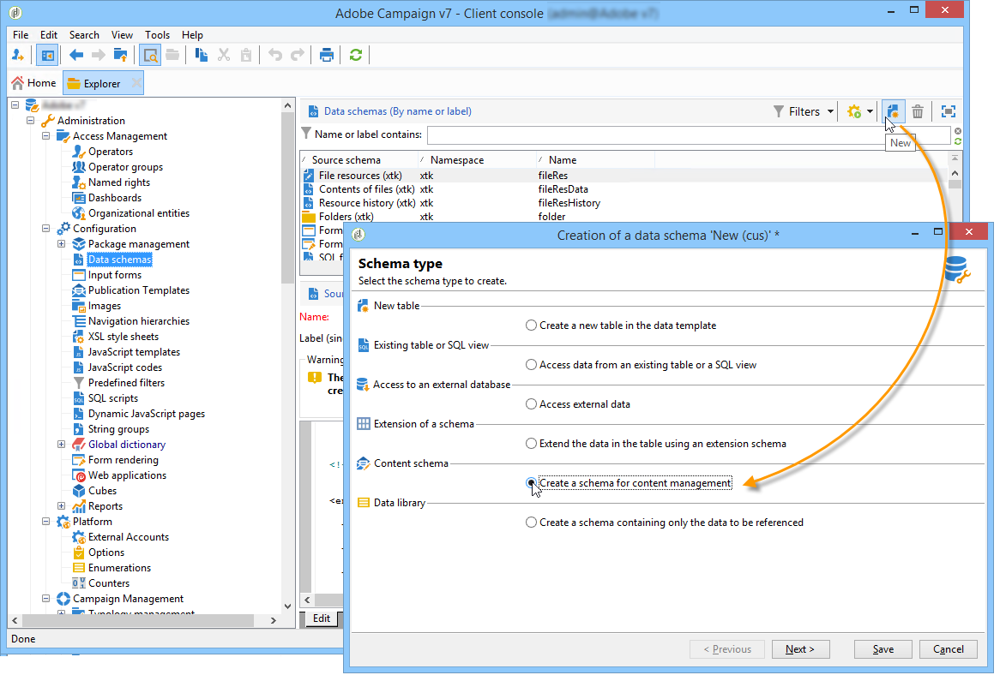

# 使用案例：建立內容管理{#use-case-creating-content-management}


若要在Adobe Campaign中建立內容管理，需執行下列步驟：

* [步驟1 — 分析要製作的內容](#step-1---analyzing-the-content-to-be-produced),
* [步驟2 — 建立資料結構](#step-2---creating-the-data-schema),
* [步驟3 — 建立輸入表單](#step-3---creating-the-input-form),
* [步驟4 — 建立構建模板](#step-4---creating-the-construction-template),
* [步驟5 — 建立發佈範本](#step-5---creating-the-publication-template),
* [步驟6 — 建立內容](#step-6---creating-contents).

## 步驟1 — 分析要製作的內容 {#step-1---analyzing-the-content-to-be-produced}

開始之前，您需要對要產生的內容進行精確分析：識別要顯示的元素、研究連結到這些元素的約束、定義每個元素的類型等。 您也需要區分靜態元素和變數元素。

例如，若要以HTML建立包含下列內容類型的電子報：


本電子報包含三種類型的元素：

1. 變數元素，其內容由使用者在傳遞建立期間透過輸入表單輸入或選取。

   

1. 根據儲存在資料庫中的資訊（此例中是收件者的名字和姓氏）動態輸入的個人化欄位。

   

1. 靜態元素，與所有電子報相同。

   

本電子報的各種元素會根據JavaScript範本中定義的規則加以組合，這些規則會參照所有要插入的元素，並將其版面概念化。

這些元素是透過專用架構建立，該架構會為每個內容指定下列元素：名稱、標籤、類型、大小，以及任何與Adobe Campaign中處理程式相關的其他資訊。

## 步驟2 — 建立資料結構 {#step-2---creating-the-data-schema}

資料架構是與內容相關聯的XML檔案。 它描述了此內容中資料的XML結構。

>[!NOTE]
>
>如需在Adobe Campaign中建立和設定資料結構的詳細資訊，請參閱 [本節](../../configuration/using/about-schema-edition.md).
>
>內容管理專屬的設定元素於 [資料結構](data-schemas.md).

若要建立資料結構，請套用下列步驟：

1. 開啟Adobe Campaign Explorer並選取 **[!UICONTROL Administration > Configuration > Data schemas]** 節點。

   按一下 **[!UICONTROL New]** 圖示（位於資料結構清單上方）。

1. 選取 **[!UICONTROL Create a schema]** 內容管理選項，然後按一下 **[!UICONTROL Next]**.

   

1. 在相應欄位中輸入架構的名稱和標籤。 您可以新增說明，並視需要連結特定影像。

   

   按一下 **[!UICONTROL Next]** 以驗證。

1. 在 **[!UICONTROL Edit schema]** 窗口。

   使用 **[!UICONTROL Insert]** 按鈕以建立架構內容。

   

   有關詳細資訊，請參閱 [編輯結構](data-schemas.md#editing-schemas).

   對於內容中參考的每個元素，您需要選取相符的類型。

   在此範例中，已識別的內容、其格式和類型為：

<table> 
 <thead> 
  <tr> 
   <th> <strong>內容</strong> <br /> </th> 
   <th> <strong>格式</strong> <br /> </th> 
   <th> <strong>類型</strong> <br /> </th> 
   <th> <strong>標籤</strong> <br /> </th> 
  </tr> 
 </thead> 
 <tbody> 
  <tr> 
   <td> 標題<br /> </td> 
   <td> 屬性<br /> </td> 
   <td> 字串<br /> </td> 
   <td> 標題<br /> </td> 
  </tr> 
  <tr> 
   <td> 子標題<br /> </td> 
   <td> 屬性<br /> </td> 
   <td> 字串<br /> </td> 
   <td> 名稱<br /> </td> 
  </tr> 
  <tr> 
   <td> 事件日期<br /> </td> 
   <td> 屬性<br /> </td> 
   <td> 日期<br /> </td> 
   <td> 日期<br /> </td> 
  </tr> 
  <tr> 
   <td> 導言段落<br /> </td> 
   <td> 元素<br /> </td> 
   <td> HTML<br /> </td> 
   <td> 概觀<br /> </td> 
  </tr> 
  <tr> 
   <td> 作者的照片<br /> </td> 
   <td> 屬性<br /> </td> 
   <td> 字串<br /> </td> 
   <td> URL<br /> </td> 
  </tr> 
  <tr> 
   <td> 作者<br /> </td> 
   <td> 元素<br /> </td> 
   <td> 備忘錄<br /> </td> 
   <td> 作者<br /> </td> 
  </tr> 
  <tr> 
   <td> 標題標誌(儲存在Adobe Campaign公共資源中)<br /> </td> 
   <td> 屬性<br /> </td> 
   <td> 連結<br /> </td> 
   <td> 影像<br /> </td> 
  </tr> 
 </tbody> 
</table>

架構將包含下列資訊：

```
<element label="Invitation" name="invitation" template="ncm:content" xmlChildren="true">
    <compute-string expr="@name"/>
    <attribute label="Title" length="40" name="title" type="string"/>
    <element label="Presentation" name="presentation" type="html"/>
    <attribute label="Date" name="date" type="date"/>
    <attribute label="Name" length="10" name="name" type="string"/>
    <attribute label="URL" name="url" type="string"/>
    <element label="Author" name="author" type="memo"/>
    <element label="Image" name="image" target="xtk:fileRes" type="link"/>
  </element>
```

1. 按一下 **[!UICONTROL Save]** 來建立資料結構。

## 步驟3 — 建立輸入表單 {#step-3---creating-the-input-form}

輸入表單可讓您透過Adobe Campaign用戶端主控台的輸入介面編輯內容例項。

表單的說明是一種結構化XML檔案，會遵守「xtk:form」表單架構的文法。

>[!NOTE]
>
>如需在Adobe Campaign中建立和設定表單的詳細資訊，請參閱 [本節](../../configuration/using/identifying-a-form.md).
>
>內容管理專屬的設定元素於 [輸入表單](input-forms.md).

要建立用於內容管理的輸入表單，請應用以下步驟：

1. 開啟Adobe Campaign Explorer並選取 **[!UICONTROL Administration > Configuration > Input forms]** 節點。

   按一下 **[!UICONTROL New]** 表徵圖。

1. 輸入表單名稱以及連結至表單的標籤，然後選取 **[!UICONTROL Content management]** 類型。

   

   >[!NOTE]
   >
   >若要讓兩個元素自動相符，建議您使用與連結資料結構相同的名稱。 使用 **[!UICONTROL Insert]** 按鈕，從連結到表單的架構中添加欄位。

   

1. 在編輯器的中間區段中，指定您要在輸入表單中顯示的欄位。

   在此範例中，我們將提供下列類型的資訊：

   ```
    <input xpath="@title"/>
     <input xpath="@date"/>
     <input xpath="presentation"/>
     <input xpath="@name"/>
     <input xpath="@url"/>
     <input xpath="author"/>
     <input img="nl:sryimage.png" newEntityFormChoice="true" xpath="image">
       <sysFilter>
         <condition expr="@isImage = true"/>
       </sysFilter>
     </input>
   ```

   此 **[!UICONTROL Preview]** 索引標籤可讓您在編輯表單時檢查其轉譯：

   

1. 按一下 **[!UICONTROL Save]** 來建立輸入表單。

## 步驟4 — 建立構建模板 {#step-4---creating-the-construction-template}

XSLT語言允許您將XML文檔轉換為另一個輸出文檔。 此轉換在稱為樣式表的文檔中以XML描述。

在此範例中，我們想使用JavaScript範本，在產生的檔案中定義資料建構和配置模式。

>[!NOTE]
>
>連結至檔案建立（JavaScript或XSL範本）的限制在 [格式](formatting.md).

若要在Adobe Campaign中使用JavaScript範本，請套用下列步驟：

1. 開啟Adobe Campaign Explorer並選取 **[!UICONTROL Administration > Configuration > JavaScript Templates]** 節點。

   按一下 **[!UICONTROL New]** 表徵圖。

1. 輸入模板名稱並選擇為內容管理建立的架構。
1. 匯入您要在訊息中顯示的設定內容。

   新增變數元素，同時遵循 [JavaScript範本](formatting.md#javascript-templates).

   若要顯示範例中顯示的內容，JavaScript範本必須包含下列元素：

   ```
   <html>
   <% eval(xtk.javascript.load("xac:perso").data); %>
   <head>
     <title>Invitation to an exceptional dedication session</title>
   </head>
   <body link="#0E59AE" vlink="#0E59AE" alink="#0E59AE" style="background-color:white;">
       <table width="546" border="0" align="center" cellpadding="0" cellspacing="0" style="border-left: solid 1px gray;border-top: solid 1px gray;border-right: solid 1px gray;">
         <tr>
           <td colspan="3">
             <%= generateImgTag(content.@["image-id"]) %>
           </td>
         </tr>
       </table>
       <table width="546" border="0" align="center" cellpadding="0" cellspacing="0" style="border-left: solid 1px gray;border-right: solid 1px gray;">
         <tr>
           <td>
             <table border="0" cellspacing="0" cellpadding="5">
               <tr>
                 <td width="10"> </td>
                 <td style="padding-top:2em; padding-bottom:2em;" width="730" align="middle">
                   <b>
                     <font style="font-family:Verdana, Arial, Helvetica, sans-serif; font-size:14px; color:#800080;">
                       <span style="FONT-VARIANT: small-caps"><%= content.@title %> - <%= content.@name %></span>
                     </font>
                   </b>
                 </td>
                 <td width="10"> </td>
               </tr>
               <tr>
                 <td width="10"> </td>
                 <td style="padding-top:1em; padding-bottom:1em;" width="730">
                   <font style="font-family:Verdana, Arial, Helvetica, sans-serif; font-size:11px; color:#666666;">
                     Hello <%= perso('recipient.firstName') %> <%= perso('recipient.lastName') %>,
                     <p>
                       <%= content.presentation %>
                     </p>               
                     <center>
                       <b><%= formatDate(content.@date, "%2D %Bl %4Y") %></b> come to our Book Fair and meet our favorite authors and illustrators.<br>
                       <br>
                       <a href="https://www.site.web.com/registration" target="_blank"><b>REGISTER</b></a>
                     </center>
                   </font>
                 </td>
                 <td width="10"> </td>
               </tr>
               <tr>
                 <td width="10"> </td>
                 <td style="padding-top:1em; padding-bottom:1em;" width="730">
                   <font style="font-family:Verdana, Arial, Helvetica, sans-serif; font-size:11px; color:#666666;">
                    " width="70" height="70">
                     <b><%= content.author %></b>, will be signing their book between 2
   and 5:30PM.
                   </font>
                 </td>
                 <td width="10"> </td>
               </tr>            
                   <tr>
                 <td width="10"> </td>
                 <td width="730">
                   <font style="font-family:Verdana, Arial, Helvetica, sans-serif; font-size:11px; color:#666666;">                  
                 </td>
                 <td width="10"> </td>
               </tr>           
               <tr>
                 <td width="10"> </td>
                 <td>
                   <font style="font-family:Verdana, Arial, Helvetica, sans-serif; font-size:11px; color:#666666;">
                     <center>
                       <p>
                         <a href="https://www.site.web.com/program" target="_blank"><span style="FONT-VARIANT: small-caps"><b>Program</b></span></a>
                          | 
                         <a href="https://www.site.web.com/information" target="_blank"><span style="FONT-VARIANT: small-caps"><b>Useful information</b></span></a>
                          | 
                       <a href="https://www.site.web.com/registration" target="_blank"><span style="FONT-VARIANT: small-caps"><b>Register</b></span></a></p>
                       </center>
                     </font>
                   </td>
                   <td width="10"> </td>
                 </tr>
               </table>
               <br>
             </td>
           </tr>
         </table>
   </body>
   </html>
   ```

   在範本開始時呼叫函式可讓您設定對從Adobe Campaign資料庫擷取之個人化資料的呼叫(在此例中為：recipient.firstName和recipient.lastName)，以便在傳送中使用時加以解譯。 有關詳細資訊，請參閱 [包含JavaScript範本](formatting.md#including-a-javascript-template).

   在此範例中，函式將包含下列程式碼：

   ```
   function perso(strPerso)
   {
     var strStart = '<' + '%' + '=';
     var strEnd = '%' + '>';
     return strStart + strPerso + strEnd;
   }
     function bloc(strPerso)
   {
     var strStart = '<' + '%' + '@ include view="';
     var strEnd = '" %' + '>';
     return strStart + strPerso + strEnd;
   }
   ```

   為了讓JavaScript範本有效，必須預先從 **[!UICONTROL JavaScript codes]** 節點，如下所示：

   

## 步驟5 — 建立發佈範本 {#step-5---creating-the-publication-template}

下一步包括建立內容發佈範本，以連結結構、表單和內容建構範本。 此發佈範本可以有多種輸出格式。

>[!NOTE]
>
>如需內容發佈範本的詳細資訊，請參閱 [發佈範本](publication-templates.md).

在此範例中，步驟如下：

1. 透過 **[!UICONTROL Administration > Configuration > Publication templates]** 節點。
1. 輸入名稱和標籤，然後選擇要使用的方案和表單。
1. 然後輸入模板的名稱，並選擇要應用的呈現模式。 這裡，我們有 **[!UICONTROL JavaScript]** 根據上述建立的範本輸入呈現。

   

   >[!NOTE]
   >
   >此 **[!UICONTROL DOM interface]** 選項，這表示如果您使用E4X語法，將無法存取此檔案。 勾選此選項時，必須使用DOM介面，且為建議的語法。
   >
   >您仍可使用E4X語法。 若有，請務必取消勾選此選項。

   使用 **[!UICONTROL Add]** 按鈕以建立其他轉換模板。

1. 按一下 **[!UICONTROL Save]** 建立發佈範本。

## 步驟6 — 建立內容 {#step-6---creating-contents}

您現在可以根據此出版物範本建立內容。

>[!NOTE]
>
>有關建立內容的詳細資訊，請參閱 [使用內容範本](using-a-content-template.md).

### 在傳遞精靈中建立內容 {#creating-content-in-the-delivery-wizard}

若要直接在傳送中建立內容，請套用下列步驟：

1. 首先，透過 **[!UICONTROL Advanced]** 標籤。

   

   傳送精靈中會新增另一個索引標籤，以便透過內容管理表單定義內容。

1. 輸入電子報的變數資訊。

   

1. 按一下 **[!UICONTROL HTML preview]** 標籤來檢視呈現。 您需要選取收件者以測試個人化。

   
