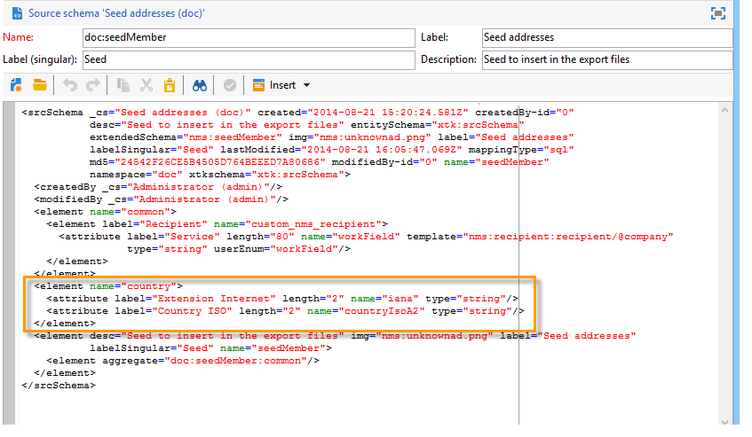
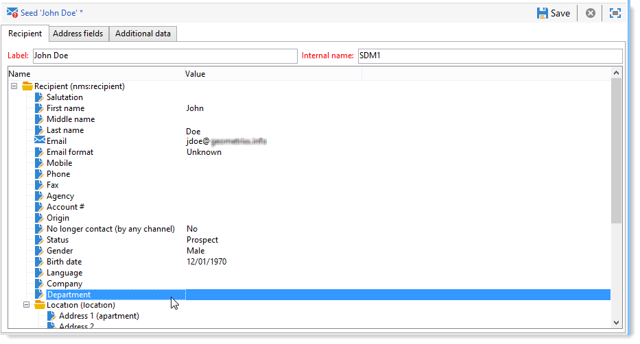
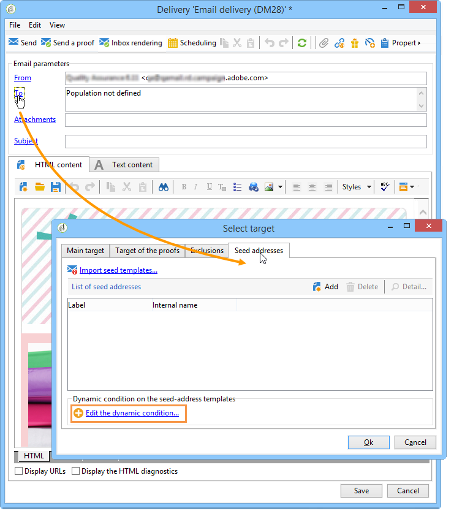

# 使用案例：選擇條件中的種子地址{#use-case-selecting-seed-addresses-on-criteria}

在傳送或促銷活動的架構中，連結可 **[!UICONTROL Edit the dynamic condition...]** 讓您根據特定選擇標準選擇種子位址。

在這個使用案例中，My **online library網站** ，會根據客戶的文學品味，將電子報個人化。

負責遞送的使用者會與採購部門合作，為購買警察小說的訂閱者建立電子報。

為分享與採購部門合作的最終結果，交貨經理決定將採購部門的同事新增至交貨，作為種子地址。 使用動態條件可節省配置和更新地址的時間。

若要使用動態條件，您必須具備：

* 準備寄送的貨物，
* 具有公用值的種子地址。 此值可以是Adobe Campaign中已存在的欄位。 在此範例中，種子位址會在「部門」欄位中共用「購買」值，此值預設不會出現在應用程式中。

## 步驟1 —— 建立傳送 {#step-1---creating-a-delivery}

建立傳送的步驟在「建立電子郵件傳送 [」區段中詳述](../../delivery/using/creating-an-email-delivery.md) 。

在此範例中，傳送管理員已建立電子報並選取收件者。


## 步驟2 —— 建立公用值 {#step-2---creating-a-common-value}

要建立與示例（採購部門）中的公用值類似的值，您必須先擴展種子地址的 **資料結構** ，並編輯關聯的輸入表單。

### 擴展資料模式 {#extending-the-data-schema}

有關架構擴展的詳細資訊，請參閱配置 [指南](../../configuration/using/data-schemas.md)。

1. 在節 **[!UICONTROL Administration > Configuration > Data schemas]** 點中，按一下圖 **[!UICONTROL New]** 標。
1. 在窗口 **[!UICONTROL Creation of a data schema]** 中，選擇選 **[!UICONTROL Extension of a schema]** 項並按一下 **[!UICONTROL Next]**。

   

1. 選擇源 **[!UICONTROL Seed addresses]** 方案，輸入 **doc** 作為， **[!UICONTROL Namespace]** 然後按一下 **[!UICONTROL Ok]**。

   

1. 按一下 **[!UICONTROL Save]**.
1. 在架構編輯視窗中，複製下面的行，並貼到螢幕擷取中指示的區域。

   ```
     <element name="common">
       <element label="Recipient" name="custom_nms_recipient">
         <attribute label="Department" length="80" name="workField" template="nms:recipient:recipient/@company"
                    type="string" userEnum="workField"/>
       </element>
     </element>
   ```

   

   然後複製下列行，並將它們貼上到元素 **[!UICONTROL Seed to insert in the export files]** 下。

   ```
       <element aggregate="doc:seedMember:common">
     </element>
   ```

   

   在這種情況下，您將指定在種子地址表中建立了名為 **[!UICONTROL Department]** new enumeration，並且它基於標準枚舉模板(在種子地址表中的名稱 **[!UICONTROL @company]** Company **** 下標籤)。

1. 按一下 **[!UICONTROL Save]**.
1. 在功能表 **[!UICONTROL Tools > Advanced]** 中，選取選 **[!UICONTROL Update database structure]** 項。

   

1. 顯示更新嚮導時，按一下按鈕以 **[!UICONTROL Next]** 訪問「編輯表」窗口：在種子地址資料模式中執行的更改需要結構更新。

   

1. 請依照精靈進行，直到您進入頁面執行更新。 Click the **[!UICONTROL Start]** button.

   

   更新完成後，您可以關閉精靈。

1. 中斷連線，然後重新連線至Adobe Campaign。 種子地址資料模式中所做的更改現在是有效的。 要讓種子地址螢幕顯示它們，您必須更新關聯的 **[!UICONTROL Input form]**。 請參閱「更 [新輸入表單](#updating-the-input-form) 」一節。

#### 從連結表擴展資料模式 {#extending-the-data-schema-from-a-linked-table}

種子地址資料模式可以使用來自連結到接收者資料模式的表的值——接收者(nms)。

例如，使用者想要整合連結至收件 **[!UICONTROL Internet Extension]** 者方案之 **[!UICONTROL Country]** 表格中的找到項目。


因此，它們必須擴展種子地址資料模式，如一節中所述。 不過，在步驟4中要整合的程 **式碼行** 如下：

```
<element name="country">
      <attribute label="Internet Extension" length="2" name="iana" type="string"/>
      <attribute label="Country ISO" length="2" name="countryIsoA2" type="string"/>
    </element>
```



它們指出：

* 使用者想要建立新元素 **[!UICONTROL Internet Extension]**,
* 這個元素來自表 **[!UICONTROL Country]** 格。

>[!CAUTION]
>
>在連結的表格名稱中，您必須指定 **該連結表格的xpath** -dst。
>
>這可在收件者表格 **[!UICONTROL Country]** 的元素中找到。


然後，用戶可 **以按照該節的** 5步進行操作 **[!UICONTROL Input form]** ，並更新種子地址。

請參閱「更 [新輸入表單](#updating-the-input-form) 」一節。

#### 更新輸入表單 {#updating-the-input-form}

1. 在節點 **[!UICONTROL Administration > Configuration > Input forms]** 中，查找種子地址輸入表單。

   

1. 編輯表單，並在容器中插入下 **[!UICONTROL Recipient]** 列行。

   ```
   <input xpath="@workField"/>
   ```

   

1. 儲存您的變更。
1. 開啟種子地址。 該字 **[!UICONTROL Department]** 段將出現在表 **[!UICONTROL Recipient]** 中。

   

1. 編輯要用於交貨的種子地址，並在欄位中輸 **入** Oracle Purchasing **[!UICONTROL Department]** 值。

## 步驟3 —— 定義條件 {#step-3---defining-the-condition}

您現在可以指定傳送種子地址的動態條件。 操作步驟：

1. 開啟傳送。

   

1. 按一下 **[!UICONTROL To]** 連結，然 **[!UICONTROL Seed addresses]** 後按一下標籤以存取 **[!UICONTROL Edit the dynamic condition...]** 連結。

   

1. 選擇可讓您選擇所需種子地址的表達式。 在此，用戶選擇了表達 **[!UICONTROL Department (@workField)]** 式。

   

1. 選取您要的值。 在此範例中，使用者從值 **下拉式清單中選取** 「採購」部門。

   

   >[!NOTE]
   >
   >先前建立的架構擴充功能來自收件 **者** 。 上述螢幕上顯示的值來自收件者結構 **圖** 。

1. 按一下 **[!UICONTROL Ok]**.

   查詢將顯示在窗口 **[!UICONTROL Select target]** 中。

   

1. 按一 **[!UICONTROL Ok]** 下以核准查詢。
1. 分析您的傳送，然後按一下標 **[!UICONTROL Delivery]** 簽以存取傳送記錄檔。

   採購部門的種子地址顯示為待交貨，與接收者或其他種子地址相同。

   

1. 按一下 **[!UICONTROL Send]** 按鈕以開始傳送。

   採購部門的成員構成了種子地址的一部分，這些種子地址將接收其電子郵件收件箱中的發送。

   
