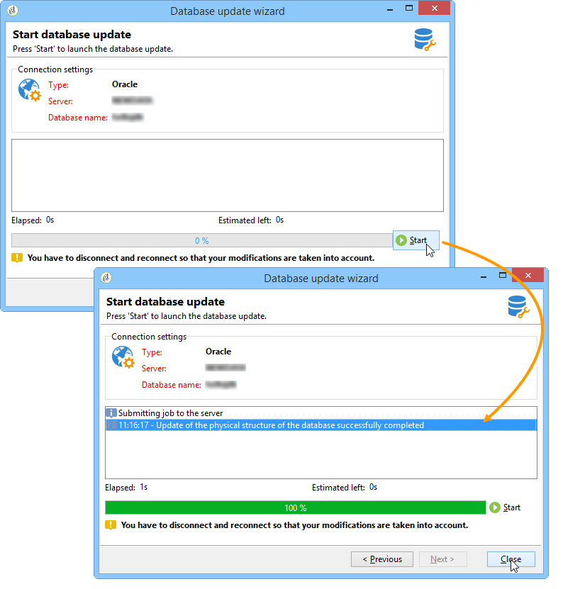
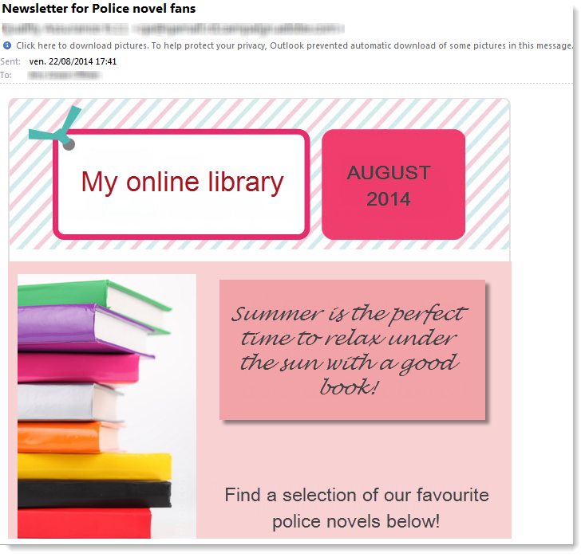

# 使用實例：依條件選取種子地址{#use-case-selecting-seed-addresses-on-criteria}


在傳遞或行銷活動的框架中， **[!UICONTROL Edit the dynamic condition...]** 連結可讓您根據特定選取條件選擇種子地址。

在此使用案例中，網站 **我的線上媒體櫃** 想要根據客戶的文學品味打造個人化的電子報。

負責遞送的使用者與購買部門合作，為購買警察小說的訂閱者建立電子報。

為了分享他們與同事共同作業的最終結果，交貨經理決定將其採購部門的同事新增至交貨作為種子地址。 使用動態條件可讓您節省設定和更新位址的時間。

若要使用動態條件，您必須具備：

* 已準備好傳送的傳遞，
* 有共同值的種子地址。 此值可以是Adobe Campaign中已存在的欄位。 在此範例中，種子地址會分享「部門」欄位中的「購買」值，預設情況下不會出現在應用程式中。

## 步驟1 — 建立傳遞 {#step-1---creating-a-delivery}

建立傳送的詳細步驟載於 [建立電子郵件傳遞](creating-an-email-delivery.md) 區段。

在此範例中，傳遞管理員已建立電子報並選取收件者。


## 步驟2 — 建立通用值 {#step-2---creating-a-common-value}

若要建立與範例（「採購管理系統」部門）相同的通用值，您必須先擴充 **資料綱要** 並編輯關聯的輸入表單。

### 擴充資料架構 {#extending-the-data-schema}

有關結構描述擴充功能的詳細資訊，請參閱 [本節](../../configuration/using/data-schemas.md).

1. 在 **[!UICONTROL Administration > Configuration > Data schemas]** 節點，按一下 **[!UICONTROL New]** 圖示。
1. 在 **[!UICONTROL Creation of a data schema]** 視窗，選取 **[!UICONTROL Extension of a schema]** 選項並按一下 **[!UICONTROL Next]**.

   

1. 選取 **[!UICONTROL Seed addresses]** 來源結構描述，請輸入 **doc** 作為 **[!UICONTROL Namespace]** 並按一下 **[!UICONTROL Ok]**.

   

1. 按一下&#x200B;**[!UICONTROL Save]**。
1. 在結構描述編輯視窗中，複製下方的行並將它們貼到熒幕擷取畫面中指示的區域中。

   ```
     <element name="common">
       <element label="Recipient" name="custom_nms_recipient">
         <attribute label="Department" length="80" name="workField" template="nms:recipient:recipient/@company"
                    type="string" userEnum="workField"/>
       </element>
     </element>
   ```

   

   然後複製下列各行，並將它們貼到 **[!UICONTROL Seed to insert in the export files]** 元素。

   ```
       <element aggregate="doc:seedMember:common">
     </element>
   ```

   

   在此案例中，您會指定名為的新分項清單 **[!UICONTROL Department]** 已在種子地址表中建立，且以標準為基礎 **[!UICONTROL @company]** 分項清單範本（在名稱下加上標籤） **公司** （在種子地址表單中）。

1. 按一下&#x200B;**[!UICONTROL Save]**。
1. 在 **[!UICONTROL Tools > Advanced]** 功能表，選取 **[!UICONTROL Update database structure]** 選項。

   

1. 顯示更新精靈時，按一下 **[!UICONTROL Next]** 按鈕以存取「編輯表格」視窗：在種子地址資料模式中執行的變更需要結構更新。

   

1. 請依照精靈的指示進行，直到您進入頁面執行更新為止。 按一下 **[!UICONTROL Start]** 按鈕。

   

   更新完成後，您可以關閉精靈。

1. 中斷連線，然後重新連線至Adobe Campaign。 在種子位址資料結構中所做的變更現在生效。 為了從種子地址畫面中可見，您必須更新相關聯的 **[!UICONTROL Input form]**. 請參閱 [更新輸入表單](#updating-the-input-form) 區段。

#### 從連結的表格擴充資料結構 {#extending-the-data-schema-from-a-linked-table}

種子地址資料結構描述可以使用連結到收件者資料結構描述 — 收件者(nms)的表格中的值。

例如，使用者想要整合 **[!UICONTROL Internet Extension]** 可在 **[!UICONTROL Country]** 連結至收件者綱要的表格。


因此，他們必須擴充種子地址資料架構，如區段所述。 然而，要整合的程式碼行位於 **步驟4** 如下所示：

```
<element name="country">
      <attribute label="Internet Extension" length="2" name="iana" type="string"/>
      <attribute label="Country ISO" length="2" name="countryIsoA2" type="string"/>
    </element>
```


它們表示：

* 使用者想要建立名為的新元素 **[!UICONTROL Internet Extension]**，
* 此元素來自 **[!UICONTROL Country]** 表格。

>[!CAUTION]
>
>在連結表格名稱中，您必須指定 **xpath-dst** 的已連結資料表。
>
>這可在以下網址找到： **[!UICONTROL Country]** 元素。


然後，使用者可以從以下位置關注 **步驟5** ，並更新 **[!UICONTROL Input form]** 種子地址的。

請參閱 [更新輸入表單](#updating-the-input-form) 區段。

#### 更新輸入表單 {#updating-the-input-form}

1. 在 **[!UICONTROL Administration > Configuration > Input forms]** 節點，尋找種子地址輸入表單。

   

1. 編輯表單並將下列行插入 **[!UICONTROL Recipient]** 容器。

   ```
   <input xpath="@workField"/>
   ```

   

1. 儲存您的變更。
1. 開啟種子地址。 此 **[!UICONTROL Department]** 欄位會顯示在 **[!UICONTROL Recipient]** 表格。

   

1. 編輯您要用於傳送的種子地址，並輸入 **採購** 作為中的值 **[!UICONTROL Department]** 欄位。

## 步驟3 — 定義條件 {#step-3---defining-the-condition}

您現在可以為傳遞指定種子地址的動態條件。 操作步驟：

1. 開啟傳遞。

   

1. 按一下 **[!UICONTROL To]** 連結然後 **[!UICONTROL Seed addresses]** 標籤以存取 **[!UICONTROL Edit the dynamic condition...]** 連結。

   

1. 選取運算式，讓您選擇想要的種子地址。 使用者可在此選取 **[!UICONTROL Department (@workField)]** 運算式。

   

1. 選取您想要的值。 在此範例中，使用者選取 **採購** 的值下拉式清單中的department 。

   

   >[!NOTE]
   >
   >先前建立的結構描述擴充功能來自 **收件者** 綱要。 上方熒幕顯示的值來自 **收件者** 綱要。

1. 按一下&#x200B;**[!UICONTROL Ok]**。

   查詢會顯示在 **[!UICONTROL Select target]** 視窗。

   

1. 按一下 **[!UICONTROL Ok]** 以核准查詢。
1. 分析您的傳遞，然後按一下 **[!UICONTROL Delivery]** 標籤以存取傳送記錄檔。

   採購部門的種子地址會顯示為待定傳遞，就像收件者或其他種子地址一樣。

   

1. 按一下 **[!UICONTROL Send]** 按鈕以開始傳遞。

   採購部門的成員會組成您的種子地址，這些地址將會在其電子郵件收件匣中接收傳遞。

   
