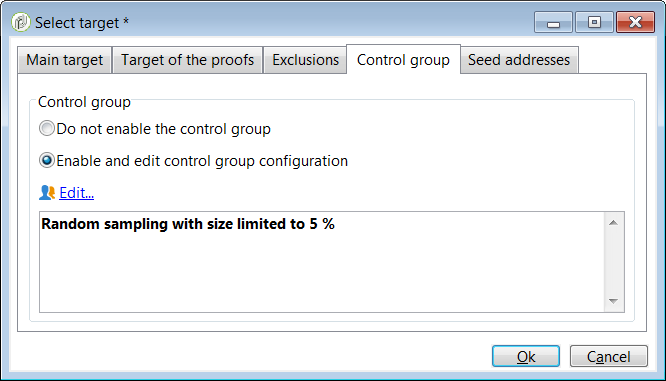

# 使用範本 {#use-templates}

提供範本可針對大多數常見活動類型提供現成的藍本，以提高效率。 使用範本，行銷人員可以在較短的時間內，以最少的自訂方式部署新的促銷活動。

進一步瞭解[本節](../../delivery/using/creating-a-delivery-template.md)中的傳送範本。

## 開始使用傳送範本{#gs-templates}

[傳送範本](../../delivery/using/creating-a-delivery-template.md)可讓您定義一組符合您需求且可重複使用於未來傳送的技術和功能屬性。 然後，您就可以節省時間，並視需要標準化傳送。

當您在Adobe Campaign管理多個品牌時，Adobe建議每個品牌有一個子網域。 例如，銀行可以有多個子域，對應於每個區域機構。 如果銀行擁有bluebank.com網域，其子網域可以是@ny.bluebank.com、@ma.bluebank.com、@ca.bluebank.com等。 每個子網域有一個傳送範本，讓您隨時針對每個品牌使用正確的預先設定參數，以避免錯誤並節省您的時間。

**提示**:為避免設定錯誤，建議您複製原生範本並變更其屬性，而不要建立新範本。

## 配置地址

* 傳送者的地址是強制性的，以允許傳送電子郵件。

* 某些ISP（Internet服務提供商）在接受消息之前檢查發件人地址的有效性。

* 錯誤形成的地址可能導致接收伺服器拒絕。 您必須確定地址正確無誤。

* 地址必須明確標識發件人。 域必須由發送者擁有並註冊。

* Adobe建議建立與傳送和回覆所指定位址對應的電子郵件帳戶。 請洽詢您的訊息系統管理員。

若要在促銷活動介面中設定位址，請遵循下列步驟：

1. 在[傳送範本](../../delivery/using/creating-a-delivery-template.md)中，按一下&#x200B;**[!UICONTROL From]**&#x200B;連結。 在&#x200B;**[!UICONTROL Email header parameters]**&#x200B;視窗中，填寫下列欄位：

   

1. 在&#x200B;**[!UICONTROL Sender address]**&#x200B;欄位中，請確定地址網域與您委託給Adobe的子網域相同。 您可以變更&#39;@&#39;前的部分，但不能變更網域位址。

1. 在&#x200B;**[!UICONTROL From]**&#x200B;欄位中，使用收件者可輕易辨識的名稱（例如您的品牌名稱）來提高交貨的開業率。 若要進一步改善收件者的體驗，您可以新增人名，例如「Emma from Megastore」。

1. 在&#x200B;**[!UICONTROL Reply address text]**&#x200B;欄位中，預設會使用傳送者的位址來回覆。 但是，Adobe建議使用現有的實際地址，例如您品牌的客戶服務。 在這種情況下，如果收件者傳送回覆，客戶服務將能夠處理。

### 設定控制群組

傳送傳送後，您可以比較已排除的收件者與已接收傳送的收件者的行為。 然後，您可以衡量促銷活動的效率。 進一步瞭解控制群組[本節](../../campaign/using/marketing-campaign-deliveries.md#defining-a-control-group)。

要設定控制組，請按一下&#x200B;**[!UICONTROL To]**&#x200B;連結。 在&#x200B;**[!UICONTROL Select target]**&#x200B;窗口中，選擇&#x200B;**[!UICONTROL Control group]**&#x200B;頁籤。 您可以擷取目標的一部分，例如5%的隨機樣本。

## 使用類型套用篩選或控制規則

類型學包含分析階段期間在傳送任何訊息之前套用的檢查規則。

在範本屬性的&#x200B;**[!UICONTROL Typology]**&#x200B;標籤中，根據您的需求變更預設類型。

例如，為了更好地控制對外流量，您可以定義每個子網域可使用一個相似性，並為每個相似性建立一個類型，以定義哪些IP位址。 相關性在實例的配置檔案中定義。 聯繫您的Adobe Campaign管理員。

有關類型的詳細資訊，請參閱[本節](../../campaign/using/about-campaign-typologies.md)。
