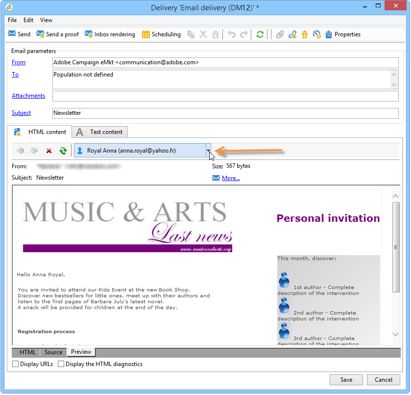
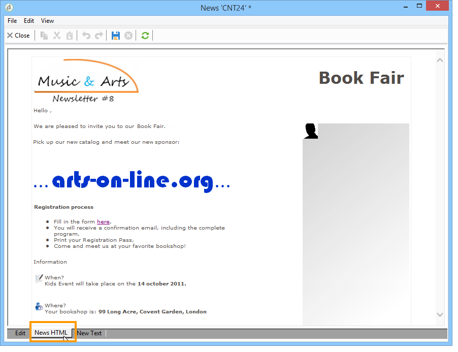

# 使用內容範本{#using-a-content-template}

## 關於內容範本 {#about-content-templates}

內容範本可直接參考並用於傳送。 請參閱 [透過內容管理建立傳送](#creating-a-delivery-via-content-management)

也可用來建立內容例項。 建立這些例項後，這些例項就可供傳送(請參閱「傳送內容例項 [」)或匯出(請參閱「](#delivering-a-content-instance)建立內容例項 」)。

## 透過內容管理建立傳送 {#creating-a-delivery-via-content-management}

您可以在傳送中參考內容範本，以檢視使用輸入欄位來輸入內容。 傳送精靈會新增另一個標籤來定義傳送內容。

版面將會根據選取的設定自動套用。 若要檢視，請按一下( **[!UICONTROL HTML preview]** 或 **[!UICONTROL Text preview]** )並選取收件者以測試個人化元素。

如需詳細資訊，請參閱完整的實作範例：在 [傳送精靈中建立內容](../../delivery/using/use-case--creating-content-management.md#creating-content-in-the-delivery-wizard)。

## 建立內容例項 {#creating-a-content-instance}

您可以直接在Adobe Campaign樹狀結構中建立內容，以便用於工作流程、匯出或直接插入新的傳送。

應用以下步驟：

1. 選擇樹 **[!UICONTROL Resources > Contents]** 的節點，按一下右鍵並選擇 **[!UICONTROL Properties]**。

   

1. 選擇將在此資料夾中處於活動狀態的發佈模板。

   

1. 您現在可以使用內容清單上方的 **[!UICONTROL New]** 按鈕建立新內容。

   

1. 在表單中輸入欄位。

   

1. 然後，按一 **[!UICONTROL HTML preview]** 下標籤以檢視演算。 在此，不會輸入從資料庫擷取的個人化欄位。

   

1. 內容建立後，即會新增至可用內容清單。 按一下 **[!UICONTROL Properties]** 連結以變更其標籤、狀態或檢視其歷史記錄。

   

1. 如有必要，內容一經核准，就可使用工具列上的適當按鈕產生。

   

   >[!NOTE]
   >
   >您可以授權產生未核准的內容。 若要這麼做，請變更出版物範本中的相關選項。 有關詳細資訊，請參閱 [建立和配置模板](../../delivery/using/publication-templates.md#creating-and-configuring-the-template)。

   HTML和「文字」內容預設會在Adobe Campaign例項 **的** 「發佈」檔案夾中產生。 您可以使用 **NcmPublishingDir選項來變更出版物資料夾** 。

## 傳送內容例項 {#delivering-a-content-instance}

若要建立內容例項並加以傳送，傳送範本必須連結至用來產生此內容的出版物範本。 For more on this, refer to [Delivery](../../delivery/using/publication-templates.md#delivery).

此外，內容儲存資料夾必須專用於從此出版物範本擷取的內容（當內容資料夾可讓您產生多種內容類型時，無法自動建立傳送）。

若要根據選取的內容自動建立傳送，請按一下圖 **[!UICONTROL Delivery]** 示並選擇範本。

文字和HTML內容會自動輸入。
