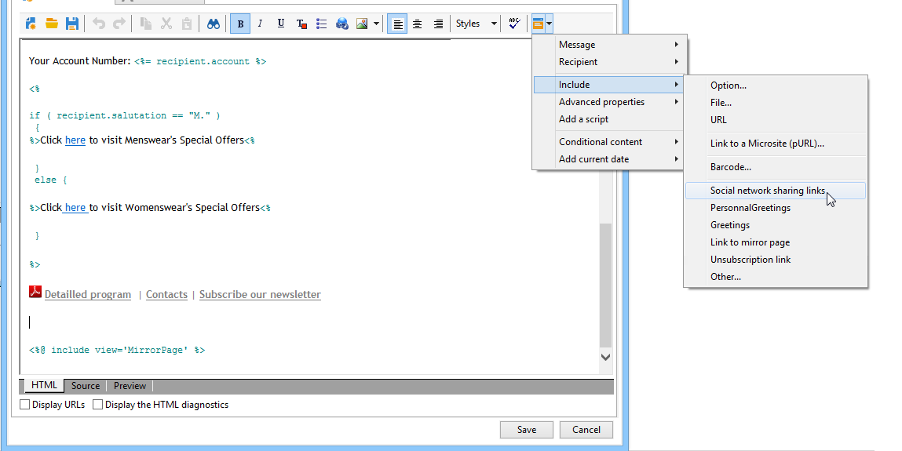

# 病毒式行銷及社交行銷{#viral-and-social-marketing}

Adobe Campaign可讓您設定鼓勵病毒式行銷的工具。

這可讓傳遞收件者或網站訪客與其網路共用資訊：從新增連結至其Facebook或Twitter設定檔，到傳送訊息給朋友。

>[!CAUTION]
>
>為了使新增的連結正常運作，必須提供相符的映象頁面。 若要這麼做，請在傳送中包含指向映象頁面的連結。

## 社交網路：共用連結 {#social-networks--sharing-a-link}

若要讓傳遞收件者與其網路成員共用訊息內容，您必須包含相符的個人化區塊。

>[!NOTE]
>
>依預設，封鎖清單中不提供此連結。 您可以按一下 **[!UICONTROL Other...]**，並選取 **[!UICONTROL Social network sharing links]** 區塊。

演算方式如下：

當收件者按一下顯示的其中一個社交網路圖示時，系統會自動將他們重新導向至其帳戶，並可透過連結共用訊息內容。 如此可讓網路成員存取通訊。

>[!NOTE]
>
>此個人化區塊包含所有連結（用於傳送訊息並與所有社交網路分享）。 您可以根據自己的需求加以變更。 但是，設定會保留給進階使用者。 若要編輯相符的個人化區塊，請前往 **[!UICONTROL Resources > Campaign management > Personalization blocks]** Adobe Campaign樹的節點。

## 病毒式行銷：轉寄給朋友 {#viral-marketing--forward-to-a-friend}

病毒式服務可讓您執行轉介型別的動作：這些動作可讓您將訊息轉寄給朋友。 被裁判的設定檔會暫時儲存在資料庫中（在專用表格中）。 轉送的訊息包含供被推薦者訂閱的連結：如果提供，會新增至Adobe Campaign資料庫。

訊息轉寄與社交網路連結的原理相同。

套用下列階段：

1. 新增 **[!UICONTROL Social network sharing links]** 個人化區塊放入原始訊息的正文中。
1. 郵件收件者可以按一下 **[!UICONTROL Email]** 圖示以傳送此訊息給一或多個朋友。

   

   推薦表單可讓您輸入推薦人的電子郵件地址。

   

   當主要收件者按一下 **[!UICONTROL Next]** 按鈕。

   >[!NOTE]
   >
   >此訊息的內容可以根據您的需求進行個人化。 它是根據以下專案建立： **[!UICONTROL Transfer of original message]** 範本，儲存在 **[!UICONTROL Administration > Campaign management > Technical delivery templates]** 節點。
   >
   >您也可以變更轉寄給反向連結的訊息表單。若要這麼做，您必須變更 **病毒形式** 網頁應用程式儲存在 **[!UICONTROL Resources > Online > Web applications]** 節點。

1. 在轉送的訊息中，連結可讓裁判將其設定檔儲存在資料庫中。 為此提供輸入表單。

   

   >[!NOTE]
   >
   >可調整此設定。 若要這麼做，您需要修改 **收件者訂閱** 網頁應用程式儲存在 **[!UICONTROL Resources > Online > Web applications]** 節點。
   >
   >如需Web應用程式的詳細資訊，請參閱 [本節](../../web/using/about-web-applications.md).

   驗證後，系統會將確認訊息傳送給他們：只有當他們在確認訊息中啟用連結時，他們才會永久註冊。 此訊息是根據 **[!UICONTROL Registration confirmation]** 範本，儲存在 **[!UICONTROL Administration > Campaign management > Technical delivery templates]** 節點。

   被推薦者會新增至 **收件者** 資料夾，並（依預設）訂閱 **電子報** 資訊服務。

## 追蹤社交網路分享 {#tracking-social-network-sharing}

會追蹤共用資訊的共用與存取權。 Adobe Campaign收集的這項資訊可在兩個地方存取：

* 在 **[!UICONTROL Tracking]** 傳遞的索引標籤（或個別針對每個收件者）：

  

* 在專屬的 **[!UICONTROL Sharing to social networks]** 報告：

  
