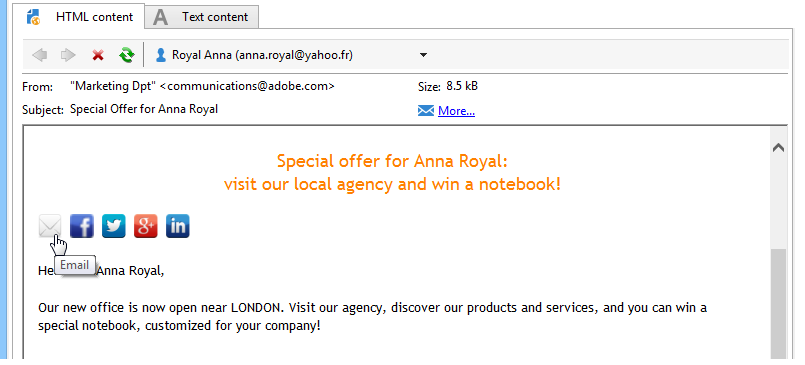

# 病毒式營銷和社交營銷{#viral-and-social-marketing}

## 關於病毒式行銷 {#about-viral-marketing}

Adobe Campaign可讓您設定工具，以鼓勵病毒式行銷。

這可讓遞送收件者或網站訪客與其網路分享資訊：從新增連結至其Facebook或Twitter個人檔案，到傳送訊息給朋友。

>[!CAUTION]
>
>為了讓新增的連結正常運作，必須提供相符的鏡像頁面。 若要這麼做，請在傳送中加入鏡像頁面的連結。

## 社交網路：共用連結 {#social-networks--sharing-a-link}

若要讓遞送收件者與其網路成員分享訊息內容，您必須包含相符的個人化區塊。

>[!NOTE]
>
>預設情況下，塊清單中不提供此連結。 您可以按一下並選 **[!UICONTROL Other...]**&#x200B;取區塊來存取 **[!UICONTROL Social network sharing links]** 它。

演算方式如下：

當收件者按一下其中一個顯示之社交網路的圖示時，他們會自動重新導向至其帳戶，並可透過連結分享訊息內容。 這可讓其網路成員訪問通信。

>[!NOTE]
>
>此個人化區塊包含所有連結（用於傳送訊息並與所有社交網路共用）。 可以根據您的需求進行變更。 不過，設定會保留給進階使用者。 若要編輯相符的個人化區塊，請前 **[!UICONTROL Resources > Campaign management > Personalization blocks]** 往Adobe Campaign樹狀結構的節點。

## 病毒式行銷：向朋友轉達 {#viral-marketing--forward-to-a-friend}

病毒式服務可讓您執行反向連結類型動作：這些動作可讓您將訊息轉寄給朋友。 裁判者的簡檔暫時儲存在資料庫中（在專用表中）。 轉發的消息包括裁判訂閱的連結：如果有，則會將其新增至Adobe Campaign資料庫。

消息轉發基於與社交網路連結相同的原則。

套用下列階段：

1. 將個人 **[!UICONTROL Social network sharing links]** 化區塊新增至原始訊息的正文。
1. 訊息收件者可以按一下 **[!UICONTROL Email]** 圖示，將此訊息傳送給一或多位朋友。

   

   推薦表單可讓您輸入裁判的電子郵件地址。

   

   當主要收件者按一下按鈕時，訊息會傳送給 **[!UICONTROL Next]** 他們。

   >[!NOTE]
   >
   >此訊息的內容可以個人化，以符合您的需求。 它基於儲存在節 **[!UICONTROL Transfer of original message]** 點中的模板創 **[!UICONTROL Administration > Campaign management > Technical delivery templates]** 建。
   >
   >您也可以變更已提供給反向連結的訊息轉寄表單。若要這麼做，您必須變更儲存在節點中的 **Viralform** web應用程 **[!UICONTROL Resources > Online > Web applications]** 式。

1. 在轉發的消息中，連結使裁判能夠將他們的概況保存在資料庫中。 為此，提供了入門表單。

   

   >[!NOTE]
   >
   >此配置可以調整。 為此，您需要修改儲存在節 **點中的Recipient** web應用 **[!UICONTROL Resources > Online > Web applications]** 程式。
   >
   >For more information on Web applications, refer to [this section](../../web/using/about-web-applications.md).

   驗證後，會傳送確認訊息給他們：只有在確認訊息中啟用連結後，才會永久註冊。 此消息基於儲存在節 **[!UICONTROL Registration confirmation]** 點中的模板創 **[!UICONTROL Administration > Campaign management > Technical delivery templates]** 建。

   裁判會新增至資料庫的 **Recipients** 資料夾，並訂閱（依預設） **Newsletter** 資訊服務。

## 追蹤社交網路共用 {#tracking-social-network-sharing}

會追蹤共用資訊的共用和存取權。 Adobe Campaign收集到的這項資訊可在兩處存取：

* 在傳送 **[!UICONTROL Tracking]** 的標籤中（或針對每位收件者個別）:

   

* 在專屬報 **[!UICONTROL Sharing to social networks]** 告中：

   

