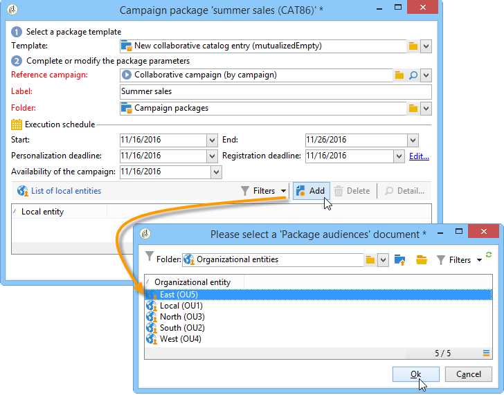

# 建立協作行銷活動{#creating-a-collaborative-campaign-intro}

中央實體從&#x200B;**Distributed Marketing**&#x200B;促銷活動範本建立協作促銷活動。 請參見[此頁面](about-distributed-marketing.md#collaborative-campaign)。

## 建立協作行銷活動 {#creating-a-collaborative-campaign}

若要設定協作促銷活動，請按一下&#x200B;**[!UICONTROL Campaign management > Campaigns]**&#x200B;節點，然後按一下&#x200B;**[!UICONTROL New]**&#x200B;圖示。

>[!NOTE]
>
>除了&#x200B;**[!UICONTROL collaborative campaigns (by campaign)]**，這些促銷活動可透過網頁介面來設定及執行。

協作行銷活動資料庫的設定程式與本機行銷活動範本的設定程式類似。 下文詳細說明不同協作促銷活動類型的規格。

### 按表單 {#by-form}

若要建立協作促銷活動（依表單），必須選取&#x200B;**[!UICONTROL Collaborative campaign (by form)]**&#x200B;範本。

在&#x200B;**[!UICONTROL Edit]**&#x200B;標籤中，按一下&#x200B;**[!UICONTROL Advanced campaign settings...]**&#x200B;連結以存取&#x200B;**Distributed Marketing**&#x200B;標籤。

選擇&#x200B;**By form** Web介面。 此類型的介面可讓您建立個人化欄位，供本機實體在排序促銷活動時使用。 請參閱[建立本機促銷活動（依表單）](examples.md#creating-a-local-campaign--by-form-)。

儲存您的行銷活動。 您現在可以按一下&#x200B;**[!UICONTROL Create]**&#x200B;按鈕，從&#x200B;**Campaign**&#x200B;標籤的&#x200B;**促銷活動套件**&#x200B;檢視使用它。

**[!UICONTROL Campaign Package]**&#x200B;檢視可讓您使用本機促銷活動範本（現成或已複製），以及參考協作促銷活動的促銷活動，以便為不同的組織實體建立促銷活動。

### 依促銷活動 {#by-campaign}

若要建立協作促銷活動（依促銷活動），必須選取&#x200B;**[!UICONTROL Collaborative campaign (by campaign) (opCollaborativeByCampaign)]**&#x200B;範本。

排序促銷活動時，本機實體可以完成中央實體預先定義的條件，並在排序之前評估促銷活動。

一旦中央實體核准&#x200B;**協作促銷活動（依促銷活動）**&#x200B;的訂單後，就會為本機實體建立子促銷活動。 當本機實體可供使用後，即可修改：

* 行銷活動工作流程，
* 類型規則，
* 和個人化欄位。

本機實體會執行子促銷活動。 中央實體會執行父促銷活動。

中央實體可以從此控制面板（透過&#x200B;**[!UICONTROL List of associated campaigns]**&#x200B;連結）檢視與&#x200B;**協作促銷活動（依促銷活動）**&#x200B;連結的所有子促銷活動。

### 按目標批准 {#by-target-approval}

若要建立協作促銷活動（透過目標核准），必須選取&#x200B;**[!UICONTROL Collaborative campaign (by target approval)]**&#x200B;範本。

>[!NOTE]
>
>在此模式中，中央實體不需要指定本地實體。

促銷活動工作流程必須整合&#x200B;**本機核准**&#x200B;類型活動。 活動參數如下：

* **[!UICONTROL Action to perform]** :Target核准通知。
* **[!UICONTROL Distribution context]** :明確。
* **[!UICONTROL Data distribution]** :本地實體分發。

**必須建** 立本地實體分發類型資料分發。資料分送範本可讓您限制分組值清單中的記錄數。 在&#x200B;**[!UICONTROL Resources > Campaign management > Data distribution]**&#x200B;中，按一下&#x200B;**[!UICONTROL New]**&#x200B;圖示以建立新的&#x200B;**[!UICONTROL Data distribution]**。 有關資料分發的詳細資訊，請參閱[Workflows](../../workflow/using/using-the-local-approval-activity.md#step-1--creating-the-data-distribution-template-)指南。

選取&#x200B;**目標維度**&#x200B;和&#x200B;**[!UICONTROL Distribution field]**。 對於&#x200B;**[!UICONTROL Assignment type]**，選擇&#x200B;**本地實體**。

在&#x200B;**[!UICONTROL Distribution]**&#x200B;標籤中，為每個本地實體添加一個欄位並指定值。

您可以在&#x200B;**傳送**&#x200B;類型活動之後新增第二個&#x200B;**Target核准**，以設定相關報表。

在促銷活動建立通知訊息中，本機實體會收到由中央實體參數預先定義的聯絡人清單。

本機實體可以根據促銷活動內容刪除某些聯絡人。

### 簡單 {#simple}

若要建立簡單的協作促銷活動，必須選取&#x200B;**[!UICONTROL Collaborative campaign (simple)]**&#x200B;範本。

## 建立協作行銷活動套件 {#creating-a-collaborative-campaign-package}

若要讓促銷活動可供本機實體使用，中央實體必須建立促銷活動套件。

應用以下步驟：

1. 在&#x200B;**促銷活動**&#x200B;頁面的&#x200B;**[!UICONTROL Navigation]**&#x200B;區段中，按一下&#x200B;**[!UICONTROL Campaign packages]**&#x200B;連結。
1. 按一下 **[!UICONTROL Create]** 按鈕。
1. 視窗頂端的區段可讓您選取&#x200B;**[!UICONTROL New collaborative package (mutualizedEmpty)]**&#x200B;範本。
1. 選取參考促銷活動。
1. 指定促銷活動套件的標籤、資料夾和執行排程。

### 日期 {#dates}

開始和結束日期會在促銷活動套件清單中定義促銷活動的可見性期間。

對於&#x200B;**協作促銷活動**，中央實體必須指定註冊和個人化截止日期。

>[!NOTE]
>
>**[!UICONTROL Personalization deadline]**&#x200B;允許中央實體選擇一個截止日期，本地實體必須在該截止日期之前傳遞要用於配置促銷活動的文檔（電子錶格、影像）。 這不是強制選項。 並排執行此日期不會影響促銷活動實作。

### 對象 {#audience}

當建立協作促銷活動時，中央實體必須指定每個促銷活動所涉及的當地實體。

>[!CAUTION]
>
>**[!UICONTROL Simple, by form and by campaign collaborative campaign kits]** 除非有關地方實體已指定，否則不得批准。

### 核准模式 {#approval-modes}

對於&#x200B;**協作促銷活動**，您可以指定訂單核准模式。

在手動模式中，本地實體需要訂閱促銷活動才能參與。

在自動模式中，已預先訂閱促銷活動的本機實體。 它可以取消促銷活動訂閱或修改其參數，而不需要中央實體的批准。

### 通知 {#notifications}

通知的設定與本機實體的通知相同。 請參閱[本節](creating-a-local-campaign.md#notifications)。

## 排序行銷活動 {#ordering-a-campaign}

將協作行銷活動新增至行銷活動套件清單時，系統會通知屬於中央實體定義之對象的本機實體(**協作行銷活動（透過目標核准）**&#x200B;沒有預先定義的對象)。 傳送的訊息包含可讓您註冊促銷活動的連結，如下所示：

此訊息也可讓本機實體檢視建立套件的中央運算子所輸入的說明，以及連結至促銷活動的檔案。 雖然行銷活動提供其他相關資訊，但這些資訊不屬於行銷活動本身。

當本機營運商透過網頁介面登入後，就可以輸入個人化資訊給他們想要訂購的協作行銷活動：

當地單位完成登記後，通過電子郵件通知中央單位核准訂單。

有關詳細資訊，請參閱[核准程式](creating-a-local-campaign.md#approval-process)區段。

## 核准訂單 {#approving-an-order}

核准協作促銷活動套件訂單的程式與針對本機促銷活動核准此程式的程式相同。 請參閱[本節](creating-a-local-campaign.md#approving-an-order)。
