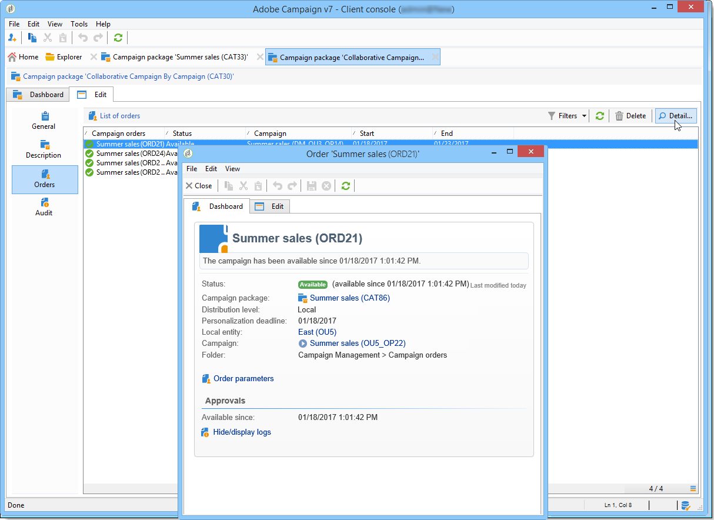
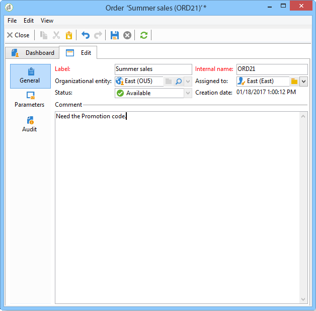

# 建立本機行銷活動{#creating-a-local-campaign}

本機促銷活動是從 **[!UICONTROL campaign packages]** 帶 **特定執行計畫**. 其目標是使用由中央實體設定和設定的行銷活動範本，來滿足本機通訊需求。 實施本地操作的主要階段如下：

**對於中央實體**

1. 建立本機行銷活動範本。
1. 從範本建立行銷活動套件。
1. 發佈行銷活動套件。
1. 批准訂單。

**對於本地實體**

1. 排序促銷活動。
1. 執行行銷活動。

## 建立本機行銷活動範本 {#creating-a-local-campaign-template}

若要建立促銷活動套件，您必須先建立 **行銷活動範本** 透過 **[!UICONTROL Resources > Templates]** 節點。

若要建立新的本機範本，請複製預設範本 **[!UICONTROL Local campaign (opLocal)]** 範本。

為您的行銷活動範本命名，並填寫可用欄位。

在促銷活動視窗中，按一下 **[!UICONTROL Edit]** ，然後按一下 **[!UICONTROL Advanced campaign settings...]** 連結。

### 網頁介面 {#web-interface}

在 **分散式行銷** 頁簽，您可以選擇Web介面的類型，並指定當本地實體下訂單時要輸入的預設值和參數。

Web介面對應於訂購促銷活動時，要由本機實體填入的表單。

選取要套用至從範本建立之促銷活動的網頁介面類型：

可用的Web介面有四種類型：

* **[!UICONTROL By brief]** :本機實體必須提供說明促銷活動設定的說明。 一旦訂單獲得核准，中央實體就會將促銷活動設定為整體並加以執行。

   

* **[!UICONTROL By form]** :本機實體可存取網頁表單，其中可依使用的範本編輯內容、目標、最大大小，以及使用個人化欄位建立和擷取日期（視使用的範本而定）。 本機實體可評估目標，並從此Web表單預覽內容。

   

   提供的表單在Web應用程式中指定，必須從 **[!UICONTROL web Interface]** 欄位 **[!UICONTROL Advanced campaign settings...]** 連結。 請參閱 [建立本機行銷活動（依表單）](examples.md#creating-a-local-campaign--by-form-).

   >[!NOTE]
   >
   >此範例中使用的Web應用程式就是範例。 您必須建立特定的網頁應用程式才能使用表單。 請參閱 [API](../../configuration/using/about-web-services.md).

   

* **[!UICONTROL By external form]** :本地實體可存取其外聯網(非Adobe Campaign)中的campaign參數。 這些參數與 **本機行銷活動（依表單）**.
* **[!UICONTROL Pre-set]** :本機實體訂購促銷活動，使用預設表單，不將其翻譯為本地。

   

### 預設值 {#default-values}

選取 **[!UICONTROL Default values]** 由本地實體完成。 例如：

* 聯繫和摘取日期，
* 目標特性（年齡區段等）。

完成 **[!UICONTROL Parent marketing program]** 和 **[!UICONTROL Charge]** 欄位。

### 核准 {#approvals}

從 **[!UICONTROL Advanced parameters for campaign entry]** 連結，您可以指定審核者的人數上限。

訂購促銷活動時，本地實體將輸入審閱者。

如果您不想為促銷活動的審核者命名，請輸入0。

### 文件 {#documents}

您可以允許本機實體運算子連結檔案（文字檔案、試算表、影像、促銷活動說明等） 建立訂單時傳送至本機促銷活動。 此 **[!UICONTROL Advanced parameters for campaign entry...]** 連結可讓您限制檔案的數量。 要執行此操作，只需在 **[!UICONTROL Number of documents]** 欄位。

訂購促銷活動套件時，表單建議連結範本中對應欄位中指出的所有檔案。

如果您不想顯示文檔上載欄位，請輸入 **[!UICONTROL 0]** 在 **[!UICONTROL Number of documents]** 欄位。

>[!NOTE]
>
>此 **[!UICONTROL Advanced parameters for campaign entry]** 可透過檢查 **[!UICONTROL Do not display the page used to enter the campaign parameters]**.

### 工作流程 {#workflow}

在 **[!UICONTROL Targeting and workflows]** 標籤，建立收集 **[!UICONTROL Default values]** 在中指定 **[!UICONTROL Advanced campaign settings...]** 並建立傳遞。

按兩下 **[!UICONTROL Query]** 活動，以根據指定的 **[!UICONTROL Default values]**.

### 傳遞 {#delivery}

在 **[!UICONTROL Audit]** ，按一下 **[!UICONTROL Detail...]** 圖示來檢視 **[!UICONTROL Scheduling]** 的URL。

此 **[!UICONTROL Scheduling]** 圖示可讓您設定傳送的聯絡與執行日期。

如有必要，請設定傳送的最大大小：

找出您傳送的HTML。 例如，在 **[!UICONTROL Delivery > Current order > Additional fields]**，請使用 **[!UICONTROL Age segment]** 欄位，以根據目標的年齡來定位傳送。

儲存您的行銷活動範本。 您現在可以從 **[!UICONTROL Campaign packages]** 檢視 **[!UICONTROL Campaigns]** ，按一下 **[!UICONTROL Create]** 按鈕。

>[!NOTE]
>
>行銷活動範本及其一般設定在 [行銷活動範本](../../campaign/using/marketing-campaign-templates.md#campaign-templates).

## 建立行銷活動套件 {#creating-the-campaign-package}

若要讓促銷活動範本可供本機實體使用，必須將其新增至清單。 為此，中央機構需要建立新的一攬子計畫。

應用以下步驟：

1. 在 **[!UICONTROL Navigation]** 區段 **行銷活動** 頁面，按一下 **[!UICONTROL Campaign packages]** 連結。
1. 按一下 **[!UICONTROL Create]** 按鈕。

   

1. 視窗上方的區段可讓您選取 [previse](#creating-a-local-campaign-template) 指定的促銷活動套件範本。

   依預設， **[!UICONTROL New local campaign package (localEmpty)]** 範本用於本機促銷活動。

1. 指定促銷活動套件的標籤、資料夾和執行排程。

### 日期 {#dates}

開始和結束日期會在促銷活動套件清單中定義促銷活動的可見性期間。

可用日期是當地實體（依序）可使用促銷活動的日期。

>[!CAUTION]
>
>如果本機實體未在截止日期前保留促銷活動，則無法使用它。

此資訊可在傳送給本機代理的通知訊息中找到，如下所示：

### 對象 {#audience}

對於本機促銷活動，中央實體可以透過檢查 **[!UICONTROL Limit the package to a set of local entities]**.

### 其他設定 {#additional-settings}

儲存套件後，中央實體即可從 **[!UICONTROL Edit]** 標籤。

從 **[!UICONTROL General]** 索引標籤，中央實體可以：

* 從 **[!UICONTROL Approval parameters...]** 連結，
* 審查執行計畫，
* 添加或刪除本地實體。

>[!NOTE]
>
>依預設，每個實體都可排序 **本機行銷活動** 一次。
>   
>檢查 **[!UICONTROL Enable multiple creation]** 選項，允許從促銷活動套件建立數個本機促銷活動。

### 通知 {#notifications}

當促銷活動可用或達到註冊截止日期時，會傳送訊息給本機通知群組的運算子。 有關詳細資訊，請參閱 [組織實體](about-distributed-marketing.md#organizational-entities).

## 排序行銷活動 {#ordering-a-campaign}

一旦本機實體核准並開始實施期間，便能存取促銷活動套件。 本機實體會收到電子郵件，通知他們有新的促銷活動套件可供使用（一旦達到可用日期）。

>[!NOTE]
>
>如果在建立促銷活動套件時已指定某些本機實體，則這些實體將是唯一接收通知的實體。 如果未指定本地實體，則所有本地實體將收到通知。

若要使用中央實體提供的促銷活動，當地實體必須訂購。

若要排序促銷活動：

1. 按一下 **[!UICONTROL Order campaign]** 或Adobe Campaign中對應的按鈕。

   輸入您的ID和密碼來排序促銷活動。 介面由Web應用程式中定義的一組頁面組成。

   >[!NOTE]
   >
   >網路應用程式在 [本節](../../web/using/about-web-applications.md).

1. 在第一頁中輸入必要資訊（訂單標籤和注釋），然後按一下 **[!UICONTROL Next]**.

   

1. 完成可用參數並核准訂單。

1. 系統會傳送通知給本機實體所屬的組織實體的經理，以核准此訂單。

   

1. 資訊將返回給本地和中央實體。 雖然本地實體只能查看其自己的訂單，但中央實體可以按任何本地實體查看所有訂單，如下所示：

   

   運算子可顯示訂單詳細資訊：

   

   此 **[!UICONTROL Edit]** 索引標籤包含本機實體在排序促銷活動時輸入的資訊。

   

1. 命令必須經中央實體批准才能定稿。

   

   有關詳細資訊，請參閱 [核准程式](#approval-process) 區段。

1. 接著，本機運算子會收到行銷活動可用的通知：行銷活動可用性可在 **行銷活動** 標籤。 然後即可使用促銷活動。 有關詳細資訊，請參閱 [存取行銷活動](accessing-campaigns.md).

   此 **[!UICONTROL Start targeting with order approval]** 選項可讓本機實體在核准訂單後立即執行促銷活動。

   

## 核准訂單 {#approving-an-order}

若要確認促銷活動訂單，中央實體必須核准。

此 **[!UICONTROL Campaign orders]** 概述，透過 **行銷活動** 索引標籤可讓您檢視促銷活動訂單的狀態並加以核准。

>[!NOTE]
>
>本地實體可以對訂單進行更改，直到批准為止。

### 核准程式 {#approval-process}

#### 電子郵件通知 {#email-notification}

當行銷活動由本機實體排序時，其審核者會透過電子郵件收到通知，如下所示：

>[!NOTE]
>
>選取審核者顯示在 [審核者](#reviewers) 區段。 他們可以接受或拒絕命令。

#### 透過Adobe Campaign主控台核准 {#approving-via-the-adobe-campaign-console}

訂單也可透過主控台核准，位於促銷活動訂單概覽中。 若要核准訂單，請選取該訂單，然後按一下 **[!UICONTROL Approve the order]**.

>[!NOTE]
>
>仍可編輯和重新設定促銷活動，直到促銷活動可用日期為止。 本機實體也可以按一下 **[!UICONTROL Cancel]** 按鈕。

#### 建立行銷活動 {#creating-a-campaign}

一旦核准促銷活動訂單，便可由本機實體加以設定及執行。

有關詳細資訊，請參閱 [存取行銷活動](accessing-campaigns.md).

### 拒絕批准 {#rejecting-an-approval}

負責批准的操作員可以拒絕訂單或促銷活動包。

如果審核者拒絕訂單，則相關通知將自動發送給相關的本地實體：它顯示由拒絕批准的運算子輸入的注釋。

資訊會顯示在促銷活動套件清單頁面或促銷活動訂單頁面上。 如果他們能存取Adobe Campaign主控台，本機實體就會收到此拒絕通知。

他們可以在促銷活動套件的 **[!UICONTROL Edit]** 標籤。

### 審核者 {#reviewers}

每次需要核準時，審閱者都會收到電子郵件通知。

對於每個本地實體，將選擇審閱者以批准促銷活動訂單和促銷活動批准。 有關選擇本地審閱者的詳細資訊，請參閱 [組織實體](about-distributed-marketing.md#organizational-entities).

>[!NOTE]
>
>為了能夠進行此選擇，訂單批准必須尚未生效。

### 取消訂單 {#canceling-an-order}

中央機構可使用 **[!UICONTROL Delete]** 按鈕（位於訂單控制面板上）。

這會取消 **[!UICONTROL Campaign orders]** 檢視。
