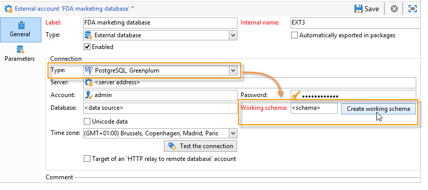

# 開始使用同盟資料存取 {#about-federated-data-access}

Adobe Campaign provides the **Federated Data Access** (FDA) option in order to process information stored in one or more external databases: you can access external data without changing the structure of Adobe Campaign data.

## 必要條件 {#operating-principle}

FDA選項可讓您在協力廠商資料庫中擴充資料模型。 它將自動檢測目標表的結構並使用SQL源中的資料。

若要使用此功能，下列為必要條件：

* **配置**:除雪花之外，您需要 **內部部署****** 或混合托管模型來設定Federated Data Access。 [進一步瞭解](../../installation/using/hosting-models.md)
* **外部資料庫版本**:您需要有與Adobe Campaign FDA模組相容的外部資料庫。 資料庫系統和相容版本的清單會在「促銷活動相容性」 [矩陣中詳細說明](../../rn/using/compatibility-matrix.md#FederatedDataAccessFDA)。
* **權限**:使用者也必須擁 [有Adobe Campaign](../../installation/using/remote-database-access-rights.md) 和外部資料庫的必要權限。

## 限制 {#limitations}

FDA選項是用來在工作流程中以批次模式控制外部資料庫中的資料。 為避免效能問題，不建議在單一作業中使用FDA模組，例如：個人化、互動、即時訊息等。

請盡量避免需要同時使用Adobe Campaign和外部資料庫的作業。 若要這麼做，您可以：

* 將Adobe Campaign資料庫匯出至外部資料庫，並僅從外部資料庫執行作業，然後再將結果重新匯入Adobe Campaign。

* 從外部Adobe Campaign資料庫收集資料，並在本機執行作業。

如果您想要使用外部資料庫的資料在傳送中進行個人化，請收集要在工作流程中使用的資料，以便在臨時表格中使用。 然後使用臨時表格中的資料來個人化您的傳送。

FDA選項受您使用的外部資料庫系統的限制。

## 建議 {#recommendations}

### 建立臨時結構 {#create-temporary-schemas}

您可以透過FDA管理對Greenplum外部資料庫的數次存取。 專用選項可讓您在設定外部帳戶時直接建立工作架構。

>[!NOTE]
>
>此選項僅適用於PostgreSQL Greenplum。

### 使用外部資料最佳化電子郵件個人化 {#optimizing-email-personalization-with-external-data}

您可以在專屬的工作流程中預先處理訊息個人化。 若要執行此動作，請 **[!UICONTROL Prepare the personalization data with a workflow]** 使用傳送屬性標籤 **[!UICONTROL Analysis]** 中的選項。

在傳送分析期間，此選項會自動建立並執行將所有連結至目標的資料儲存在暫存表格中的工作流程，包括來自外部資料庫中連結之表格的資料。

此選項可大幅改善執行個人化步驟時的效能。

### Use data from an external database in a workflow {#using-data-from-an-external-database-in-a-workflow}

在多個Adobe Campaign工作流程活動中，您可以使用儲存在外部資料庫中的資料。

* **篩選外部資料** -查  詢活動可讓您新增外部資料，並在定義的篩選設定中使用。 有關詳細資訊，請參見[此頁面](../../workflow/using/targeting-data.md#selecting-data)。

* **建立子集** -「拆 [分](../../workflow/using/split.md) 」活動允許您建立子集。 您可以使用外部資料來定義要使用的篩選條件。 有關詳細資訊，請參見[此頁面](../../workflow/using/split.md)。

* **載入外部資料庫** -可以在「資料載入 [(RDBMS)」活動中](../../workflow/using/data-loading--rdbms-.md) 使用外部資料。 在本頁中進 [一步瞭解](../../workflow/using/data-loading--rdbms-.md)。

* **添加資訊和連結** - [Enrichment](../../workflow/using/enrichment.md) （擴展）活動允許您向工作流的工作台添加其他資料，以及向外部表的連結。 在此上下文中，它可以使用外部資料庫的資料。 在本頁中進 [一步瞭解](../../workflow/using/enrichment.md)。
