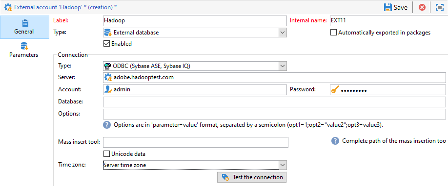

# 配置對Hadoop {#configure-access-to-hadoop}的訪問

使用Campaign **Federated Data Access**(FDA)選項來處理儲存在外部資料庫中的資訊。 請遵循下列步驟來設定對Hadoop的存取。

1. 配置[Hadoop資料庫](#configuring-hadoop)
1. 在Campaign中配置Hadoop [外部帳戶](#hadoop-external)

## 配置Hadoop 3.0 {#configuring-hadoop}

在FDA中連線至Hadoop外部資料庫需要Adobe Campaign伺服器上的下列組態。 請注意，此配置適用於Windows和Linux。

1. 根據您的OS版本下載Hadoop的ODBC驅動程式。 可在[本頁](https://www.cloudera.com/downloads.html)中找到驅動程式。

1. 然後，您需要安裝ODBC驅動程式並為Hive連接建立DSN。 有關說明，請參閱[本頁](https://docs.cloudera.com/documentation/other/connectors/hive-odbc/2-6-5/Cloudera-ODBC-Driver-for-Apache-Hive-Install-Guide.pdf)

1. 在下載並安裝ODBC驅動程式後，您需要重新啟動Campaign Classic。 要執行此操作，請運行以下命令：

   ```
   systemctl stop nlserver.service
   systemctl start nlserver.service
   ```

1. 在Campaign Classic中，您接著可以設定[!DNL Hadoop]外部帳戶。 有關如何配置外部帳戶的詳細資訊，請參閱[本節](#hadoop-external)。

## Hadoop外部帳戶{#hadoop-external}

[!DNL Hadoop]外部帳戶允許您將Campaign實例連接到Hadoop外部資料庫。

1. 在Campaign Classic中，設定您的[!DNL Hadoop]外部帳戶。 在&#x200B;**[!UICONTROL Explorer]**&#x200B;中，按一下&#x200B;**[!UICONTROL Administration]** / **[!UICONTROL Platform]** / **[!UICONTROL External accounts]**。

1. 按一下 **[!UICONTROL New]**。

1. 選擇&#x200B;**[!UICONTROL External database]**&#x200B;作為外部帳戶的&#x200B;**[!UICONTROL Type]**。

1. 設定&#x200B;**[!UICONTROL Hadoop]**&#x200B;外部帳戶，您必須指定：

   * **[!UICONTROL Type]**:ODBC(Sybase ASE、Sybase IQ)

   * **[!UICONTROL Server]**:DNS的名稱

   * **[!UICONTROL Account]**:用戶名稱

   * **[!UICONTROL Password]**:使用者帳戶密碼

   * **[!UICONTROL Database]**:DSN中未指定的資料庫名稱。如果在DSN中指定，則可保留為空

   * **[!UICONTROL Time zone]**:伺服器時區

   

連接器支援以下ODBC選項：

| 名稱 | 值 |
|---|---|
| ODBCMgr | iODBC |
| 倉庫 | 1/2/4 |

連接器還支援以下Hive選項：

| 名稱 | 值 | 說明 |
|---|---|---|
| bulkKey | Azure blob或DataLake存取金鑰 | 對於wasb://或wasbs://大量載入器(即，如果批量載入工具以wasb://或wasbs://開頭)。 <br>它是blob或DataLake儲存貯體的存取金鑰，以進行大量載入。 |
| hdfsPort | 埠號<br>預設設定為8020 | 對於HDFS批量載入(即，如果批量載入工具以webhdfs://或webhdfss://開頭)。 |
| burketsNumber | 20 | 建立聚簇表時的桶數。 |
| fileFormat | 鑲木 | 工作表的預設檔案格式。 |


## 配置Hadoop 2.1 {#configure-access-hadoop-2}

如果您需要連接到Hadoop 2.1，請遵循以下為[Windows](#for-windows)或[Linux](#for-linux)所述的步驟。

### Windows {#for-windows}版Hadoop 2.1

1. 安裝Windows專用的ODBC和[Azure HD Insight](https://www.microsoft.com/en-us/download/details.aspx?id=40886)驅動程式。
1. 通過運行ODBC資料源管理工具建立DSN（資料源名稱）。 Hive的系統DSN示例供您修改。

   ```
   Description: vorac (or any name you like)
   Host: vorac.azurehdinsight.net
   Port: 443
   Database: sm_tst611 (or your database name)
   Mechanism: Azure HDInsight Service
   User/Password: admin/<your password here>
   ```

1. 建立Hadoop外部帳戶，如[本節](#hadoop-external)中所述。

### Linux {#for-linux}版Hadoop 2.1

1. 安裝unixodbc for Linux。

   ```
   apt-get install unixodbc
   ```

1. 從HortonWorks下載並安裝Apache Hive的ODBC驅動程式：[https://www.cloudera.com/downloads.html](https://www.cloudera.com/downloads.html)。

   ```
   dpkg -i hive-odbc-native_2.1.10.1014-2_amd64.deb
   ```

1. 檢查ODBC檔案位置。

   ```
   root@campadpac71:/tmp# odbcinst -j
   unixODBC 2.3.1
   DRIVERS............: /etc/odbcinst.ini
   SYSTEM DATA SOURCES: /etc/odbc.ini
   FILE DATA SOURCES..: /etc/ODBCDataSources
   USER DATA SOURCES..: /root/.odbc.ini
   SQLULEN Size.......: 8
   SQLLEN Size........: 8
   SQLSETPOSIROW Size.: 8
   ```

1. 建立DSN（資料源名稱）並編輯odbc.ini檔案。 然後，為Hive連接建立DSN。

   以下是HDInsight設定名為「病毒式」連線的範例：

   ```
   [ODBC Data Sources]
   vorac 
   
   [vorac]
   Driver=/usr/lib/hive/lib/native/Linux-amd64-64/libhortonworkshiveodbc64.so
   HOST=vorac.azurehdinsight.net
   PORT=443
   Schema=sm_tst611
   HiveServerType=2
   AuthMech=6
   UID=admin
   PWD=<your password here>
   HTTPPath=
   UseNativeQuery=1
   ```

   >[!NOTE]
   >
   >此處的&#x200B;**UseNativeQuery**&#x200B;參數非常重要。 促銷活動會感知蜂窩，除非設定UseNativeQuery，否則無法正常運作。 通常，驅動程式或Hive SQL連接器將重寫查詢並篡改列順序。

   驗證設定取決於Hive/Hadoop配置。 例如，對於HD Insight，請使用AuthMech=6進行使用者／密碼驗證，如[此處](https://www.simba.com/products/Spark/doc/ODBC_InstallGuide/unix/content/odbc/hi/configuring/authenticating/azuresvc.htm)所述。

1. 匯出變數。

   ```
   export ODBCINI=/etc/myodbc.ini
   export ODBCSYSINI=/etc/myodbcinst.ini
   ```

1. 通過/usr/lib/hive/lib/native/Linux-amd64-64/hortonworks.hiveodbc.ini設定Hortonworks驅動程式。

   您必須使用UTF-16才能連線Campaign和unix-odbc(libodbcinst)。

   ```
   [Driver]
   
   DriverManagerEncoding=UTF-16
   ErrorMessagesPath=/usr/lib/hive/lib/native/hiveodbc/ErrorMessages/
   LogLevel=0
   LogPath=/tmp/hive
   SwapFilePath=/tmp
   
   ODBCInstLib=libodbcinst.so
   ```

1. 您現在可以使用isql測試連線。

   ```
   isql vorac
   isql vorac -v
   ```

1. 建立Hadoop外部帳戶，如[本節](#hadoop-external)中所述。

