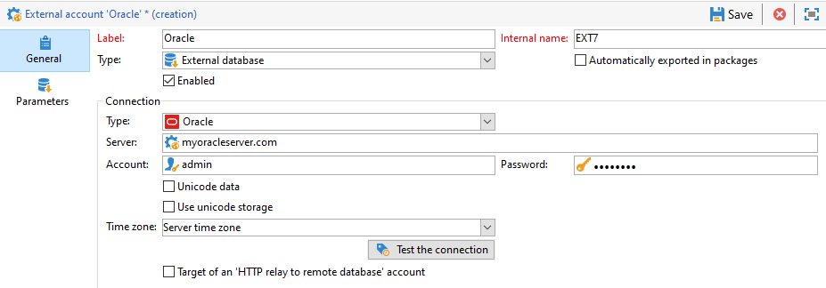

# 設定Oracle的存取權 {#configure-access-to-oracle}


使用行銷活動 [同盟資料存取](../../installation/using/about-fda.md) (FDA)選項，用於處理儲存在外部資料庫中的資訊。 請依照下列步驟設定對Oracle的存取權。

1. 設定Oracle於 [Linux](#oracle-linux) 或 [Windows](#azure-windows)
1. 設定Oracle [外部帳戶](#oracle-external) 在Campaign中

## 在Linux上的Oracle {#oracle-linux}

在FDA中連線至Oracle外部資料庫時，需要在Adobe Campaign伺服器上設定以下其他設定。

1. 安裝與您的Oracle版本相對應的Oracle完整使用者端。
1. 將TNS定義新增至安裝。 若要這麼做，請在 **tnsnames.ora** /etc/oracle存放庫中的檔案。 如果此存放庫不存在，請建立它。

   然後建立新的TNS_ADMIN環境變數：匯出TNS_ADMIN=/etc/oracle並重新啟動電腦。

1. 將Oracle整合至您的Adobe Campaign伺服器(nlserver)。 若要這麼做，請檢查 **customer.sh** 檔案位於Adobe Campaign伺服器樹狀結構的「nl6」資料夾中，且包含Oracle程式庫的連結。

   例如，對於11.2中的使用者端：

   ```
   export ORACLE_HOME=/usr/lib/oracle/11.2
   export TNS_ADMIN=/etc/oracle
   export LD_LIBRARY_PATH=$ORACLE_HOME/client64/lib:$LD_LIBRARY_PATH
   ```

   >[!NOTE]
   >
   >這些值(尤其是ORACLE_HOME)取決於您的安裝存放庫。 在參照這些值之前，請務必檢查您的樹狀結構。

1. 安裝Oracle所需的程式庫：

   * **libclntsh.so**

     ```
     cd /usr/lib/oracle/<version>/client<architecture>/lib
     ln -s libclntsh.so.<version> libclntsh.so
     ```

   * **libaio1**

     ```
     aptitude install libaio1
     or
     yum install libaio1
     ```

1. 然後，您可以在Campaign Classic中設定 [!DNL Oracle] 外部帳戶。 有關如何設定外部帳戶的詳細資訊，請參閱 [本節](#oracle-external).

## 在Windows上Oracle {#oracle-windows}

在FDA中連線至Oracle外部資料庫時，需要在Adobe Campaign伺服器上設定以下其他設定。

1. 安裝Oracle使用者端。

1. 在C：Oracle資料夾中，建立 **tnsnames.ora** 包含您的TNS定義的檔案。

1. 新增具有C：Oracle作為值的TNS_ADMIN環境變數，並重新啟動電腦。

1. 然後，您可以在Campaign Classic中設定 [!DNL Oracle] 外部帳戶。 有關如何設定外部帳戶的詳細資訊，請參閱 [本節](#oracle-external).

## oracle外部帳戶 {#oracle-external}

此 [!DNL Oracle] 外部帳戶可讓您將您的Campaign執行個體連線至Oracle外部資料庫。

1. 從Campaign **[!UICONTROL Explorer]**，選取 **[!UICONTROL Administration]** &#39;>&#39; **[!UICONTROL Platform]** &#39;>&#39; **[!UICONTROL External accounts]**.

1. 選擇 **[!UICONTROL New]**.

1. 選取 **[!UICONTROL External database]** 作為外部帳戶的 **[!UICONTROL Type]**.

1. 設定 **[!UICONTROL Oracle]** 外部帳戶，您必須指定：

   * **[!UICONTROL Type]**：Oracle

   * **[!UICONTROL Server]**：DNS的名稱

   * **[!UICONTROL Account]**：使用者名稱

   * **[!UICONTROL Password]**：使用者帳戶密碼

   * **[!UICONTROL Time zone]**：伺服器時區

   
