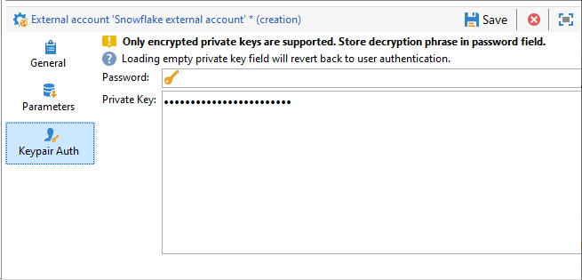

# 設定Snowflake的存取權 {#configure-access-to-snowflake}


使用行銷活動 **同盟資料存取** (FDA)選項，用於處理儲存在外部資料庫中的資訊。 請依照下列步驟，設定存取權至 [!DNL Snowflake].

1. 設定 [!DNL Snowflake] 於 [Linux](#snowflake-linux).
1. 設定 [!DNL Snowflake] [外部帳戶](#snowflake-external) 在Campaign中

>[!NOTE]
>
>[!DNL Snowflake] 聯結器可用於託管及內部部署。 如需詳細資訊，請參閱[此頁面](../../installation/using/capability-matrix.md)。


## 在Linux上的Snowflake {#snowflake-linux}

進行設定 [!DNL Snowflake] 在Linux上，請遵循下列步驟：

1. 在ODBC安裝之前，請檢查您的Linux發行版本上是否已安裝下列套裝軟體：

   * 若為Red Hat/CentOS：

     ```
     yum update
     yum upgrade
     yum install -y grep sed tar wget perl curl
     ```

   * 對於Debian：

     ```
     apt-get update
     apt-get upgrade
     apt-get install -y grep sed tar wget perl curl
     ```

1. 在執行指令碼之前，您可以透過存取更多資訊 `--help` 選項：

   ```
   cd /usr/local/neolane/nl6/bin/fda-setup-scripts/
   ./snowflake_odbc-setup.sh --help
   ```

1. 存取指令碼所在的目錄，並以root使用者的身分執行以下指令碼：

   ```
   cd /usr/local/neolane/nl6/bin/fda-setup-scripts
   ./snowflake_odbc-setup.sh
   ```

1. 安裝ODBC驅動程式之後，您需要重新啟動Campaign Classic。 要執行此操作，請執行以下命令：

   ```
   systemctl stop nlserver.service
   systemctl start nlserver.service
   ```

1. 接著，您可以在Campaign中設定 [!DNL Snowflake] 外部帳戶。 有關如何設定外部帳戶的詳細資訊，請參閱 [本節](#snowflake-external).

## Snowflake外部帳戶 {#snowflake-external}

您需要建立 [!DNL Snowflake] 將您的Campaign執行個體連線到您的外部帳戶 [!DNL Snowflake] 外部資料庫。

1. 從Campaign **[!UICONTROL Explorer]**，按一下 **[!UICONTROL Administration]** &#39;>&#39; **[!UICONTROL Platform]** &#39;>&#39; **[!UICONTROL External accounts]**.

1. 按一下&#x200B;**[!UICONTROL New]**。

1. 選取 **[!UICONTROL External database]** 作為外部帳戶的 **[!UICONTROL Type]**.

1. 在 **[!UICONTROL Configuration]**，選取 [!DNL Snowflake] 從 **[!UICONTROL Type]** 下拉式清單。

   

1. 新增您的 **[!UICONTROL Server]** URL和 **[!UICONTROL Database]**.

1. 設定 **[!UICONTROL Snowflake]** 外部帳戶驗證：

   * 針對帳戶/密碼驗證，您必須指定：

      * **[!UICONTROL Account]**：使用者名稱

      * **[!UICONTROL Password]**：使用者帳戶密碼。

     

   * 對於金鑰組驗證，按一下 **[!UICONTROL Keypair Auth]** 標籤以使用您的 **[!UICONTROL Private key]** 驗證並複製貼上您的 **[!UICONTROL Private key]**.

     

1. 按一下 **[!UICONTROL Parameters]** 按Tab鍵，然後 **[!UICONTROL Deploy functions]** 按鈕以建立函式。

   >[!NOTE]
   >
   >若要讓所有函式都可使用，您需要在遠端資料庫中建立Adobe Campaign SQL函式。 如需詳細資訊，請參閱此 [頁面](../../configuration/using/adding-additional-sql-functions.md).

   

1. 按一下 **[!UICONTROL Save]** 完成設定時。

聯結器支援下列選項：

| Option | 說明 |
|---|---|
| 工作綱要 | 用於工作表的資料庫綱要 |
| 倉儲 | 要使用的預設倉儲名稱。 它會覆寫使用者的預設值。 |
| 時區名稱 | 預設為空白，這表示會使用Campaign Classic應用程式伺服器的系統時區。 選項可用來強制TIMEZONE工作階段引數。 <br>[如需關於此項目的詳細資訊，請參閱此頁面](https://docs.snowflake.net/manuals/sql-reference/parameters.html#timezone). |
| weekstart | WEEK_START階段作業引數。 預設為0。 <br>[如需關於此項目的詳細資訊，請參閱此頁面](https://docs.snowflake.com/en/sql-reference/parameters.html#week-start). |
| UseCachedResult | USE_CACHED_RESULTS工作階段引數。 預設為TRUE。 此選項可用來停用Snowflake快取結果。 <br>[如需關於此項目的詳細資訊，請參閱此頁面](https://docs.snowflake.net/manuals/user-guide/querying-persisted-results.html). |
| bulkThread | 用於Snowflake大量載入器的執行緒數量，執行緒越多，批次載入量越大，效能就越好。 預設為1。 根據機器執行緒計數，數字可以調整。 |
| chunkSize | 決定大量載入器區塊的檔案大小。 預設為128MB。 可以修改以獲得最佳效能（當與bulkThreads一起使用時）。 同時作用中的執行緒越多，效能就越好。 <br>有關詳細資訊，請參閱 [Snowflake檔案](https://docs.snowflake.net/manuals/sql-reference/sql/put.html). |
| 階段名稱 | 預先布建的內部階段名稱。 它將用於大量載入，而不是建立新的臨時階段。 |
