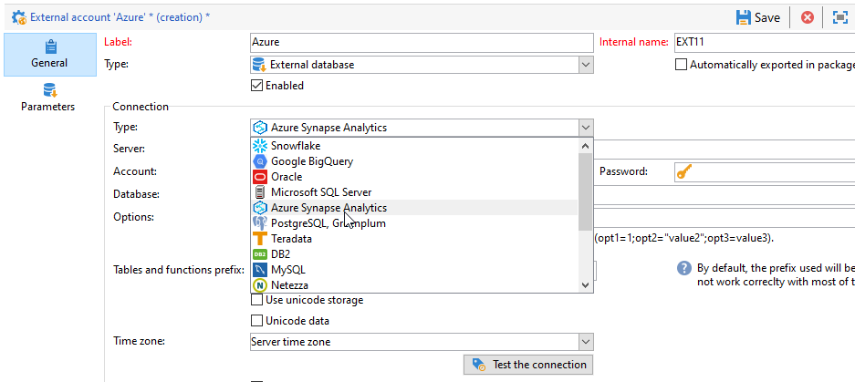
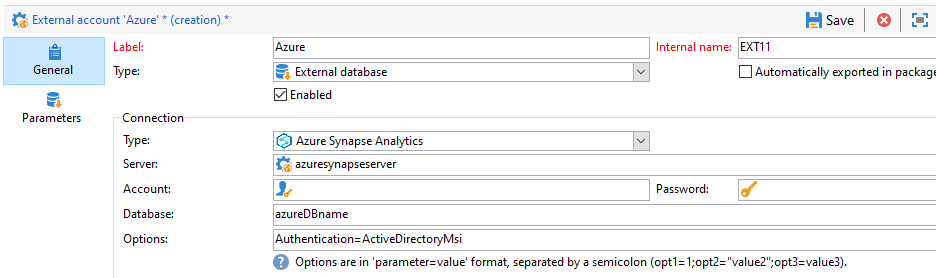

# 設定Azure synapse的存取權 {#configure-access-to-azure-synapse}


使用行銷活動 [同盟資料存取](../../installation/using/about-fda.md) (FDA)選項，用於處理儲存在外部資料庫中的資訊。 請依照下列步驟，設定存取權至 **MicrosoftAzure synapse分析**.

1. 設定Azure synapse於 [CentOS](#azure-centos)， [Windows](#azure-windows) 或 [Debian](#azure-debian)
1. 設定Azure synapse [外部帳戶](#azure-external) 在Campaign中

## 在CentOS上Azure synapse {#azure-centos}

>[!CAUTION]
>
>* 您需要root許可權才能安裝ODBC驅動程式。
>* Microsoft提供的Red Hat Enterprise ODBC驅動程式也可搭配CentOS使用來連線至SQL Server。
>* 13.0版可搭配Red Hat 6和7使用。

若要在CentOS上設定Azure synapse，請遵循下列步驟：

1. 首先，安裝ODBC驅動程式。 您可以在這裡找到它 [頁面](https://www.microsoft.com/en-us/download/details.aspx?id=50420).

   >[!NOTE]
   >
   >這是ODBC驅動程式13版的專屬功能。

   ```
   sudo su
   curl https://packages.microsoft.com/config/rhel/6/prod.repo > /etc/yum.repos.d/mssql-release.repo
   exit
   # Uninstall if already installed Unix ODBC driver
   sudo yum remove unixODBC-utf16 unixODBC-utf16-devel #to avoid conflicts
   
   sudo ACCEPT_EULA=Y yum install msodbcsql
   
   sudo ACCEPT_EULA=Y yum install mssql-tools
   echo 'export PATH="$PATH:/opt/mssql-tools/bin"' >> ~/.bash_profile
   echo 'export PATH="$PATH:/opt/mssql-tools/bin"' >> ~/.bashrc
   source ~/.bashrc
   
   # the Microsoft driver expects unixODBC to be here /usr/lib64/libodbc.so.1, so add soft links to the '.so.2' files
   cd /usr/lib64
   sudo ln -s libodbccr.so.2   libodbccr.so.1
   sudo ln -s libodbcinst.so.2 libodbcinst.so.1
   sudo ln -s libodbc.so.2     libodbc.so.1
   
   # Set the path for unixODBC
   export ODBCINI=/usr/local/etc/odbc.ini
   export ODBCSYSINI=/usr/local/etc
   source ~/.bashrc
   
   #Add a DSN information to /etc/odbc.ini
   sudo vi /etc/odbc.ini
   
   #Add the following:
   [Azure Synapse Analytics]
   Driver      = ODBC Driver 13 for SQL Server
   Description = Azure Synapse Analytics DSN
   Trace       = No
   Server      = [insert your server here]
   ```

1. 如有需要，您可以執行下列命令來安裝unixODBC開發標頭：

   ```
   sudo yum install unixODBC-devel
   ```

1. 安裝驅動程式後，您可以測試及驗證ODBC驅動程式，並視需要查詢資料庫。 執行以下命令：

   ```
   /opt/mssql-tools/bin/sqlcmd -S yourServer -U yourUserName -P yourPassword -q "your query" # for example -q "select 1"
   ```

1. 接著，您可以在Campaign中設定 [!DNL Azure Synapse] 外部帳戶。 有關如何設定外部帳戶的詳細資訊，請參閱 [本節](#azure-external).

1. 由於Azure synapse Analytics會透過TCP 1433連線埠通訊，因此您必須在防火牆上開啟此連線埠。 使用以下命令：

   ```
   firewall-cmd --permanent --add-rich-rule='rule family="ipv4" source address="[server_ip_here]/32" port port="1433" protocol="tcp" accept'
   # you can ping your hostname and the ping command will translate the hostname to IP address which you can use here
   ```

   >[!NOTE]
   >
   >若要允許來自Azure synapse Analytics端的通訊，您可能需要將您的公用IP新增至允許清單。 要執行此操作，請參閱 [Azure檔案](https://docs.microsoft.com/en-us/azure/sql-database/sql-database-firewall-configure#use-the-azure-portal-to-manage-server-level-ip-firewall-rules).

1. 如果是iptables，請執行以下命令：

   ```
   iptables -A OUTPUT -p tcp -d [server_hostname_here] --dport 1433 -j ACCEPT
   ```

## 在Windows上Azure synapse {#azure-windows}

>[!NOTE]
>
>這是ODBC驅動程式13版的專屬功能，但Adobe Campaign Classic也可以使用SQL Server Native Client驅動程式11.0和10.0。

若要在Windows上設定Azure synapse：

1. 首先，安裝Microsoft ODBC驅動程式。 您可在以下位置找到： [此頁面](https://www.microsoft.com/en-us/download/details.aspx?id=50420).

1. 選擇要安裝的下列檔案：

   ```
   your_language\your_architecture\msodbcsql.msi (i.e: English\X64\msodbcsql.msi)
   ```

1. 安裝ODBC驅動程式之後，您可以視需要加以測試。 如需關於此項目的詳細資訊，請參閱此[頁面](https://docs.microsoft.com/en-us/sql/connect/odbc/windows/system-requirements-installation-and-driver-files?view=sql-server-ver15#installing-microsoft-odbc-driver-for-sql-server)。

1. 然後，您可以在Campaign Classic中設定 [!DNL Azure Synapse] 外部帳戶。 有關如何設定外部帳戶的詳細資訊，請參閱 [本節](#azure-external).

1. 由於Azure synapse Analytics會透過TCP 1433連線埠通訊，因此您必須在Windows Defender防火牆上開啟此連線埠。 有關詳細資訊，請參閱 [Windows檔案](https://docs.microsoft.com/en-us/windows/security/threat-protection/windows-firewall/create-an-outbound-program-or-service-rule).

## Debian上的Azure synapse {#azure-debian}

**先決條件：**

* 您需要root許可權才能安裝ODBC驅動程式。
* 安裝msodbcsql套件需要CURL。 如果您尚未安裝，請執行以下命令：

  ```
  sudo apt-get install curl
  ```

若要在Debian上設定Azure synapse：

1. 首先，安裝適用於SQL Server的Microsoft ODBC驅動程式。 使用下列命令安裝SQL Server的ODBC驅動程式13.1：

   ```
   sudo su
   curl https://packages.microsoft.com/keys/microsoft.asc | apt-key add -
   curl https://packages.microsoft.com/config/debian/8/prod.list > /etc/apt/sources.list.d/mssql-release.list
   exit
   sudo apt-get update
   sudo ACCEPT_EULA=Y apt-get install msodbcsql
   ```

1. 如果您收到下列錯誤 **「找不到方法驅動程式/usr/lib/apt/methods/https」** 呼叫時 **sudo apt-get更新**，您應該執行命令：

   ```
   sudo apt-get install apt-transport-https ca-certificates
   ```

1. 您現在需要使用以下命令安裝mssql-tools。 需要Mssq-tools才能使用大量復製程式（或BCP）公用程式並執行查詢。

   ```
   sudo ACCEPT_EULA=Y apt-get install mssql-tools
   echo 'export PATH="$PATH:/opt/mssql-tools/bin"' >> ~/.bash_profile
   echo 'export PATH="$PATH:/opt/mssql-tools/bin"' >> ~/.bashrc
   source ~/.bashrc
   ```

1. 如有需要，您可以執行下列命令來安裝unixODBC開發標頭：

   ```
   sudo yum install unixODBC-devel
   ```

1. 安裝驅動程式後，您可以測試及驗證ODBC驅動程式，並視需要查詢資料庫。 執行以下命令：

   ```
   /opt/mssql-tools/bin/sqlcmd -S yourServer -U yourUserName -P yourPassword -q "your query" # for example -q "select 1"
   ```

1. 在Campaign Classic中，您現在可以設定 [!DNL Azure Synapse] 外部帳戶。 有關如何設定外部帳戶的詳細資訊，請參閱 [本節](#azure-external).

1. 若要在Debian上設定iptables以確保與Azure synapse Analytics連線，請使用下列命令為您的主機名稱啟用輸出TCP 1433連線埠：

   ```
   iptables -A OUTPUT -p tcp -d [server_hostname_here] --dport 1433 -j ACCEPT
   ```

   >[!NOTE]
   >
   >若要允許來自Azure synapse Analytics端的通訊，您可能需要將您的公用IP新增至允許清單。 要執行此操作，請參閱 [Azure檔案](https://docs.microsoft.com/en-us/azure/sql-database/sql-database-firewall-configure#use-the-azure-portal-to-manage-server-level-ip-firewall-rules).

## azure synapse外部帳戶 {#azure-external}

此 [!DNL Azure Synapse] 外部帳戶可讓您將您的Campaign執行個體連線至Azure synapse外部資料庫。

若要建立 [!DNL Azure Synapse] 外部帳戶請遵循以下步驟：

1. 從Campaign **[!UICONTROL Explorer]**，按一下 **[!UICONTROL Administration]** &#39;>&#39; **[!UICONTROL Platform]** &#39;>&#39; **[!UICONTROL External accounts]**.

1. 按一下&#x200B;**[!UICONTROL New]**。

1. 選取 **[!UICONTROL External database]** 作為外部帳戶的 **[!UICONTROL Type]**.

   

1. 在 **[!UICONTROL Configuration]**，選取 **[!UICONTROL Azure Synapse Analytics]** 從 **[!UICONTROL Type]** 下拉式清單。

   

1. 設定 [!DNL Azure Synapse] 外部帳戶：

   * 對於標準驗證，您必須指定：

      * **[!UICONTROL Server]**：Azure synapse伺服器的URL

      * **[!UICONTROL Account]**：使用者名稱

      * **[!UICONTROL Password]**：使用者帳戶密碼

      * **[!UICONTROL Database]**：資料庫名稱

     

   * 對於系統指派的Managed身分驗證，您必須指定：

      * **[!UICONTROL Server]**：Azure synapse伺服器的URL

      * **[!UICONTROL Database]**：資料庫名稱

      * **[!UICONTROL Options]**：新增下列語法 `Authentication=ActiveDirectoryMsi`

     

1. 按一下&#x200B;**[!UICONTROL Save]**。

聯結器支援下列選項：

| 選項 | 說明 |
|---|---|
| 驗證 | 聯結器支援的驗證型別。 目前支援的值： ActiveDirectoryMSI。 </br>如需詳細資訊，請參閱 [SQL檔案](https://docs.microsoft.com/en-us/sql/connect/odbc/using-azure-active-directory?view=sql-server-ver15#example-connection-strings) （連線字串n°8範例）。 |
