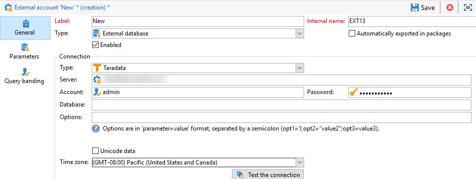

# 設定Teradata的存取權 {#configure-access-to-teradata}


使用Campaign [同盟資料存取](../../installation/using/about-fda.md) (FDA)選項來處理儲存在外部資料庫中的資訊。 請依照下列步驟設定對Teradata的存取權。

1. 安裝及設定[Teradata驅動程式](#teradata-config)
1. 在Campaign中設定Teradata[外部帳戶](#teradata-external)
1. 設定Teradata與促銷活動伺服器的[額外組態](#teradata-additional-configurations)

## teradata設定 {#teradata-config}

您必須安裝Teradata驅動程式，才能實作與Campaign的連線。

1. 安裝Teradata](https://downloads.teradata.com/download/connectivity/odbc-driver/linux)的[ODBC驅動程式。

   它由三個套件組成，可依下列順序安裝在Red Hat （或CentOS）/Suse上：

   * TeraGSS
   * tdicu1510 （使用setup_wrapper.sh安裝）
   * tdodbc1510 （使用setup_wrapper.sh安裝）

1. 設定ODBC驅動程式。 可在標準檔案中執行組態： **/etc/odbc.ini** （一般引數）和/etc/odbcinst.ini （宣告驅動程式）：

   * **/etc/odbc.ini**

     ```
     [ODBC]
     InstallDir=/etc/
     ```

     「InstallDir」對應至&#x200B;**odbcinst.ini**&#x200B;檔案的位置。

   * **/etc/odbcinst.ini**

     ```
     [ODBC DRIVERS]
     teradata=Installed
     
     [teradata]
     Driver=/opt/teradata/client/17.10/lib64/tdataodbc_sb64.so
     APILevel=CORE
     ConnectFunctions=YYY
     DriverODBCVer=3.51
     SQLLevel=1
     ```

1. 指定Adobe Campaign伺服器的環境變數：

   * **LD_LIBRARY_PATH**： /opt/teradata/client/15.10/lib64和/opt/teradata/client/15.10/odbc_64/lib。
   * **ODBCINI**： odbc.ini檔案的位置(例如/etc/odbc.ini)。
   * **NLSPATH**： opermsgs.cat檔案(/opt/teradata/client/15.10/msg/opermsgs.cat)的位置

>[!NOTE]
>
>在FDA中連線到Teradata外部資料庫需要Adobe Campaign伺服器上的其他設定步驟。 [了解更多](#teradata-additional-configurations)。
>

## teradata外部帳戶{#teradata-external}

teradata外部帳戶可讓您將您的Campaign執行個體連線至Teradata外部資料庫。

1. 從行銷活動&#x200B;**[!UICONTROL Explorer]**，按一下&#x200B;**[!UICONTROL Administration]** / **[!UICONTROL Platform]** / **[!UICONTROL External accounts]**。

1. 按一下&#x200B;**[!UICONTROL New]**&#x200B;並選取&#x200B;**[!UICONTROL External database]**&#x200B;作為&#x200B;**[!UICONTROL Type]**。

   

1. 若要設定&#x200B;**[!UICONTROL Teradata]**&#x200B;外部帳戶，您必須指定：

   * **[!UICONTROL Type]**：選擇&#x200B;**[!UICONTROL Teradata]**&#x200B;型別。

   * **[!UICONTROL Server]**：您的Teradata伺服器的URL或名稱

   * **[!UICONTROL Account]**：用來存取Teradata資料庫的帳戶名稱

   * **[!UICONTROL Password]**：用來連線至Teradata資料庫的密碼

   * **[!UICONTROL Database]**：資料庫的名稱（選擇性）

   * **[!UICONTROL Options]**：要透過Teradata傳遞的選項。 使用以下格式： &#39;parameter=value&#39;。 值之間使用分號作為分隔符號。

   * **[!UICONTROL Timezone]**：時區設定於Teradata。 [了解更多](#timezone)

聯結器支援下列選項：

| 選項 | 說明 |
|---|---|
| TD_MAX_SESSIONS | 指定「Teradata平行傳輸程式」可為運運算元工作取得的登入工作階段數目上限。 |
| 時區名稱 | 伺服器時區的名稱。 |
| 字元集 | 用於設定Teradata字元集。 <br>如需詳細資訊，請參閱[此頁面](https://docs.teradata.com/r/ODBC-Driver-for-Teradata-User-Guide/May-2017/Configuration-of-odbc.ini-in-UNIX/Linux-and-Apple-OS-X/Teradata-DSN-Options#rub1478609534082__table_N102D3_N102B6_N102B3_N10001)。 |
| IANAAppCodePage | ODBC應用程式程式碼頁。 <br>如需詳細資訊，請參閱[此頁面](https://docs.teradata.com/r/ODBC-Driver-for-Teradata-User-Guide/May-2017/ODBC-Driver-for-Teradata-Application-Development/International-Character-Set-Support/Application-Code-Page) |

### 新增其他ODBC外部帳戶 {#add-external}

>[!NOTE]
>
> 此選項不適用於7.3.1版之前的組建。

teradata驅動程式提供自己的ODBC程式庫，但此程式庫可能與其他ODBC外部帳戶不相容。

如果您要設定另一個也使用ODBC的外部帳戶(例如Snowflake)，您需要將ODBCLib選項集新增至預設ODBC程式庫的路徑（`/usr/lib/x86_64-linux-gnu/libodbc.so`在Debian上，`/usr/lib64/libodbc.so`在RHEL/CentOS上）。


### 查詢級區

當多個Adobe Campaign使用者連線至相同的FDATeradata外部帳戶時，**[!UICONTROL Query banding]**&#x200B;標籤可讓您在工作階段上設定查詢範圍，即一組索引鍵/值組。


設定此選項後，每次Campaign使用者在Teradata資料庫上執行查詢時，Adobe Campaign都會傳送與此使用者相關聯的中繼資料，其中包含索引鍵清單。 然後，Teradata管理員可使用此資料進行稽核或管理存取許可權。

>[!NOTE]
>
>如需&#x200B;**[!UICONTROL Query banding]**&#x200B;的詳細資訊，請參閱[Teradata檔案](https://docs.teradata.com/reader/cY5B~oeEUFWjgN2kBnH3Vw/a5G1iz~ve68yTMa24kVjVw)。

若要設定「查詢」級區，請遵循下列步驟：

1. 使用&#x200B;**[!UICONTROL Default]**&#x200B;輸入預設查詢頻帶，如果使用者沒有關聯的查詢頻帶，就會使用預設查詢頻帶。 如果此欄位留空，則沒有查詢範圍的使用者將無法使用Teradata。

1. 使用&#x200B;**[!UICONTROL Users]**&#x200B;欄位為每個使用者指定查詢頻帶。 您可以視需要新增任意數量的索引鍵/值組，例如，priority=1；workload=high。 如果使用者未指派查詢頻帶，則會套用&#x200B;**[!UICONTROL Default]**&#x200B;欄位。

1. 勾選&#x200B;**[!UICONTROL Active]**&#x200B;方塊以啟動此功能

#### 外部帳戶疑難排解 {#external-account-troubleshooting}

如果在測試連線&#x200B;**TIM-030008日期&#39;2&#39;時出現下列錯誤：遺漏字元(iRc=-53)**，請確定已正確安裝ODBC驅動程式，且已為Campaign伺服器設定LD_LIBRARY_PATH (Linux) / PATH (Windows)。

錯誤&#x200B;**ODB-240000 ODBC錯誤： [找不到Microsoft][ODBC Driver Manager]資料來源名稱，且未指定預設驅動程式。如果您使用16.X驅動程式，Windows會發生**。 Adobe Campaign預期odbcinst.ini中的teradata名稱為&#39;{teradata}&#39;。

* 從Campaign 18.10開始，您可以在外部帳戶的選項中新增ODBCDriverName=&quot;Teradata資料庫ODBC驅動程式16.10&quot;。 版本編號可以變更，執行odbcad32.exe並存取[驅動程式]索引標籤即可找到確切的名稱。

* 如果您使用較舊的Campaign版本，則必須將驅動程式安裝所建立的odbcinst.ini的Teradata區段複製到名為Teradata的新區段。 在這種情況下，可以使用Regedit 。 如果您的基底是latin1，則必須在選項中新增&#x200B;**APICharSize=1**。

## 其他設定 {#teradata-additional-configurations}

<!--
### Compatibility {#teradata-compatibility}

**Based in Unicode**

| Database version | Driver version |  Minimal Campaign version required |  Note |
|:-:|:-:|:-:|:-:|
| 15  |  15 |  Campaign Classic 17.9 | Under Linux: Queries with timestamp may fail (fixed in build 8937 for 18.4 and 8977 for 18.10) In debug mode, warnings relative to bad memory usage in the driver may occur. |
| 15  | 16  | Campaign Classic 17.9  | Recommended setup for a Teradata 15 database under Linux.  |
|  16 | 16  | Campaign Classic 18.10 |  Unicode characters with surrogate pairs are not fully handled. Using surrogate characters in data should work. Using surrogates in a filtering condition of a query will not work without this change. |
| 16  |  15 |  Campaign Classic 19.0 |  &nbsp; |

**Based in Latin1**

Versions previous to Adobe Campaign Classic 17.9 only supported Teradata Latin-1 database.

Starting from Adobe Campaign Classic 17.9, we now support by default Teradata database in Unicode.

Customers with a Latin-1 Teradata database migrating to a recent Campaign Classic release will have to add the parameter APICharSize=1 in the options of the external account.
-->

### 使用者設定 {#user-configuration}

外部資料庫需要下列許可權：建立/刪除/執行自訂程式、建立/刪除/插入/選取表格。 如果您想要在Adobe Campaign執行個體上使用md5和sha2函式，則可能也需要建立使用者模式函式。

請務必設定正確的時區。 它應符合將在Adobe Campaign例項中建立的外部帳戶中設定的內容。

Adobe Campaign不會在其將在資料庫中建立的物件上設定保護模式（備援）。 您可能需要在Adobe Campaign將用來透過下列查詢連線至Teradata資料庫的使用者上設定預設值：

| 停用預設遞補 |
| :-: |
| ```MODIFY USER $login$ AS NO FALLBACK;``` |

### MD5安裝 {#md5-installation}

如果您想要在Adobe Campaign執行個體中使用md5函式，您必須從此[頁面](https://downloads.teradata.com/download/extensibility/md5-message-digest-udf) (md5_20080530.zip)在Teradata資料庫上安裝使用者模式函式。

下載檔案的sha1如下65cc0bb6935f72fcd84fef1ebcd64c00115dfd1e。

若要安裝md5：

1. 解壓縮md5_20080530.zip檔案。

1. 前往md5/src目錄。

1. 使用bteq連線至您的Teradata資料庫。

1. 執行下列bteq命令：

   ```
   .run file = hash_md5.btq
   ```

### SHA2安裝 {#sha2-installation}

如果您想要在Adobe Campaign執行個體中使用sha2函式，您必須從此[頁面](https://github.com/akuroda/teradata-udf-sha2/archive/v1.0.zip) (teradata-udf-sha2-1.0.zip)在Teradata資料庫上安裝使用者模式函式。

下載檔案的sha1如下e87438d37424836358bd3902cf1adeb629349780。

若要安裝sha2：

1. 解壓縮teradata-udf-sha2-1.0.zip檔案。

1. 前往teradata-udf-sha2-1.0/src目錄。

1. 使用bteq連線至您的Teradata資料庫。

1. 執行以下兩個bteq命令：

   ```
   .run file = hash_sha256.sql
   .run file = hash_sha512.sql
   ```

### UDF_UTF16TO8安裝 {#UDF-UTF16TO8-installation}

如果您要在Adobe Campaign執行個體中使用udf_utf16to8函式，請從&#x200B;**Teradataunicode工具套件**&#x200B;在Teradata資料庫上安裝使用者模式函式。

下載檔案的sha1如下e58235f434f52c71316a577cb48e20b97d24f470。

若要安裝udf_utf16to8：

1. 解壓縮utk_release1.7.0.0.zip檔案。

1. 在擷取的檔案中尋找udf_utf16to8.o，並瀏覽至包含該檔案的目錄。 它應該命名為utk_release1.7.0.0/utk_release1.7.0.0/04 TranslationUDFs/01TeradataUDFs/suselinux-x8664/udf_installation/。

1. 使用bteq連線至您的Teradata資料庫。

1. 輸入下列bteq指令：

   ```
   REPLACE FUNCTION udf_utf16to8 (
   inputString VARCHAR(8000) CHARACTER SET UNICODE
   ) RETURNS VARCHAR(16000) CHARACTER SET LATIN
   LANGUAGE C
   NO SQL
   EXTERNAL NAME 'CO!i18n103!udf_utf16to8.o!F!udf_utf16to8'
   PARAMETER STYLE SQL;
   
   -- Test: should return 410042
   SELECT CAST(Char2HexInt(UDF_UTF16to8(_UNICODE'004100000042'XC)) AS VARCHAR(100));
   ```

## 適用於Linux的Campaign伺服器設定 {#campaign-server-linux}

驅動程式安裝需要下列專案：

* teradata的ODBC驅動程式，可在此[頁面](https://downloads.teradata.com/download/connectivity/odbc-driver/linux)中找到

* 可在此[頁面](https://downloads.teradata.com/download/tools/teradata-tools-and-utilities-linux-installation-package-0)找到的Teradata工具和公用程式（用於大量載入）

檔案名稱和sha1：

* tdodbc1620__linux_indep.16.20.00.00-1.tar.gz 121fdd978b56fe1304fc5cb7819741b0847f44fd

* TeradataToolsAndUtilitiesBase__linux_indep.16.20.01.00.tar.gz b 29d0af5ffd8dcf68a9dbbaa6f8639387b19c563

如果Linux發行版沒有套件，您可以依照CentOS 7上的說明進行安裝（例如使用docker），然後在Adobe Campaign伺服器上複製/opt/teradata的內容。

### ODBC驅動程式安裝 {#odbc-installation}

若要安裝ODBC驅動程式：

1. 解壓縮tdodbc1620__linux_indep.16.20.00.00-1.tar.gz檔案。

1. 移至tdodbc1620目錄。

1. 您可能需要修正安裝指令碼：

   ```
   "sed -i s/16.10/16.20/ setup_wrapper.sh".
   ```

1. 執行setup_wrapper.sh。

### teradata工具與公用程式安裝 {#teradata-tools-installation}

若要安裝工具：

1. 解壓縮TeradataToolsAndUtilitiesBase__linux_indep.16.20.01.00.tar.gz檔案。

1. 前往TeradataToolsAndUtilitiesBase/Linux/i386-x8664/tdicu目錄。

1. 執行setup_wrapper.sh。

1. 前往TeradataToolsAndUtilitiesBase/Linux/i386-x8664/cliv2目錄。

1. 執行setup_wrapper.sh。

1. 前往TeradataToolsAndUtilitiesBase/Linux/i386-x8664/tptbase目錄。

1. 執行setup_wrapper.sh。

1. libtelapi.so檔案應可在/opt/teradata/client/16.20/lib64中使用。

## 適用於Windows的Campaign伺服器設定 {#campaign-server-windows}

您必須先下載Windows適用的Teradata工具和公用程式。 您可以從此[頁面](https://downloads.teradata.com/download/tools/teradata-tools-and-utilities-windows-installation-package)下載

請務必安裝ODBC驅動程式和Teradata平行傳輸程式基底。 它會安裝用來在Teradata資料庫上進行大量載入的telapi.dll。

請確定驅動程式和公用程式的路徑位於nlserver在執行期間所擁有的PATH變數中。 依預設，路徑為C:\Program Files (x86) \Teradata\Client\15.10\bin （在Windows 32位元）或C:\Program Files\Teradata\Client\15.10\bin （在64位元）。

## 時區 {#timezone}

teradata使用非標準的時區名稱，您可以在[Teradata網站](https://docs.teradata.com/reader/rgAb27O_xRmMVc_aQq2VGw/oGKvgl7gCeBMTGrp59BnwA)上找到清單。 Adobe Campaign會嘗試將外部設定中指定的時區轉換為Teradata所瞭解的情況。 如果找不到通訊，則會找到工作階段最近的GMT+X （或GMT-X）時區，並在日誌中顯示警告。

轉換會讀取名為teradata_timezones.txt的檔案，該檔案應位於以下datakit目錄中：/usr/local/neolane/nl6/datakit linux下。 如果您編輯此檔案，請務必聯絡Adobe Campaign團隊以在原始程式碼中進行變更，否則此檔案將在下次行銷活動更新時覆寫。

使用 — verbose引數執行nlserver時，將會指出用來連線的時區，例如：

```
15:04:04 >   ODB-240007 Teradata: will use 'Europe Central' as session time zone.
```

如果所用的時區不正確，可以在外部帳戶上新增名為「TimeZoneName」的選項。 在該情況下，請使用Teradata值，例如&quot;TimeZoneName=Europe Central&quot;。

在Teradata檔案中使用大量載入或「快速載入」時，Campaign無法指出時區。 因此，建議您設定Campaign用來連線之使用者的預設時區：

```
MODIFY USER $login$ AS TIME ZONE = 'Europe Central';
```
