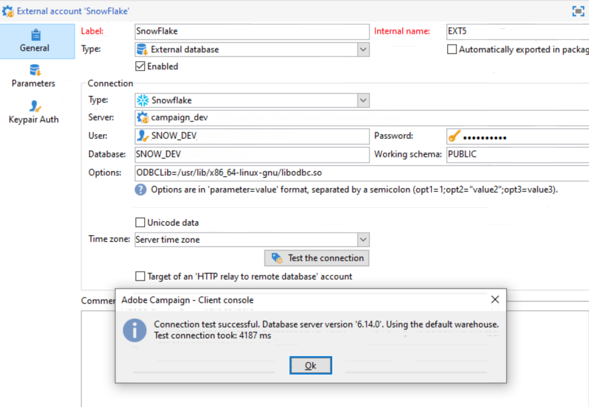

# 配置對Teradata的訪問 {#configure-access-to-teradata}


使用市場活動 [聯合資料存取](../../installation/using/about-fda.md) (FDA)選項，用於處理儲存在外部資料庫中的資訊。 按照以下步驟配置對Teradata的訪問。

1. 安裝和配置 [Teradata驅動程式](#teradata-config)
1. 配置Teradata [外部帳戶](#teradata-external) 在活動中
1. 設定 [附加配置](#teradata-additional-configurations) 用於Teradata和市場活動伺服器

## Teradata配置 {#teradata-config}

您需要安裝驅動程式以便Teradata與已實施的市場活動建立連接。

1. 安裝 [用於Teradata的ODBC驅動程式](https://downloads.teradata.com/download/connectivity/odbc-driver/linux)。

   它由三個軟體包組成，可按以下順序安裝在Red Hat（或CentOS）/Suse上：

   * 泰拉GSS
   * tdicu1510（使用setup_wrapper.sh安裝）
   * tdobc1510（使用setup_wrapper.sh安裝）

1. 配置ODBC驅動程式。 配置可以在標準檔案中執行： **/etc/odbc.ini** 用於聲明驅動程式的常規參數和/etc/odbcinst.ini

   * **/etc/odbc.ini**

      ```
      [ODBC]
      InstallDir=/etc/
      ```

      &quot;InstallDir&quot;與 **odbcinst.ini** 的子菜單。

   * **/etc/odbcinst.ini**

      ```
      [ODBC DRIVERS]
      teradata=Installed
      
      [teradata]
      Driver=/opt/teradata/client/15.10/lib64/tdata.so
      APILevel=CORE
      ConnectFunctions=YYY
      DriverODBCVer=3.51
      SQLLevel=1
      ```

1. 指定Adobe Campaign伺服器的環境變數：

   * **LD_LIBRARY_PATH**:/opt/teradata/client/15.10/lib64和/opt/teradata/client/15.10/odbc_64/lib。
   * **奧布奇尼**:odbc.ini檔案的位置(例如/etc/odbc.ini)。
   * **NLSPATH**:opermsgs.cat檔案的位置(/opt/teradata/client/15.10/msg/opermsgs.cat)

>[!NOTE]
>
>連接到FDA中的Teradata外部資料庫需要在Adobe Campaign伺服器上執行其他配置步驟。 [了解更多資訊](#teradata-additional-configurations)。

## Teradata外部帳戶{#teradata-external}

teradata外部帳戶允許您將市場活動實例連接到Teradata外部資料庫。

1. 從市場活動 **[!UICONTROL Explorer]**&#x200B;按一下 **[!UICONTROL Administration]** / **[!UICONTROL Platform]** / **[!UICONTROL External accounts]**。

1. 按一下 **[!UICONTROL New]** 選擇 **[!UICONTROL External database]** 如 **[!UICONTROL Type]**。

   

1. 配置 **[!UICONTROL Teradata]** 外部帳戶，必須指定：

   * **[!UICONTROL Type]**:選擇 **[!UICONTROL Teradata]** 的雙曲餘切值。

   * **[!UICONTROL Server]**:您的Teradata伺服器的URL或名稱

   * **[!UICONTROL Account]**:用於訪問Teradata資料庫的帳戶的名稱

   * **[!UICONTROL Password]**:用於連接到Teradata資料庫的密碼

   * **[!UICONTROL Database]**:資料庫名稱（可選）

   * **[!UICONTROL Options]**:要通過的選項Teradata。 使用以下格式：「parameter=value」。 使用半列作為值之間的分隔符。

   * **[!UICONTROL Timezone]**:在Teradata中設定時區。 [了解更多](#timezone)

連接器支援以下選項：

| Option | 說明 |
|---|---|
| TD_MAX_SESSIONS | 指定Teradata並行傳送器可為操作員作業獲取的登錄會話的最大數。 <br>[如需關於此項目的詳細資訊，請參閱此頁面](https://documentation.sas.com/doc/en/pgmsascdc/9.4_3.5/ds2ref/p1naft0um1kn3vn1ubgkrjdf7c3a.html). |
| 時區名稱 | 伺服器時區的名稱。 |
| 字元集 | 用於配置Teradata字元集。 <br>[如需關於此項目的詳細資訊，請參閱此頁面](https://docs.teradata.com/r/ODBC-Driver-for-Teradata-User-Guide/May-2017/Configuration-of-odbc.ini-in-UNIX/Linux-and-Apple-OS-X/Teradata-DSN-Options#rub1478609534082__table_N102D3_N102B6_N102B3_N10001). |
| IANAAppCodePage | 「ODBC應用程式碼」頁。 <br>[如需關於此項目的詳細資訊，請參閱此頁面](https://docs.teradata.com/r/ODBC-Driver-for-Teradata-User-Guide/May-2017/ODBC-Driver-for-Teradata-Application-Development/International-Character-Set-Support/Application-Code-Page) |

### 添加其他ODBC外部帳戶 {#add-external}

>[!NOTE]
>
> 此選項對7.3.1版以前的版本不可用。

teradata驅動程式提供其自己的ODBC庫，但此庫可能與其他ODBC外部帳戶不相容。

如果要配置另一個也使用ODBC的外部帳戶，例如Snowflake，則需要將ODBCLib選項集添加到預設ODBC庫的路徑(`/usr/lib/x86_64-linux-gnu/libodbc.so` 德比和 `/usr/lib64/libodbc.so` 在RHEL/CentOS上)。



### 查詢段

當多個Adobe Campaign用戶連接到同一FDATeradata外部帳戶時， **[!UICONTROL Query banding]** 頁籤允許您在會話中設定查詢帶，即一組鍵/值對。


配置此選項後，每次市場活動用戶對Teradata資料庫執行查詢時，Adobe Campaign都會發送元資料，該元資料包括與此用戶關聯的鍵清單。 然後，此資料可供Teradata管理員用於審核或管理訪問權限。

>[!NOTE]
>
>有關 **[!UICONTROL Query banding]**，請參閱 [Teradata文檔](https://docs.teradata.com/reader/cY5B~oeEUFWjgN2kBnH3Vw/a5G1iz~ve68yTMa24kVjVw)。

要配置查詢分段，請執行以下步驟：

1. 使用  **[!UICONTROL Default]** 輸入預設查詢帶，如果用戶沒有關聯的查詢帶，將使用該查詢帶。 如果此欄位為空，則沒有查詢帶的用戶將無法使用Teradata。

1. 使用 **[!UICONTROL Users]** 欄位，為每個用戶指定查詢頻帶。 您可以根據需要添加盡可能多的鍵/值對，例如priority=1;workload=high。 如果用戶未分配查詢帶， **[!UICONTROL Default]** 的子菜單。

1. 檢查 **[!UICONTROL Active]** 框，激活此功能

#### 外部帳戶疑難解答 {#external-account-troubleshooting}

如果測試連接時出現以下錯誤 **TIM-030008日期「2」：缺少字元(iRc=-53)** 確保ODBC驅動程式已正確安裝，並且已為市場活動伺服器設定了LD_LIBRARY_PATH(Linux)/PATH(Windows)。

錯誤 **ODB-240000 ODBC錯誤： [Microsoft][ODBC Driver Manager] 找不到資料源名稱，未指定預設驅動程式。** 使用16.X驅動程式時發生。 Adobe Campaign希望odbcinst.ini中的teradata命名為「{teradata}」。

* 啟動Campaig 18.10後，可在外部帳戶的選項中添加ODBCDriverName=&quot;Teradata資料庫ODBC驅動程式16.10&quot;。 版本號可以更改，通過運行odbcad32.exe並訪問「驅動程式」頁籤，可以找到確切的名稱。

* 如果您使用的是舊的市場活動版本，則必須將驅動程式安裝建立的odbcinst.ini的Teradata部分複製到名為Teradata的新部分。 Regedit可在此情況下使用。 如果您的基位在latin1中，則必須添加 **APICharSize=1** 的雙曲餘切值。

## 其他設定 {#teradata-additional-configurations}

<!--
### Compatibility {#teradata-compatibility}

**Based in Unicode**

| Database version | Driver version |  Minimal Campaign version required |  Note |
|:-:|:-:|:-:|:-:|
| 15  |  15 |  Campaign Classic 17.9 | Under Linux: Queries with timestamp may fail (fixed in build 8937 for 18.4 and 8977 for 18.10) In debug mode, warnings relative to bad memory usage in the driver may occur. |
| 15  | 16  | Campaign Classic 17.9  | Recommended setup for a Teradata 15 database under Linux.  |
|  16 | 16  | Campaign Classic 18.10 |  Unicode characters with surrogate pairs are not fully handled. Using surrogate characters in data should work. Using surrogates in a filtering condition of a query will not work without this change. |
| 16  |  15 |  Campaign Classic 19.0 |  &nbsp; |

**Based in Latin1**

Versions previous to Adobe Campaign Classic 17.9 only supported Teradata Latin-1 database.

Starting from Adobe Campaign Classic 17.9, we now support by default Teradata database in Unicode.

Customers with a Latin-1 Teradata database migrating to a recent Campaign Classic release will have to add the parameter APICharSize=1 in the options of the external account.
-->

### 用戶配置 {#user-configuration}

外部資料庫需要以下權限：建立/刪除/執行自定義過程、建立/刪除/插入/選擇表。 如果要在Adobe Campaign實例上使用md5和sha2函式，則可能還必須建立用戶模式函式。

確保配置正確的時區。 它應與將在Adobe Campaign實例中建立的外部帳戶中設定的內容相匹配。

Adobe Campaign不會對它將在資料庫中建立的對象設定保護模式（回退）。 您可能需要對Adobe Campaign將使用以下查詢連接到Teradata資料庫的用戶設定預設值：

| 禁用預設回退 |
| :-: |
| ```MODIFY USER $login$ AS NO FALLBACK;``` |

### MD5安裝 {#md5-installation}

如果要在Adobe Campaign實例中使用md5函式，則必須從此將用戶模式函式安裝到Teradata資料庫 [頁](https://downloads.teradata.com/download/extensibility/md5-message-digest-udf) (md5_20080530.zip)。

下載的檔案的sha1如下所示：65cc0bb6935f72fcd84fef1ebcd64c00115dfd1e。

要安裝md5:

1. 解壓縮md5_20080530.zip檔案。

1. 轉到md5/src目錄。

1. 使用beteq連接到Teradata資料庫。

1. 運行以下beq命令：

   ```
   .run file = hash_md5.btq
   ```

### SHA2安裝 {#sha2-installation}

如果要在Adobe Campaign實例中使用sha2函式，則必須從此資料庫在Teradata資料庫上安裝用戶模式函式 [頁](https://github.com/akuroda/teradata-udf-sha2/archive/v1.0.zip) (teradata-udf-sha2-1.0.zip)。

下載檔案的sha1如下所示e87438d37424836358bd3902cf1adeb629349780。

要安裝sha2:

1. 解壓縮teradata-udf-sha2-1.0.zip檔案。

1. 轉到teradata-udf-sha2-1.0/src目錄。

1. 使用beteq連接到Teradata資料庫。

1. 運行以下兩個beq命令：

   ```
   .run file = hash_sha256.sql
   .run file = hash_sha512.sql
   ```

### UDF_UTF16TO8安裝 {#UDF-UTF16TO8-installation}

如果要在Adobe Campaign實例中使用udf_utf16to8函式，則必須從以下位置將用戶模式函式安裝到Teradata資料庫 **Teradataunicode工具套件** 這個 [頁](https://downloads.teradata.com/download/tools/unicode-tool-kit) (utk_release1.7.0.0.zip)。

下載檔案的sha1如下所示e58235f434f52c71316a577cb48e20b97d24f470。

要安裝udf_utf16to8:

1. 解壓縮utk_release1.7.0.0.zip檔案。

1. 在提取的檔案中查找udf_utf16to8.o，然後導航到包含該檔案的目錄。 它應命名為utk_release1.7.0.0/utk_release1.7.0.0/04 TranslationUDFs/01TeradataUDFs/suselinux-x8664/udf_installation/。

1. 使用beteq連接到Teradata資料庫。

1. 鍵入以下beq命令：

   ```
   REPLACE FUNCTION udf_utf16to8 (
   inputString VARCHAR(8000) CHARACTER SET UNICODE
   ) RETURNS VARCHAR(16000) CHARACTER SET LATIN
   LANGUAGE C
   NO SQL
   EXTERNAL NAME 'CO!i18n103!udf_utf16to8.o!F!udf_utf16to8'
   PARAMETER STYLE SQL;
   
   -- Test: should return 410042
   SELECT CAST(Char2HexInt(UDF_UTF16to8(_UNICODE'004100000042'XC)) AS VARCHAR(100));
   ```

## 針對Linux的市場活動伺服器配置 {#campaign-server-linux}

驅動程式安裝需要以下內容：

* TeradataODBC驅動程式，可在此中找到 [頁](https://downloads.teradata.com/download/connectivity/odbc-driver/linux)

* Teradata工具和實用程式（用於批量載荷），可在此中找到 [頁](https://downloads.teradata.com/download/tools/teradata-tools-and-utilities-linux-installation-package-0)

檔案名和sha1:

* tdobc1620_linux_indep.16.20.00.00-1.tar.gz 121fdd978b56fe1304fc5cb7819741b0847f44f

* TeradataToolsAndUtilitiesBase_linux_indep.16.20.01.00.tar.gz b 29d0af5ffd8dcf68a9dbbaa639387b19c563

如果Linux發行版沒有軟體包，則可以按照CentOS 7（例如使用docker）中的說明進行安裝，然後將/opt/teradata的內容複製到Adobe Campaign伺服器上。

### ODBC驅動程式安裝 {#odbc-installation}

要安裝ODBC驅動程式：

1. 解壓縮tdobc1620_linux_indep.16.20.00.00-1.tar.gz檔案。

1. 轉到tdobc1620目錄。

1. 您可能需要修復安裝指令碼：

   ```
   "sed -i s/16.10/16.20/ setup_wrapper.sh".
   ```

1. 運行setup_wrapper.sh。

### Teradata工具和實用程式安裝 {#teradata-tools-installation}

安裝工具：

1. 提取TeradataToolsAndUtilitiesBase_linux_indep.16.20.01.00.tar.gz檔案。

1. 轉到TeradataToolsAndUtilitiesBase/Linux/i386-x8664/tdicu目錄。

1. 運行setup_wrapper.sh。

1. 轉到TeradataToolsAndUtilitiesBase/Linux/i386-x8664/cliv2目錄。

1. 運行setup_wrapper.sh。

1. 轉到TeradataToolsAndUtilitiesBase/Linux/i386-x8664/tpbase目錄。

1. 運行setup_wrapper.sh。

1. libtelapi.so檔案應在/opt/teradata/client/16.20/lib64中可用。

## Windows的市場活動伺服器配置 {#campaign-server-windows}

您首先需要下載Windows的Teradata工具和實用程式。 可以從此下載 [頁](https://downloads.teradata.com/download/tools/teradata-tools-and-utilities-windows-installation-package)

確保安裝ODBC驅動程式和Teradata並行傳送器庫。 它將安裝telapi.dll，用於對Teradata資料庫進行批量載入。

確保驅動程式和實用程式的路徑位於nlserver在執行期間將具有的PATH變數中。 預設情況下，路徑為C:\Program Files (x86)\Teradata\Client\15.10\bin on Windows 32 bits or C:\Program Files\Teradata\Client\15.10\bin on 64 bit)。

## 時區 {#timezone}

Teradata使用非標準的時區名稱，您可以在 [Teradata站](https://docs.teradata.com/reader/rgAb27O_xRmMVc_aQq2VGw/oGKvgl7gCeBMTGrp59BnwA)。 Adobe Campaign將嘗試將外部配置中給定的時區轉換為Teradata理解的時區。 如果找不到通信，則會為會話找到機櫃GMT+X（或GMT-X）時區，日誌中會出現警告。

轉換完成後，將讀取名為「teradata時區.txt」的檔案，該檔案應位於以下datakit目錄中：/usr/local/neolane/nl6/datakit在linux下。 如果編輯此檔案，請確保與Adobe Campaign團隊聯繫以更改原始碼，否則在下次市場活動更新期間，此檔案將被覆蓋。

使用 — verbose開關運行nlserver時，將指示用於連接的時區，例如：

```
15:04:04 >   ODB-240007 Teradata: will use 'Europe Central' as session time zone.
```

如果使用的時區不正確，可以在外部帳戶上添加名為「TimeZoneName」的選項。 在這種情況下，請使用Teradata值，例如&quot;TimeZoneName=Europe Central&quot;。

在Teradata文檔中使用批量載入或「快速載入」時，市場活動無法指示時區。 因此，建議設定市場活動用於連接的用戶的預設時區：

```
MODIFY USER $login$ AS TIME ZONE = 'Europe Central';
```
