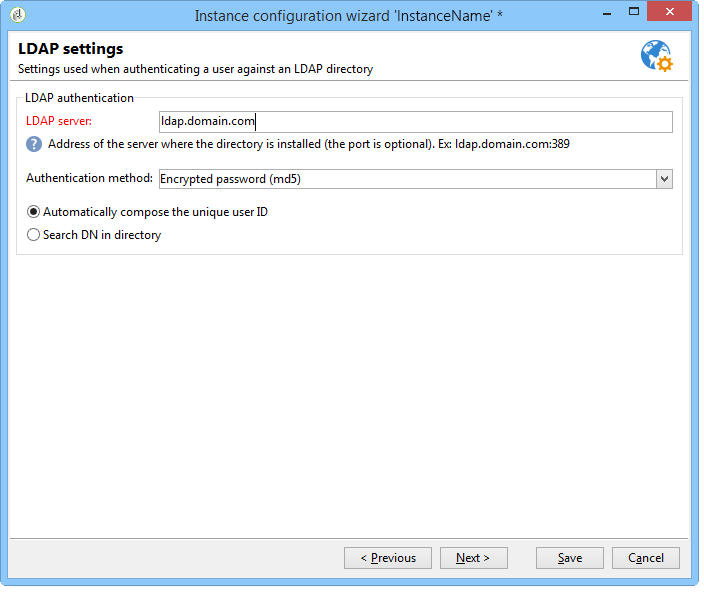

# 透過LDAP連線{#connecting-through-ldap}

## 設定Campaign和LDAP {#configuring-campaign-and-ldap}

>[!NOTE]
>
>LDAP設定僅適用於內部部署或混合式安裝。

LDAP設定會在部署精靈中執行。 必須在第一個組態步驟中選取&#x200B;**[!UICONTROL LDAP integration]**&#x200B;選項。 請參閱[部署精靈](../../installation/using/deploying-an-instance.md#deployment-wizard)。

視窗可讓您透過指定的LDAP目錄設定Adobe Campaign使用者的身分識別。

* 在&#x200B;**[!UICONTROL LDAP server]**&#x200B;欄位中指定LDAP伺服器的位址。 您可以新增連線埠號碼。 依預設，使用的連線埠為389。
* 在下拉式清單中，選取使用者的驗證方法：

   * 加密的密碼(**md5**)

     預設模式。

   * 純文字密碼+ SSL (**TLS**)

     整個驗證程式（包括密碼）都會加密。 安全連線埠636不可在此模式中使用： Adobe Campaign會自動切換至安全模式。

     當您使用此驗證模式時，在Linux中，憑證會由openLDAP使用者端程式庫驗證。 建議您使用有效的SSL憑證，以便加密驗證程式。 否則，資訊將以純文字顯示。

     憑證也會在Windows中驗證。

   * Windows NT LAN管理員(**NTLM**)

     專屬Windows驗證。 **[!UICONTROL Unique identifier]**&#x200B;僅用於網域名稱。

   * 分散式密碼驗證(**DPA**)

     專屬Windows驗證。 **[!UICONTROL Unique identifier]**&#x200B;僅用於網域名稱(domain.com)。

   * 純文字密碼

     無加密（僅供測試階段使用）。

* 選取使用者驗證模式： **[!UICONTROL Automatically compute the unique user identifier]** （請參閱步驟[辨別名稱計算](#distinguished-name-calculation)）或&#x200B;**[!UICONTROL Search the unique user identifier in the directory]** （請參閱步驟[搜尋識別碼](#searching-for-identifiers)）。

## 相容性 {#compatibility}

相容的系統取決於選取的驗證機制。 以下是作業系統與LDAP伺服器的相容性矩陣。

<table> 
 <thead> 
  <tr> 
   <th> </th> 
   <th> OpenLDAP  </th> 
   <th> Active Directory  </th> 
  </tr> 
 </thead> 
 <tbody> 
  <tr> 
   <td> md5  </td> 
   <td> Windows， Linux  </td> 
   <td> Linux  </td> 
  </tr> 
  <tr> 
   <td> TLS  </td> 
   <td> Linux  </td> 
   <td> Windows， Linux  </td> 
  </tr> 
  <tr> 
   <td> NTLM與DPA  </td> 
   <td> </td> 
   <td> Windows  </td> 
  </tr> 
  <tr> 
   <td> 純文字  </td> 
   <td> Windows， Linux  </td> 
   <td> Windows， Linux  </td> 
  </tr> 
 </tbody> 
</table>

## 辨別名稱計算 {#distinguished-name-calculation}

如果您要計算「辨別名稱(DN)」識別碼，部署精靈的下一個步驟可讓您設定計算模式。

* 在&#x200B;**[!UICONTROL Distinguished Name]**&#x200B;欄位中，指定目錄中使用者的唯一識別碼（辨別名稱 — DN）。

  **[!UICONTROL (login)]**&#x200B;將取代為Adobe Campaign運運算元的識別碼。

  >[!CAUTION]
  >
  >**[!UICONTROL dc]**&#x200B;設定必須為小寫。

* 選取選項&#x200B;**[!UICONTROL Enable synchronization of user rights from authorizations and groups in the directory]**，以同步LDAP目錄中的群組和使用者關聯以及Adobe Campaign中的群組和使用者關聯。

  選取此選項時，**[!UICONTROL Application level DN used for the search]**&#x200B;和&#x200B;**[!UICONTROL Password of the application login]**&#x200B;已啟用。

  如果您填入這兩個欄位，Adobe Campaign將使用自己的登入和密碼連線到LDAP伺服器。 如果兩者空白，Adobe Campaign將以匿名方式連線至伺服器。

## 搜尋識別碼 {#searching-for-identifiers}

如果您選擇搜尋識別碼，部署精靈可讓您設定搜尋。

* 在&#x200B;**[!UICONTROL Application level DN used for the search]**&#x200B;和&#x200B;**[!UICONTROL Password of the application login]**&#x200B;欄位中，提供Adobe Campaign將用來連線以搜尋識別碼的識別碼和密碼。 如果兩者空白，Adobe Campaign將以匿名方式連線至伺服器。
* 指定&#x200B;**[!UICONTROL Base identifier]**&#x200B;和&#x200B;**[!UICONTROL Search scope]**&#x200B;欄位，以決定要開始搜尋的LDAP目錄子集。

  在下拉式清單中選取所需的模式：

  

   1. **[!UICONTROL Recursive (default mode)]**。

      會從指定的層級開始完整搜尋LDAP目錄。

   1. **[!UICONTROL Limited to the base]**。

      所有屬性都包含在搜尋中。

   1. **[!UICONTROL Limited to the first sub-level of the base]**。

      對目錄的所有屬性執行搜尋，並從屬性的第一層級開始。

* **[!UICONTROL Filter]**&#x200B;欄位可讓您指定元素來縮小搜尋的範圍。

## 設定LDAP授權 {#configuring-ldap-authorizations}

當您選取&#x200B;**[!UICONTROL Enable synchronization of user rights from authorizations and groups in the directory]**&#x200B;選項時，會顯示此視窗。

您必須指定數個引數，才能尋找使用者所屬的一個或多個群組及其對應的許可權，例如：

* **[!UICONTROL Database identifier]**&#x200B;欄位，
* **[!UICONTROL Search scope]**&#x200B;欄位，

  >[!NOTE]
  >
  >如果您已選擇搜尋DN，您可以選取&#x200B;**[!UICONTROL Reuse the DN search parameters]**，以延續先前畫面所選取的DN值與搜尋範圍。

* **[!UICONTROL Rights search filter]**&#x200B;欄位，根據登入和使用者的辨別名稱，
* 有關使用者的&#x200B;**[!UICONTROL Attribute containing the group or authorization name]**&#x200B;欄位，
* **[!UICONTROL Association mask]**&#x200B;欄位可讓您在Adobe Campaign中擷取群組名稱及其相關許可權。 您可以使用規則運算式來搜尋名稱。
* 選取「**[!UICONTROL Enable the connection of users declared in the LDAP directory if the operator is not declared in Adobe Campaign]**」，讓使用者在連線時自動獲得存取許可權。

按一下&#x200B;**[!UICONTROL Save]**&#x200B;完成執行個體的設定。

## 管理運運算元 {#managing-operators}

確認設定後，您必須定義透過LDAP目錄管理哪些Adobe Campaign運運算元。

若要使用LDAP目錄來驗證運運算元，請編輯對應的設定檔並按一下&#x200B;**[!UICONTROL Edit the access parameters]**&#x200B;連結。 選取&#x200B;**[!UICONTROL Use LDAP for authentication]**&#x200B;選項： **[!UICONTROL Password]**&#x200B;欄位在此運運算元中呈現灰色。

## 使用案例 {#use-cases}

本節提供幾個簡單的使用案例，協助您根據需求達成最適當的設定。

1. 已在LDAP目錄中建立使用者，但未在Adobe Campaign中建立。

   可以設定Adobe Campaign，讓使用者透過其LDAP驗證存取平台。 Adobe Campaign需要能夠控制LDAP目錄中ID/密碼組合的有效性，以便在Adobe Campaign中即時建立運運算元。 若要這麼做，請核取&#x200B;**[!UICONTROL Enable the connection of users declared in the LDAP directory if the operator is not declared in Adobe Campaign]**&#x200B;選項。 在此情況下，也需要設定群組同步處理：必須選取&#x200B;**[!UICONTROL Enable synchronization of user rights from authorizations and groups in the directory]**&#x200B;選項。

1. 使用者已在Adobe Campaign中建立，但未在LDAP目錄中建立。

   他們將無法登入Adobe Campaign。

1. LDAP目錄中的群組不存在於Adobe Campaign中。

   此群組不會在Adobe Campaign中建立。 您需要建立群組並同步群組，以透過&#x200B;**[!UICONTROL Enable synchronization of user rights from authorizations and groups in the directory]**&#x200B;選項啟用比對。

1. 群組存在於Adobe Campaign中，且LDAP目錄在事件後啟動： Adobe Campaign中的使用者群組不會自動取代為LDAP群組的內容。 同樣地，如果群組僅存在於Adobe Campaign中，則只有在群組在LDAP中建立並同步化後，才能新增LDAP使用者。

   無論透過Adobe Campaign還是LDAP，群組都不會即時建立。 兩者都需要在Adobe Campaign和LDAP目錄中個別建立。

   LDAP目錄中的群組名稱必須與Adobe Campaign群組的名稱一致。 其關聯遮罩定義於部署精靈的最後設定階段：Adobe Campaign_(。&#42;)，例如。
