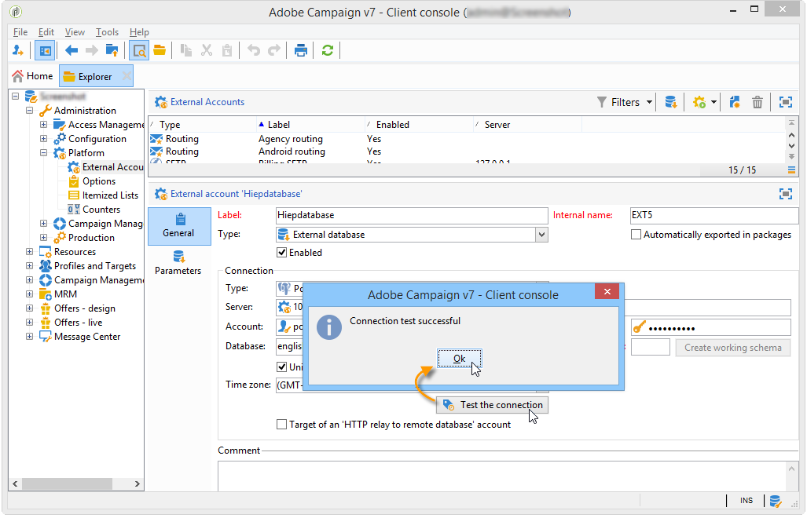
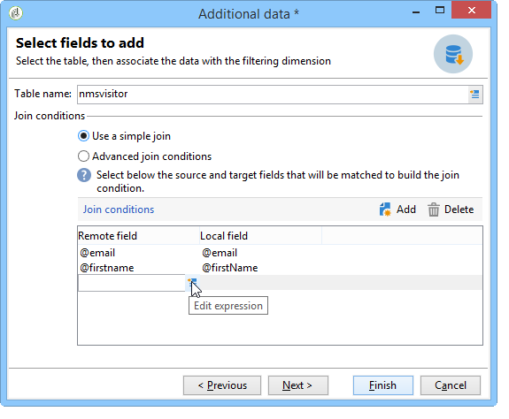

# 連接到資料庫 {#connecting-to-the-database}

要啟用到外部資料庫的連接，必須指定連接參數，即目標資料源和需要載入資料的表的名稱。

>[!CAUTION]
>
>Adobe Campaign使用者需要外部資料庫和Adobe Campaign應用程式伺服器的特定權限，才能處理來自外部資料庫的資料。 有關詳細資訊，請參閱[遠程資料庫訪問權限](../../installation/using/remote-database-access-rights.md)部分。
>
>為避免任何故障，存取遠端共用資料的營運商必須從個別空間工作。

## 建立共用連線 {#creating-a-shared-connection}

若要啟用共用外部資料庫的連線，只要此連線啟用，您就可透過Adobe Campaign存取資料庫。

1. 配置必須通過&#x200B;**[!UICONTROL Administration > Platform > External accounts]**&#x200B;節點預先定義。
1. 按一下&#x200B;**[!UICONTROL New]**&#x200B;按鈕並選擇&#x200B;**[!UICONTROL External database]**&#x200B;類型。
1. 定義外部資料庫的&#x200B;**[!UICONTROL Connection]**&#x200B;參數。

   對於與&#x200B;**ODBC**&#x200B;類型資料庫的連接，**[!UICONTROL Server]**&#x200B;欄位必須包含ODBC資料源的名稱，而不包含伺服器名。 此外，可能需要某些附加配置，具體取決於使用的資料庫。 請參閱[按資料庫類型](../../installation/using/configure-fda.md)列出的特定配置部分。

1. 在輸入參數後，按一下&#x200B;**[!UICONTROL Test the connection]**&#x200B;按鈕批准參數。

   

1. 如有必要，請取消選中&#x200B;**[!UICONTROL Enabled]**&#x200B;選項以禁用對此資料庫的訪問，而不刪除其配置。
1. 若要允許Adobe Campaign存取此資料庫，您必須部署SQL函式。 按一下&#x200B;**[!UICONTROL Parameters]**&#x200B;頁籤，然後按一下&#x200B;**[!UICONTROL Deploy functions]**&#x200B;按鈕。

   

可以在&#x200B;**[!UICONTROL Parameters]**&#x200B;頁籤中為表和索引定義特定的工作表空間。

## 建立臨時連接{#creating-a-temporary-connection}

您可以從工作流活動直接定義到外部資料庫的連接。 在這種情況下，它將位於本地外部資料庫上，保留以用於當前工作流：不會儲存在外部帳戶中。 此類型的準時連接可以建立在工作流的不同活動上，特別是&#x200B;**[!UICONTROL Query]**、**[!UICONTROL Data loading (RDBMS)]**、**[!UICONTROL Enrichment]**&#x200B;活動或&#x200B;**[!UICONTROL Split]**&#x200B;活動。

>[!CAUTION]
>
>不建議使用此類配置，但可定期用於收集資料。 不過，您應建立外部帳戶，如[建立共用連接](#creating-a-shared-connection)部分中所示。

例如，在查詢活動中，建立到外部資料庫的定期連接的步驟如下：

1. 按一下&#x200B;**[!UICONTROL Add data...]**&#x200B;並選擇&#x200B;**[!UICONTROL External data]**&#x200B;選項。
1. 選擇&#x200B;**[!UICONTROL Locally defining the data source]**&#x200B;選項。

   

1. 在下拉清單中選擇目標資料庫引擎。 輸入伺服器的名稱並提供驗證參數。

   也指定外部資料庫的名稱。

   

   按一下 **[!UICONTROL Next]** 按鈕。

1. 選擇儲存資料的表。

   您可以直接在相應欄位中輸入表的名稱，或按一下編輯表徵圖訪問資料庫表的清單。

   

1. 按一下&#x200B;**[!UICONTROL Add]**&#x200B;按鈕，以定義外部資料庫資料與Adobe Campaign資料庫中資料之間的一或多個協調欄位。 **[!UICONTROL Remote field]**&#x200B;和&#x200B;**[!UICONTROL Local field]**&#x200B;的&#x200B;**[!UICONTROL Edit expression]**&#x200B;圖示可讓您存取每個表格的欄位清單。

   

1. 如有必要，請指定篩選條件和資料排序模式。
1. 選擇要在外部資料庫中收集的其他資料。 若要這麼做，請連按兩下您要新增的欄位，以在&#x200B;**[!UICONTROL Output columns]**&#x200B;中顯示欄位。

   

   按一下&#x200B;**[!UICONTROL Finish]**&#x200B;確認此配置。

## 安全連接{#secure-connection}

>[!NOTE]
>
>安全連接僅適用於PostgreSQL。

在設定外部FDA帳戶時，您可以確保外部資料庫的存取安全。

若要這麼做，請在使用之埠的伺服器位址和位址後新增「**:ssl**」。 例如：**192.168.0.52:4501:ssl**。

然後，資料會透過安全SSL通訊協定傳送。

## 其他配置 {#additional-configurations}

如有必要，可以建立用於處理外部資料庫中資料的模式。 同樣地，Adobe Campaign也可讓您定義外部表格中資料的對應。 這些設定是一般的，不僅適用於工作流程。

>[!NOTE]
>
>如需在Adobe Campaign中建立結構以及定義新資料對應的詳細資訊，請參閱[本頁](../../configuration/using/about-schema-edition.md)。