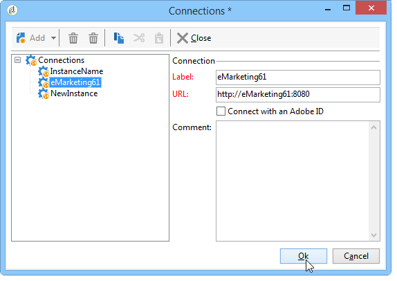
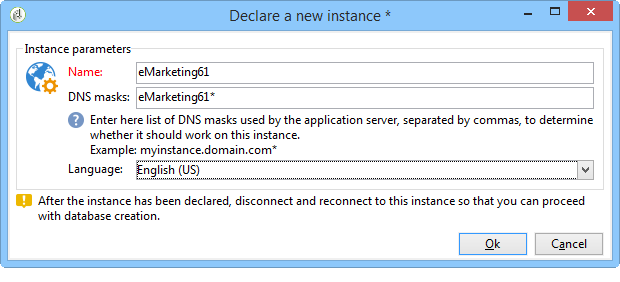

# 建立執行個體並登入{#creating-an-instance-and-logging-on}

若要建立新例項和Adobe Campaign資料庫，請套用下列程式：

1. 建立連線。
1. 登入以建立相關例項。
1. 建立及設定資料庫.

>[!NOTE]
>
>僅 **內部** 識別碼可執行這些操作。 如需詳細資訊，請參閱[本章節](../../installation/using/configuring-campaign-server.md#internal-identifier)。

啟動Adobe Campaign主控台時，您會存取登入頁面。

若要建立新例項，請遵循下列步驟：

1. 按一下認證欄位右上角的連結，以存取連線設定視窗。 此連結可以是 **[!UICONTROL New...]** 或現有例項名稱。

   

1. 按一下 **[!UICONTROL Add > Connection]** 並輸入Adobe Campaign應用程式伺服器的標籤和URL。

   

1. 透過URL指定與Adobe Campaign應用程式伺服器的連線。 使用電腦的DNS、別名或IP地址。

   例如，您可以使用 [`https://<machine>.<domain>.com`](https://myserver.adobe.com) 類型URL。

   >[!CAUTION]
   >
   >對於連線URL，僅使用下列字元： `[a-z]`, `[A-Z]`, `[0-9]` 和破折號(-)或句號。

1. 按一下 **[!UICONTROL Ok]** 若要確認設定：您現在可以從執行個體建立程式開始。
1. 在 **[!UICONTROL Connection settings]** ，輸入 **內部** 登入及其密碼以連線至Adobe Campaign應用程式伺服器。 連接後，您將訪問實例建立嚮導以聲明新實例
1. 在 **[!UICONTROL Name]** 欄位，輸入 **執行個體名稱**. 因為此名稱用於生成配置檔案 **config-`<instance>`.xml** 和用於命令行參數以標識實例，請確保選擇不帶特殊字元的短名稱。 例如： **電子行銷**.

   

   新增至網域名稱的執行個體名稱不得超過40個字元。 這可讓您限制「Message-ID」標題的大小，並防止郵件被視為垃圾訊息，尤其是透過SpamAssassin等工具。

1. 在 **[!UICONTROL DNS masks]** 欄位，輸入 **DNS掩碼清單** 例項。 Adobe Campaign伺服器會使用HTTP要求中顯示的主機名稱，來判斷要存取的執行個體。

   字串之間包含主機名 **https://** 和第一個斜線字元 **/** 的URL。

   您可以定義以逗號分隔的值清單。

   ? 和*字元可作為萬用字元來取代一或多個字元（DNS、連接埠等）。 例如， **示範*** 值可與&quot;https://demo&quot;搭配使用，如同&quot;https://demo:8080&quot;甚至&quot;https://demo2&quot;。

   使用的名稱必須在DNS中定義。 您也可以通知 **c:/windows/system32/drivers/etc/hosts** 檔案（在Windows中） **/etc/hosts** 檔案。 因此，您必須修改連接設定以使用此DNS名稱，才能連接到您選擇的實例。

   伺服器必須以此名稱識別，尤其是用於上傳電子郵件中的影像。

   此外，伺服器必須能夠通過此名稱（如果可能的話）通過環回地址(127.0.0.1)連接到自身，尤其是允許以PDF格式導出報告。

1. 在 **[!UICONTROL Language]** 下拉式清單，選取 **例項語言**:英文（美國）、英文（英國）、法文或日文。

   美國英文與英國英文的差異於 [本節](../../platform/using/adobe-campaign-workspace.md#date-and-time).

   >[!CAUTION]
   >
   >此步驟之後無法修改執行個體語言。 Adobe Campaign例項不會多語言：您無法將介面從語言切換為其他語言。

1. 按一下 **[!UICONTROL Ok]** 確認執行個體聲明。 註銷並重新登錄以聲明資料庫。

   >[!NOTE]
   >
   >可以從命令行建立實例。 有關詳細資訊，請參閱 [命令列](../../installation/using/command-lines.md).
