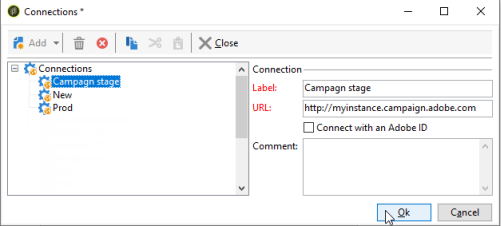

# 建立執行個體並登入{#creating-an-instance-and-logging-on}

若要建立新執行個體和Adobe Campaign資料庫，請套用以下程式：

1. 建立連線。
1. 登入以建立相關的執行個體。
1. 建立及設定資料庫。

>[!NOTE]
>
>只有&#x200B;**內部**&#x200B;識別碼可以執行這些作業。 如需詳細資訊，請參閱[本章節](../../installation/using/configuring-campaign-server.md#internal-identifier)。

Adobe Campaign主控台啟動時，您會存取登入頁面。

若要建立新執行個體，請遵循下列步驟：

1. 按一下認證欄位右上角的連結以存取連線設定視窗。 此連結可以是&#x200B;**[!UICONTROL New...]**&#x200B;或現有的執行個體名稱。

   

1. 按一下 **[!UICONTROL Add > Connection]** 並輸入 Adobe Campaign 應用程式伺服器的標籤和 URL。

   

1. 指定透過 URL 連線至您的 Adobe Campaign 應用程式伺服器。請使用電腦的 DNS 或別名，或您的 IP 位址。

   例如，您可以使用 `https://<machine>.<domain>.com` 類型 URL。

   >[!CAUTION]
   >
   >對於連線URL，僅使用下列字元： `[a-z]`、`[A-Z]`、`[0-9]`和破折號(-)或句號。

1. 按一下&#x200B;**[!UICONTROL Ok]**&#x200B;以確認設定：您現在可以從執行個體建立程式開始。
1. 在&#x200B;**[!UICONTROL Connection settings]**&#x200B;視窗中，輸入&#x200B;**內部**&#x200B;登入及其密碼以連線至Adobe Campaign應用程式伺服器。 連線之後，您可以存取執行個體建立助理來宣告新的執行個體
1. 在&#x200B;**[!UICONTROL Name]**&#x200B;欄位中，輸入&#x200B;**執行個體名稱**。 由於此名稱是用來產生組態檔&#x200B;**config-`<instance>`.xml**，且用於命令列引數以識別執行個體，因此請務必選擇不含特殊字元的簡短名稱。 例如： **eMarketing**。

   

   新增到網域名稱的執行個體名稱不能超過40個字元。 這可讓您限制「訊息ID」標頭的大小，並防止將訊息視為垃圾訊息，尤其是SpamAssassin等工具。

1. 在&#x200B;**[!UICONTROL DNS masks]**&#x200B;欄位中，輸入應附加執行個體的&#x200B;**DNS遮罩清單**。 Adobe Campaign伺服器會使用HTTP請求中顯示的主機名稱，來判斷要連絡的執行個體。

   主機名稱包含在字串&#x200B;**https://**&#x200B;和伺服器位址的第一個斜線字元&#x200B;**/**&#x200B;之間。

   您可以定義以逗號分隔的值清單。

   此？ 和&#42;個字元可做為萬用字元來取代一或多個字元（DNS、連線埠等）。 例如，**demo&#42;**&#x200B;值可與「https://demo」搭配使用，就像與「https://demo:8080」甚至「https://demo2」搭配使用一樣。

   使用的名稱必須在您的DNS中定義。 您也可以在Windows的&#x200B;**c：/windows/system32/drivers/etc/hosts**&#x200B;檔案和Linux的&#x200B;**/etc/hosts**&#x200B;檔案中通知DNS名稱與IP位址之間的對應。 因此，您必須修改連線設定以使用此DNS名稱，才能連線到您選擇的執行個體。

   伺服器必須以此名稱識別，尤其是在電子郵件中上傳影像時。

   此外，伺服器必須能夠使用此名稱連線到本身，如果可能的話，也必須使用回送位址 — 127.0.0.1 — 尤其是允許以PDF格式匯出報告。

1. 在&#x200B;**[!UICONTROL Language]**&#x200B;下拉式清單中，選取&#x200B;**執行個體語言**：英文（美國）、英文（英國）、法文或日文。

   美式英文與英式英文之間的差異在[Campaign v8 （主控台）檔案] (.https://experienceleague.adobe.com/en/docs/campaign/campaign-v8/new/campaign-ui)中說明。

   >[!CAUTION]
   >
   >執行個體語言在此步驟後無法修改。 Adobe Campaign例項並非多語言版本：您無法將介面從語言切換為其他語言。

1. 按一下&#x200B;**[!UICONTROL Ok]**&#x200B;以確認執行個體宣告。 登出再登入，以宣告資料庫。

   >[!NOTE]
   >
   >可以從命令列建立例證。 如需詳細資訊，請參閱[命令列](../../installation/using/command-lines.md)。
