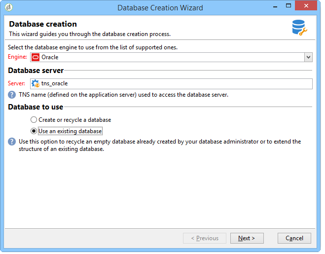

# 建立和設定資料庫{#creating-and-configuring-the-database}


建立資料庫時，Adobe Campaign提供兩種不同的選項：

1. 建立或循環使用資料庫：如果要建立新資料庫或重新使用現有資料庫，請選擇此選項。 請參閱[案例1:建立/循環使用資料庫](#case-1--creating-recycling-a-database)。
1. 使用現有資料庫：如果管理員已建立空資料庫且您想使用該資料庫，請選擇此選項；或擴展現有資料庫的結構。 請參閱[案例2:使用現有資料庫](#case-2--using-an-existing-database)。

以下詳細說明設定步驟。

>[!CAUTION]
>
>資料庫、用戶和架構的名稱不得以數字開頭或包含特殊字元。
>
>只有&#x200B;**內部**&#x200B;標識符可以執行這些操作。 如需詳細資訊，請參閱[本章節](../../installation/using/configuring-campaign-server.md#internal-identifier)。

## 案例1:建立/循環使用資料庫 {#case-1--creating-recycling-a-database}

建立資料庫或回收現有資料庫的步驟如下。 某些配置取決於使用的資料庫引擎：

涉及下列步驟：

* [步驟1 — 選取資料庫引擎](#step-1---selecting-the-database-engine)、
* [步驟2 — 連接到伺服器](#step-2---connecting-to-the-server)
* [第3步 — 資料庫的連接和特性](#step-3---connection-and-characteristics-of-the-database),
* [步驟4 — 安裝的套件](#step-4---packages-to-install)、
* [步驟5 — 建立步驟](#step-5---creation-steps)、
* [步驟6 — 建立資料庫](#step-6---creating-the-database)。

### 步驟1 — 選擇資料庫引擎 {#step-1---selecting-the-database-engine}

從下拉式清單中選取資料庫引擎。


支援的資料庫列在Campaign [相容性矩陣](../../rn/using/compatibility-matrix.md)中。

識別伺服器，並選擇要執行的操作類型。 在此情況下，**[!UICONTROL Create or recycle a database]**。


根據所選資料庫引擎，伺服器標識資訊可能變化。

* 對於&#x200B;**Oracle**&#x200B;引擎，填入為應用程式伺服器定義的&#x200B;**TNS名稱**。
* 對於&#x200B;**PostgreSQL**&#x200B;或&#x200B;**DB2**&#x200B;引擎，必須指定應用程式伺服器上定義的DNS名稱（或IP地址）以訪問資料庫伺服器。
* 對於&#x200B;**Microsoft SQL Server**&#x200B;引擎，必須定義：應用程式伺服器上定義的DNS名稱（或IP地址），用於訪問資料庫伺服器：**DNS**&#x200B;或&#x200B;**DNS`\<instance>`**（執行個體模式）,

   >[!CAUTION]
   >
   > 從20.3開始，Windows NT驗證已停止服務。 **[!UICONTROL SQL Server authentication]** 現在是Microsoft SQL Server唯一可用的驗證模式。[顯示全文](../../rn/using/deprecated-features.md)

   

### 步驟2 — 連接到伺服器 {#step-2---connecting-to-the-server}

在&#x200B;**[!UICONTROL Server access]**&#x200B;窗口中，定義資料庫伺服器訪問。


要執行此操作，請輸入&#x200B;**管理系統帳戶**&#x200B;的名稱和密碼，該帳戶具有訪問資料庫的權限，即：

* **** Oracle資料庫的系統，
* **** 針對Microsoft SQL Server資料庫，
* **** PostgreSQL資料庫的postgresers,
* **db2inst1** （用於DB2資料庫）。

### 步驟3 — 資料庫的連接和特性 {#step-3---connection-and-characteristics-of-the-database}

下列步驟可讓您配置登入資料庫的設定。


您需要定義下列設定：

* 指定要建立的資料庫的名稱。

   >[!NOTE]
   >
   >對於DB2資料庫，資料庫的名稱不得超過8個字元。

* 輸入連結到此資料庫的帳戶的密碼。
* 指定資料庫是否必須是Unicode格式。

   **[!UICONTROL Unicode database]**&#x200B;選項可讓您以Unicode儲存所有字元類型，而不論語言為何。

   >[!NOTE]
   >
   >使用Oracle資料庫，**[!UICONTROL Unicode storage]**&#x200B;選項可以使用&#x200B;**NCLOB**&#x200B;和&#x200B;**NVARCHAR**&#x200B;類型欄位。
   > 
   >如果不選擇此選項，Oracle資料庫的字元集（字元集）必須啟用所有語言的資料儲存(建議使用AL32UTF8)。

* 為資料庫選擇時區，並指定是否以UTC表示（如果可用）。

   有關詳細資訊，請參閱[時區管理](../../installation/using/time-zone-management.md)。

### 步驟4 — 要安裝的軟體包 {#step-4---packages-to-install}

選擇要安裝的包。

請參閱您的授權合約，以檢查您有權安裝哪些解決方案和選項，例如「互動」或「社交行銷」。


### 步驟5 — 建立步驟 {#step-5---creation-steps}

通過&#x200B;**[!UICONTROL Creation steps]**&#x200B;窗口，可以顯示和編輯用於建立表的SQL指令碼。


* 對於Oracle、Microsoft SQL Server或PostgreSQL資料庫，管理員還可以定義建立資料庫對象時使用的&#x200B;**儲存參數**。

   這些參數將接收確切的表空間名稱(警告：區分大小寫)。 它們分別儲存在&#x200B;**[!UICONTROL Administration > Platform > Options]**&#x200B;節點中的以下選項中（請參閱[此部分](../../installation/using/configuring-campaign-options.md#database)）:

   * **WdbcOptions_TableSpaceUser**:基於架構的用戶表
   * **WdbcOptions_TableSpaceIndex**:基於架構的用戶表索引
   * **WdbcOptions_TableSpaceWork**:無架構的表
   * **WdbcOptions_TableSpaceWorkIndex**:沒有架構的工作表索引

* 對於Oracle資料庫，Adobe Campaign用戶必須具有Oracle庫的訪問權限，通常是&#x200B;**oinstall**&#x200B;組的成員。
* **[!UICONTROL Set or change the administrator password]**&#x200B;選項可讓您輸入連結至具有管理員權限之Adobe Campaign運算子的密碼。

   建議您為安全起見定義Adobe Campaign帳戶管理員密碼。

### 步驟6 — 建立資料庫 {#step-6---creating-the-database}

嚮導的最後階段允許您建立資料庫。 按一下&#x200B;**[!UICONTROL Start]**&#x200B;以確認。


建立資料庫後，您可以重新連接以完成實例配置。

您現在必須啟動部署精靈才能完成執行個體的設定。 請參閱[部署嚮導](../../installation/using/deploying-an-instance.md#deployment-wizard)。

連結到實例的資料庫的連接設定儲存在Adobe Campaign安裝目錄中找到的檔案&#x200B;**`/conf/config-<instance>.xml`**&#x200B;中。

在base61資料庫上的Microsoft SQL Server配置示例，該資料庫連結到帶有加密密碼的「campaign」帳戶：

```
<dbcnx encrypted="1" login="campaign:myBase" password="myPassword" provider="DB" server="dbServer"/>
```

## 案例2:使用現有資料庫 {#case-2--using-an-existing-database}

資料庫以及用戶必須由資料庫管理員建立，並正確配置訪問權限。

例如，對於Oracle資料庫，最低所需權限為：授予CONNECT、資源和無限表空間。

要使用現有資料庫，配置步驟如下：

* [步驟1 — 選擇資料庫引擎](#step-1---choosing-the-database-engine)、
* [步驟2 — 資料庫連接設定](#step-2---database-connection-settings),
* [步驟3 — 安裝的套件](#step-3---packages-to-install)、
* [步驟4 — 建立步驟](#step-4---creation-steps)、
* [步驟5 — 建立資料庫](#step-5---creating-the-database)。

### 步驟1 — 選擇資料庫引擎 {#step-1---choosing-the-database-engine}

從下拉清單中選擇資料庫引擎。


確定伺服器並選擇要執行的操作類型。 在此情況下，**[!UICONTROL Use an existing database]**。



根據所選資料庫引擎，伺服器標識資訊可能變化。

* 對於&#x200B;**Oracle**&#x200B;引擎，填入為應用程式伺服器定義的&#x200B;**TNS名稱**。
* 對於&#x200B;**PostgreSQL**&#x200B;或&#x200B;**DB2**&#x200B;引擎，必須指定應用程式伺服器上定義的DNS名稱（或IP地址）以訪問資料庫伺服器。
* 對於&#x200B;**Microsoft SQL Server**&#x200B;引擎，必須定義：

   1. 應用程式伺服器上定義的DNS名稱（或IP地址），以訪問資料庫伺服器，
   1. 用於訪問Microsoft SQL Server的安全方法：**[!UICONTROL SQL Server authentication]**&#x200B;或&#x200B;**[!UICONTROL Windows NT authentication]**。

      

### 步驟2 — 資料庫連接設定 {#step-2---database-connection-settings}

在&#x200B;**[!UICONTROL Database]**&#x200B;窗口中，定義資料庫連接設定。


您需要定義下列設定：

* 輸入要使用的資料庫的名稱，
* 輸入與此資料庫關聯的帳戶的名稱和密碼，

   >[!NOTE]
   >
   >請確定架構名稱和使用者名稱均相符。 建議使用透過campaign console用戶端建立資料庫。
   >對於Oracle資料庫，您不需要輸入帳戶名稱。

* 指定資料庫是否應為Unicode。

### 步驟3 — 要安裝的軟體包 {#step-3---packages-to-install}

選擇要安裝的包。

請參閱您的授權合約，以檢查您有權安裝哪些解決方案和選項，例如「互動」或「銷售機會」。


### 步驟4 — 建立步驟 {#step-4---creation-steps}

通過&#x200B;**[!UICONTROL Creation steps]**&#x200B;窗口，可以顯示和編輯用於建立表的SQL指令碼。


* 對於Oracle、Microsoft SQL Server或PostgreSQL資料庫，管理員可以定義建立資料庫對象時要使用的&#x200B;**儲存參數**。
* 對於Oracle資料庫，Adobe Campaign用戶必須具有Oracle庫的訪問權限，通常是&#x200B;**oinstall**&#x200B;組的成員。
* **[!UICONTROL Set or change the administrator password]**&#x200B;選項可讓您輸入連結至具有管理員權限之Adobe Campaign運算子的密碼。

   建議您為安全起見定義Adobe Campaign帳戶管理員密碼。

### 步驟5 — 建立資料庫 {#step-5---creating-the-database}

嚮導的最後階段允許您建立資料庫。 按一下&#x200B;**[!UICONTROL Start]**&#x200B;以確認。


資料庫建立完成後，您可以重新連接以完成實例配置。

您現在必須啟動部署精靈才能完成執行個體的設定。 請參閱[部署嚮導](../../installation/using/deploying-an-instance.md#deployment-wizard)。

連結到實例的資料庫的連接設定儲存在Adobe Campaign安裝目錄中找到的檔案&#x200B;**`/conf/config-<instance>.xml`**&#x200B;中。

在base61資料庫上的Microsoft SQL Server配置示例，該資料庫連結到帶有加密密碼的「campaign」帳戶：

```
<dbcnx encrypted="1" login="campaign:myBase" password="myPassword" provider="DB" server="dbServer"/>
```
