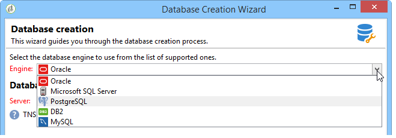

# 建立和設定資料庫{#creating-and-configuring-the-database}

當您建立資料庫時，Adobe Campaign提供兩種不同的選項：

1. 建立或回收資料庫：如果要建立新資料庫或重複使用現有資料庫，請選擇此選項。 請參閱[案例1：建立/回收資料庫](#case-1--creating-recycling-a-database)。
1. 使用現有資料庫：如果管理員已建立空白資料庫且您想要使用它，請選擇此選項；或擴充現有資料庫的結構。 請參考[案例2：使用現有的資料庫](#case-2--using-an-existing-database)。

配置步驟將於下文詳細說明。

>[!CAUTION]
>
>資料庫、使用者和綱要的名稱不能以數字開頭或包含特殊字元。
>
>只有&#x200B;**內部**&#x200B;識別碼可以執行這些作業。 如需詳細資訊，請參閱[本章節](../../installation/using/configuring-campaign-server.md#internal-identifier)。

## 案例1：建立/回收資料庫 {#case-1--creating-recycling-a-database}

建立資料庫或回收現有基礎的步驟如下所示。 有些設定取決於所使用的資料庫引擎：

涉及下列步驟：

* [步驟1 — 選取資料庫引擎](#step-1---selecting-the-database-engine)，
* [步驟2 — 連線到伺服器](#step-2---connecting-to-the-server)，
* [步驟3 — 資料庫的連線與特性](#step-3---connection-and-characteristics-of-the-database)，
* [步驟4 — 要安裝的套件](#step-4---packages-to-install)，
* [步驟5 — 建立步驟](#step-5---creation-steps)，
* [步驟6 — 建立資料庫](#step-6---creating-the-database)。

### 步驟1 — 選取資料庫引擎 {#step-1---selecting-the-database-engine}

從下拉式清單中選取資料庫引擎。



支援的資料庫列在Campaign [相容性矩陣](../../rn/using/compatibility-matrix.md)中。

識別伺服器並選擇要執行的作業型別。 在這種情況下，**[!UICONTROL Create or recycle a database]**。


視選取的資料庫引擎而定，伺服器識別資訊可能會有所不同。

* 針對&#x200B;**Oracle**&#x200B;引擎，請填入為應用程式伺服器定義的&#x200B;**TNS名稱**。
* 對於&#x200B;**PostgreSQL**&#x200B;引擎，您必須指定應用程式伺服器上定義的DNS名稱（或IP位址），才能存取資料庫伺服器。
* 針對&#x200B;**Microsoft SQL Server**&#x200B;引擎，您必須定義：應用程式伺服器上定義的DNS名稱（或IP位址），以存取資料庫伺服器： **DNS**&#x200B;或&#x200B;**DNS`\<instance>`** （執行個體模式），

  >[!CAUTION]
  >
  > 從20.3版本開始，Windows NT驗證已停止服務。 **[!UICONTROL SQL Server authentication]**&#x200B;現在是Microsoft SQL Server唯一可用的驗證模式。 [閱讀更多](../../rn/using/deprecated-features.md)

  

### 步驟2 — 連線到伺服器 {#step-2---connecting-to-the-server}

在&#x200B;**[!UICONTROL Server access]**&#x200B;視窗中，定義資料庫伺服器存取。


若要這麼做，請輸入有權存取資料庫的&#x200B;**系統管理系統帳戶**&#x200B;的名稱和密碼，例如：

* oracle資料庫的&#x200B;**系統**，
* Microsoft SQL Server資料庫的&#x200B;**sa**，
* PostgreSQL資料庫的&#x200B;**postgres**，

### 步驟3 — 資料庫的連線與特性 {#step-3---connection-and-characteristics-of-the-database}

下列步驟可讓您設定登入資料庫的設定。


您需要定義下列設定：

* 指定要建立的資料庫名稱。
* 輸入連結至此資料庫的帳戶密碼。
* 指示資料庫是否必須採用Unicode。

  **[!UICONTROL Unicode database]**&#x200B;選項可讓您以Unicode儲存所有字元型別，無論語言為何。

  >[!NOTE]
  >
  >使用Oracle資料庫時，**[!UICONTROL Unicode storage]**&#x200B;選項可讓您使用&#x200B;**NCLOB**&#x200B;和&#x200B;**NVARCHAR**&#x200B;型別欄位。
  > 
  >如果未選取此選項，Oracle資料庫的字元集（字元集）必須啟用所有語言的資料儲存（建議使用AL32UTF8）。

* 選擇資料庫的時區，並指定是否要以UTC格式（如果可用）顯示。

  如需詳細資訊，請參閱[時區管理](../../installation/using/time-zone-management.md)。

### 步驟4 — 要安裝的套件 {#step-4---packages-to-install}

選取您要安裝的套裝軟體。

請參閱您的授權合約，以檢查您有權安裝的解決方案和選項，例如「互動」或「社交行銷」。


### 步驟5 — 建立步驟 {#step-5---creation-steps}

**[!UICONTROL Creation steps]**&#x200B;視窗可讓您顯示和編輯用來建立資料表的SQL指令碼。


* 對於Oracle、Microsoft SQL Server或PostgreSQL資料庫，管理員也可以定義建立資料庫物件時要使用的&#x200B;**儲存體引數**。

  這些引數會收到完全相同的表格空間名稱（警告：區分大小寫）。 它們分別儲存在下列選項的&#x200B;**[!UICONTROL Administration > Platform > Options]**&#x200B;節點中（請參閱[本區段](../../installation/using/configuring-campaign-options.md#database)）：

   * **WdbcOptions_TableSpaceUser**：以結構描述為基礎的使用者資料表
   * **WdbcOptions_TableSpaceIndex**：根據結構描述的使用者資料表索引
   * **WdbcOptions_TableSpaceWork**：沒有結構描述的工作表
   * **WdbcOptions_TableSpaceWorkIndex**：沒有結構描述的工作表索引

* 若為Oracle資料庫，Adobe Campaign使用者必須擁有Oracle資料庫的存取權，通常是&#x200B;**oinstall**&#x200B;群組的成員。
* **[!UICONTROL Set or change the administrator password]**&#x200B;選項可讓您輸入連結至具有管理員許可權的Adobe Campaign運運算元的密碼。

  基於安全考量，建議您定義Adobe Campaign帳戶管理員密碼。

### 步驟6 — 建立資料庫 {#step-6---creating-the-database}

精靈的最後階段可讓您建立資料庫。 按一下 **[!UICONTROL Start]** 確認。


建立資料庫之後，您可以重新連線以完成執行處理組態。

您現在必須啟動部署精靈，才能完成執行個體的設定。 請參閱[部署精靈](../../installation/using/deploying-an-instance.md#deployment-wizard)。

連結至執行個體的資料庫連線設定儲存在Adobe Campaign安裝目錄中的檔案&#x200B;**`/conf/config-<instance>.xml`**&#x200B;中。

在base61資料庫上連結至&#39;campaign&#39;帳戶及其加密密碼的Microsoft SQL Server設定範例：

```
<dbcnx encrypted="1" login="campaign:myBase" password="myPassword" provider="DB" server="dbServer"/>
```

## 案例2：使用現有資料庫 {#case-2--using-an-existing-database}

資料庫以及使用者都必須由資料庫管理員建立，而且存取許可權必須已正確設定。

例如，對於Oracle資料庫，最低必要許可權為：GRANTCONNECT、RESOURCE和UNLIMITED TABLESPACE。

若要使用現有資料庫，設定步驟如下：

* [步驟1 — 選擇資料庫引擎](#step-1---choosing-the-database-engine)，
* [步驟2 — 資料庫連線設定](#step-2---database-connection-settings)，
* [步驟3 — 要安裝的套件](#step-3---packages-to-install)，
* [步驟4 — 建立步驟](#step-4---creation-steps)，
* [步驟5 — 建立資料庫](#step-5---creating-the-database)。

### 步驟1 — 選擇資料庫引擎 {#step-1---choosing-the-database-engine}

從下拉式清單中選擇資料庫引擎。


識別伺服器並選擇您要執行的作業型別。 在這種情況下，**[!UICONTROL Use an existing database]**。


視選取的資料庫引擎而定，伺服器識別資訊可能會有所不同。

* 針對&#x200B;**Oracle**&#x200B;引擎，請填入為應用程式伺服器定義的&#x200B;**TNS名稱**。
* 對於&#x200B;**PostgreSQL**&#x200B;引擎，您必須指定應用程式伺服器上定義的DNS名稱（或IP位址），才能存取資料庫伺服器。
* 針對&#x200B;**Microsoft SQL Server**&#x200B;引擎，您必須定義：

   1. 應用程式伺服器上定義的DNS名稱（或IP位址），用來存取資料庫伺服器，
   1. 用來存取Microsoft SQL Server的安全性方法： **[!UICONTROL SQL Server authentication]**&#x200B;或&#x200B;**[!UICONTROL Windows NT authentication]**。

      

### 步驟2 — 資料庫連線設定 {#step-2---database-connection-settings}

在&#x200B;**[!UICONTROL Database]**&#x200B;視窗中，定義資料庫連線設定。


您需要定義下列設定：

* 輸入要使用的資料庫名稱，
* 輸入與此資料庫關聯之帳戶的名稱和密碼，

  >[!NOTE]
  >
  >請確定結構描述名稱和使用者名稱相符。 建立資料庫的建議方式是透過Campaign主控台使用者端。
  >對於Oracle資料庫，您不需要輸入帳戶名稱。

* 指示資料庫是否應為Unicode。

### 步驟3 — 要安裝的套件 {#step-3---packages-to-install}

選取您要安裝的套裝軟體。

請參閱您的授權合約，以檢視您有權安裝哪些解決方案和選項，例如「互動」或「銷售機會」。


### 步驟4 — 建立步驟 {#step-4---creation-steps}

**[!UICONTROL Creation steps]**&#x200B;視窗可讓您顯示和編輯用來建立資料表的SQL指令碼。


* 對於Oracle、Microsoft SQL Server或PostgreSQL資料庫，管理員可以定義建立資料庫物件時要使用的&#x200B;**儲存體引數**。
* 若為Oracle資料庫，Adobe Campaign使用者必須擁有Oracle資料庫的存取權，通常是&#x200B;**oinstall**&#x200B;群組的成員。
* **[!UICONTROL Set or change the administrator password]**&#x200B;選項可讓您輸入連結至具有管理員許可權的Adobe Campaign運運算元的密碼。

  基於安全考量，建議您定義Adobe Campaign帳戶管理員密碼。

### 步驟5 — 建立資料庫 {#step-5---creating-the-database}

精靈的最後階段可讓您建立資料庫。 按一下 **[!UICONTROL Start]** 確認。


資料庫建立完成後，您可以重新連線以完成執行處理組態。

您現在必須啟動部署精靈，才能完成執行個體的設定。 請參閱[部署精靈](../../installation/using/deploying-an-instance.md#deployment-wizard)。

連結至執行個體的資料庫連線設定儲存在Adobe Campaign安裝目錄中的檔案&#x200B;**`/conf/config-<instance>.xml`**&#x200B;中。

在base61資料庫上連結至&#39;campaign&#39;帳戶及其加密密碼的Microsoft SQL Server設定範例：

```
<dbcnx encrypted="1" login="campaign:myBase" password="myPassword" provider="DB" server="dbServer"/>
```
