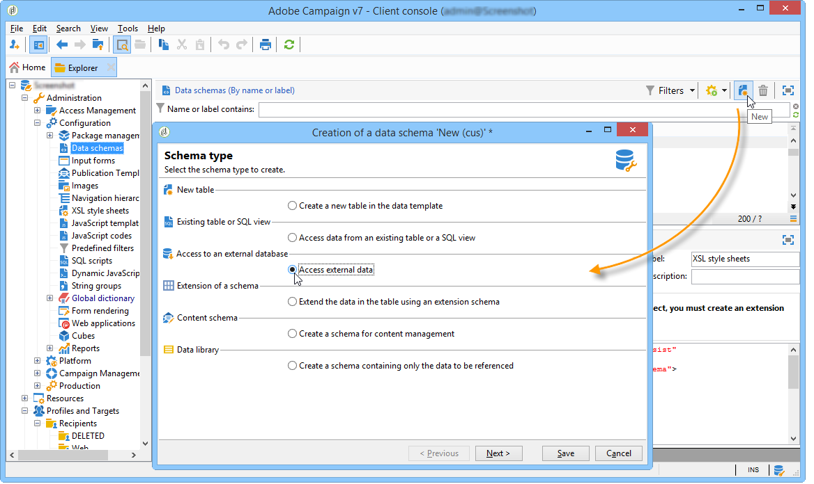

# 建立資料結構綱要 {#creating-the-data-schema}

要在外部資料庫上建立架構：

1. 按一下 **[!UICONTROL New]** 按鈕，然後選擇 **[!UICONTROL Access external data]**.

   

1. 輸入 **[!UICONTROL Namespace]** 和  **[!UICONTROL Name]** 針對架構，並選取 **[!UICONTROL External account]** 這將啟用與資料庫的連接。 這允許訪問外部資料庫中可用的表清單。

   

1. 從 **[!UICONTROL Table name]** 欄位中，選擇包含要收集的資料的表。

   使用Snowflake，如果資料庫用戶已獲得正確權限，則可以在此處選擇視圖。 請注意，使用檢視時，Adobe Campaign無法自動產生XML架構，您必須自行建立。 如需檢視的詳細資訊，請參閱 [Snowflake檔案](https://docs.snowflake.com/en/user-guide/views-introduction.html).

   

1. 按一下 **[!UICONTROL OK]** 確認。Adobe Campaign會自動偵測所選表格的結構，並產生邏輯架構。 請注意，Adobe Campaign不會產生連結。

1. 按一下 **[!UICONTROL Save]** 確認建立。

   >[!CAUTION]
   >
   >使用Snowflake時，主鍵為必填。

   

對應表格（標準或FDA對應）時會自動建立索引。
