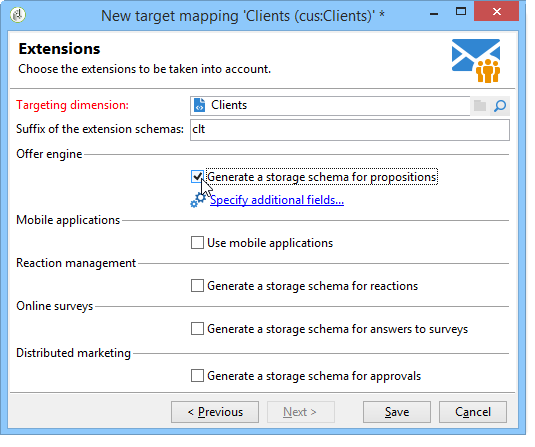

# 定義外部資料對應 {#defining-data-mapping}

Adobe Campaign可讓您定義外部表格中資料的對應。

若要這麼做，在建立外部表格的綱要後，您需要建立新的傳送對應，以使用此表格中的資料作為傳送目標。

若要這麼做，請套用下列步驟：

1. 建立新的傳送對應，並選擇目標維度，例如您剛才建立的結構描述。

   

1. 表示儲存傳遞資訊的欄位（姓氏、名字、電子郵件、地址等）。

   

1. 指定資訊儲存的引數，包括擴充功能結構的尾碼，以便輕鬆識別。

   

   您可以選擇是否要儲存排除專案(**excludelog**)、包含訊息(**broadlog**)或是在個別的資料表中。

   您也可以選擇是否要管理此傳遞對應(**trackinglog**)的追蹤。

1. 然後選取要考慮的擴充功能。 擴充功能型別取決於平台的引數和選項（檢視您的授權合約）。

   

   按一下&#x200B;**[!UICONTROL Save]**&#x200B;按鈕以啟動傳遞對應建立：所有連結表格都會根據選取的引數自動建立。
