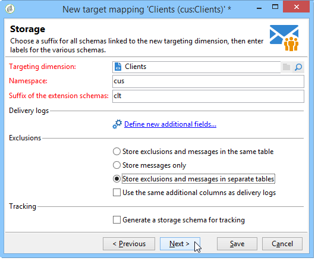

# 定義外部資料映射 {#defining-data-mapping}

Adobe Campaign允許您定義外部表中的資料映射。

為此，在建立外部表的架構後，需要建立新的傳遞映射以將此表中的資料用作傳遞目標。

若要這麼做，請套用下列步驟：

1. 建立新的傳遞映射並選擇目標維，例如您剛建立的方案。

   

1. 指示儲存傳遞資訊的欄位（姓、名、電子郵件、地址等）。

   

1. 指定資訊儲存的參數，包括擴展架構的尾碼，以便便於識別。

   

   您可以選擇是否儲存排除(**排除日誌**)，帶消息(**廣播**)或單獨的表中。

   您還可以選擇是否管理此交貨映射的跟蹤(**跟蹤日誌**)。

1. 然後選擇要考慮的擴展。 擴展類型取決於您的平台的參數和選項（查看您的許可證合同）。

   

   按一下 **[!UICONTROL Save]** 按鈕啟動交貨映射建立：所有連結的表都會基於所選參數自動建立。
