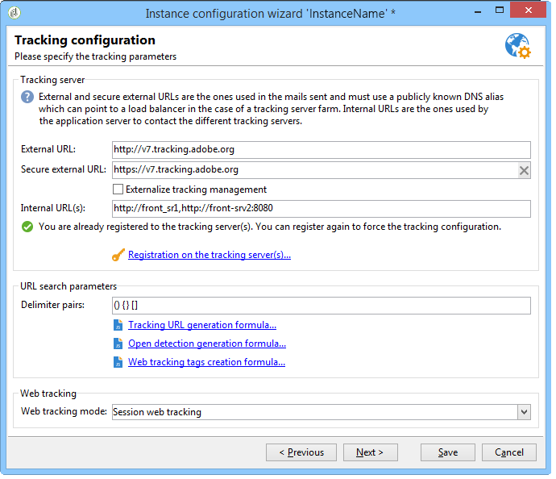
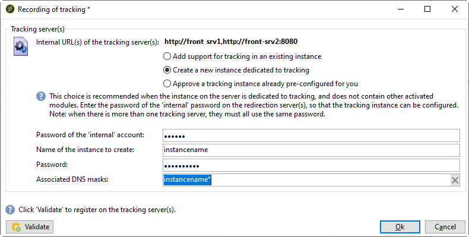
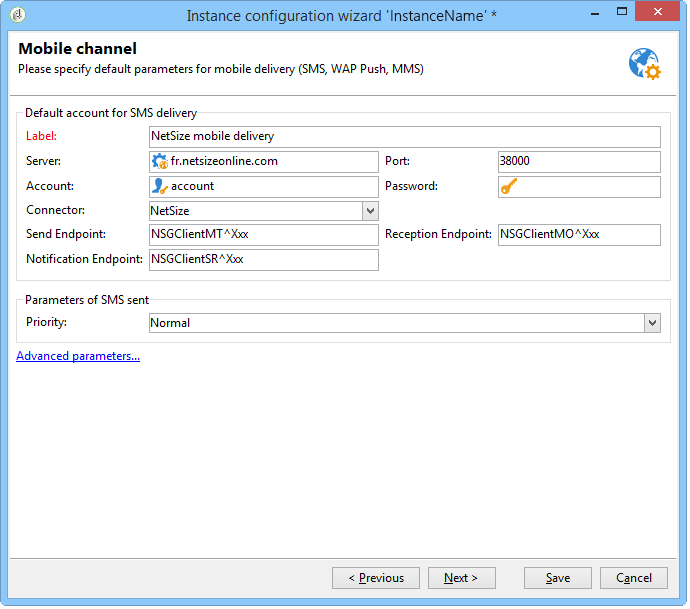
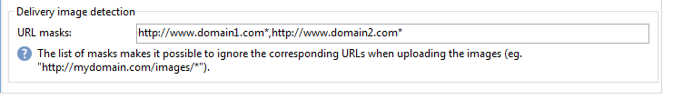
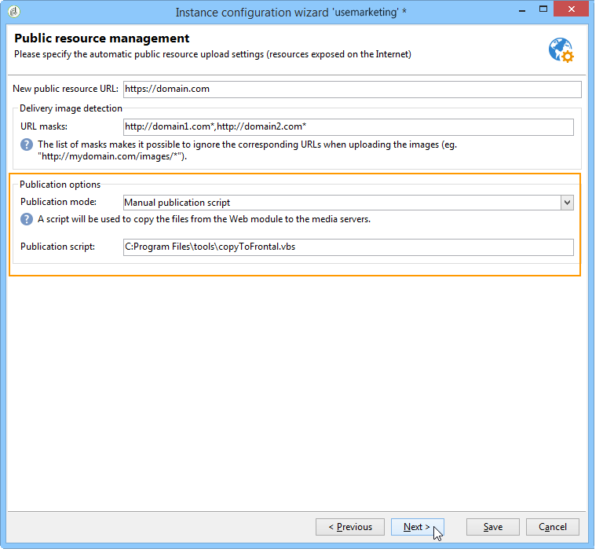

# 部署執行個體{#deploying-an-instance}

>[!NOTE]
>
>伺服器端設定只能由Adobe託管部署的Adobe執行。 若要進一步瞭解不同的部署，請參閱 [託管模型](../../installation/using/hosting-models.md) 區段或 [此頁面](../../installation/using/capability-matrix.md).

## 部署精靈 {#deployment-wizard}

Adobe Campaign提供Adobe Campaign使用者端主控台中可用的圖形化助理，以定義您要連線的執行個體引數。

若要啟動部署精靈，請選取「 」 **「工具」>「進階」>「部署精靈」**.


設定步驟如下：

1. [一般參數](#general-parameters)
1. [電子郵件通道參數](#email-channel-parameters)
1. [管理退信電子郵件](#managing-bounced-emails)
1. [追蹤設定](#tracking-configuration)
1. [行動裝置頻道引數](#mobile-channel-parameters)
1. [區域設定](#regional-settings)
1. [從網際網路存取](#access-from-the-internet)
1. [管理公用資源](#managing-public-resources)
1. [清除資料](#purging-data)

## 一般參數 {#general-parameters}

部署精靈的第一步可讓您輸入執行個體的一般資訊。


### 一般資訊 {#general-information}

視窗的下半部可讓您選取要啟動的選項。

* **[!UICONTROL Customer identifier used in billing]** ：這可以是執行個體的名稱和版本號碼。
* **[!UICONTROL Common name of the customer]** ：輸入包含公司名稱的字元字串。 此資訊可用於取消訂閱連結。
* **[!UICONTROL Namespace]** ：以小寫輸入簡短識別碼。 目的是區分您的特定組態與工廠組態在升級時的差異。 預設名稱空間為 **cus**  — 適用於客戶。

### 技術選項 {#technical-options}

視窗的下半部可讓您選取要啟動的選項。

可以使用以下選項：

* **[!UICONTROL Email channel]** ：啟用電子郵件傳送。 請參閱 [電子郵件通道引數](#email-channel-parameters).
* **[!UICONTROL Tracking]** ：啟用目標母體追蹤（開啟和點按）。 請參閱 [追蹤設定](#tracking-configuration).
* **[!UICONTROL Managing bounced emails]** ：定義用來擷取傳入電子郵件的POP帳戶。 請參閱 [管理退信電子郵件](#managing-bounced-emails).
* **[!UICONTROL LDAP integration]** ：透過LDAP目錄設定使用者驗證。 請參閱 [透過LDAP連線](../../installation/using/connecting-through-ldap.md).

## 電子郵件通道參數 {#email-channel-parameters}

下列步驟可讓您定義要在訊息標頭中顯示的資訊。

這些引數可在傳遞範本中多載，並可個別針對每次傳遞（如果使用者擁有必要的許可權）多載。

### 傳遞的電子郵件的參數 {#parameters-for-delivered-emails}


指示下列引數：

* **[!UICONTROL Sender name]** ：輸入寄件者的名稱。
* **[!UICONTROL Sender address]** ：輸入寄件者的電子郵件地址。 從Adobe Campaign傳送電子郵件時， **寄件者地址** 信箱未受到監視，行銷使用者無法存取此信箱。 Adobe Campaign也不提供自動回覆或自動轉寄此信箱中接收之電子郵件的功能。 進一步瞭解傳遞能力最佳實務 [在本檔案內](https://experienceleague.adobe.com/docs/deliverability-learn/deliverability-best-practice-guide/additional-resources/campaign/ac-starting-new-platform.html){_blank}.

* **[!UICONTROL Reply address text]** ：輸入收件者按一下 **[!UICONTROL Reply]** 按鈕。
* **[!UICONTROL Reply address]** ：輸入收件者按一下 **[!UICONTROL Reply]** 電子郵件使用者端軟體中的「 」按鈕。 目的 **回覆地址** 欄位是您希望收件者回覆不同於 **寄件者地址**.  此地址必須是有效的電子郵件地址、連結至受監控的信箱，並由客戶託管。  它可能是支援信箱，例如customer-care@customer.com，可讀取和回應電子郵件。

* **[!UICONTROL Error address]** ：輸入有錯誤的訊息的電子郵件地址。 這是用來處理退信的技術位址，包括Adobe Campaign伺服器因不存在目標位址而收到的電子郵件。 此地址必須是有效的電子郵件地址、連結至受監控的信箱，並由客戶託管。 可能是退回信箱，例如errors@customer.com。


除此之外，您還可以指定 **遮色片** 已授權寄件者地址與錯誤地址。 如有必要，可以使用逗號分隔這些遮罩。 此設定是選用的。 輸入欄位時，Adobe Campaign會在傳送時（分析期間，如果地址不包含任何變數）檢查地址是否有效。 此作業模式可確保不使用可能觸發傳送問題的地址。 必須在傳遞伺服器上設定傳遞位址。

>[!NOTE]
>
>* 這些設定會儲存在Campaign平台選項中。 [了解更多](../../installation/using/configuring-campaign-options.md)。
> 
>* 對於多品牌設定，您可以調整錯誤地址，並從電子郵件路由外部帳戶覆寫此設定。 [了解更多](../../installation/using/external-accounts.md#email-routing-external-account)。
>


### 地址中授權的字元 {#characters-authorized-in-addresses}

<!--This window enables you to define, for all email campaigns, the delivery and address-quality management options.-->

在Adobe Campaign資料庫中，所有電子郵件地址的建立方式如下： `x@y.z`. 此 **x**， **y** 和 **z** 字元不得為空白，且不得包含非授權字元。

您可以在此處定義資料庫電子郵件欄位中授權的字元（「資料原則」）。 清單中未包含的字元將被禁止，因此在透過介面、網頁表單在資料庫中輸入資訊以及匯入資料時，會遭到拒絕。

提供兩種清單： **僅限歐洲** 或 **僅限美國**. 如有需要，可新增其他字元。

### 傳送參數 {#delivery-parameters}

此 **進階引數……** 連結可讓您存取傳送選項、連結至重試和隔離的引數。


此視窗可讓您為所有電子郵件行銷活動定義傳遞和地址品質管理選項。

可以使用以下選項：

* **[!UICONTROL Delivery duration of messages]** ：超過此時會停止傳送（預設為5天）。
* **[!UICONTROL Online resources validity duration]** ：為了產生映象頁面，保留收件者設定檔中資訊的時間。
* **[!UICONTROL Exclude recipients who no longer wish to be contacted]** ：選取此選項時，將不會連絡封鎖清單上的收件者。
* **[!UICONTROL Automatically ignore doubles]** ：選取此選項時，不會傳送重複的地址。

>[!NOTE]
>
>對於託管或混合安裝，如果您已升級至 [增強型MTA](../../delivery/using/sending-with-enhanced-mta.md)，則 **[!UICONTROL Delivery duration of the messages]** 僅在設為時使用 **3.5天或更短**.  如果您定義的值超過　3.5　天，則不會考慮該值。

### 重試引數 {#retry-parameters}

有關回覆的資訊提供在 **復原期間** 和 **復原次數** 欄位：當收件者無法連線時（例如，收件匣已滿），程式預設會嘗試聯絡他們5次，每次嘗試之間有一小時的間隔（在最大傳送時間內）。 您可以視需要變更這些值。

>[!NOTE]
>
>對於託管或混合安裝，如果您已升級至 [增強型MTA](../../delivery/using/sending-with-enhanced-mta.md)，不再使用Campaign重試引數。 軟退信重試次數以及重試之間的時間長度由Enhanced MTA根據從訊息的電子郵件網域傳回的退信回應的型別和嚴重性來決定。

### 隔離引數 {#quarantine-parameters}

隔離的設定選項如下：

* **[!UICONTROL Duration between two significant errors]** ：輸入值（預設為&quot;1d&quot;： 1天），以定義應用程式在發生失敗時增加錯誤計數器之前等待的時間，
* **[!UICONTROL Maximum number of errors before quarantine]** ：達到此值後，電子郵件地址會被隔離（預設為「5」：發生第六次錯誤時，該地址會被隔離）。 這表示該在後續傳送時將自動排除該聯絡人。

## 管理退信電子郵件 {#managing-bounced-emails}

退回郵件對於確認傳送錯誤非常重要。 一旦規則確定錯誤的原因，就會在NP@I中分類這些錯誤。

此步驟僅適用於 **電子郵件頻道** 和 **退回郵件** 在部署精靈的第一階段中選取管理選項。 請參閱 [一般引數](#general-parameters).

此階段可讓您定義管理退回郵件的設定。


### 用於擷取傳入郵件的POP帳戶 {#pop-account-used-to-retrieve-incoming-mails}

表示要連線至帳戶以擷取內送電子郵件的引數。

* **[!UICONTROL Label]** ：此名稱包含下面提供的所有引數，
* **[!UICONTROL Server]** ：用於擷取退回郵件（內送郵件）的伺服器，
* **[!UICONTROL Security]** ：如有必要，請選取 **[!UICONTROL SSL]** 從下拉式清單，
* **[!UICONTROL Port]** ：伺服器連線埠（通常為110）、
* **[!UICONTROL Account]** ：用於退回郵件的帳戶名稱，
* **[!UICONTROL Password]** ：與帳戶相關聯的密碼。

指定POP設定後，按一下 **測試** 以確保它們正確。

### 未處理的退回郵件 {#unprocessed-bounce-mails}

Adobe Campaign會套用「 」中列出的規則，自動處理退信 **管理> Campaign Management >無法傳遞專案管理>傳遞記錄資格** 節點。 有關詳細資訊，請參閱 [彈回郵件管理](../../delivery/using/understanding-delivery-failures.md#bounce-mail-management).

未處理的退信不會顯示在Adobe Campaign介面中。 除非使用下列欄位將其傳輸到協力廠商信箱，否則會自動刪除：

* **[!UICONTROL Forwarding address]** ：填寫此欄位以將Adobe Campaign平台收集的所有錯誤訊息（已處理或未處理）傳輸至第三方地址。
* **[!UICONTROL Address for errors]** ：填寫此欄位，只將inMail程式不符合資格的錯誤訊息傳輸至協力廠商地址。
* **[!UICONTROL SMTP server]** ：用來傳送未處理退信電子郵件的伺服器。

>[!IMPORTANT]
>
>若要轉寄未處理的退回電子郵件，Adobe建議僅填寫 **[!UICONTROL Address for errors]** 欄位。 不過，請確定會定期檢查所使用的位址，因為這可能會對郵件伺服器造成大量負載。 如需詳細資訊，請聯絡您的客戶經理。

## 追蹤設定 {#tracking-configuration}

下一個步驟可讓您設定執行個體的追蹤。 執行個體必須宣告並在追蹤伺服器註冊。

此步驟僅在 **電子郵件頻道** 和 **追蹤** 會在部署精靈的第一頁選取選項。 請參閱 [一般引數](#general-parameters).

如需網頁追蹤（追蹤模式、建立和插入標籤……）的詳細資訊，請參閱 [本檔案](../../configuration/using/about-web-tracking.md).

### 操作原則 {#operating-principle}

在執行個體上啟用追蹤時，傳送中的URL會在傳送期間變更以啟用追蹤。

* 在部署精靈的這個頁面上輸入的外部URL資訊（無論是否安全）可用來建置新的URL。 除了此資訊外，修改的連結還包含：傳遞的識別碼、收件者和URL。

  Adobe Campaign會在追蹤伺服器上收集追蹤資訊，以擴充收件者設定檔與連結至傳遞的資料( **[!UICONTROL Tracking]** 標籤)。

  內部URL的相關資訊僅供Adobe Campaign應用程式伺服器用來聯絡追蹤伺服器。

  有關詳細資訊，請參閱 [追蹤伺服器](#tracking-server).

* 設定URL後，您需要啟用追蹤。 若要這麼做，必須在追蹤伺服器上註冊執行個體。

  有關詳細資訊，請參閱 [儲存追蹤](#saving-tracking).

### 追蹤伺服器 {#tracking-server}



為確保此執行個體的追蹤效率，必須顯示下列資訊：
<!--With Mid-sourcing architecture, you can externalize tracking management. To do this:-->

* **[!UICONTROL External URL]** 和/或 **[!UICONTROL Secure external URL]** ：輸入要用於要傳送之電子郵件中的重新導向URL。
* **[!UICONTROL Internal URL(s)]** ：Adobe Campaign伺服器用來聯絡追蹤伺服器，以收集記錄檔及上傳URL的URL。 不需要將其與執行個體建立關聯。

  如果您未指定URL，系統會預設使用追蹤URL。

透過中間來源架構，您可以將追蹤管理外部化。 操作步驟：

1. 選取選項 **[!UICONTROL Externalize tracking management]** ：這可讓您使用中間來源伺服器作為追蹤伺服器。
1. 填入 **[!UICONTROL External account]** 和 **[!UICONTROL Instance name]** 能夠連線到中間來源伺服器的欄位。

   如需詳細資訊，請參閱 [中間來源伺服器](../../installation/using/mid-sourcing-server.md).

1. 按一下 **[!UICONTROL Enable the tracking instance]** 按鈕以核准與伺服器的連線。

   

### 儲存追蹤 {#saving-tracking}

填入URL後，您必須註冊追蹤伺服器。

按一下連結 **在追蹤伺服器上註冊** 然後選取其中一個可用選項。


實作追蹤的架構可能共有三種型別：

1. **在現有例項中新增追蹤支援**

   如果例項是為其他需求（MTA伺服器等）而建立的，則此選項適用。 在將作為追蹤伺服器的伺服器上。

   

   輸入密碼 **內部** 重新導向伺服器上的帳戶，以便設定追蹤例項。

   >[!NOTE]
   >
   >如果使用多個追蹤伺服器，它們必須使用相同的名稱和密碼。

   指定執行處理的名稱和密碼。

1. **建立專用於追蹤的新執行個體**

   當追蹤例項是為追蹤而保留，但沒有任何其他應用程式模組時，此選項很有用。

   

   輸入密碼 **內部** 重新導向伺服器上的帳戶，以便設定追蹤例項。

   >[!NOTE]
   >
   >如果設定了多個追蹤伺服器，它們必須使用相同的密碼。

   指定執行個體的名稱、密碼和任何相關的DNS遮罩，例如 **[!UICONTROL Campaign*]**.

1. **驗證已為您預先設定的追蹤執行個體**

   您沒有的密碼時，可使用此選項。 **內部** 帳戶；在此情況下，會在追蹤伺服器上為您預先設定追蹤帳戶。 輸入重新導向伺服器的追蹤帳戶密碼，以驗證追蹤執行個體。

   

   指定要驗證的執行個體名稱。

按一下 **核准** 以使用追蹤伺服器啟動錄製程式。

回到上一個視窗，會出現一則訊息，確認在追蹤伺服器層級進行註冊：


連結至URL搜尋的引數 **不得修改** 用於標準安裝。 如需所有其他引數，請聯絡Adobe。

## 行動裝置頻道引數 {#mobile-channel-parameters}

下一個步驟可讓您定義傳送至行動裝置（簡訊和WAP推播）的預設設定。

>[!NOTE]
>
>行動裝置頻道為選用：此階段只有在購買後才出現。 請檢查您的授權合約。



### 簡訊傳遞的預設帳戶 {#default-account-for-sms-delivery}

輸入下列資訊：

* **[!UICONTROL Label]** ：輸入此SMS/Wap推播帳戶的名稱。 例如，您可能希望使用路由器的名稱。
* 對於 **[!UICONTROL Server]**， **[!UICONTROL Port]**， **[!UICONTROL Account]**， **[!UICONTROL Password]**， **[!UICONTROL Connector]**， **[!UICONTROL Send Endpoint]**， **[!UICONTROL Reception Endpoint]**， **[!UICONTROL Notification Endpoint]** 欄位：請聯絡您的服務提供者，以取得必要的設定。

### 已傳送簡訊的參數 {#parameters-of-sms-sent}

在 **優先順序** 下拉式清單：選取「一般」、「高」或「緊急」，將其套用至要傳送的訊息。

### 高級參數 {#advanced-parameters}

此 **進階引數……** 連結可讓您存取重試和隔離選項。


有關重試的資訊，請參閱 **重試期間** 和 **重試次數** 欄位：當行動裝置無法連線時，依預設，程式將至少每隔15分鐘重試5次（達到最大傳送期間）。 您可以根據自己的需求調整這些值。

隔離的設定選項如下：

* **[!UICONTROL Time between two significant errors]** ：輸入預設值（預設為「1d」：天）以定義應用程式在遞增錯誤計數器失敗之前等待的時間。
* **[!UICONTROL Maximum number of errors before quarantine]** ：一旦達到此值，行動電話號碼就會被隔離（預設為「5」：第六次錯誤時將會隔離該號碼）。 這表示該聯絡人會自動排除在未來的傳遞之外。

## 區域設定 {#regional-settings}

此階段可讓您包含資料原則偏好設定。


* **[!UICONTROL Consider all phone numbers as international ones]** ：選取此選項時，應用程式會將國際格式套用至電話號碼（國家/地區首碼為必要，因為在套用格式之前不會檢查位數）。 如果未選取此選項，您必須在國際電話號碼前面加上「+」或「00」。
* **[!UICONTROL Store all phone numbers using the international format]** ：此選項僅供參考 **國內** 已匯入或編輯的電話號碼。 定義您要使用國內格式（例如425 555 0150）還是國際格式（例如+1 425 555 0150）

## 從網際網路存取 {#access-from-the-internet}

>[!IMPORTANT]
>
>基於隱私權考量，我們建議對所有外部資源使用HTTPS。

此步驟可讓您為網際網路上公開的Adobe Campaign頁面定義存取URL。

您也必須在此處指出連結至網路表單的發佈選項。


### 公開在網頁上的伺服器 {#servers-exposed-on-the-web}

您可以在此頁面將伺服器URL填入：

1. 存取網際網路上公開的應用程式伺服器：訂閱/取消訂閱表單、外部網路等。
1. 存取應用程式伺服器上未公開在網頁上的資源：表單、內部網路、確認頁面。
1. 存取傳遞的映象頁面。

   映象頁面是顯示電子郵件內容的動態頁面。 可透過插入到傳送給收件者的訊息中的連結來存取它，並且可以包含個人化元素。 無論傳遞格式(文字或HTML)為何，映象頁面都可讓收件者在網際網路瀏覽器中讀取郵件，而非電子郵件軟體。 不過，只有在已定義必要的HTML內容時，才會為指定的傳送產生映象頁面。

Adobe Campaign可讓您區別這三個URL，以將負載分散到多個平台。


>[!NOTE]
>
>* 這些設定會儲存在Campaign平台選項中。 [了解更多](../../installation/using/configuring-campaign-options.md)。
>* 針對多品牌設定，您可以調整映象頁面URL，並從電子郵件路由外部帳戶覆寫此設定。 [了解更多](../../installation/using/configuring-campaign-options.md)。


## 管理公用資源 {#managing-public-resources}

>[!IMPORTANT]
>
>基於隱私權考量，我們建議對所有外部資源使用HTTPS。

若要從外部檢視，連結至行銷活動的電子郵件和公共資源中使用的影像，必須存在於外部可存取的伺服器上。 然後，外部收件者或操作員便可使用這些值。


對於此步驟，您必須輸入：

1. 新的公用資源URL。 如需詳細資訊，請參閱 [公用資源URL](#public-resources-url) 區段。
1. 傳遞中的影像偵測模式。 如需詳細資訊，請參閱 [傳遞影像偵測](#delivery-image-detection) 區段。
1. 發佈選項。 如需詳細資訊，請參閱 [發佈模式](#publication-modes) 區段。

公共資源可透過 **管理>資源>線上>公用資源** Adobe Campaign樹的節點。 它們會收集在程式庫中，並可包含在電子郵件中，但也可用於行銷活動或任務，以及內容管理。


### 公用資源URL {#public-resources-url}

第一個欄位可讓您指定上傳後用於資源的URL開頭。 上傳後，即可透過此新URL存取資源。

在傳送中，您可以使用儲存在公用資源資料庫中的影像，或儲存在伺服器上的任何其他本機影像或影像。

* 對於電子郵件影像， **https://**&#x200B;伺服器&#x200B;**/res/img** URL。

  此值可針對每次傳遞覆寫。

* 若為公用資源，則為網址 **https://**&#x200B;伺服器&#x200B;**/res/**&#x200B;例項&#x200B;****位置&#x200B;**例項**是追蹤例項的名稱。

### 傳遞影像偵測 {#delivery-image-detection}

在傳送中，您可以使用儲存在公用資源資料庫中的影像，或儲存在伺服器上的任何其他本機影像或影像。

欄位 **URL遮罩** 可讓您指定自動上傳影像時要略過的URL遮罩清單。 例如，如果您使用儲存在可從外部存取的網站（尤其是網際網路網站）上的影像，則可以在此欄位中輸入網站URL。



您可以使用逗號來分隔多個URL遮罩，以指定每個URL遮罩。

* 如需在電子郵件中使用和管理影像的詳細資訊，請參閱 [本節](../../delivery/using/defining-the-email-content.md#adding-images).
* 在傳遞精靈中，從這些URL呼叫的影像將具有「已忽略」狀態。

### 發佈模式 {#publication-modes}

精靈的下半部可讓您選取公用資源和影像的發佈選項。

可使用下列發佈模式：

* 追蹤伺服器

  資源會自動複製到不同的追蹤伺服器。 已在步驟中設定 [追蹤設定](#tracking-configuration).

* 其他Adobe Campaign伺服器

  您可以使用其他一部要複製資源的Adobe Campaign伺服器。

  伺服器端，若要使用專用的Adobe Campaign伺服器，您必須使用下列命令建立新執行個體：

  ```
  nlserver config -addtrackinginstance:<trackingA>/<trackingA*>
  ```

  然後輸入密碼。

  專用伺服器的引數提供於 **[!UICONTROL Media URL(s)]**， **[!UICONTROL Password]** 和 **[!UICONTROL Instance name]** 欄位。

  

* 手動發佈指令碼（僅適用於公用資源）

  

  您可以使用指令碼發佈影像：

   * 您必須建立此指令碼：其內容取決於您的設定。
   * 指令碼將透過以下命令來呼叫：

     ```
     [INSTALL]/copyToFrontal.vbs "$(XTK_INSTALL_DIR)\var\<instance>\upload\" "img1,img2,img3"
     ```

     位置 `[INSTALL]` 是Adobe Campaign安裝資料夾的存取路徑。

   * 在Unix中，請確定指令碼為可執行檔。

對於影像，它必須從透過指定的「影像」資料夾複製影像。 **NmsDelivery_ImageSubDirectory** 一或多個前端伺服器的選項。 這些伺服器會儲存影像，以便透過新設定的URL存取。

如果在沒有手動發佈指令碼的Adobe Campaign伺服器上發佈，預設情況下，傳送的影像會儲存在 `$(XTK_INSTALL_DIR)/var/res/img/ directory`. 對應的URL如下： **`https://server/res/img`**.

`XTK_INSTALL_DIR)/var/res/$(INSTANCE_NAME)`. 對應的URL如下： **`https://server/res/instance`** 其中instance是追蹤例項的名稱。

>[!NOTE]
>
>可以變更公用資源儲存目錄。 有關詳細資訊，請參閱 [管理公用資源](#managing-public-resources).

### 同步公用資源 {#synchronizing-public-resources}

此功能可讓您 **同步公用資源** 於多個備用伺服器上。

如果追蹤伺服器上沒有公用資源，或資源傳回404錯誤，追蹤伺服器會嘗試在其中一個備用伺服器上尋找資源。

宣告及設定備用伺服器必須在行銷伺服器的 **serverConf.xml** 檔案。 所有引數都可在 **serverConf.xml** 列於此 [區段](../../installation/using/the-server-configuration-file.md).

**宣告**

```
<redirection>
<spareServer enabledIf="" id="" url=""/>
</redirection>
```

**配置**

對於每個必須同步處理的公用資源，您必須將狀態屬性新增至 `<url>` 中的元素 `<relay>` 部分：

狀態屬性可以是下列三個值之一：

* 備用：公用資源已同步處理

* 一般：現有行為（沒有同步）

* 黑名單：如果URL傳回404錯誤，則會將其新增至封鎖清單。 封鎖清單中URL的持續時間（以秒為單位）是由 **逾時** 預設值為60s的屬性。

現成可用的同步設定是：

```
(extracted from the serverConf.xml file)

<redirection P3PCompactPolicy="CAO DSP COR CURa DEVa TAIa OUR BUS IND UNI COM NAV"
databaseId="" defLogCount="30" expirationURL="" maxJobsInCache="100"
startRedirection="true" startRedirectionInModule="true" trackWebVisitors="false" trackingPassword="">
<spareServer enabledIf="" id="1" url=""/>
</redirection>

....


<relay debugRelay="false" forbiddenCharsInAuthority="?#.@/:" forbiddenCharsInPath="?#/"
           modDir="index.html" startRelay="false" startRelayInModule="true" timeout="60">
   <url IPMask="" deny="" hostMask="" relayHost="true" relayPath="true" status="normal" targetUrl="https://localhost:8080" timeout="" urlPath="/view/*"/>
      <url IPMask="" deny="" hostMask="" relayHost="true" relayPath="true" status="blacklist" targetUrl="https://localhost:8080" timeout="" urlPath="*.jsp"/>
      <url IPMask="" deny="" hostMask="" relayHost="true" relayPath="true" status="blacklist" targetUrl="https://localhost:8080" timeout="" urlPath="*.jssp"/>
      <url IPMask="" deny="" hostMask="" relayHost="true" relayPath="true" status="blacklist" targetUrl="https://localhost:8080" timeout="" urlPath="/webApp/*"/>
      <url IPMask="" deny="" hostMask="" relayHost="true" relayPath="true" status="blacklist" targetUrl="https://localhost:8080" timeout="" urlPath="/report/*"/>
      <url IPMask="" deny="" hostMask="" relayHost="true" relayPath="true" status="blacklist" targetUrl="https://localhost:8080" timeout="" urlPath="/jssp/*"/>
      <url IPMask="" deny="" hostMask="" relayHost="true" relayPath="true" status="normal" targetUrl="https://localhost:8080" timeout="" urlPath="/strings/*"/>
      <url IPMask="" deny="" hostMask="" relayHost="true" relayPath="true" status="normal" targetUrl="https://localhost:8080" timeout="" urlPath="/interaction/*"/>
      <url IPMask="" deny="" hostMask="" relayHost="true" relayPath="true" status="normal" targetUrl="https://localhost:8080" timeout="" urlPath="/barcode/*"/>

      <url IPMask="" deny="" hostMask="" relayHost="false" relayPath="false" status="spare" targetUrl="" timeout="" urlPath="/favicon.*"/>
      <url IPMask="" deny="" hostMask="" relayHost="false" relayPath="false" status="spare" targetUrl="" timeout="" urlPath="/*.html"/>
      <url IPMask="" deny="" hostMask="" relayHost="false" relayPath="false" status="spare" targetUrl="" timeout="" urlPath="/*.png"/>
      <url IPMask="" deny="" hostMask="" relayHost="false" relayPath="false" status="spare" targetUrl="" timeout="" urlPath="/*.jpg"/>

 </relay>
```

## 清除資料 {#purging-data}

部署精靈的最後一個階段可讓您設定自動清除過時資料。 值以天為單位表示。


資料會透過資料庫清理工作流程自動刪除。 有關如何設定和操作此工作流程的更多資訊，以及已刪除專案的詳細資訊，請參閱此 [檔案](../../production/using/database-cleanup-workflow.md).
