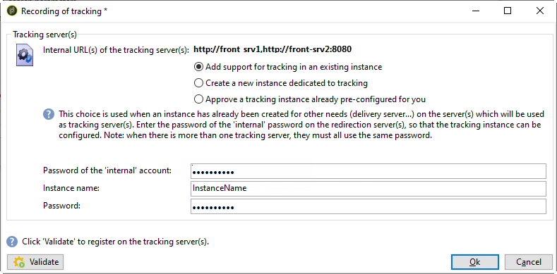

# 部署執行個體{#deploying-an-instance}


>[!NOTE]
>
>伺服器端配置只能通過Adobe執行由Adobe承載的部署。 要瞭解有關不同部署的詳細資訊，請參閱 [托管模型](../../installation/using/hosting-models.md) 或 [此頁](../../installation/using/capability-matrix.md)。

## 部署嚮導 {#deployment-wizard}

在Adobe Campaign客戶端控制台中提供的圖形嚮導使您能夠定義要連接到的實例的參數。

要啟動部署嚮導，請選擇 **工具>高級>部署嚮導**。


配置步驟如下：

1. [一般參數](#general-parameters)
1. [電子郵件通道參數](#email-channel-parameters)
1. [管理已拒發的電子郵件](#managing-bounced-emails)
1. [跟蹤配置](#tracking-configuration)
1. [移動通道參數](#mobile-channel-parameters)
1. [區域設定](#regional-settings)
1. [從Internet訪問](#access-from-the-internet)
1. [管理公共資源](#managing-public-resources)
1. [清除資料](#purging-data)

## 一般參數 {#general-parameters}

使用部署嚮導的第一步，可以輸入有關實例的一般資訊。


### 一般資訊 {#general-information}

窗口的下半部分允許您選擇要激活的選項。

* **[!UICONTROL Customer identifier used in billing]** :這可以是實例的名稱和版本號。
* **[!UICONTROL Common name of the customer]** :輸入包含公司名稱的字串。 此資訊可用於取消訂閱連結。
* **[!UICONTROL Namespace]** :以小寫輸入短標識符。 目的是在升級時區分您的特定配置和出廠配置。 預設命名空間為 **番**  — 客戶。

### 技術選項 {#technical-options}

窗口的下半部分允許您選擇要激活的選項。

可以使用以下選項：

* **[!UICONTROL Email channel]** :激活電子郵件傳遞。 請參閱 [電子郵件通道參數](#email-channel-parameters)。
* **[!UICONTROL Tracking]** :啟用目標填充的跟蹤（開啟並按一下）。 請參閱 [跟蹤配置](#tracking-configuration)。
* **[!UICONTROL Managing bounced emails]** :定義用於接收傳入電子郵件的POP帳戶。 請參閱 [管理已拒發的電子郵件](#managing-bounced-emails)。
* **[!UICONTROL LDAP integration]** :通過LDAP目錄配置用戶身份驗證。 請參閱 [通過LDAP連接](../../installation/using/connecting-through-ldap.md)。

## 電子郵件通道參數 {#email-channel-parameters}

通過以下步驟，您可以定義要在消息標題中顯示的資訊。

這些參數可以在傳遞模板中重載，並且可以針對每個傳遞單獨重載（如果用戶具有所需權限）。

### 傳遞的電子郵件的參數 {#parameters-for-delivered-emails}


指明以下參數：

* **[!UICONTROL Sender name]** :發件人的名稱
* **[!UICONTROL Sender address]** :發件人地址
* **[!UICONTROL Reply address text]** :可自定義的名稱，當收件人按一下 **[!UICONTROL Reply]** 按鈕
* **[!UICONTROL Reply address]** :收件人按一下 **[!UICONTROL Reply]** 按鈕
* **[!UICONTROL Error address]** :出錯郵件的電子郵件地址。 這是用於處理彈回郵件的技術地址，包括由於不存在目標地址而由Adobe Campaign伺服器接收的電子郵件。

除此之外，還可以指定 **口罩** 已為發件人地址和錯誤地址授權。 如有必要，這些蒙版可以用逗號分隔。 此配置是可選的。 輸入欄位後，Adobe Campaign會在交付時（在分析期間，如果地址不包括任何變數）檢查地址是否有效。 此操作模式確保沒有使用任何地址來觸發傳遞問題。 必須在傳遞伺服器上配置傳遞地址。

### 地址中授權的字元 {#characters-authorized-in-addresses}

<!--This window enables you to define, for all email campaigns, the delivery and address-quality management options.-->

在Adobe Campaign資料庫中，必須按如下方式建立所有電子郵件地址： `x@y.z`。 的 **x**。 **y** 和 **z** 字元不能為空，也不能包含非授權字元。

您可以在此處定義資料庫電子郵件欄位中已授權的字元（「資料策略」）。 當通過介面、通過Web表單以及導入資料在資料庫中輸入資訊時，清單中未包括的字元將被禁止並因此被拒絕。

有兩個清單可用： **僅限歐洲** 或 **僅美國**。 如有必要，可添加其他字元。

### 傳送參數 {#delivery-parameters}

的 **高級參數……** 連結使您可以訪問傳遞選項、連結到重試和隔離的參數。


通過此窗口，您可以為所有電子郵件市場活動定義交付和地址質量管理選項。

可以使用以下選項：

* **[!UICONTROL Delivery duration of messages]** :此後，交貨將停止（預設為5天）。
* **[!UICONTROL Online resources validity duration]** :保留來自接收者配置檔案的資訊以生成鏡像頁的時間。
* **[!UICONTROL Exclude recipients who no longer wish to be contacted]** :選擇此選項後，將不聯繫denylist收件人。
* **[!UICONTROL Automatically ignore doubles]** :選中此選項後，將不會將傳遞到重複地址。

>[!NOTE]
>
>對於托管或混合安裝，如果已升級到 [增強的MTA](../../delivery/using/sending-with-enhanced-mta.md)，也請參見Wiki頁。 **[!UICONTROL Delivery duration of the messages]** 將僅在設定為 **3.5天或以下**。  如果您定義的值超過　3.5　天，則不會考慮該值。

### 重試參數 {#retry-parameters}

有關回收的資料載於 **恢復期** 和 **恢複數** 欄位：當收件人無法訪問時，例如，如果收件箱已滿，則預設情況下程式將嘗試與他們聯繫5次，每次嘗試之間的時間間隔為1小時（在最大傳遞時間內）。 這些值可以根據需要進行更改。

>[!NOTE]
>
>對於托管或混合安裝，如果已升級到 [增強的MTA](../../delivery/using/sending-with-enhanced-mta.md)，市場活動重試參數不再使用。 軟反彈重試次數和它們之間的時間長度由增強MTA根據郵件電子郵件域返回的反彈響應的類型和嚴重性確定。

### 隔離參數 {#quarantine-parameters}

隔離的配置選項如下：

* **[!UICONTROL Duration between two significant errors]** :輸入值（預設為「1d」）:1天)定義應用程式在出錯時等待的時間，然後遞增錯誤計數器，
* **[!UICONTROL Maximum number of errors before quarantine]** :達到此值後，將隔離電子郵件地址（預設為「5」）:地址將在第六個錯誤時被隔離)。 這表示該在後續傳送時將自動排除該聯絡人。

## 管理已拒發的電子郵件 {#managing-bounced-emails}

彈出郵件對確認傳遞錯誤非常重要。 一旦規則確定其原因，這些錯誤將在NP@I中分類。

此步驟僅在 **電子郵件通道** 和 **退信郵件** 在部署嚮導的第一階段中選擇了管理選項。 請參閱 [常規參數](#general-parameters)。

此階段允許您定義管理退回郵件的設定。


### 用於檢索傳入郵件的POP帳戶 {#pop-account-used-to-retrieve-incoming-mails}

指示連接到帳戶以檢索傳入電子郵件的參數。

* **[!UICONTROL Label]** :名稱，包括下面給出的所有參數，
* **[!UICONTROL Server]** :用於檢索反饋郵件（傳入郵件）的伺服器，
* **[!UICONTROL Security]** :如有必要，請選擇 **[!UICONTROL SSL]** 從下拉清單中，
* **[!UICONTROL Port]** :伺服器埠（通常為110）,
* **[!UICONTROL Account]** :用於退信郵件的帳戶名稱，
* **[!UICONTROL Password]** :與帳戶關聯的密碼。

指定POP設定後，按一下 **Test** 來確保他們是正確的。

### 未處理的退回郵件 {#unprocessed-bounce-mails}

Bounce由Adobe Campaign自動處理，並應用 **管理>Campaign Management>非交付項管理>交付日誌資格** 的下界。 有關此內容的詳細資訊，請參閱 [彈出郵件管理](../../delivery/using/understanding-delivery-failures.md#bounce-mail-management)。

未處理的彈出不顯示在Adobe Campaign介面中。 除非使用以下欄位將它們傳輸到第三方郵箱，否則它們將自動刪除：

* **[!UICONTROL Forwarding address]** :填入此欄位以將Adobe Campaign平台收集的所有錯誤消息（已處理或未處理）傳輸到第三方地址。
* **[!UICONTROL Address for errors]** :填寫此欄位以僅將inMail進程無法確認的錯誤消息傳輸到第三方地址。
* **[!UICONTROL SMTP server]** :伺服器用於發送未處理的退回電子郵件。

>[!IMPORTANT]
>
>要轉發未處理的退回電子郵件，Adobe建議只填寫 **[!UICONTROL Address for errors]** 的子菜單。 但是，請確保定期檢查所使用的地址，因為這可能會給郵件伺服器帶來沈重負載。 有關詳細資訊，請與客戶經理聯繫。

## 跟蹤配置 {#tracking-configuration}

下一步允許您配置實例的跟蹤。 實例必須聲明並註冊到跟蹤伺服器。

僅當 **電子郵件通道** 和 **跟蹤** 選項。 請參閱 [常規參數](#general-parameters)。

有關Web跟蹤（跟蹤模式、建立和插入標籤……）的詳細資訊，請參閱 [此文檔](../../configuration/using/about-web-tracking.md)。

### 操作原則 {#operating-principle}

在實例上激活跟蹤時，在發送期間將更改交貨中的URL以啟用跟蹤。

* 在部署嚮導的此頁上輸入的有關外部URL（無論是否安全）的資訊用於生成新URL。 除此資訊外，修改的連結還包含：傳遞、收件人和URL的標識符。

   跟蹤資訊由Adobe Campaign在跟蹤伺服器上收集，以豐富接收人簡檔和與遞送連結的資料(100) **[!UICONTROL Tracking]** )。

   關於內部URL的資訊僅由Adobe Campaign應用伺服器用於與跟蹤伺服器聯繫。

   有關此內容的詳細資訊，請參閱 [跟蹤伺服器](#tracking-server)。

* 配置URL後，需要啟用跟蹤。 為此，必須在跟蹤伺服器上註冊實例。

   有關此內容的詳細資訊，請參閱 [保存跟蹤](#saving-tracking)。

### 追蹤伺服器 {#tracking-server}


為確保跟蹤此實例的效率，必須顯示以下資訊：
<!--With Mid-sourcing architecture, you can externalize tracking management. To do this:-->

* **[!UICONTROL External URL]** 和/或 **[!UICONTROL Secure external URL]** :輸入要在要發送的電子郵件中使用的重定向URL。
* **[!UICONTROL Internal URL(s)]** :僅由Adobe Campaign伺服器用於聯繫跟蹤伺服器以收集日誌和上載URL的URL。 不必將其與實例關聯。

   如果未指定URL，則預設情況下將使用跟蹤URL。

使用中間採購體系結構，您可以將跟蹤管理外部化。 操作步驟：

1. 選擇選項 **[!UICONTROL Externalize tracking management]** :這允許您將中間採購伺服器用作跟蹤伺服器。
1. 填充 **[!UICONTROL External account]** 和 **[!UICONTROL Instance name]** 欄位，以便能夠連接到中間採購伺服器。

   有關詳細資訊，請參閱 [中間採購伺服器](../../installation/using/mid-sourcing-server.md)。

1. 按一下 **[!UICONTROL Enable the tracking instance]** 按鈕以批准與伺服器的連接。

   

### 保存跟蹤 {#saving-tracking}

填充URL後，必須註冊跟蹤伺服器。

按一下連結 **在跟蹤伺服器上註冊** ，然後選擇一個可用選項。


實現跟蹤的體系結構有三種可能類型：

1. **添加對現有實例中跟蹤的支援**

   如果實例是為其他需要（MTA伺服器等）而建立的，則此選擇適用 將用作跟蹤伺服器的伺服器上。

   

   輸入密碼 **內部** 用於配置跟蹤實例的重定向伺服器上的帳戶。

   >[!NOTE]
   >
   >如果使用了多個跟蹤伺服器，則它們必須使用相同的名稱和密碼。

   指定實例的名稱和密碼。

1. **建立專用於跟蹤的新實例**

   當跟蹤實例被保留用於跟蹤且沒有任何其他應用程式模組時，此選項非常有用。

   

   輸入密碼 **內部** 用於配置跟蹤實例的重定向伺服器上的帳戶。

   >[!NOTE]
   >
   >如果配置了多個跟蹤伺服器，則它們必須使用相同的密碼。

   指定實例的名稱、密碼和任何關聯的DNS掩碼，如 **[!UICONTROL Campaign*]**。

1. **驗證已為您預先配置的跟蹤實例**

   當您沒有 **內部** 賬戶；在這種情況下，跟蹤帳戶已在跟蹤伺服器上預配置。 輸入重定向伺服器的跟蹤帳戶密碼以驗證跟蹤實例。

   

   指定要驗證的實例的名稱。

按一下 **批准** 啟動跟蹤伺服器的錄制過程。

返回到上一個窗口時，將顯示一條消息確認跟蹤伺服器級別的註冊：


連結到URL搜索的參數 **不能修改** 標準安裝。 有關所有其他參數，請與Adobe聯繫。

## 移動通道參數 {#mobile-channel-parameters}

下一步允許您定義向手機傳送的預設設定（SMS和WAP推送）。

>[!NOTE]
>
>移動頻道是可選的：此階段僅在已購買時才顯示。 請檢查您的授權合約。


### 簡訊傳遞的預設帳戶 {#default-account-for-sms-delivery}

輸入以下資訊：

* **[!UICONTROL Label]** :輸入此SMS/Wap推送帳戶的名稱。 例如，您可能希望使用路由器的名稱。
* 對於 **[!UICONTROL Server]**。 **[!UICONTROL Port]**。 **[!UICONTROL Account]**。 **[!UICONTROL Password]**。 **[!UICONTROL Connector]**。 **[!UICONTROL Send Endpoint]**。 **[!UICONTROL Reception Endpoint]**。 **[!UICONTROL Notification Endpoint]** 欄位：請與服務提供商聯繫以獲取所需的設定。

### 已傳送簡訊的參數 {#parameters-of-sms-sent}

在 **優先順序** 下拉清單：選擇「正常」、「高」或「緊急」將其應用於要發送的郵件。

### 高級參數 {#advanced-parameters}

的 **高級參數……** 連結使您可以訪問重試和隔離選項。


有關重試的資訊，請參閱 **重試期間** 和 **重試次數** 欄位：當無法訪問移動設備時，預設情況下，程式將在至少15分鐘的間隔內重試5次（最長傳輸期）。 這些值可以適應您的需要。

隔離的配置選項如下：

* **[!UICONTROL Time between two significant errors]** :輸入預設值（預設為&quot;1d&quot;）:定義應用程式等待的時間，然後遞增錯誤計數器以備失敗。
* **[!UICONTROL Maximum number of errors before quarantine]** :達到此值後，將隔離移動號碼（預設為&quot;5&quot;）:第6個錯誤時將隔離該號碼)。 這意味著聯繫人將自動從將來的交貨中排除。

## 區域設定 {#regional-settings}

此階段允許您包括資料策略首選項。


* **[!UICONTROL Consider all phone numbers as international ones]** :選擇此選項後，應用程式將國際格式應用於電話號碼（然後國家/地區前置詞是必填的，因為在應用格式之前將不檢查數字數）。 如果未選擇此選項，則必須在國際電話號碼前加上「+」或「00」的前置詞。
* **[!UICONTROL Store all phone numbers using the international format]** :此選項僅涉及 **國內** 導入或編輯的電話號碼。 定義您是要使用國內格式（如425 555 0150）還是使用國際格式(如+1 425 555 0150)

## 從Internet訪問 {#access-from-the-internet}

>[!IMPORTANT]
>
>出於隱私原因，我們建議對所有外部資源使用HTTPS。

此步驟允許您為Internet上公開的Adobe Campaign頁面定義訪問URL。

您還必須在此處指明連結到Web表單的發佈選項。


### Web上公開的伺服器 {#servers-exposed-on-the-web}

使用此頁可將伺服器URL填充到：

1. 訪問Internet上公開的應用程式伺服器：訂閱/取消訂閱表單、外聯網等。
1. 訪問應用程式伺服器以查找Web上未公開的資源：表單、內聯網、確認頁。
1. 訪問交貨的鏡像頁。

   鏡像頁是顯示電子郵件內容的動態頁。 它通過插入到發送到接收者的消息中的連結被訪問，並且可以包含個性化元素。 鏡像頁面使接收者可以在網際網路瀏覽器而不是電子郵件軟體中閱讀消息，而不管傳送格式(文本或HTML)。 但是，只有在定義了所需的HTML內容時，才會為給定傳遞生成鏡像頁。

Adobe Campaign允許您區分這三個URL，以將負載分散到多個平台。

## 管理公共資源 {#managing-public-resources}

>[!IMPORTANT]
>
>出於隱私原因，我們建議對所有外部資源使用HTTPS。

要從外部查看，電子郵件和連結到市場活動的公共資源中使用的影像必須存在於外部可訪問的伺服器上。 然後，它們可供外部收件人或操作員使用。


對於此步驟，您需要輸入：

1. 新公共資源URL。 有關詳細資訊，請參閱 [公共資源URL](#public-resources-url) 的子菜單。
1. 在遞送中的影像檢測模式。 有關詳細資訊，請參閱 [遞送影像檢測](#delivery-image-detection) 的子菜單。
1. 發佈選項。 有關詳細資訊，請參閱 [發佈模式](#publication-modes) 的子菜單。

公共資源可通過 **管理>資源>聯機>公共資源** Adobe Campaign樹的節點。 它們被收集在庫中，可以包含在電子郵件中，但也可用於市場活動或任務，以及內容管理。


### 公共資源URL {#public-resources-url}

第一個欄位允許您指定上載後用於資源的URL的開始。 上載後，可通過此新URL訪問資源。

在傳遞中，可以使用儲存在公共資源庫中的影像或儲存在伺服器上的任何其他本地影像或影像。

* 對於電子郵件影像， **https://**&#x200B;伺服器&#x200B;**/res/img** URL。

   可以覆蓋每個交貨的此值。

* 對於公共資源，URL **https://**&#x200B;伺服器&#x200B;**/res/**&#x200B;實例&#x200B;****何處&#x200B;**實例**是跟蹤實例的名稱。

### 遞送影像檢測 {#delivery-image-detection}

在傳遞中，可以使用儲存在公共資源庫中的影像或儲存在伺服器上的任何其他本地影像或影像。

欄位 **URL掩碼** 用於指定自動上載影像時要跳過的URL掩碼清單。 例如，如果您使用儲存在可從外部訪問的站點上的影像，則可以在此欄位中輸入站點URL。


可以使用逗號分隔多個URL掩碼。

* 有關使用和管理電子郵件中的影像的資訊，請參閱 [此部分](../../delivery/using/defining-the-email-content.md#adding-images)。
* 在傳遞嚮導中，從這些URL調用的映像將具有「已忽略」狀態。

### 發佈模式 {#publication-modes}

嚮導的下半部分允許您選擇公共資源和映像的發佈選項。

以下發佈模式可用：

* 追蹤伺服器

   資源將自動複製到不同的跟蹤伺服器。 在步驟中配置 [跟蹤配置](#tracking-configuration)。

* 其他Adobe Campaign伺服器

   您可以再使用一個將複製資源的Adobe Campaign伺服器。

   伺服器端，要使用專用的Adobe Campaign伺服器，必須使用以下命令建立新實例：

   ```
   nlserver config -addtrackinginstance:<trackingA>/<trackingA*>
   ```

   然後輸入密碼。

   在 **[!UICONTROL Media URL(s)]**。 **[!UICONTROL Password]** 和 **[!UICONTROL Instance name]** 的子菜單。

   

* 手動發佈指令碼（僅用於公共資源）

   

   可以使用指令碼發佈影像：

   * 必須建立此指令碼：其內容取決於您的配置。
   * 指令碼將由以下命令調用：

      ```
      [INSTALL]/copyToFrontal.vbs "$(XTK_INSTALL_DIR)\var\<instance>\upload\" "img1,img2,img3"
      ```

      何處 `[INSTALL]` 是訪問Adobe Campaign安裝資料夾的路徑。

   * 在Unix中，確保指令碼是可執行的。

對於映像，它必須從通過 **NmsDelivery_ImageSubDirectory** 可選到一個或多個額外伺服器。 這些伺服器將儲存映像，以便通過新配置的URL訪問映像。

如果在沒有手動發佈指令碼的Adobe Campaign伺服器上發佈，預設情況下，傳遞的映像儲存在 `$(XTK_INSTALL_DIR)/var/res/img/ directory`。 相應的URL如下： **`https://server/res/img`**。

`XTK_INSTALL_DIR)/var/res/$(INSTANCE_NAME)`。 相應的URL如下： **`https://server/res/instance`** 其中，instance是跟蹤實例的名稱。

>[!NOTE]
>
>可以更改公共資源儲存目錄。 有關此內容的詳細資訊，請參閱 [管理公共資源](#managing-public-resources)。

### 同步公共資源 {#synchronizing-public-resources}

此功能允許您 **同步公共資源** 在多個備用伺服器上。

如果跟蹤伺服器上不存在公共資源，或者如果資源返回404錯誤，則跟蹤伺服器將嘗試在其中一個備用伺服器上查找該資源。

必須在Marketing Server的 **serverConf.xml** 的子菜單。 中的所有可用參數 **serverConf.xml** 列在 [節](../../installation/using/the-server-configuration-file.md)。

**聲明**

```
<redirection>
<spareServer enabledIf="" id="" url=""/>
</redirection>
```

**配置**

對於每個必須同步的公共資源，您必須向 `<url>` 元素 `<relay>` 部分：

狀態屬性可以是以下三個值之一：

* 備用：公共資源已同步

* 正常：現有行為（無同步）

* 黑名單：如果返回404錯誤，則URL將添加到denylist。 denylist中URL的持續時間（秒）由 **超時** 預設值為60s的屬性。

同步的現成配置是：

```
(extracted from the serverConf.xml file)

<redirection P3PCompactPolicy="CAO DSP COR CURa DEVa TAIa OUR BUS IND UNI COM NAV"
databaseId="" defLogCount="30" expirationURL="" maxJobsInCache="100"
startRedirection="true" startRedirectionInModule="true" trackWebVisitors="false" trackingPassword="">
<spareServer enabledIf="" id="1" url=""/>
</redirection>

....


<relay debugRelay="false" forbiddenCharsInAuthority="?#.@/:" forbiddenCharsInPath="?#/"
           modDir="index.html" startRelay="false" startRelayInModule="true" timeout="60">
   <url IPMask="" deny="" hostMask="" relayHost="true" relayPath="true" status="normal" targetUrl="https://localhost:8080" timeout="" urlPath="/view/*"/>
      <url IPMask="" deny="" hostMask="" relayHost="true" relayPath="true" status="blacklist" targetUrl="https://localhost:8080" timeout="" urlPath="*.jsp"/>
      <url IPMask="" deny="" hostMask="" relayHost="true" relayPath="true" status="blacklist" targetUrl="https://localhost:8080" timeout="" urlPath="*.jssp"/>
      <url IPMask="" deny="" hostMask="" relayHost="true" relayPath="true" status="blacklist" targetUrl="https://localhost:8080" timeout="" urlPath="/webApp/*"/>
      <url IPMask="" deny="" hostMask="" relayHost="true" relayPath="true" status="blacklist" targetUrl="https://localhost:8080" timeout="" urlPath="/report/*"/>
      <url IPMask="" deny="" hostMask="" relayHost="true" relayPath="true" status="blacklist" targetUrl="https://localhost:8080" timeout="" urlPath="/jssp/*"/>
      <url IPMask="" deny="" hostMask="" relayHost="true" relayPath="true" status="normal" targetUrl="https://localhost:8080" timeout="" urlPath="/strings/*"/>
      <url IPMask="" deny="" hostMask="" relayHost="true" relayPath="true" status="normal" targetUrl="https://localhost:8080" timeout="" urlPath="/interaction/*"/>
      <url IPMask="" deny="" hostMask="" relayHost="true" relayPath="true" status="normal" targetUrl="https://localhost:8080" timeout="" urlPath="/barcode/*"/>

      <url IPMask="" deny="" hostMask="" relayHost="false" relayPath="false" status="spare" targetUrl="" timeout="" urlPath="/favicon.*"/>
      <url IPMask="" deny="" hostMask="" relayHost="false" relayPath="false" status="spare" targetUrl="" timeout="" urlPath="/*.html"/>
      <url IPMask="" deny="" hostMask="" relayHost="false" relayPath="false" status="spare" targetUrl="" timeout="" urlPath="/*.png"/>
      <url IPMask="" deny="" hostMask="" relayHost="false" relayPath="false" status="spare" targetUrl="" timeout="" urlPath="/*.jpg"/>

 </relay>
```

## 清除資料 {#purging-data}

部署嚮導的最後一階段允許您配置自動清除過時資料。 值以天為單位表示。


資料通過資料庫清理工作流自動刪除。 有關如何配置和操作此工作流以及刪除項目的詳細資訊，請參閱此 [文檔](../../production/using/database-cleanup-workflow.md)。
