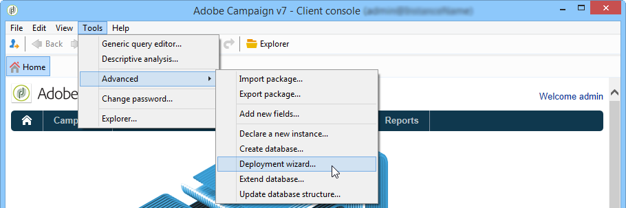
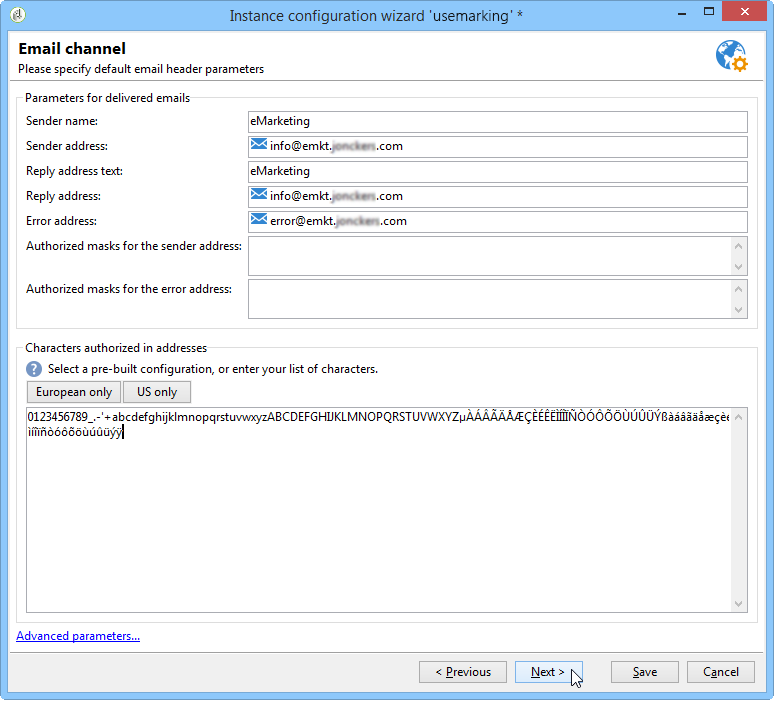

# 部署實例{#deploying-an-instance}

>[!NOTE]
>
>伺服器端組態只能由Adobe針對Adobe代管的部署執行。 若要進一步瞭解不同的部署，請參閱「代 [管模型](../../installation/using/hosting-models.md) 」一節或 [本文章](https://helpx.adobe.com/campaign/kb/acc-on-prem-vs-hosted.html)。

## 部署精靈 {#deployment-wizard}

Adobe Campaign用戶端主控台中提供的圖形精靈可讓您定義要連接的例項參數。

要啟動部署嚮導，請選擇「工 **具」>「高級」>「部署嚮導**」。



配置步驟如下：

1. [一般參數](#general-parameters)
1. [電子郵件通道參數](#email-channel-parameters)
1. [管理遭拒的電子郵件](#managing-bounced-emails)
1. [追蹤設定](#tracking-configuration)
1. [行動頻道參數](#mobile-channel-parameters)
1. [地區設定](#regional-settings)
1. [從網際網路存取](#access-from-the-internet)
1. [管理公共資源](#managing-public-resources)
1. [清除資料](#purging-data)

## 一般參數 {#general-parameters}

部署嚮導的第一步可讓您輸入實例的一般資訊。


### 一般資訊 {#general-information}

在窗口的下部，可以選擇要激活的選項。

* **[!UICONTROL Customer identifier used in billing]** : 這可以是例項的名稱和版本號碼。
* **[!UICONTROL Common name of the customer]** : 輸入公司名稱的字元字串。 此資訊可用於取消訂閱連結。
* **[!UICONTROL Namespace]** : 以小寫輸入簡短識別碼。 目的是在升級時區分您的特定配置和出廠配置。 預設的命名空 **間為** cus - for customer.

### 技術選項 {#technical-options}

在窗口的下部，可以選擇要激活的選項。

可以使用以下選項：

* **[!UICONTROL Email channel]** : 啟動電子郵件傳送。 請參閱電 [子郵件渠道參數](#email-channel-parameters)。
* **[!UICONTROL Tracking]** : 若要啟用目標人口族群的追蹤（開啟和點按）。 請參閱 [追蹤設定](#tracking-configuration)。
* **[!UICONTROL Managing bounced emails]** : 要定義用於接收傳入電子郵件的POP帳戶，請執行以下操作： 請參閱「管 [理已退回的電子郵件](#managing-bounced-emails)」。
* **[!UICONTROL LDAP integration]** : 通過LDAP目錄配置用戶身份驗證。 請參閱 [通過LDAP連接](../../installation/using/connecting-through-ldap.md)。

## 電子郵件通道參數 {#email-channel-parameters}

以下步驟可讓您定義要顯示在訊息標題中的資訊。

這些參數可在傳送範本中過載，而每個傳送（如果使用者擁有所需的權限）也可個別地過載。

### 傳遞電子郵件的參數 {#parameters-for-delivered-emails}



指出下列參數：

* **[!UICONTROL Sender name]** : 發件人姓名，
* **[!UICONTROL Sender address]** : 發件人地址，
* **[!UICONTROL Reply address text]** : 此名稱可自訂，當收件者按一下其電子郵件用戶端軟 **[!UICONTROL Reply]** 體中的按鈕時，即可使用。
* **[!UICONTROL Reply address]** : 當收件者按一下其電子郵件用戶端軟 **[!UICONTROL Reply]** 體中的按鈕時，要使用的電子郵件地址，
* **[!UICONTROL Error address]** : 有錯誤訊息的電子郵件地址。 這是用於處理彈回郵件的技術地址，包括由於不存在目標地址而由Adobe Campaign伺服器收到的電子郵件。

除此之外，您還可以指定傳送者 **地址** 、錯誤地址的授權遮色片。 如有必要，這些遮色片可以使用逗號來分隔。 此配置是可選的。 在輸入欄位時，Adobe Campaign會在傳送時（分析期間，如果位址不包含任何變數）檢查位址是否有效。 此作業模式可確保沒有使用任何可能觸發傳送問題的位址。 必須在傳送伺服器上設定傳送位址。

### 地址中授權的字元 {#characters-authorized-in-addresses}

<!--This window enables you to define, for all email campaigns, the delivery and address-quality management options.-->

在Adobe Campaign資料庫中，所有電子郵件地址都必須建立如下： `x@y.z`. **x**、 **y** 和 **** z字元不得空白，也不得包含未授權的字元。

您可以在此處定義資料庫電子郵件欄位中授權的字元(&#39;data policy&#39;)。 在通過介面、通過Web表單和導入資料時，在資料庫中輸入資訊時，清單中未包含的字元將被禁止，因此被拒絕。

有兩個清單可供使用： **僅限歐洲** , **或僅限美國**。 如有需要，可新增其他字元。

### 傳送參數 {#delivery-parameters}

高 **級參數……** 連結可讓您存取傳送選項、連結至重試的參數和隔離。


此視窗可讓您針對所有電子郵件促銷活動定義傳送和地址品質管理選項。

可以使用以下選項：

* **[!UICONTROL Delivery duration of messages]** : 此後，傳送將停止（預設為5天）,
* **[!UICONTROL Online resources validity duration]** : 收件者描述檔中的資訊保留的時間，以產生鏡像頁面，
* **[!UICONTROL Exclude recipients who no longer wish to be contacted]** : 選取此選項時，將不會連絡黑名單收件者，
* **[!UICONTROL Automatically ignore doubles]** : 選取此選項時，不會傳送至重複的位址。

### 重試參數 {#retry-parameters}

有關恢復的資訊在「恢復期 **間** 」和「恢 **複數」欄位中提供** : 當收件者無法連線時（例如，如果收件者的收件匣已滿），預設程式會嘗試連絡他們5次，每次嘗試之間間隔一小時（在最長傳送時間）。 這些值可以變更以符合您的需求。

### 隔離參數 {#quarantine-parameters}

隔離的配置選項如下：

* **[!UICONTROL Duration between two significant errors]** : 輸入值（預設為&quot;1d&quot;）: 1天)，以定義應用程式在發生故障時等待的時間，再遞增錯誤計數器，
* **[!UICONTROL Maximum number of errors before quarantine]** : 到達此值後，電子郵件地址將被隔離(預設為&quot;5&quot;: 地址將在第六個錯誤時被隔離)。 這表示該連絡人將自動排除在後續傳送之外。

## 管理遭拒的電子郵件 {#managing-bounced-emails}

彈回郵件對於確認傳送錯誤非常重要。 當規則確定其原因後，這些錯誤會分類在NP@I中。

只有在部署精靈的第一個階 **段中選取了** 「電子郵件」頻道和 **「彈回郵件** 」管理選項時，才能使用此步驟。 請參閱「 [一般參數](#general-parameters)」。

此階段可讓您定義管理反彈電子郵件的設定。


### 用於檢索傳入郵件的POP帳戶 {#pop-account-used-to-retrieve-incoming-mails}

指定要連線至帳戶以擷取傳入電子郵件的參數。

* **[!UICONTROL Label]** : 名稱，其中包含下面提供的所有參數，
* **[!UICONTROL Server]** : 用於檢索彈回郵件（傳入郵件）的伺服器，
* **[!UICONTROL Security]** : 如有必要， **[!UICONTROL SSL]** 請從下拉式清單中選取
* **[!UICONTROL Port]** : 伺服器埠（通常為110）,
* **[!UICONTROL Account]** : 用於彈回郵件的帳戶名稱，
* **[!UICONTROL Password]** : 與帳戶關聯的密碼。

指定POP設定後，按一下 **Test** （測試）以確保它們正確。

### 未處理的回傳郵件 {#unprocessed-bounce-mails}

彈回會由Adobe Campaign自動處理，並套用「管理>促銷活動管理>非交付項目管理>傳送記錄資格 **** 」節點中所列的規則。 有關詳情，請參閱「彈回 [郵件管理」](../../delivery/using/understanding-delivery-failures.md#bounce-mail-management)。

未處理的彈回數不會顯示在Adobe Campaign介面中。 除非使用下列欄位將其傳輸到第三方郵箱，否則會自動刪除它們：

* **[!UICONTROL Forwarding address]** : 填寫此欄位，將Adobe Campaign平台收集的所有錯誤訊息（已處理或未處理）傳送至協力廠商。
* **[!UICONTROL Address for errors]** : 填寫此欄位，只將inMail程式無法符合的錯誤訊息傳送至第三方地址。
* **[!UICONTROL SMTP server]** : 伺服器用來傳送未處理的彈回電子郵件。

>[!IMPORTANT]
>
>若要轉寄未處理的彈回電子郵件，Adobe建議只填入欄 **[!UICONTROL Address for errors]** 位。 不過，請務必定期檢查所使用的地址，因為這可能給郵件伺服器帶來沈重負載。 如需詳細資訊，請洽詢您的帳戶管理員。

## 追蹤設定 {#tracking-configuration}

下一步可讓您設定例項的追蹤。 必須向追蹤伺服器宣告及註冊該例項。

只有在部署精靈的第一頁 **選取「電子郵件** 」頻道 **** 和「追蹤」選項時，才會提供此步驟。 請參閱「 [一般參數](#general-parameters)」。

有關網頁追蹤（追蹤模式、建立和插入標籤……）的詳細資訊，請參閱本 [檔案](../../configuration/using/about-web-tracking.md)。

### 操作原則 {#operating-principle}

當您啟用例項的追蹤時，傳送期間傳送的URL會變更，以啟用追蹤。

* 在部署精靈的此頁面上輸入的外部URL（無論是否安全）相關資訊會用來建立新URL。 除了這些資訊外，修改的連結還包含： 傳送、收件者和URL的識別碼。

   追蹤資訊由追蹤伺服器上的Adobe Campaign收集，以豐富收件者描述檔和連結至傳送的資料(標 **[!UICONTROL Tracking]** 簽)。

   有關內部URL的資訊僅供Adobe Campaign應用程式伺服器用來連絡追蹤伺服器。

   For more on this, refer to [Tracking server](#tracking-server).

* 在設定URL後，您必須啟用追蹤。 若要這麼做，例項必須在追蹤伺服器上註冊。

   For more on this, refer to [Saving tracking](#saving-tracking).

### 追蹤伺服器 {#tracking-server}


為保證此實例的跟蹤效率，必須顯示以下資訊：
<!--With Mid-sourcing architecture, you can externalize tracking management. To do this:-->

* **[!UICONTROL External URL]** 和／或 **[!UICONTROL Secure external URL]** : 輸入要在要傳送的電子郵件中使用的重新導向URL。
* **[!UICONTROL Internal URL(s)]** : 僅由Adobe Campaign伺服器用來連絡追蹤伺服器以收集記錄檔和上傳URL的URL。 不需要將它與實例關聯。

   如果您未指定URL，則預設會使用追蹤URL。

有了中間採購架構，您就可以將追蹤管理外部化。 操作步驟：

1. 選擇選項 **[!UICONTROL Externalize tracking management]** : 這可讓您使用中間採購伺服器做為追蹤伺服器。
1. 填入 **[!UICONTROL External account]** 和字 **[!UICONTROL Instance name]** 段，以便能夠連接到中間採購伺服器。

   如需詳細資訊，請參 [閱Mid-sourcing伺服器](../../installation/using/mid-sourcing-server.md)。

1. 按一下該 **[!UICONTROL Enable the tracking instance]** 按鈕可批准與伺服器的連接。

   

### 儲存追蹤 {#saving-tracking}

填入URL後，您必須註冊追蹤伺服器。

按一下追蹤 **伺服器上的連結註冊** ，然後選取其中一個可用選項。


實作追蹤有三種可能的架構類型：

1. **新增現有例項中追蹤的支援**

   如果已針對其他需求（MTA伺服器等）建立執行個體，則適用此選項 會用作追蹤伺服器的伺服器上。

   

   輸入重新導向伺 **服器** 上內部帳戶的密碼，以設定追蹤例項。

   >[!NOTE]
   >
   >如果使用多個追蹤伺服器，則必須使用相同的名稱和密碼。

   指定實例的名稱和口令。

1. **建立專用於追蹤的新例項**

   當追蹤例項保留供追蹤，且沒有其他應用程式模組時，這個選項很有用。

   

   輸入重新導向伺 **服器** 上內部帳戶的密碼，以設定追蹤例項。

   >[!NOTE]
   >
   >如果已設定多個追蹤伺服器，則所有追蹤伺服器都必須使用相同的密碼。

   指定實例的名稱、口令和任何關聯的DNS掩碼，如 **[!UICONTROL Campaign*]**。

1. **驗證已預先為您設定的追蹤例項**

   當您沒有內部帳戶的密碼時，就會使 **用** 此選項； 在此情況下，追蹤伺服器上已預先設定追蹤帳戶。 輸入重新導向伺服器的追蹤帳戶密碼以驗證追蹤例項。

   

   指定要驗證的實例的名稱。

按一 **下「核准** 」，即可啟動追蹤伺服器的錄製程式。

在上一個視窗中，會出現一則訊息確認追蹤伺服器層級的註冊：


URL搜尋連結的參 **數不得在標準安裝** 中修改。 如需所有其他參數，請聯絡Adobe。

## 行動頻道參數 {#mobile-channel-parameters}

下個步驟可讓您定義傳送至行動裝置（SMS和WAP推播）的預設設定。

>[!NOTE]
>
>行動頻道是選用的： 此階段僅在已購買時顯示。 請檢查您的授權合約。


### SMS傳送的預設帳戶 {#default-account-for-sms-delivery}

輸入以下資訊：

* **[!UICONTROL Label]** : 輸入此SMS/Wap推播帳戶的名稱。 例如，您可能希望使用路由器的名稱。
* 對於 **[!UICONTROL Server]**,,, **[!UICONTROL Port]**,, **[!UICONTROL Account]**,, **[!UICONTROL Password]****[!UICONTROL Connector]**,，欄位 **[!UICONTROL Send Endpoint]****[!UICONTROL Reception Endpoint]****[!UICONTROL Notification Endpoint]** : 請洽詢您的服務供應商以取得所需的設定。

### 發送的簡訊參數 {#parameters-of-sms-sent}

在「優 **先順序** 」下拉式清單中： 選擇「正常」、「高」或「緊急」，將其應用於要發送的消息。

### 高級參數 {#advanced-parameters}

高 **級參數……** 連結允許您訪問重試和隔離選項。


「重試期間」和「重試次 **數」欄位中** , **提供重試資訊** : 當行動裝置無法連線時，預設情況下，程式會以至少15分鐘的間隔（最長傳送期間）再試一次5次。 這些值可以適合您的需求。

隔離的配置選項如下：

* **[!UICONTROL Time between two significant errors]** : 輸入預設值(依預設為&quot;1d&quot;: 天)，以定義應用程式在增加錯誤計數器以發生錯誤之前等待的時間。
* **[!UICONTROL Maximum number of errors before quarantine]** : 到達此值後，將隔離移動號碼（預設為&quot;5&quot;）: 第6個錯誤時將隔離該號碼)。 這表示聯絡人將自動排除在未來的傳送中。

## 地區設定 {#regional-settings}

此階段可讓您包含資料原則偏好設定。


* **[!UICONTROL Consider all phone numbers as international ones]** : 選擇此選項後，應用程式將將國際格式應用於電話號碼（國家首碼是必填的，因為在應用格式設定之前將不會檢查數字數）。 如果未選取此選項，您必須在國際電話號碼前面加上&quot;+&quot;或&quot;00&quot;。
* **[!UICONTROL Store all phone numbers using the international format]** : 此選項僅涉及 **匯入** 或編輯的國內電話號碼。 定義您要使用國內格式（例如425 555 0150）或國際格式(例如 +1 425 555 0150)

## 從網際網路存取 {#access-from-the-internet}

>[!IMPORTANT]
>
>基於隱私權原因，我們建議對所有外部資源使用HTTPS。

此步驟可讓您定義網際網路上公開的Adobe Campaign頁面存取URL。

您也必須在此處指明連結至Web表格的出版物選項。


### Web上公開的伺服器 {#servers-exposed-on-the-web}

此頁用於將伺服器URL填充到：

1. 存取網際網路上公開的應用程式伺服器： 訂閱／取消訂閱表格、外部網路等。
1. 存取應用程式伺服器，以取得Web上未公開的資源： 表單、內部網路、確認頁面。
1. 存取傳送的鏡像頁面。

   鏡像頁面是顯示電子郵件內容的動態頁面。 它通過插入到發送給收件人的消息中的連結來訪問，並可包含個性化元素。 鏡像頁面使收件人可以在網際網路瀏覽器而不是電子郵件軟體中讀取消息，而不管發送格式（文本或HTML）。 不過，只有在已定義必要的HTML內容時，才會針對指定的傳送產生鏡像頁面。

Adobe Campaign可讓您區隔這三個URL，將負載分散到多個平台。

## 管理公共資源 {#managing-public-resources}

>[!IMPORTANT]
>
>基於隱私權原因，我們建議對所有外部資源使用HTTPS。

若要從外部觀看，連結至促銷活動的電子郵件和公共資源中使用的影像必須存在於可外部存取的伺服器上。 然後，外部收件者或運算子就可使用這些檔案。


對於此步驟，您需要輸入：

1. 新的公共資源URL。 如需詳細資訊，請參閱「公 [用資源URL](#public-resources-url) 」區段。
1. 在傳送中的影像檢測模式。 如需詳細資訊，請參閱「傳送影 [像偵測」一節](#delivery-image-detection) 。
1. 發佈選項。 如需詳細資訊，請參閱「出版物 [模式」一節](#publication-modes) 。

公共資源可透過Adobe Campaign樹狀 **結構的「管理>資源>線上>公共資源** 」節點存取。 它們會收集在資料庫中，並可包含在電子郵件中，但也可用於促銷活動或工作，以及內容管理中。


### 公共資源URL {#public-resources-url}

第一個欄位可讓您指定上傳後用於資源的URL開始。 上傳後，即可透過這個新URL存取資源。

在傳送中，您可以使用儲存在公共資源庫中的影像，或儲存在伺服器上的任何其他本機影像或影像。

* 對於電子郵件影像，請使 **用https://** server **/res/img** URL。

   您可以覆寫每個傳送的此值。

* 對於公共資源，URL **https://** server **/res/** instance ****，其中&#x200B;**instance**是追蹤例項的名稱。

### 傳送影像偵測 {#delivery-image-detection}

在傳送中，您可以使用儲存在公共資源庫中的影像，或儲存在伺服器上的任何其他本機影像或影像。

欄位 **URL遮色片** ，可讓您指定自動上傳影像時要略過的URL遮色片清單。 例如，如果您使用儲存在可從外部存取的網站（尤其是網際網路網站）上的影像，您可以在此欄位中輸入網站URL。


您可以使用逗號來分隔多個URL遮色片。

* 有關在電子郵件中使用和管理影像的資訊，請參 [閱本節](../../delivery/using/defining-the-email-content.md#adding-images)。
* 在傳送精靈中，從這些URL呼叫的影像將會顯示「已忽略」狀態。

### 出版模式 {#publication-modes}

使用嚮導的下部部分，可以選擇公共資源和映像的發佈選項。 這些選項也適用於Web表格和調查。

可使用下列出版模式：

* 追蹤伺服器

   資源會自動複製到不同的追蹤伺服器。 它們是在步驟追蹤設定 [中設定](#tracking-configuration)。

* 其他Adobe Campaign伺服器

   您可以使用其他一個Adobe Campaign伺服器來複製資源。

   伺服器端，若要使用專用的Adobe Campaign伺服器，您必須使用下列命令建立新的例項：

   ```
   nlserver config -addtrackinginstance:<trackingA>/<trackingA*>
   ```

   然後輸入密碼。

   專用伺服器的參數在和欄位 **[!UICONTROL Media URL(s)]**&#x200B;中 **[!UICONTROL Password]** 提 **[!UICONTROL Instance name]** 供。

   

* 手動出版物指令碼（僅限公共資源）

   

   您可以使用指令碼發佈影像：

   * 您必須建立此指令碼： 其內容取決於您的配置。
   * 該指令碼將由以下命令調用：

      ```
      [INSTALL]/copyToFrontal.vbs "$(XTK_INSTALL_DIR)\var\<instance>\upload\" "img1,img2,img3"
      ```

      其中 `[INSTALL]` 是Adobe Campaign安裝資料夾的存取路徑。

   * 在Unix中，確保指令碼是可執行的。

對於影像，它必須將它們從通過 **** NmsDelivery_ImageSubDirectory選項指定的「影像」資料夾複製到一個或多個前端伺服器。 這些伺服器會儲存影像，以便透過新設定的URL加以存取。

在Adobe Campaign伺服器上發佈時，若未使用手動出版指令碼，預設會將傳送的影像儲存在中 `$(XTK_INSTALL_DIR)/var/res/img/ directory`。 對應的URL如下： **`https://server/res/img`**.

`XTK_INSTALL_DIR)/var/res/$(INSTANCE_NAME)`. 對應的URL如下： **`https://server/res/instance`** 其中，instance是追蹤例項的名稱。

>[!NOTE]
>
>可以更改公共資源儲存目錄。 有關詳細資訊，請參閱管 [理公共資源](#managing-public-resources)。

### 同步公共資源 {#synchronizing-public-resources}

此功能允許您同 **步多個備用** -伺服器上的公共資源。

如果追蹤伺服器上沒有公用資源，或如果資源傳回404錯誤，追蹤伺服器會嘗試在其中一個備用伺服器上尋找資源。

必須在Marketing Server的serverConf.xml檔案中宣告及設定備 **用伺服器** 。 serverConf.xml中可用的所 **有參數** ，都列在本節 [中](../../installation/using/the-server-configuration-file.md)。

**聲明**

```
<redirection>
<spareServer enabledIf="" id="" url=""/>
</redirection>
```

**配置**

對於每個必須同步的公共資源，必須向部件中的元素添加 `<url>` 狀態屬 `<relay>` 性：

狀態屬性可以是三個值之一：

* 備用： 公共資源已同步

* 正常： 現有行為（無同步）

* 黑名單： 如果URL傳回404錯誤，則會列入黑名單。 黑名單的持續時間（以秒為單位）由預設值 **為** 60s的逾時屬性定義。

同步的現成配置是：

```
(extracted from the serverConf.xml file)

<redirection P3PCompactPolicy="CAO DSP COR CURa DEVa TAIa OUR BUS IND UNI COM NAV"
databaseId="" defLogCount="30" expirationURL="" maxJobsInCache="100"
startRedirection="true" startRedirectionInModule="true" trackWebVisitors="false" trackingPassword="">
<spareServer enabledIf="" id="1" url=""/>
</redirection>

....


<relay debugRelay="false" forbiddenCharsInAuthority="?#.@/:" forbiddenCharsInPath="?#/"
           modDir="index.html" startRelay="false" startRelayInModule="true" timeout="60">
   <url IPMask="" deny="" hostMask="" relayHost="true" relayPath="true" status="normal" targetUrl="https://localhost:8080" timeout="" urlPath="/view/*"/>
      <url IPMask="" deny="" hostMask="" relayHost="true" relayPath="true" status="blacklist" targetUrl="https://localhost:8080" timeout="" urlPath="*.jsp"/>
      <url IPMask="" deny="" hostMask="" relayHost="true" relayPath="true" status="blacklist" targetUrl="https://localhost:8080" timeout="" urlPath="*.jssp"/>
      <url IPMask="" deny="" hostMask="" relayHost="true" relayPath="true" status="blacklist" targetUrl="https://localhost:8080" timeout="" urlPath="/webApp/*"/>
      <url IPMask="" deny="" hostMask="" relayHost="true" relayPath="true" status="blacklist" targetUrl="https://localhost:8080" timeout="" urlPath="/report/*"/>
      <url IPMask="" deny="" hostMask="" relayHost="true" relayPath="true" status="blacklist" targetUrl="https://localhost:8080" timeout="" urlPath="/jssp/*"/>
      <url IPMask="" deny="" hostMask="" relayHost="true" relayPath="true" status="normal" targetUrl="https://localhost:8080" timeout="" urlPath="/strings/*"/>
      <url IPMask="" deny="" hostMask="" relayHost="true" relayPath="true" status="normal" targetUrl="https://localhost:8080" timeout="" urlPath="/interaction/*"/>
      <url IPMask="" deny="" hostMask="" relayHost="true" relayPath="true" status="normal" targetUrl="https://localhost:8080" timeout="" urlPath="/barcode/*"/>

      <url IPMask="" deny="" hostMask="" relayHost="false" relayPath="false" status="spare" targetUrl="" timeout="" urlPath="/favicon.*"/>
      <url IPMask="" deny="" hostMask="" relayHost="false" relayPath="false" status="spare" targetUrl="" timeout="" urlPath="/*.html"/>
      <url IPMask="" deny="" hostMask="" relayHost="false" relayPath="false" status="spare" targetUrl="" timeout="" urlPath="/*.png"/>
      <url IPMask="" deny="" hostMask="" relayHost="false" relayPath="false" status="spare" targetUrl="" timeout="" urlPath="/*.jpg"/>

 </relay>
```

## 清除資料 {#purging-data}

部署精靈的最後一個階段可讓您設定自動清除過時資料。 值以天數表示。


資料會透過資料庫清除工作流程自動刪除。 有關如何配置和操作此工作流以及已刪除項的詳細資訊，請參閱本 [文檔](../../production/using/database-cleanup-workflow.md)。
