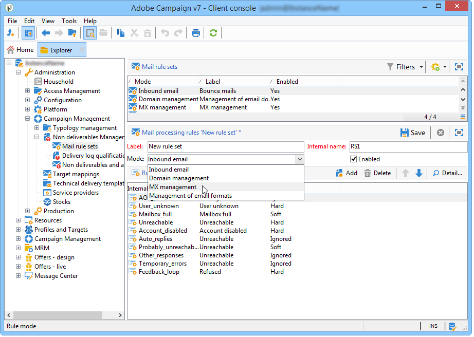

# 技術電子郵件設定{#email-deliverability}


## 概覽 {#overview}

以下章節概述傳送電子郵件時控制Adobe Campaign例項輸出所需的設定。

>[!NOTE]
>
>某些設定只能透過Adobe來執行，適用於由Adobe托管的部署，例如，存取伺服器和執行個體設定檔。 若要進一步了解不同部署，請參閱 [托管模型](../../installation/using/hosting-models.md) 區段或 [本頁](../../installation/using/capability-matrix.md).

如需與Adobe Campaign傳遞能力相關的概念和最佳實務，請參閱此 [節](../../delivery/using/about-deliverability.md).

如需深入了解什麼是傳遞能力，包括有關Adobe平台有效傳送和接收電子郵件的所有技術建議，請參閱 [Adobe傳遞能力最佳實務指南](https://experienceleague.adobe.com/docs/deliverability-learn/deliverability-best-practice-guide/introduction.html?lang=zh-Hant).

## 操作原則 {#operating-principle}

您可以控制一或多個Adobe Campaign例項的輸出，以根據網域限制傳送的電子郵件數量。 例如，您可以將輸出限制為每小時20,000 **yahoo.com** 位址，而為所有其他網域設定每小時100,000則訊息。

需要針對傳送伺服器使用的每個IP位址來控制訊息輸出(**mta**)。 數個 **mta** 劃分為數部電腦，且屬於各種Adobe Campaign例項，可共用相同的IP位址進行電子郵件傳送：需要設定程式來協調這些IP位址的使用。

這是 **stat** 模組會：它會針對一組IP地址將所有連接請求和郵件轉發到郵件伺服器。 統計伺服器可跟蹤傳送，並可根據設定的配額啟用或禁用發送。


* 統計伺服器(**stat**)連結至Adobe Campaign基底以載入其設定。
* 傳送伺服器(**mta**)使用UDP聯繫統計伺服器，該伺服器並不總是屬於自己的實例。

### 傳送伺服器 {#delivery-servers}

此 **mta** 模組將報文分發到 **mtachild** 子模組。 每個 **mtachild** 在向統計伺服器請求授權併發送之前準備消息。

步驟如下：

1. 此 **mta** 選擇合格的消息，並為其分配可用的消息 **mtachild**.
1. 此 **mtachild** 會載入建置訊息（內容、個人化元素、附件、影像等）所需的所有資訊 並將消息轉發到 **電子郵件流量整形器**.
1. 當電子郵件流量整形器收到統計伺服器的授權時(**smtpstat**)，則訊息會傳送給收件者。


### 電子郵件伺服器統計資料和限制 {#email-server-statistics-and-limitations}

統計伺服器為每個接收消息的電子郵件伺服器維護以下統計資訊：

* 開啟的時間點連接數，
* 最後一小時內發送的消息數，
* 成功/拒絕連接的速率，
* 與無法連線伺服器的連線率。

同時，模組會載入特定電子郵件伺服器的限制清單：

* 同時連接的最大數量，
* 每小時最大消息數，
* 每個連接的最大消息數。

### 管理IP位址 {#managing-ip-addresses}

統計伺服器可以組合具有相同公共IP地址的多個實例或多台電腦。 因此，它並未連結至特定例項，但必須連絡例項才能復原每個網域的限制。

會針對每個目標MX和每個來源IP保留傳送統計資料。 例如，如果目標網域有5個MX，而平台可以使用3個不同的IP位址，則伺服器可以管理此網域最多15個系列的指標。

源IP地址與公用IP地址匹配，即遠程電子郵件伺服器所看到的地址。 此IP地址可以與承載 **mta**，如果提供了NAT路由器。 這就是為什麼統計伺服器使用與公共IP匹配的標識符(**publicId**)。 本機位址與此識別碼之間的關聯會在 **serverConf.xml** 設定檔。 中所有可用的參數 **serverConf.xml** 列於此 [節](../../installation/using/the-server-configuration-file.md).

## 傳遞輸出控制 {#delivery-output-controlling}

若要傳送訊息至電子郵件伺服器， **電子郵件流量整形器** 元件從統計伺服器請求連接。 接受請求後，會開啟連線。

傳送訊息前，模組會向伺服器要求「Token」。 這些權杖通常至少是10個權杖的集合，可減少向伺服器的查詢數。

伺服器會儲存與連線和傳送相關的所有統計資料。 如果重新啟動，資訊會暫時丟失：每個客戶端都保留其發送統計資訊的本地副本，並定期（每2分鐘）將其返回到伺服器。 然後，伺服器可重新匯總資料。

以下各節將說明 **電子郵件流量整形器** 元件。

### 訊息傳送 {#message-delivery}

傳送訊息時，可能會有3個結果：

1. **成功**:已成功發送消息。 訊息已更新。
1. **消息失敗**:已聯繫的伺服器拒絕所選收件人的消息。 此結果與返回代碼550到599匹配，但可以定義例外。
1. **會話失敗** （5.11以上）:若 **mta** 收到此訊息的答案後，訊息會捨棄(請參閱 [消息放棄](#message-abandonment))。 訊息會傳送至其他路徑，如果沒有其他可用路徑，則設為「待定」(請參閱 [消息掛起](#message-pending))。

   >[!NOTE]
   >
   >A **路徑** 是Adobe Campaign **mta** 和目標 **mta**. Adobe Campaign **mta** 可以從多個起始IP和多個目標域IP中選擇。

### 消息放棄 {#message-abandonment}

放棄的訊息會傳回至 **mta** 和不再由管理 **mtachild**.

此 **mta** 決定此訊息的程式（恢復、放棄、隔離等） 視回應程式碼和規則而定。

### 消息掛起 {#message-pending}

當消息到達活動隊列且沒有可用路徑時，將會附加該消息。

在連接錯誤後，路徑通常被標籤為不可用於可變時間量。 不可用時間取決於錯誤的頻率和年齡。

## 統計伺服器配置 {#statistics-server-configuration}

統計伺服器可用於多個實例：它必須與將使用它的執行個體分開設定。

首先，定義將托管配置的Adobe Campaign資料庫。

### 啟動配置 {#start-configuration}

依預設， **stat** 模組會針對每個例項啟動。 當實例在同一台電腦上儲存，或當實例共用相同的IP地址時，使用單個統計伺服器：其他人必須是殘疾人。

### 伺服器埠的定義 {#definition-of-the-server-port}

預設情況下，統計伺服器偵聽埠7777。 此埠可在 **serverConf.xml** 檔案。 中所有可用的參數 **serverConf.xml** 列於此 [節](../../installation/using/the-server-configuration-file.md).

```
<stat port="1234"/>
```

## MX配置 {#mx-configuration}

>[!IMPORTANT]
>
>若為托管或混合安裝，若您已升級至 [增強的MTA](../../delivery/using/sending-with-enhanced-mta.md), **[!UICONTROL MX management]** 不再使用傳送輸送量規則。 Enhanced MTA使用其專屬的MX規則，可讓它根據您過去的電子郵件信譽，以及您傳送電子郵件之網域所提供的即時意見，依網域自訂您的輸送量。

### 關於MX規則 {#about-mx-rules}

>[!NOTE]
>
>本節及以下各節僅適用於使用舊版Campaign MTA的內部部署安裝和托管/混合安裝。

MX規則(Mail eXchanger)是管理發送伺服器與接收伺服器之間通信的規則。

這些規則會在每天早上6:00（伺服器時間）自動重新載入，以定期提供用戶端例項。

ISP將接受每小時預定義的連接和消息數量，具體取決於物料容量和內部策略。 ISP系統可根據IP和發送域的信譽自動修改這些變數。 Adobe Campaign透過其傳遞平台，透過ISP管理超過150個特定規則，以及其他網域的一個一般規則。

連線數上限不完全取決於MTA使用的公用IP位址數量。

例如，如果您在MX規則中允許5個連線，並且您配置了2個公用IP，則您可能認為不能同時開啟超過10個連線到此域。 這不是真的，事實上，最大連線數是指路徑和路徑，這是我們其中一個MTA公用IP和用戶端MTA的公用IP的組合。

在以下範例中，使用者已設定兩個公用IP位址，且網域為yahoo.com。

```
user:~ user$ host -t mx yahoo.com
                yahoo.com mail is handled by 1 mta5.am0.yahoodns.net.
                yahoo.com mail is handled by 1 mta6.am0.yahoodns.net.
                yahoo.com mail is handled by 1 mta7.am0.yahoodns.net.
```

yahoo.com的MX記錄告訴我們yahoo.com有3個Mail Rexcenters。 要連接對等郵件交換器，MTA將從DNS請求其IP地址。

```
user:~ user$ host -t a mta5.am0.yahoodns.net
                mta5.am0.yahoodns.net has address 98.136.216.26
                mta5.am0.yahoodns.net has address 98.136.217.202
                mta5.am0.yahoodns.net has address 98.138.112.38
                mta5.am0.yahoodns.net has address 66.196.118.37
                mta5.am0.yahoodns.net has address 63.250.192.46
                mta5.am0.yahoodns.net has address 66.196.118.240
                mta5.am0.yahoodns.net has address 98.136.217.203
                mta5.am0.yahoodns.net has address 98.138.112.35
```

對於此記錄，用戶可以聯繫8個對等IP地址。 由於使用者有2個公用IP位址，因此可提供8 * 2 = 16個組合，以連線至yahoo.com郵件伺服器。 這些組合中的每一個都稱為路徑。

第二個MX記錄顯示為：

```
user:~ user$ host -t a mta6.am0.yahoodns.net
                mta6.am0.yahoodns.net has address 98.138.112.38
                mta6.am0.yahoodns.net has address 98.136.216.26
                mta6.am0.yahoodns.net has address 63.250.192.46
                mta6.am0.yahoodns.net has address 66.196.118.35
                mta6.am0.yahoodns.net has address 98.136.217.203
                mta6.am0.yahoodns.net has address 98.138.112.32
                mta6.am0.yahoodns.net has address 98.138.112.37
                mta6.am0.yahoodns.net has address 66.196.118.33
```

其中4個IP位址已用於mta5（98.136.216.26、98.138.112.38、63.250.192.46和98.136.217.203）。 此記錄可讓使用者使用4個新IP位址。 第三條MX記錄也會這樣做。

總共有16個遠端IP位址。 與我們的2個本機公用IP結合，我們有32個路徑可連線至yahoo.com郵件伺服器。

>[!NOTE]
>
>如果2個MX記錄引用的是相同的IP地址，則此IP地址將計為一條路徑，而非兩條路徑。

以下是使用MX規則的一些範例：


在以下範例中，使用者對特定網域每小時有10,000則訊息的限制，但MTA吞吐量容量高於此限制。

在此情況下，流量會分為12個時段，每小時5分鐘，而實際限制是每個時段833則訊息。

這些訊息會盡快傳送。


### 配置MX管理 {#configuring-mx-management}

MX須遵守的規則定義於 **[!UICONTROL MX management]** 檔案 **[!UICONTROL Administration > Campaign Management > Non deliverables Management > Mail rule sets]** 樹的節點。

若 **[!UICONTROL MX management]** 節點中不存在文檔，您可以手動建立它。 操作步驟：

1. 建立一組新的郵件規則。
1. 選擇 **[!UICONTROL MX management]** 模式。

   

1. 輸入 **defaultMXRules** 在 **[!UICONTROL Internal name]** 欄位。

為了考慮更改，您需要重新啟動統計伺服器。

要重新載入配置而不重新啟動統計伺服器，請在承載伺服器的電腦上使用以下命令： `nlserver stat -reload`

>[!NOTE]
>
>此命令行比 **nlserver重新啟動**. 它防止在重新啟動丟失之前收集的統計資訊，並避免使用中的高峰，這些高峰可能會違反MX規則中定義的配額。

### 配置MX規則 {#configuring-mx-rules}

此 **[!UICONTROL MX management]** 文檔列出連結到MX規則的所有域。

這些規則會依序套用：應用其MX掩碼與目標MX相容的第一個規則。

每個規則可用的下列參數為：

* **[!UICONTROL MX mask]**:套用規則的網域。 每個規則都定義MX的地址掩碼。 因此，任何名稱與此掩碼匹配的MX都符合條件。 遮罩可包含「&#42;&quot;和&quot;?&quot; 一般字元。

   例如，以下地址：

   * a.mx.yahoo.com
   * b.mx.yahoo.com
   * c.mx.yahoo.com

   與下列遮罩相容：

   * &#42;.yahoo.com
   * ?.mx.yahoo.com

   例如，對於電子郵件地址foobar@gmail.com，網域為gmail.com，而MX記錄為：

   ```
   gmail.com mail exchanger = 20 alt2.gmail-smtp-in.l.google.com.
   gmail.com mail exchanger = 10 alt1.gmail-smtp-in.l.google.com.
   gmail.com mail exchanger = 40 alt4.gmail-smtp-in.l.google.com.
   gmail.com mail exchanger = 5  gmail-smtp-in.l.google.com.
   gmail.com mail exchanger = 30 alt3.gmail-smtp-in.l.google.com.
   ```

   在此例中，MX規則 `*.google.com` 中指定的規則。 如您所見，MX規則遮罩不一定符合郵件中的網域。 套用至gmail.com電子郵件地址的MX規則，將是含有遮罩的規則 `*.google.com`.

* **[!UICONTROL Range of identifiers]**:此選項可讓您指出套用規則的識別碼範圍(publicID)。 您可以指定：

   * 數字：規則只適用於此publicId,
   * 數字範圍(**number1-number2**):此規則將套用至這兩個數字之間的所有publicId。

   >[!NOTE]
   >
   >如果欄位空白，則規則會套用至所有識別碼。

   公用ID是一或多個MTA所使用之公用IP的內部識別碼。 這些ID會定義於 **config-instance.xml** 檔案。

   

* **[!UICONTROL Shared]**:定義此MX規則的屬性範圍。 若勾選此選項，所有參數都會在執行個體上所有可用的IP上共用。 取消勾選後，會為每個IP定義MX規則。 最大消息數乘以可用IP數。
* **[!UICONTROL Maximum number of connections]**:與發件人網域同時連線的最大數量。
* **[!UICONTROL Maximum number of messages]**:可在連接上發送的最大消息數。 當消息超過此數時，將關閉連接並開啟新連接。
* **[!UICONTROL Messages per hour]**:一小時內可發送到發件人域的最大郵件數。
* **[!UICONTROL Connection time out]**:連接到域的時間閾值。

   >[!NOTE]
   >
   >Windows可以發出 **逾時** 在此閾值之前，這取決於您的Windows版本。

* **[!UICONTROL Timeout Data]**:發送郵件內容（SMTP協定的DATA部分）後的最大等待時間。
* **[!UICONTROL Timeout]**:與SMTP伺服器進行其他交換的最長等待時間。
* **[!UICONTROL TLS]**:可讓您加密電子郵件傳送的TLS通訊協定可選擇性地啟用。 對於每個MX掩碼，可使用以下選項：

   * **[!UICONTROL Default configuration]**:這是在套用的serverConf.xml設定檔案中指定的一般設定。

      >[!IMPORTANT]
      >
      >不建議修改預設配置。

   * **[!UICONTROL Disabled]** :系統地發送消息，無需加密。
   * **[!UICONTROL Opportunistic]** :如果接收伺服器(SMTP)可以產生TLS通訊協定，則會加密訊息傳送。

配置示例：


>[!NOTE]
>
>有關將MX伺服器與Adobe Campaign搭配使用的詳細資訊，請參見 [本節](../../installation/using/using-mx-servers.md).

### 管理電子郵件格式 {#managing-email-formats}

您可以定義已傳送訊息的格式，讓顯示的內容能根據每個收件者位址的網域自動調整。

若要這麼做，請前往 **[!UICONTROL Management of email formats]** 文檔，位於 **[!UICONTROL Administration]** > **[!UICONTROL Campaign management]** > **[!UICONTROL Non deliverables management]** > **[!UICONTROL Mail rule sets]**.

本檔案包含與Adobe Campaign管理的日文格式對應的所有預先定義網域清單。 如需詳細資訊，請參閱 [此文檔](../../delivery/using/defining-the-email-content.md#sending-emails-on-japanese-mobiles).


此 **MIME結構** （多功能網際網路郵件延伸模組）參數可讓您定義要傳送至不同郵件用戶端的郵件結構。 有三種可用選項：

* **多部分**:訊息會以文字或HTML格式傳送。 如果不接受HTML格式，訊息仍能以文字格式顯示。

   依預設，多部分結構為 **多重部分/替代**，但會自動變成 **多部分/相關** 影像新增至訊息時。 某些提供者預期 **多部分/相關** 預設格式， **[!UICONTROL Force multipart/related]** 選項會實施此格式，即使未附加影像亦然。

* **HTML**:僅傳送HTML訊息。 如果不接受HTML格式，則不會顯示訊息。
* **文字**:只會傳送文字格式的訊息。 文本格式消息的優點是其大小非常小。

若 **[!UICONTROL Image inclusion]** 選項，這些選項會直接顯示在電子郵件的內文中。 接著會上傳影像，而URL連結將會被其內容取代。

此選項在日本市場中特別用於 **裝飾郵件**, **Decore Mail** 或 **裝飾郵件**. 如需詳細資訊，請參閱 [此文檔](../../delivery/using/defining-the-email-content.md#sending-emails-on-japanese-mobiles).

>[!IMPORTANT]
>
>在電子郵件中插入影像會大幅增加其大小。

## 傳送伺服器設定 {#delivery-server-configuration}

### 時鐘同步 {#clock-synchronization}

組成Adobe Campaign平台（包括資料庫）的所有伺服器的時鐘必須同步，且其系統設定為相同時區。

### 統計伺服器的坐標 {#coordinates-of-the-statistics-server}

統計伺服器的地址必須在 **mta**.

此 **statServerAddress** 屬性 **mta** 配置的元素可讓您指定要使用的埠的地址和編號。

```
<mta statServerAddress="emailStatServer:7777">
   [...]
 </mta>
```

要在同一台電腦上使用統計伺服器，您至少必須使用 **localhost** 值：

```
 <mta statServerAddress="localhost">
```

>[!IMPORTANT]
>
>若未填入此欄位，則 **mta** 不會開始。

### 要使用的IP位址清單 {#list-of-ip-addresses-to-use}

有關流量管理的設定位於 **mta/child/smtp** 元素。

針對每個 **IPAffinity** 元素，您需要聲明可用於電腦的IP地址。

範例:

```
<IPAffinity localDomain="<domain>" name="default">
  <IP address="192.168.0.11" publicId="1" weight="5"/>
  <IP address="192.168.0.12" heloHost="revdns1.campaign.com" publicId="2" weight="5"/>
  <IP address="192.168.0.13" publicId="3" weight="1"/>
</IPAffinity>
```

參數如下：

* **地址**:這是要使用的MTA主機的IP地址。
* **heloHost**:此標識符表示SMTP伺服器將看到的IP地址。

* **publicId**:若數個Adobe Campaign共用IP位址，此資訊就十分實用 **mta** 在NAT路由器後面。 統計伺服器使用該標識符來儲存該起始點和目標伺服器之間的連接併發送統計資訊。
* **權重**:可讓您定義地址的使用相對頻率。 預設情況下，所有地址的權重均等於1。

>[!NOTE]
>
>在serverConf.xml檔案中，您需要驗證一個IP是否對應至具有唯一識別碼(public_id)的單一主機。 無法將其對應至多個主機，這可能導致傳送限制問題。

在上例中，使用正常條件時，地址將按以下方式分配：

    * &quot;1&quot;: 5 / (5+5+1) = 45%
    * &quot;2&quot;: 5 / (5+5+1) = 45%
    * &quot;3&quot;: 1 / (5+5+1) = 10%

例如，如果不能將第一個地址用於指定MX，則消息將按如下方式發送：

    * &quot;2&quot;: 5 / (5+1) = 83%
    * &quot;3&quot;: 1 / (5+1) = 17%

* **includeDomains**:可讓您為屬於特定網域的電子郵件保留此IP位址。 這是可包含一或多個萬用字元(「&#42;&#39;)。 如果未指定屬性，則所有域都可以使用此IP地址。

   範例： **includeDomains=」wanadoo.com,orange.com,yahoo。&#42;&quot;**

* **excludeDomains**:不包括此IP位址的網域清單。 此篩選會在 **includeDomains** 篩選。

   

## 電子郵件傳送最佳化 {#email-sending-optimization}

Adobe Campaign的內部架構 **mta** 會影響最佳化電子郵件傳送的設定。 以下提供改善傳遞的一些秘訣。

### 調整maxWaitingMessages參數 {#adjust-the-maxwaitingmessages-parameter}

此 **maxWaitingMessages** 參數會指出預先準備的訊息數量最高 **mtachild**. 只有在發送或放棄郵件後，才會從此清單中刪除這些郵件。

如果未依網域排序訊息，此參數非常重要，尤其重要。

一旦 **maxWorkingSetMb** (256)達到臨界值，傳遞伺服器會停止傳送訊息。 效能會大幅下降，直到 **mtachild** 重新開始。 若要避免此問題，您可以提高 **maxWorkingSetMb** 參數，或降低 **maxWaitingMessages** 參數。

此 **maxWorkingSetMb** 參數是經驗計算的，方法是將最大消息數乘以平均消息大小，然後將結果乘以2.5。例如，如果消息的平均大小為50 kB，而 **maxWaitingMessages** 參數等於1,000，所用記憶體將平均為125 MB。

### 調整母體欄位數 {#adjust-the-number-of-mtachild}

子代數不應超過機器中的處理器數(約 1000屆)。 建議您不要超過8 **mtachild**. 然後，您可以增加每個 **子項** (**maxMsgPerChild**)，以達到足夠的壽命。
