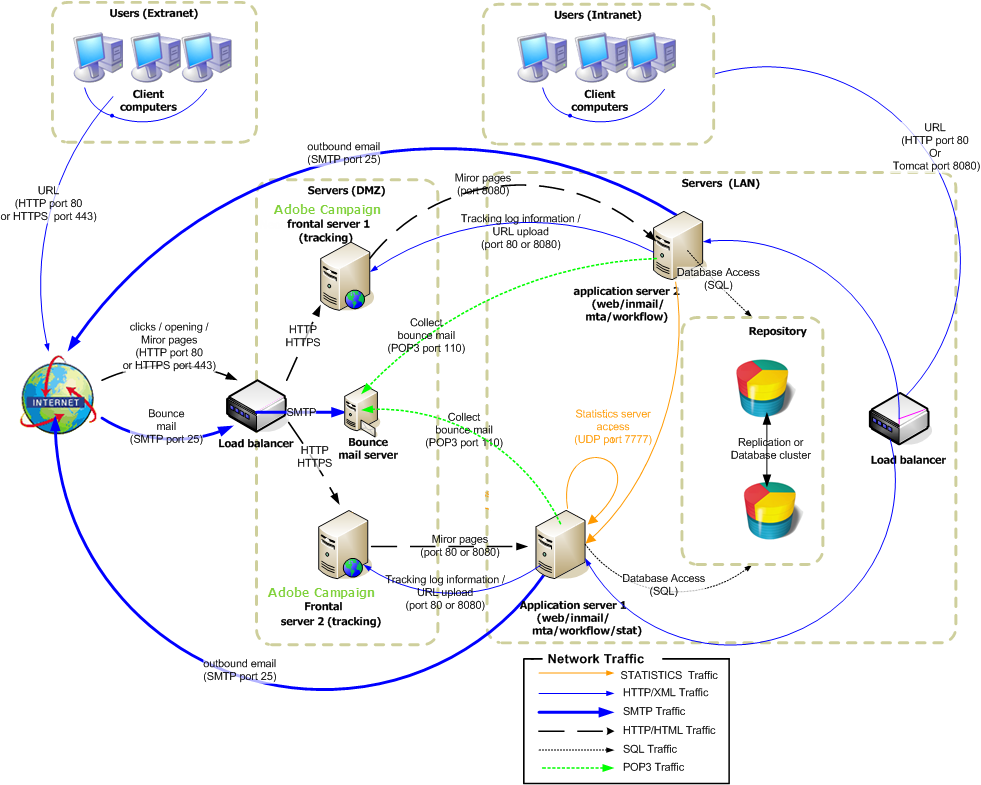

# 企業部署{#enterprise-deployment}


這是最完整的設定。 它以標準組態為基礎，提供更優異的安全性與可用性：

* 專用重新導向伺服器位於HTTP或TCP負載平衡器之後，以利擴充性與可用性，
* 兩個應用程式伺服器，可改善傳輸量和容錯移轉能力（容錯能力），且隔離在LAN中。

伺服器與處理序之間的一般通訊會根據以下結構描述執行：



使用這種型別的設定，透過適當的頻寬和調整，每小時的預期處理量可能會超過100,000封郵件。

## 功能 {#features}

### 優點 {#advantages}

* 最佳化安全性：只有需要對外公開的伺服器才會安裝在DMZ的電腦上。
* 高可用性更容易確保：只有從外部可見的電腦才需要以高可用性來管理。

### 缺點 {#disadvantages}

硬體與管理成本較高。

### 建議的裝置 {#recommended-equipment}

* 應用程式伺服器：2 Ghz四核心CPU、4 GB RAM、軟體RAID 1 80 GB SATA硬碟。
* 重新導向伺服器：2 Ghz四核心CPU、4 GB RAM、軟體RAID 1 80 GB SATA硬碟。

>[!NOTE]
>
>對於流向重新導向伺服器的流量，可以重複使用現有的負載平衡器。

## 安裝和設定步驟 {#installation-and-configuration-steps}

### 先決條件 {#prerequisites}

* 兩個應用程式伺服器上的JDK、
* 位於兩個前端的網頁伺服器(IIS、Apache)，
* 存取兩個應用程式伺服器上的資料庫伺服器，
* 可透過POP3存取的彈回信箱，
* 在負載平衡器上建立兩個DNS別名：

   * 第一個公開給大眾用於追蹤和指向虛擬IP位址(VIP)上的負載平衡器，然後分發給兩個前端伺服器，
   * 第二個透過主控台公開給內部使用者以存取，並指向虛擬IP位址(VIP)上的負載平衡器，然後將其分發給兩個應用程式伺服器。

* 防火牆已設定為開啟STMP (25)、DNS (53)、HTTP (80)、HTTPS (443)、SQL (1521 (Oracle)、5432 (PostgreSQL)等) 連線埠。 如需進一步資訊，請參閱區段[資料庫存取](../../installation/using/network-configuration.md#database-access)。

>[!CAUTION]
>
>如果您的應用程式伺服器指向單一資料庫執行個體，則在一個執行個體上匯入標準套件後，封裝中包含的結構描述不會載入另一個執行個體。
>  
>如果您的應用程式伺服器指向單一資料庫執行處理，則變更一個執行處理上的結構描述後，不會載入另一個執行處理上的結構描述。
>
>若要復原這些問題，您必須在發生錯誤的第二個執行個體上重新啟動&#39;web@default&#39;程式。

### 安裝和設定應用程式伺服器1 {#installing-and-configuring-the-application-server-1}

在下列範例中，例項的引數為：

* 執行個體的名稱：示範
* DNS遮罩： tracking.campaign.net&#42;， console.campaign.net&#42; （應用程式伺服器會處理使用者端主控台連線和報告，以及映象頁面和取消訂閱頁面的URL）
* 語言：英文
* 資料庫： campaign：demo@dbsrv

安裝第一台伺服器的步驟如下：

1. 請依照Adobe Campaign伺服器的安裝程式進行：在Linux上執行&#x200B;**nlserver**&#x200B;封裝，或在Windows上執行&#x200B;**setup.exe**。

   如需詳細資訊，請參閱[在Linux安裝Campaign的必要條件](../../installation/using/prerequisites-of-campaign-installation-in-linux.md) (Linux)以及[在Windows](../../installation/using/prerequisites-of-campaign-installation-in-windows.md) (Windows)安裝Campaign的必要條件。

1. 安裝Adobe Campaign伺服器後，請使用命令&#x200B;**nlserver web -tomcat**&#x200B;啟動應用程式伺服器(Web) （Web模組可讓您以獨立Web伺服器模式啟動Tomcat，接聽連線埠8080），並確定Tomcat正確啟動：

   ```sql
   12:08:18 >   Application server for Adobe Campaign Classic (7.X YY.R build XXX@SHA1) of DD/MM/YYYY
   12:08:18 >   Starting Web server module (pid=28505, tid=-1225184768)...
   12:08:18 >   Tomcat started
   12:08:18 >   Server started
   ```


   >[!NOTE]
   >
   >第一次執行Web模組時，會在安裝資料夾下的&#x200B;**conf**&#x200B;目錄中建立&#x200B;**config-default.xml**&#x200B;和&#x200B;**serverConf.xml**&#x200B;檔案。 **serverConf.xml**&#x200B;中可用的所有引數都列在此[區段](../../installation/using/the-server-configuration-file.md)中。

   按&#x200B;**Ctrl+C**&#x200B;以停止伺服器。

   如需詳細資訊，請參閱下列章節：

   * 針對Linux： [伺服器的首次啟動](../../installation/using/installing-packages-with-linux.md#first-start-up-of-the-server)
   * 針對Windows： [伺服器的首次啟動](../../installation/using/installing-the-server.md#first-start-up-of-the-server)

1. 使用下列命令變更&#x200B;**內部**&#x200B;密碼：

   ```
   nlserver config -internalpassword
   ```

   如需詳細資訊，請參閱[本章節](../../installation/using/configuring-campaign-server.md#internal-identifier)。

1. 使用DNS遮罩建立&#x200B;**demo**&#x200B;執行個體，以追蹤（在此例中為&#x200B;**tracking.campaign.net**）和存取使用者端主控台（在此例中為&#x200B;**console.campaign.net**）。 有兩種方法可以達成此目的：

   * 透過主控台建立執行個體：

     

     如需詳細資訊，請參閱[建立執行個體並登入](../../installation/using/creating-an-instance-and-logging-on.md)。

     或

   * 使用命令列建立例證：

     ```
     nlserver config -addinstance:demo/tracking.campaign.net*,console.campaign.net*
     ```

     如需詳細資訊，請參閱[建立執行個體](../../installation/using/command-lines.md#creating-an-instance)。

1. 編輯&#x200B;**config-demo.xml**&#x200B;檔案（透過先前的命令建立且位於&#x200B;**config-default.xml**&#x200B;檔案旁），檢查&#x200B;**mta** （傳遞）、**wfserver** （工作流程）、**inMail** （復原郵件）和&#x200B;**stat** （統計資料）處理程式是否已啟用，然後設定&#x200B;**應用程式**&#x200B;統計伺服器的位址：

   ```xml
   <?xml version='1.0'?>
   <serverconf>  
     <shared>    
       <!-- add lang="eng" to dataStore to force English for the instance -->    
       <dataStore hosts="tracking.campaign.net*,console.campaign.net*">      
         <mapping logical="*" physical="default"/>    
       </dataStore>  </shared>  
       <mta autoStart="true" statServerAddress="app">
       <wfserver autoStart="true"/>  
       <inMail autoStart="true"/>  
       <sms autoStart="false"/>  
       <listProtect autoStart="false"/>
   </serverconf>
   ```

   如需詳細資訊，請參閱[本章節](../../installation/using/configuring-campaign-server.md#enabling-processes)。

1. 編輯&#x200B;**serverConf.xml**&#x200B;檔案並指定傳遞網域，然後指定MTA模組用於回應MX型別DNS查詢之DNS伺服器的IP （或主機）位址。

   ```xml
   <dnsConfig localDomain="campaign.com" nameServers="192.0.0.1, 192.0.0.2"/>
   ```

   >[!NOTE]
   >
   >**nameServers**&#x200B;引數僅用於Windows。

   如需詳細資訊，請參閱[Campaign伺服器組態](../../installation/using/configuring-campaign-server.md)。

1. 將使用者端主控台安裝程式&#x200B;**setup-client-7.XX**、**YYYY.exe**&#x200B;複製到&#x200B;**/datakit/nl/eng/jsp**&#x200B;資料夾。 [了解更多](../../installation/using/client-console-availability-for-windows.md)。

1. 啟動Adobe Campaign伺服器(**net start nlserver6** （在Windows中），**/etc/init.d/nlserver6 start** （在Linux中）)，然後再次執行命令&#x200B;**nlserver pdump**&#x200B;以檢查所有啟用的模組是否存在。

   >[!NOTE]
   >
   >從20.1開始，我們建議改用以下命令（適用於Linux）： **systemctl start nlserver**


   ```sql
   12:09:54 >   Application server for Adobe Campaign Classic (7.X YY.R build XXX@SHA1) of DD/MM/YYYY
   syslogd@default (7611) - 9.2 MB
   stat@demo (5988) - 1.5 MB
   inMail@demo (7830) - 11.9 MB
   watchdog (27369) - 3.1 MB
   mta@demo (7831) - 15.6 MB
   wfserver@demo (7832) - 11.5 MB
   web@default (28671) - 40.5 MB
   ```

   此命令也可讓您知道電腦上安裝的Adobe Campaign伺服器的版本和版本編號。

1. 使用URL測試&#x200B;**nlserver web**&#x200B;模組： [https://console.campaign.net/nl/jsp/logon.jsp](https://tracking.campaign.net/r/test)。

   此URL可讓您存取使用者端安裝程式的下載頁面。 [了解更多](../../installation/using/client-console-availability-for-windows.md)。

   進入存取控制頁面時，請輸入&#x200B;**內部**&#x200B;登入及相關密碼。

   

### 安裝和設定應用程式伺服器2 {#installing-and-configuring-the-application-server-2}

應用以下步驟：

1. 安裝Adobe Campaign伺服器。
1. 將您建立的執行處理檔案複製到應用程式伺服器1。

   我們保留與應用程式伺服器1相同的執行個體名稱。

1. 將&#x200B;**internal**&#x200B;變更為與應用程式伺服器1相同。
1. 將資料庫連結至執行處理：

   ```
   nlserver config -setdblogin:PostgreSQL:campaign:demo@dbsrv -instance:demo
   ```

1. 編輯&#x200B;**config-demo.xml**&#x200B;檔案（透過先前的命令建立且位於&#x200B;**config-default.xml**&#x200B;檔案旁），檢查&#x200B;**mta** （傳遞）、**wfserver** （工作流程）、**inMail** （復原郵件）和&#x200B;**stat** （統計資料）處理程式是否已啟用，然後設定&#x200B;**應用程式**&#x200B;統計伺服器的位址：

   ```xml
   <?xml version='1.0'?>
   <serverconf>  
     <shared>    
       <!-- add lang="eng" to dataStore to force English for the instance -->    
       <dataStore hosts="tracking.campaign.net*,console.campaign.net*">      
         <mapping logical="*" physical="default"/>    
       </dataStore>  </shared>  
       <mta autoStart="true" statServerAddress="app">
       <wfserver autoStart="true"/>  
       <inMail autoStart="true"/>  
       <sms autoStart="false"/>  
       <listProtect autoStart="false"/>
   </serverconf>
   ```

   如需詳細資訊，請參閱[本章節](../../installation/using/configuring-campaign-server.md#enabling-processes)。

1. 編輯&#x200B;**serverConf.xml**&#x200B;檔案並填入MTA模組的DNS設定：

   ```xml
   <dnsConfig localDomain="campaign.com" nameServers="192.0.0.1, 192.0.0.2"/>
   ```

   >[!NOTE]
   >
   >**nameServers**&#x200B;引數僅用於Windows。

   如需詳細資訊，請參閱[Campaign伺服器組態](../../installation/using/configuring-campaign-server.md)。

1. 啟動Adobe Campaign伺服器。

   如需詳細資訊，請參閱下列章節：

   * 針對Linux： [伺服器的首次啟動](../../installation/using/installing-packages-with-linux.md#first-start-up-of-the-server)
   * 針對Windows： [伺服器的首次啟動](../../installation/using/installing-the-server.md#first-start-up-of-the-server)

### 安裝和設定前端伺服器 {#installing-and-configuring-the-frontal-servers}

兩部電腦上的安裝和設定程式相同。

步驟如下：

1. 安裝Adobe Campaign伺服器，
1. 請遵循以下各節所述的Web伺服器整合程式(IIS、Apache)：

   * 針對Linux： [整合至Linux網頁伺服器](../../installation/using/integration-into-a-web-server-for-linux.md)，
   * 針對Windows： [整合至Windows的Web伺服器](../../installation/using/integration-into-a-web-server-for-windows.md)。

1. 複製安裝期間建立的&#x200B;**config-demo.xml**&#x200B;和&#x200B;**serverConf.xml**&#x200B;檔案。 在&#x200B;**config-demo.xml**&#x200B;檔案中，啟用&#x200B;**trackinglogd**&#x200B;處理序並停用&#x200B;**mta**、**inmail**、**wfserver**&#x200B;和&#x200B;**stat**&#x200B;處理序。
1. 編輯&#x200B;**serverConf.xml**&#x200B;檔案，並在重新導向的引數中填入多餘的追蹤伺服器：

   ```xml
   <spareServer enabledIf="$(hostname)!='front_srv1'" id="1" url="https://front_srv1:8080"/>
   <spareServer enabledIf="$(hostname)!='front_srv2'" id="2" url="https://front_srv2:8080"/>
   ```

1. 啟動網站並從URL測試重新導向： [https://tracking.campaign.net/r/test](https://tracking.campaign.net/r/test)

   瀏覽器應顯示以下訊息（視負載平衡器重新導向的URL而定）：

   ```xml
   <redir status="OK" date="AAAA/MM/JJ HH:MM:SS" build="XXXX" host="tracking.campaign.net" localHost="front_srv1"/>
   ```

   或

   ```xml
   <redir status="OK" date="AAAA/MM/JJ HH:MM:SS" build="XXXX" host="tracking.campaign.net" localHost="front_srv2"/>
   ```

   如需詳細資訊，請參閱下列章節：

   * 針對Linux： [正在啟動Web伺服器並測試組態](../../installation/using/integration-into-a-web-server-for-linux.md#launching-the-web-server-and-testing-the-configuration)，
   * 針對Windows： [正在啟動Web伺服器並測試組態](../../installation/using/integration-into-a-web-server-for-windows.md#launching-the-web-server-and-testing-the-configuration)。

1. 啟動Adobe Campaign伺服器。
