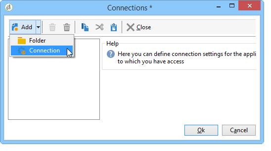

# 企業部署{#enterprise-deployment}

這是最完整的配置。 它以標準配置為基礎，以提高安全性和可用性：

* 在HTTP或TCP負載平衡器後面提供專用的重新導向伺服器，以提升可擴充性和可用性，
* 兩台應用程式伺服器，用於提高吞吐量和故障轉移能力（容錯），它們在LAN中隔離。

伺服器和進程之間的通用通信根據以下方案進行：


通過這種配置，在適當的頻寬和調整下，預期的吞吐量可以超過每小時100,000封郵件。

## 功能{#features}

### 優勢{#advantages}

* 最佳化安全性：只有需要暴露在外部的伺服器才安裝在DMZ的電腦上。
* 高可用性更容易確保：只有從外部看到的電腦才需要考慮高可用性。

### 缺點{#disadvantages}

硬體和管理成本提高。

### 建議的設備{#recommended-equipment}

* 應用程式伺服器：2 Ghz四核CPU,4 GB RAM，軟體RAID 1 80 GB SATA硬碟。
* 重定向伺服器：2 Ghz四核CPU,4 GB RAM，軟體RAID 1 80 GB SATA硬碟。

>[!NOTE]
>
>可以重複使用現有的負載平衡器來向重定向伺服器發送流量。

## 安裝和配置步驟{#installation-and-configuration-steps}

### 必要條件 {#prerequisites}

* JDK在兩個應用程式伺服器上，
* Web伺服器(IIS、Apache)。
* 訪問兩個應用程式伺服器上的資料庫伺服器，
* 可通過POP3訪問的彈回郵箱，
* 在負載平衡器上建立兩個DNS別名：

   * 首先暴露在公眾面前，用於跟蹤並指向虛擬IP地址(VIP)上的負載平衡器，然後分配給兩個前端伺服器，
   * 第二個暴露給內部用戶，以便通過控制台訪問，並指向虛擬IP地址(VIP)上的負載平衡器，然後該負載平衡器被分發到兩個應用程式伺服器。

* 防火牆配置為開啟STMP(25)、DNS(53)、HTTP(80)、HTTPS(443)、SQL(1521 forOracle、5432 for PostgreSQL等) 埠。 有關詳細資訊，請參閱[Database access](../../installation/using/network-configuration.md#database-access)一節。

>[!CAUTION]
>
>如果應用程式伺服器指向單個資料庫實例，則在將標準包導入一個實例後，該包中包含的模式不會載入到另一個實例。
>  
>如果應用程式伺服器指向單個資料庫實例，則在更改一個實例上的模式後，該模式不會載入到另一個實例上。
>
>要恢復這些問題，您需要在第二個發生錯誤的實例上重新啟動「web@default」進程。

### 安裝和配置應用程式伺服器1 {#installing-and-configuring-the-application-server-1}

在以下示例中，實例的參數為：

* 實例的名稱：展示
* DNS掩碼：tracking.campaign.net*, console.campaign.net*（應用程式伺服器會處理用戶端主控台連線和報表的URL，以及鏡像頁面和取消訂閱頁面）
* 語言：英文
* 資料庫：促銷活動：demo@dbsrv

安裝第一台伺服器的步驟如下：

1. 按照Adobe Campaign伺服器的安裝過程操作：**nlserver**&#x200B;套件（在Linux上）或&#x200B;**setup.exe**（在Windows上）。

   有關詳細資訊，請參閱[Linux中促銷活動安裝的先決條件(Linux)和[Windows中促銷活動安裝的先決條件(Windows)。](../../installation/using/prerequisites-of-campaign-installation-in-linux.md)](../../installation/using/prerequisites-of-campaign-installation-in-windows.md)

1. 安裝Adobe Campaign伺服器後，使用命令&#x200B;**nlserver web -tomcat**&#x200B;啟動應用程式伺服器(Web)（Web模組使您能夠在埠8080上的獨立Web伺服器模式偵聽中啟動Tomcat），並確保Tomcat正確啟動：

   ```
   12:08:18 >   Application server for Adobe Campaign Classic (7.X YY.R build XXX@SHA1) of DD/MM/YYYY
   12:08:18 >   Starting Web server module (pid=28505, tid=-1225184768)...
   12:08:18 >   Tomcat started
   12:08:18 >   Server started
   ```


   >[!NOTE]
   >
   >首次執行Web模組時，它會在安裝資料夾下的&#x200B;**conf**&#x200B;目錄下建立&#x200B;**config-default.xml**&#x200B;和&#x200B;**serverConf.xml**&#x200B;檔案。 **serverConf.xml**&#x200B;中的所有可用參數都列在[部分](../../installation/using/the-server-configuration-file.md)中。

   按&#x200B;**Ctrl+C**&#x200B;以停止伺服器。

   如需詳細資訊，請參閱下列章節：

   * 針對Linux:[伺服器的首次啟動](../../installation/using/installing-packages-with-linux.md#first-start-up-of-the-server)
   * 針對Windows:[伺服器的首次啟動](../../installation/using/installing-the-server.md#first-start-up-of-the-server)

1. 使用以下命令更改&#x200B;**internal**&#x200B;口令：

   ```
   nlserver config -internalpassword
   ```

   有關詳細資訊，請參閱[內部標識符](../../installation/using/campaign-server-configuration.md#internal-identifier)。

1. 使用DNS遮罩建立&#x200B;**demo**&#x200B;例項以進行追蹤（在本例中為&#x200B;**tracking.campaign.net**），並存取用戶端主控台（在本例中為&#x200B;**console.campaign.net**）。 有兩種方法可以做到：

   * 透過主控台建立執行個體：

      

      有關詳細資訊，請參閱[建立實例並登錄](../../installation/using/creating-an-instance-and-logging-on.md)。

      或

   * 使用命令行建立實例：

      ```
      nlserver config -addinstance:demo/tracking.campaign.net*,console.campaign.net*
      ```

      有關詳細資訊，請參閱[建立實例](../../installation/using/command-lines.md#creating-an-instance)。

1. 編輯&#x200B;**config-demo.xml**&#x200B;檔案（透過上一個命令建立，並位於&#x200B;**config-default.xml**&#x200B;檔案旁），檢查&#x200B;**mta**（傳送）、**wfserver**（工作流程）、**inMail**(r)電子郵件)和&#x200B;**stat**（統計）進程被啟用，然後配置&#x200B;**app**&#x200B;統計伺服器的地址：

   ```
   <?xml version='1.0'?>
   <serverconf>  
     <shared>    
       <!-- add lang="eng" to dataStore to force English for the instance -->    
       <dataStore hosts="tracking.campaign.net*,console.campaign.net*">      
         <mapping logical="*" physical="default"/>    
       </dataStore>  </shared>  
       <mta autoStart="true" statServerAddress="app">
       <wfserver autoStart="true"/>  
       <inMail autoStart="true"/>  
       <sms autoStart="false"/>  
       <listProtect autoStart="false"/>
   </serverconf>
   ```

   有關詳細資訊，請參閱[啟用進程](../../installation/using/campaign-server-configuration.md#enabling-processes)。

1. 編輯&#x200B;**serverConf.xml**&#x200B;檔案並指定傳送網域，然後指定MTA模組用來回答MX類型DNS查詢的DNS伺服器IP（或主機）位址。

   ```
   <dnsConfig localDomain="campaign.com" nameServers="192.0.0.1, 192.0.0.2"/>
   ```

   >[!NOTE]
   >
   >**nameServers**&#x200B;參數僅用於Windows。

   如需詳細資訊，請參閱[促銷活動伺服器組態](../../installation/using/campaign-server-configuration.md)。

1. 將用戶端主控台設定程式（v7或&#x200B;**setup-client-6.XX**,v6.1的&#x200B;**setup-client-7.XX**, **/datakit/>,**/datakit/）複製至&#x200B;**/nl/eng/jsp**&#x200B;資料夾。 ****[進一步瞭解](../../installation/using/client-console-availability-for-windows.md)。

1. 啟動Adobe Campaign伺服器(在Windows中&#x200B;**net start nlserver6**，在Linux中&#x200B;**/etc/init.d/nlserver6 start**)，並再次運行命令&#x200B;**nlserver pdump**&#x200B;以檢查是否存在所有已啟用的模組。

   >[!NOTE]
   >
   >從20.1開始，建議改用下列命令（適用於Linux）:**systemmctl start nlserver**


   ```
   12:09:54 >   Application server for Adobe Campaign Classic (7.X YY.R build XXX@SHA1) of DD/MM/YYYY
   syslogd@default (7611) - 9.2 MB
   stat@demo (5988) - 1.5 MB
   inMail@demo (7830) - 11.9 MB
   watchdog (27369) - 3.1 MB
   mta@demo (7831) - 15.6 MB
   wfserver@demo (7832) - 11.5 MB
   web@default (28671) - 40.5 MB
   ```

   此命令還可讓您瞭解安裝在電腦上的Adobe Campaign伺服器的版本和內部版本號。

1. 使用URL測試&#x200B;**nlserver web**&#x200B;模組：[https://console.campaign.net/nl/jsp/logon.jsp](https://tracking.campaign.net/r/test)。

   此URL可讓您存取用戶端設定程式的下載頁面。 [進一步瞭解](../../installation/using/client-console-availability-for-windows.md)。

   當您到達訪問控制頁時，輸入&#x200B;**internal**&#x200B;登錄和相關密碼。

   

### 安裝和配置應用程式伺服器2 {#installing-and-configuring-the-application-server-2}

應用以下步驟：

1. 安裝Adobe Campaign伺服器。
1. 將您建立之執行個體的檔案複製到應用程式伺服器1。

   我們會保留與應用程式伺服器1相同的例項名稱。

1. 將&#x200B;**internal**&#x200B;變更為與應用程式伺服器1相同。
1. 將資料庫連結到實例：

   ```
   nlserver config -setdblogin:PostgreSQL:campaign:demo@dbsrv -instance:demo
   ```

1. 編輯&#x200B;**config-demo.xml**&#x200B;檔案（透過上一個命令建立，並位於&#x200B;**config-default.xml**&#x200B;檔案旁），檢查&#x200B;**mta**（傳送）、**wfserver**（工作流程）、**inMail**(r)電子郵件)和&#x200B;**stat**（統計）進程被啟用，然後配置&#x200B;**app**&#x200B;統計伺服器的地址：

   ```
   <?xml version='1.0'?>
   <serverconf>  
     <shared>    
       <!-- add lang="eng" to dataStore to force English for the instance -->    
       <dataStore hosts="tracking.campaign.net*,console.campaign.net*">      
         <mapping logical="*" physical="default"/>    
       </dataStore>  </shared>  
       <mta autoStart="true" statServerAddress="app">
       <wfserver autoStart="true"/>  
       <inMail autoStart="true"/>  
       <sms autoStart="false"/>  
       <listProtect autoStart="false"/>
   </serverconf>
   ```

   有關詳細資訊，請參閱[啟用進程](../../installation/using/campaign-server-configuration.md#enabling-processes)。

1. 編輯&#x200B;**serverConf.xml**&#x200B;檔案並填充MTA模組的DNS配置：

   ```
   <dnsConfig localDomain="campaign.com" nameServers="192.0.0.1, 192.0.0.2"/>
   ```

   >[!NOTE]
   >
   >**nameServers**&#x200B;參數僅用於Windows。

   如需詳細資訊，請參閱[促銷活動伺服器組態](../../installation/using/campaign-server-configuration.md)。

1. 啟動Adobe Campaign伺服器。

   如需詳細資訊，請參閱下列章節：

   * 針對Linux:[伺服器的首次啟動](../../installation/using/installing-packages-with-linux.md#first-start-up-of-the-server)
   * 針對Windows:[伺服器的首次啟動](../../installation/using/installing-the-server.md#first-start-up-of-the-server)

### 安裝和配置前端伺服器{#installing-and-configuring-the-frontal-servers}

安裝和配置過程在兩台電腦上都相同。

步驟如下：

1. 安裝Adobe Campaign伺服器，
1. 符合下列章節所述的Web伺服器整合程式(IIS、Apache):

   * 針對Linux:[整合至Linux的Web伺服器，](../../installation/using/integration-into-a-web-server-for-linux.md)
   * 針對Windows:[整合至Windows適用的Web伺服器。](../../installation/using/integration-into-a-web-server-for-windows.md)

1. 複製在安裝期間建立的&#x200B;**config-demo.xml**&#x200B;和&#x200B;**serverConf.xml**&#x200B;檔案。 在&#x200B;**config-demo.xml**&#x200B;檔案中，啟動&#x200B;**trackinglogd**&#x200B;程式並停用&#x200B;**mta**、**inmail**、**wfserver**&#x200B;和&#x200B;**stat**&#x200B;程式。
1. 編輯&#x200B;**serverConf.xml**&#x200B;檔案，並在重新導向的參數中填入冗餘追蹤伺服器：

   ```
   <spareServer enabledIf="$(hostname)!='front_srv1'" id="1" url="https://front_srv1:8080"/>
   <spareServer enabledIf="$(hostname)!='front_srv2'" id="2" url="https://front_srv2:8080"/>
   ```

1. 啟動網站並測試從URL的重新導向：[https://tracking.campaign.net/r/test](https://tracking.campaign.net/r/test)

   瀏覽器應顯示下列訊息（視負載平衡器所重新導向的URL而定）:

   ```
   <redir status="OK" date="AAAA/MM/JJ HH:MM:SS" build="XXXX" host="tracking.campaign.net" localHost="front_srv1"/>
   ```

   或

   ```
   <redir status="OK" date="AAAA/MM/JJ HH:MM:SS" build="XXXX" host="tracking.campaign.net" localHost="front_srv2"/>
   ```

   如需詳細資訊，請參閱下列章節：

   * 針對Linux:[啟動Web伺服器並測試配置](../../installation/using/integration-into-a-web-server-for-linux.md#launching-the-web-server-and-testing-the-configuration),
   * 針對Windows:[啟動Web伺服器並測試配置](../../installation/using/integration-into-a-web-server-for-windows.md#launching-the-web-server-and-testing-the-configuration)。

1. 啟動Adobe Campaign伺服器。

