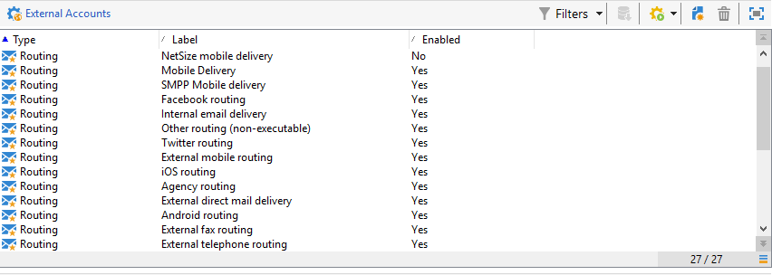
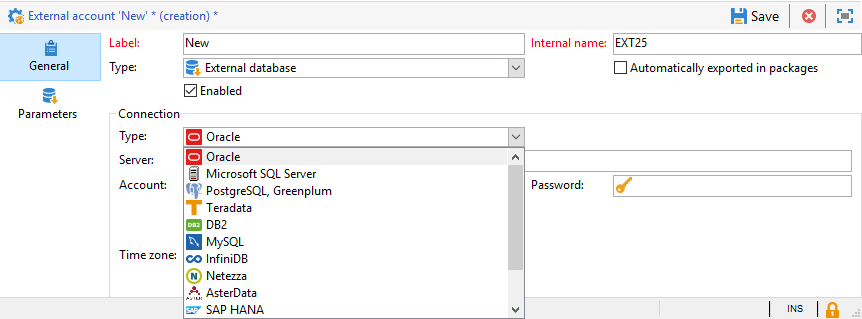

# 外部帳戶{#external-accounts}


Adobe Campaign 隨附一組預先定義的外部帳戶。若要設定與外部系統的連線，您可以建立新的外部帳戶。

技術流程（例如技術工作流程或宣傳工作流程）會使用外部帳戶。例如，在工作流程中或與任何其他應用程式(Adobe Target、Experience Manager等)進行資料交換時，您需要選取外部帳戶。

## 建立外部帳戶 {#creating-an-external-account}

若要建立新的外部帳戶，請遵循下列步驟。 詳細設定取決於外部帳戶的型別。

1. 從Campaign **[!UICONTROL Explorer]**，選取 **[!UICONTROL Administration]** &#39;>&#39; **[!UICONTROL Platform]** &#39;>&#39; **[!UICONTROL External accounts]**.

   

1. 按一下 **[!UICONTROL New]** 按鈕。

   

1. 輸入 **[!UICONTROL Label]** 和 **[!UICONTROL Internal Name]**.
1. 選取您的外部帳戶 **[!UICONTROL Type]** 您要建立哪一個。
1. 根據所選外部帳戶型別指定認證，以設定帳戶的存取權。

   所需資訊通常由您所連接的伺服器提供者提供。

1. 檢查 **[!UICONTROL Enabled]** 啟用連線的選項。
1. 按一下&#x200B;**[!UICONTROL Save]**。

外部帳戶已建立並新增至外部帳戶清單。

## 促銷活動特定外部帳戶

### 退回郵件 {#bounce-mails-external-account}

此 **退回郵件** 外部帳戶指定要用來連線至電子郵件服務的外部POP3帳戶。 如需此外部帳戶的詳細資訊，請參閱此 [頁面](../../workflow/using/inbound-emails.md).

所有設定為POP3存取的伺服器都可以用來接收回信。


若要設定 **[!UICONTROL Bounce mails (defaultPopAccount)]** 外部帳戶：

* **[!UICONTROL Server]**

   POP3伺服器的URL。

* **[!UICONTROL Port]**

   POP3連線連線埠號碼。 預設連線埠為110。

* **[!UICONTROL Account]**

   使用者名稱。

* **[!UICONTROL Password]**

   使用者帳戶密碼。

* **[!UICONTROL Encryption]**

   選擇的加密型別，介於 **[!UICONTROL By default]**， **[!UICONTROL POP3 + STARTTLS]**， **[!UICONTROL POP3]** 或 **[!UICONTROL POP3S]**.

* **[!UICONTROL Function]**

   傳入電子郵件或SOAP路由器

>[!IMPORTANT]
>
>使用Microsoft OAuth 2.0設定POP3外部帳戶之前，您必須先在Azure入口網站中註冊應用程式。 如需詳細資訊，請參閱[此頁面](https://docs.microsoft.com/en-us/azure/active-directory/develop/quickstart-register-app)。

若要使用設定POP3外部 **Microsoft OAuth 2.0**，檢查 **[!UICONTROL Microsoft OAuth 2.0]** 並填入下列欄位：

* **[!UICONTROL Azure tenant]**

   Azure ID (或目錄（租使用者） ID)可在以下位置找到： **Essentials** Azure入口網站中的應用程式概觀下拉式清單。

* **[!UICONTROL Azure Client ID]**

   使用者端ID (或應用程式（使用者端） ID)可在以下連結中找到： **Essentials** Azure入口網站中的應用程式概觀下拉式清單。

* **[!UICONTROL Azure Client secret]**

   使用者端密碼ID可在 **使用者端密碼** 欄來自 **憑證和密碼** Azure入口網站中的應用程式功能表。

* **[!UICONTROL Azure Redirect URL]**

   重新導向URL可在以下網址找到： **驗證** Azure入口網站中的應用程式功能表。 結尾應是下列語法 `nl/jsp/oauth.jsp`，例如 `https://redirect.adobe.net/nl/jsp/oauth.jsp`.

輸入不同的認證後，您可以按一下 **[!UICONTROL Setup the connection]** 以完成外部帳戶設定。

### 路由{#routing-external-account}

此 **[!UICONTROL Routing]** 外部帳戶可讓您根據安裝的套件，設定Adobe Campaign中可用的每個管道。



可設定下列通道：

* [電子郵件](../../installation/using/deploying-an-instance.md#email-channel-parameters)
* [行動裝置（簡訊）](../../delivery/using/sms-set-up.md#creating-an-smpp-external-account)
* [電話](../../delivery/using/steps-about-delivery-creation-steps.md#other-channels)
* [直接郵件](../../delivery/using/about-direct-mail-channel.md)
* [代理商](../../delivery/using/steps-about-delivery-creation-steps.md#other-channels)
* [Twitter](../../social/using/about-social-marketing.md)
* [iOS 管道](../../delivery/using/configuring-the-mobile-application.md)
* [Android 管道](../../delivery/using/configuring-the-mobile-application-android.md)

### 執行實例  {#execution-instance-external-account}

如果您有劃分的架構，則需要指定連結至控制執行個體的執行執行個體，並連線它們。 將異動訊息範本部署至執行例項


* **[!UICONTROL URL]**

   安裝執行例項的伺服器URL。

* **[!UICONTROL Account]**

   帳戶名稱，它必須符合操作員資料夾中定義的訊息中心代理程式。

* **[!UICONTROL Password]**

   運運算元資料夾中定義的帳戶密碼。

如需此設定的詳細資訊，請參閱此 [頁面](../../message-center/using/configuring-instances.md#control-instance).

## 存取外部系統外部帳戶

### FTP {#ftp-external-account}

FTP外部帳戶可讓您設定和測試對Adobe Campaign外部伺服器的存取權。 若要設定與外部系統（例如用於檔案傳輸的FTP伺服器898）的連線，您可以建立自己的外部帳戶。 如需關於此項目的詳細資訊，請參閱此[頁面](../../workflow/using/file-transfer.md)。

若要這麼做，請在此外部帳戶中指定用來建立與FTP伺服器連線的地址和認證


* **[!UICONTROL Server]**

   FTP伺服器的名稱。

* **[!UICONTROL Port]**

   FTP連線連線埠號碼。 預設連線埠為21。

* **[!UICONTROL Account]**

   使用者名稱。

* **[!UICONTROL Password]**

   使用者帳戶密碼。

* **[!UICONTROL Encryption]**

   選擇的加密型別，介於 **[!UICONTROL None]** 或 **[!UICONTROL SSL]**.

若要瞭解在何處找到這些認證，請參閱此 [頁面](https://help.dreamhost.com/hc/en-us/articles/115000675027-FTP-overview-and-credentials).

### SFTP {#sftp-external-account}

SFTP外部帳戶可讓您設定並測試對Adobe Campaign外部伺服器的存取權。 若要設定與外部系統（例如用於檔案傳輸的SFTP）的連線，您可以建立自己的外部帳戶。 如需關於此項目的詳細資訊，請參閱此[頁面](../../workflow/using/file-transfer.md)。


* **[!UICONTROL Server]**

   sftp伺服器的URL。

* **[!UICONTROL Port]**

   FTP連線連線埠號碼。 預設連線埠為22。

* **[!UICONTROL Account]**

   用來連線至SFTP伺服器的帳戶名稱。

* **[!UICONTROL Password]**

   用來連線至SFTP伺服器的密碼。

若要在Windows上新增SSH金鑰：

1. 建立 **首頁** 環境變數，其值設定為安裝目錄。

2. 將您的私密金鑰新增至 `/$HOME/.ssh/id_rsa` 資料夾。

3. 重新啟動Adobe Campaign服務。

### 外部資料庫(FDA) {#external-database-external-account}

使用 **外部資料庫** 輸入外部帳戶以連線到外部資料庫。 進一步瞭解中的同盟資料存取(FDA)選項 [本節](../../installation/using/about-fda.md).

與Campaign相容的外部資料庫列於 [相容性矩陣](../../rn/using/compatibility-matrix.md)



外部帳戶組態設定取決於資料庫引擎。 請在下列章節中進一步瞭解：

* 設定存取權至 [vertica analytics](../../installation/using/configure-fda-vertica.md)
* 設定存取權至 [Snowflake](../../installation/using/configure-fda-snowflake.md)
* 設定存取權至 [Google BigQuery](../../installation/using/configure-fda-google-big-query.md)
* 設定存取權至 [azure synapse](../../installation/using/configure-fda-synapse.md)
* 設定存取權至 [hadoop](../../installation/using/configure-fda-hadoop.md)
* 設定存取權至 [oracle](../../installation/using/configure-fda-oracle.md)
* 設定存取權至 [netezza](../../installation/using/configure-fda-netezza.md)
* 設定存取權至 [SAP HANA](../../installation/using/configure-fda-sap-hana.md)
* 設定存取權至 [Snowflake](../../installation/using/configure-fda-snowflake.md)
* 設定存取權至 [sybase IQ](../../installation/using/configure-fda-sybase.md)
* 設定存取權至 [teradata](../../installation/using/configure-fda-teradata.md)


## Adobe解決方案整合外部帳戶

### Adobe Experience Cloud {#adobe-experience-cloud-external-account}

若要使用Adobe ID連線至Adobe Campaign主控台，您必須設定 **[!UICONTROL Adobe Experience Cloud (MAC)]** 外部帳戶。


* **[!UICONTROL IMS server]**

   IMS伺服器的URL。 確定中繼和生產執行個體都指向相同的IMS生產端點。

* **[!UICONTROL IMS scope]**

   此處定義的範圍必須是IMS布建的範圍的子集。

* **[!UICONTROL IMS client identifier]**

   IMS使用者端的ID。

* **[!UICONTROL IMS client secret]**

   您的IMS使用者端密碼的認證。

* **[!UICONTROL Callback server]**

   存取Adobe Campaign執行個體的URL。

* **[!UICONTROL IMS organization ID]**

   您組織的ID。 若要尋找您的組織ID，請參閱 [此頁面](https://experienceleague.adobe.com/docs/core-services/interface/administration/organizations.html?lang=zh-Hant){_blank}。

* **[!UICONTROL Association mask]**

   語法可讓Enterprise Dashboard中的設定名稱與Adobe Campaign中的群組同步。

* **[!UICONTROL Server]**

   Adobe Experience Cloud執行個體的URL。

* **[!UICONTROL Tenant]**

   您的Adobe Experience Cloud租使用者的名稱。

如需此設定的詳細資訊，請參閱 [此頁面](../../integrations/using/configuring-ims.md).

## 網站分析 {#web-analytics-external-account}

此 **[!UICONTROL Web Analytics]** 外部帳戶可讓您以區段的形式將資料從Adobe Analytics轉送到Adobe Campaign。 相反地，它會將Adobe Campaign所傳送電子郵件行銷活動的指標和屬性傳送至Adobe Analytics聯結器。


對於此外部帳戶，必須擴充追蹤URL的計算公式，且必須核准兩個解決方案之間的連線。 如需關於此項目的詳細資訊，請參閱此[頁面](../../platform/using/adobe-analytics-connector.md#external-account-classic)。

### Adobe Experience Manager {#adobe-experience-manager-external-account}

此 **[!UICONTROL AEM (AEM instance)]** 外部帳戶可讓您直接在Adobe Experience Manager中管理電子郵件傳遞內容以及表單。


* **[!UICONTROL Server]**

   Adobe Experience Manager伺服器的URL。

* **[!UICONTROL Port]**

   用來連線至Adobe Experience Manager編寫執行個體的帳戶名稱。

* **[!UICONTROL Password]**

   用來連線至Adobe Experience Manager編寫執行個體的密碼。

如需詳細資訊，請參閱本[區段](../../integrations/using/about-adobe-experience-manager.md)。

## CRM聯結器外部帳戶

### Microsoft Dynamics CRM {#microsoft-dynamics-crm-external-account}

>[!NOTE]
>
> **[!UICONTROL On-premise]** 和 **[!UICONTROL Office 365]** 部署型別現已棄用。 [了解更多](../../rn/using/deprecated-features.md)。

此 **[!UICONTROL Microsoft Dynamics CRM]** 外部帳戶可讓您將Microsoft Dynamics資料匯入和匯出至Adobe Campaign。

在此瞭解更多關於Campaign - Microsoft Dynamics CRM聯結器 [頁面](../../platform/using/crm-ms-dynamics.md).

替換為 **[!UICONTROL Web API]** 部署型別和 **[!UICONTROL Password credentials]** 驗證，您需要提供下列詳細資料：


* **[!UICONTROL Account]**

   用來登入Microsoft CRM的帳戶。

* **[!UICONTROL Server]**

   Microsoft CRM伺服器的URL。

   尋找您的Microsoft CRM **[!UICONTROL Server URL]**，存取您的Microsoft Dynamics CRM帳戶，然後按一下 **Dynamics 365** 並選取您的應用程式。 然後您可以找到 **[!UICONTROL Server URL]** 位址列中，例如 `https://myserver.crm.dynamics.com/`.

* **[!UICONTROL Client identifier]**

   使用者端ID可以從Microsoft Azure管理入口網站的 **[!UICONTROL Update your code]** 類別， **[!UICONTROL Client ID]** 欄位。

* **[!UICONTROL CRM version]**

   選擇 **[!UICONTROL Dynamics CRM 365]** CRM版本。

替換為 **[!UICONTROL Web API]** 部署型別和 **[!UICONTROL Certificate]** 驗證，您需要提供下列詳細資料：


* **[!UICONTROL Server]**

   Microsoft CRM伺服器的URL。

   尋找您的Microsoft CRM **[!UICONTROL Server URL]**，存取您的Microsoft Dynamics CRM帳戶，然後按一下 **Dynamics 365** 並選取您的應用程式。 然後您可以找到 **[!UICONTROL Server URL]** 位址列中，例如 `https://myserver.crm.dynamics.com/`.

* **[!UICONTROL Private Key (Base64 encoded)]**

   請注意，私密金鑰必須編碼為Base64。

   要執行此操作，您可以使用Base64編碼器或命令列 `base64 -w0 private.key` 適用於Linux。

* **[!UICONTROL Custom Key identifier]**

* **[!UICONTROL Key ID]**

* **[!UICONTROL Client identifier]**

   使用者端ID可以從Microsoft Azure管理入口網站的 **[!UICONTROL Update your code]** 類別， **[!UICONTROL Client ID]** 欄位。

* **[!UICONTROL CRM version]**

   CRM的版本，介於 **[!UICONTROL Dynamics CRM 2007]**， **[!UICONTROL Dynamics CRM 2015]** 或 **[!UICONTROL Dynamics CRM 2016]**.

如需此設定的詳細資訊，請參閱此 [頁面](../../platform/using/crm-connectors.md).

### Salesforce.com CRM  {#salesforce-crm-external-account}

此 **[!UICONTROL Salesforce CRM]** 外部帳戶可讓您將Salesforce資料匯入和匯出至Adobe Campaign。


若要設定Salesforce CRM外部帳戶以搭配Adobe Campaign使用，您需要提供下列詳細資料：

* **[!UICONTROL Account]**

   用來登入Salesforce CRM的帳戶。

* **[!UICONTROL Password]**

   用來登入Salesforce CRM的密碼。

* **[!UICONTROL Client identifier]**

   若要瞭解在何處尋找您的使用者端識別碼，請參閱此 [頁面](https://help.salesforce.com/articleView?id=000205876&amp;type=1).

* **[!UICONTROL Security token]**

   若要瞭解在何處尋找您的安全性Token，請參閱此 [頁面](https://help.salesforce.com/articleView?id=000205876&amp;type=1).

* **[!UICONTROL API version]**

   選取API的版本。

對於此外部帳戶，您需要使用設定精靈來設定Salesforce CRM。

如需此設定的詳細資訊，請參閱此 [頁面](../../platform/using/crm-connectors.md).

## 傳輸資料外部帳戶

### Amazon Simple Storage Service (S3) {#amazon-simple-storage-service--s3--external-account}

Amazon Simple Storage Service (S3)聯結器可用來匯入或匯出資料至Adobe Campaign。 它可以在工作流程活動中設定。 如需關於此項目的詳細資訊，請參閱此[頁面](../../workflow/using/file-transfer.md)。


當您設定此新外部帳戶時，您必須提供下列詳細資訊：

* **[!UICONTROL AWS S3 Account Server]**

   您伺服器的URL，請依照以下方式填寫：

   ```
   <S3bucket name>.s3.amazonaws.com/<s3object path>
   ```

* **[!UICONTROL AWS access key ID]**

   若要瞭解在何處尋找您的AWS存取金鑰ID，請參閱此 [頁面](https://docs.aws.amazon.com/general/latest/gr/aws-sec-cred-types.html#access-keys-and-secret-access-keys) .

* **[!UICONTROL Secret access key to AWS]**

   若要瞭解在何處可以找到AWS的秘密存取金鑰，請參閱此 [頁面](https://aws.amazon.com/fr/blogs/security/wheres-my-secret-access-key/).

* **[!UICONTROL AWS Region]**

   若要進一步瞭解AWS地區，請參閱此 [頁面](https://aws.amazon.com/about-aws/global-infrastructure/regions_az/).

* 此 **[!UICONTROL Use server side encryption]** 核取方塊可讓您以S3加密模式儲存檔案。

若要瞭解在何處尋找存取金鑰ID和秘密存取金鑰，請參閱Amazon網站服務 [檔案](https://docs.aws.amazon.com/general/latest/gr/aws-sec-cred-types.html#access-keys-and-secret-access-keys).

### Azure Blob 儲存體 {#azure-blob-external-account}

此 **Azure Blob儲存體** 外部帳戶可用於匯入或匯出資料至Adobe Campaign，透過 **[!UICONTROL Transfer file]** 工作流程活動。 如需詳細資訊，請參閱本[區段](../../workflow/using/file-transfer.md)。


若要設定 **[!UICONTROL Azure external account]** 若要使用Adobe Campaign，您必須提供下列詳細資料：

* **[!UICONTROL Server]**

   Azure Blob儲存伺服器的URL。

* **[!UICONTROL Encryption]**

   選擇的加密型別，介於 **[!UICONTROL None]** 或 **[!UICONTROL SSL]**.

* **[!UICONTROL Access key]**

   若要瞭解在何處尋找您的 **[!UICONTROL Access key]**，請參閱此 [頁面](https://docs.microsoft.com/en-us/azure/storage/common/storage-account-keys-manage?tabs=azure-portal).
