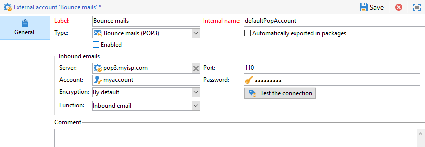
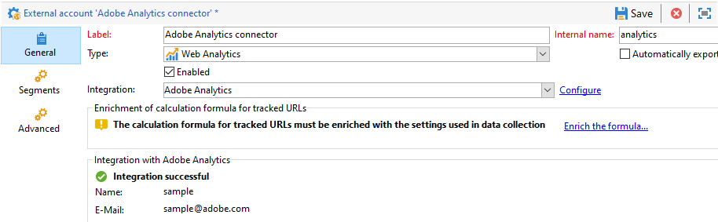

# 外部帳戶{#external-accounts}

Adobe Campaign 隨附一組預先定義的外部帳戶。若要設定與外部系統的連線，您可以建立新的外部帳戶。

技術流程（例如技術工作流程或宣傳工作流程）會使用外部帳戶。例如，在工作流程中或與任何其他應用程式(Adobe Target、Experience Manager等)進行資料交換時，您需要選取外部帳戶。

## 建立外部帳戶 {#creating-an-external-account}

若要建立新的外部帳戶，請遵循下列步驟。 詳細設定取決於外部帳戶的型別。

1. 從行銷活動&#x200B;**[!UICONTROL Explorer]**，選取&#x200B;**[!UICONTROL Administration]** &#39;>&#39; **[!UICONTROL Platform]** &#39;>&#39; **[!UICONTROL External accounts]**。

   

1. 按一下 **[!UICONTROL New]** 按鈕。

   

1. 輸入&#x200B;**[!UICONTROL Label]**&#x200B;和&#x200B;**[!UICONTROL Internal Name]**。
1. 選取您要建立的外部帳戶&#x200B;**[!UICONTROL Type]**。
1. 根據所選外部帳戶型別指定認證，以設定帳戶的存取權。

   所需資訊通常由您所連接的伺服器提供者提供。

1. 核取&#x200B;**[!UICONTROL Enabled]**&#x200B;選項以啟動連線。
1. 按一下&#x200B;**[!UICONTROL Save]**。

外部帳戶已建立並新增至外部帳戶清單。

## 促銷活動特定外部帳戶

### 退回郵件 {#bounce-mails-external-account}

**退回郵件**&#x200B;外部帳戶指定要用來連線至電子郵件服務的外部POP3帳戶。 如需此外部帳戶的詳細資訊，請參閱此[頁面](../../workflow/using/inbound-emails.md)。

所有設定為POP3存取的伺服器都可以用來接收傳回郵件。



若要設定&#x200B;**[!UICONTROL Bounce mails (defaultPopAccount)]**&#x200B;外部帳戶：

* **[!UICONTROL Server]**

  POP3伺服器的URL。

* **[!UICONTROL Port]**

  POP3連線埠號碼。 預設連線埠為110。

* **[!UICONTROL Account]**

  使用者的名稱。

* **[!UICONTROL Password]**

  使用者帳戶密碼。

* **[!UICONTROL Encryption]**

  選擇的加密型別，介於&#x200B;**[!UICONTROL By default]**、**[!UICONTROL POP3 + STARTTLS]**、**[!UICONTROL POP3]**&#x200B;或&#x200B;**[!UICONTROL POP3S]**&#x200B;之間。

* **[!UICONTROL Function]**

  傳入電子郵件或SOAP路由器

>[!IMPORTANT]
>
>使用Microsoft OAuth 2.0設定POP3外部帳戶之前，您必須先在Azure入口網站中註冊應用程式。 如需詳細資訊，請參閱[此頁面](https://docs.microsoft.com/en-us/azure/active-directory/develop/quickstart-register-app)。

若要使用&#x200B;**Microsoft OAuth 2.0**&#x200B;設定POP3外部，請核取&#x200B;**[!UICONTROL Microsoft OAuth 2.0]**&#x200B;選項並填入下列欄位：

* **[!UICONTROL Azure tenant]**

  Azure ID (或目錄（租使用者） ID)可以在Azure入口網站應用程式概觀的&#x200B;**Essentials**&#x200B;下拉式清單中找到。

* **[!UICONTROL Azure Client ID]**

  使用者端ID (或應用程式（使用者端） ID)可以在Azure入口網站應用程式概觀的&#x200B;**Essentials**&#x200B;下拉式清單中找到。

* **[!UICONTROL Azure Client secret]**

  使用者端密碼識別碼可在Azure入口網站應用程式的&#x200B;**憑證和密碼**&#x200B;功能表的&#x200B;**使用者端密碼**&#x200B;欄中找到。

* **[!UICONTROL Azure Redirect URL]**

  可在Azure入口網站應用程式的&#x200B;**驗證**&#x200B;功能表中找到重新導向URL。 它應該以下列語法`nl/jsp/oauth.jsp`結束，例如`https://redirect.adobe.net/nl/jsp/oauth.jsp`。

需要網際網路存取，才能進行安裝並使用使用者端主控台中的&#x200B;**[!UICONTROL Test Connection]**&#x200B;按鈕。 設定完成後，inMail程式便可在沒有網際網路的情況下與Microsoft伺服器通訊。

輸入不同的認證後，您可以按一下&#x200B;**[!UICONTROL Setup the connection]**&#x200B;完成外部帳戶設定。

### 路由{#routing-external-account}

**[!UICONTROL Routing]**&#x200B;外部帳戶可讓您根據安裝的套件，設定Adobe Campaign中可用的每個管道。


可設定下列通道：

* [電子郵件](#email-routing-external-account)
* [行動裝置（簡訊）](../../delivery/using/sms-set-up.md#creating-an-smpp-external-account)
* [電話](../../delivery/using/communication-channels.md#other-channels)
* [直接郵件](../../delivery/using/about-direct-mail-channel.md)
* [代理商](../../delivery/using/communication-channels.md#other-channels)
* [X (先前稱為Twitter)](../../social/using/about-social-marketing.md)
* [iOS 管道](../../delivery/using/configuring-the-mobile-application.md)
* [Android 管道](../../delivery/using/configuring-the-mobile-application-android.md)

### 電子郵件路由 {#email-routing-external-account}

預設會根據您的設定提供電子郵件路由外部帳戶。

身為內部部署/混合部署客戶，您可以建立新的路由外部帳戶或更新引數，如下所述。 此設定僅供專家使用者使用，可能會影響您的傳遞能力。 如有任何問題，請聯絡Adobe客戶服務或您的Adobe代表。

* 您可以使用&#x200B;**中間來源**、**外部**&#x200B;路由或&#x200B;**大量**&#x200B;傳遞路由型別。

* 對於&#x200B;**大量**&#x200B;和&#x200B;**中間來源**&#x200B;傳遞模式，您可以在&#x200B;**品牌**&#x200B;索引標籤中指定品牌引數。 這些引數是用來覆寫&#x200B;**映象頁面URL**&#x200B;和&#x200B;**錯誤位址**&#x200B;的[預設引數](../../installation/using/deploying-an-instance.md#email-channel-parameters)以及您品牌的特定設定。

  

* 若要設定中間來源外部帳戶，請參閱[本節](mid-sourcing-server.md)

### 執行執行個體  {#execution-instance-external-account}

如果您有已劃分的架構，則需要指定連結至控制執行個體的執行執行個體，並連線它們。 將異動訊息範本部署至執行例項。


* **[!UICONTROL URL]**

  安裝執行例項的伺服器的URL。

* **[!UICONTROL Account]**

  帳戶名稱，它必須符合操作員資料夾中定義的訊息中心代理程式。

* **[!UICONTROL Password]**

  運運算元資料夾中定義的帳戶密碼。

如需此設定的詳細資訊，請參閱此[頁面](../../message-center/using/configuring-instances.md#control-instance)。

## 存取外部系統外部帳戶

### FTP {#ftp-external-account}

FTP外部帳戶可讓您設定並測試對Adobe Campaign外部伺服器的存取權。 若要設定與外部系統（例如用於檔案傳輸的FTP伺服器898）的連線，您可以建立自己的外部帳戶。 如需關於此項目的詳細資訊，請參閱此[頁面](../../workflow/using/file-transfer.md)。

若要這麼做，請在此外部帳戶中指定用來建立與FTP伺服器連線的位址和認證


* **[!UICONTROL Server]**

  FTP伺服器的名稱。

* **[!UICONTROL Port]**

  FTP連線連線埠號碼。 預設連線埠為21。

* **[!UICONTROL Account]**

  使用者的名稱。

* **[!UICONTROL Password]**

  使用者帳戶密碼。

* **[!UICONTROL Encryption]**

  選擇的加密型別，介於&#x200B;**[!UICONTROL None]**&#x200B;或&#x200B;**[!UICONTROL SSL]**&#x200B;之間。

若要瞭解在何處尋找這些認證，請參閱此[頁面](https://help.dreamhost.com/hc/en-us/articles/115000675027-FTP-overview-and-credentials)。

### SFTP {#sftp-external-account}

SFTP外部帳戶可讓您設定並測試對Adobe Campaign外部伺服器的存取權。 若要設定與外部系統（例如用於檔案傳輸的SFTP）的連線，您可以建立自己的外部帳戶。 如需關於此項目的詳細資訊，請參閱此[頁面](../../workflow/using/file-transfer.md)。


* **[!UICONTROL Server]**

  sftp伺服器的URL。

* **[!UICONTROL Port]**

  FTP連線連線埠號碼。 預設連線埠為22。

* **[!UICONTROL Account]**

  用來連線至SFTP伺服器的帳戶名稱。

* **[!UICONTROL Password]**

  用來連線至SFTP伺服器的密碼。

<!--To add SSH keys on Windows:

1. Create the **HOME** environment variable with value set as the installation directory.

2. Add your private key to the `/$HOME/.ssh/id_rsa` folder.

3. Restart the Adobe Campaign services.
-->

### 外部資料庫(FDA) {#external-database-external-account}

使用&#x200B;**外部資料庫**&#x200B;型別外部帳戶來連線到外部資料庫。 在[本節](../../installation/using/about-fda.md)中進一步瞭解同盟資料存取(FDA)選項。

與Campaign相容的外部資料庫列於[相容性矩陣](../../rn/using/compatibility-matrix.md)


外部帳戶組態設定取決於資料庫引擎。 請在下列章節中瞭解更多資訊：

* 設定[Vertica analytics](../../installation/using/configure-fda-vertica.md)的存取權
* 設定[Snowflake](../../installation/using/configure-fda-snowflake.md)的存取權
* 設定[Google BigQuery](../../installation/using/configure-fda-google-big-query.md)的存取權
* 設定[Azure synapse](../../installation/using/configure-fda-synapse.md)的存取權
* 設定[Hadoop](../../installation/using/configure-fda-hadoop.md)的存取權
* 設定[Oracle](../../installation/using/configure-fda-oracle.md)的存取權
* 設定[Netezza](../../installation/using/configure-fda-netezza.md)的存取權
* 設定[SAP HANA](../../installation/using/configure-fda-sap-hana.md)的存取權
* 設定[Snowflake](../../installation/using/configure-fda-snowflake.md)的存取權
* 設定[Sybase IQ](../../installation/using/configure-fda-sybase.md)的存取權
* 設定[Teradata](../../installation/using/configure-fda-teradata.md)的存取權


## Adobe解決方案整合外部帳戶

### Adobe Experience Cloud {#adobe-experience-cloud-external-account}

若要使用Adobe ID連線至Adobe Campaign主控台，您必須設定&#x200B;**[!UICONTROL Adobe Experience Cloud (MAC)]**&#x200B;外部帳戶。


* **[!UICONTROL IMS server]**

  IMS伺服器的URL。 確定中繼和生產執行個體都指向相同的IMS生產端點。

* **[!UICONTROL IMS scope]**

  此處定義的範圍必須是IMS布建的範圍的子集。

* **[!UICONTROL IMS client identifier]**

  IMS使用者端的ID。

* **[!UICONTROL IMS client secret]**

  您的IMS使用者端密碼的認證。

* **[!UICONTROL Callback server]**

  存取Adobe Campaign執行個體的URL。

* **[!UICONTROL IMS organization ID]**

  您組織的ID。 若要尋找您的組織識別碼，請參閱[此頁面](https://experienceleague.adobe.com/docs/core-services/interface/administration/organizations.html?lang=zh-hant){_blank}。

* **[!UICONTROL Association mask]**

  語法可讓Enterprise Dashboard中的設定名稱與Adobe Campaign中的群組同步。

* **[!UICONTROL Server]**

  Adobe Experience Cloud執行個體的URL。

* **[!UICONTROL Tenant]**

  您的Adobe Experience Cloud租使用者的名稱。

如需此設定的詳細資訊，請參閱[此頁面](../../integrations/using/configuring-ims.md)。

## 網站分析 {#web-analytics-external-account}

**[!UICONTROL Web Analytics]**&#x200B;外部帳戶可讓您以區段的形式將資料從Adobe Analytics轉送到Adobe Campaign。 相反地，它會將Adobe Campaign所傳送電子郵件行銷活動的指標和屬性傳送至Adobe Analytics聯結器。



對於此外部帳戶，必須擴充追蹤URL的計算公式，且必須核准兩個解決方案之間的連線。 如需關於此項目的詳細資訊，請參閱此[頁面](../../integrations/using/gs-aa.md)。

### Adobe Experience Manager {#adobe-experience-manager-external-account}

**[!UICONTROL AEM (AEM instance)]**&#x200B;外部帳戶可讓您直接在Adobe Experience Manager中管理電子郵件傳遞的內容以及表單。


* **[!UICONTROL Server]**

  Adobe Experience Manager伺服器的URL。

* **[!UICONTROL Port]**

  用來連線至Adobe Experience Manager編寫執行個體的帳戶名稱。

* **[!UICONTROL Password]**

  用來連線至Adobe Experience Manager編寫執行個體的密碼。

如需詳細資訊，請參閱本[區段](../../integrations/using/about-adobe-experience-manager.md)。

## CRM聯結器外部帳戶

### Microsoft Dynamics CRM {#microsoft-dynamics-crm-external-account}

>[!NOTE]
>
> **[!UICONTROL On-premise]**&#x200B;和&#x200B;**[!UICONTROL Office 365]**&#x200B;部署型別現已棄用。 [了解更多](../../rn/using/deprecated-features.md)。

**[!UICONTROL Microsoft Dynamics CRM]**&#x200B;外部帳戶可讓您將Microsoft Dynamics資料匯入及匯出至Adobe Campaign。

在此[頁面](../../platform/using/crm-ms-dynamics.md)中進一步瞭解Campaign - Microsoft Dynamics CRM聯結器。

使用&#x200B;**[!UICONTROL Web API]**&#x200B;部署型別和&#x200B;**[!UICONTROL Password credentials]**&#x200B;驗證，您需要提供下列詳細資料：


* **[!UICONTROL Account]**

  用來登入Microsoft CRM的帳戶。

* **[!UICONTROL Server]**

  Microsoft CRM伺服器的URL。

  若要尋找您的Microsoft CRM **[!UICONTROL Server URL]**，請存取您的Microsoft Dynamics CRM帳戶，然後按一下&#x200B;**Dynamics 365**&#x200B;並選取您的應用程式。 然後，您可以在瀏覽器的位址列中找到您的&#x200B;**[!UICONTROL Server URL]**，例如`https://myserver.crm.dynamics.com/`。

* **[!UICONTROL Client identifier]**

  可以在&#x200B;**[!UICONTROL Update your code]**&#x200B;類別&#x200B;**[!UICONTROL Client ID]**&#x200B;欄位中的Microsoft Azure管理入口網站找到使用者端識別碼。

* **[!UICONTROL CRM version]**

  選擇&#x200B;**[!UICONTROL Dynamics CRM 365]** CRM版本。

使用&#x200B;**[!UICONTROL Web API]**&#x200B;部署型別和&#x200B;**[!UICONTROL Certificate]**&#x200B;驗證，您需要提供下列詳細資料：


* **[!UICONTROL Server]**

  Microsoft CRM伺服器的URL。

  若要尋找您的Microsoft CRM **[!UICONTROL Server URL]**，請存取您的Microsoft Dynamics CRM帳戶，然後按一下&#x200B;**Dynamics 365**&#x200B;並選取您的應用程式。 然後，您可以在瀏覽器的位址列中找到您的&#x200B;**[!UICONTROL Server URL]**，例如`https://myserver.crm.dynamics.com/`。

* **[!UICONTROL Private Key (Base64 encoded)]**

  請注意，私密金鑰必須編碼為Base64。

  若要這樣做，您可以使用Base64編碼器或使用Linux的命令列`base64 -w0 private.key`。

* **[!UICONTROL Custom Key identifier]**

* **[!UICONTROL Key ID]**

* **[!UICONTROL Client identifier]**

  可以在&#x200B;**[!UICONTROL Update your code]**&#x200B;類別&#x200B;**[!UICONTROL Client ID]**&#x200B;欄位中的Microsoft Azure管理入口網站找到使用者端識別碼。

* **[!UICONTROL CRM version]**

  介於&#x200B;**[!UICONTROL Dynamics CRM 2007]**、**[!UICONTROL Dynamics CRM 2015]**&#x200B;或&#x200B;**[!UICONTROL Dynamics CRM 2016]**&#x200B;之間的CRM版本。

如需此設定的詳細資訊，請參閱此[頁面](../../platform/using/crm-connectors.md)。

### Salesforce.com CRM  {#salesforce-crm-external-account}

**[!UICONTROL Salesforce CRM]**&#x200B;外部帳戶可讓您將Salesforce資料匯入及匯出至Adobe Campaign。


若要設定Salesforce CRM外部帳戶以搭配Adobe Campaign使用，您必須提供下列詳細資料：

* **[!UICONTROL Account]**

  用來登入Salesforce CRM的帳戶。

* **[!UICONTROL Password]**

  用來登入Salesforce CRM的密碼。

* **[!UICONTROL Client identifier]**

  若要瞭解在何處尋找您的使用者端識別碼，請參閱此[頁面](https://help.salesforce.com/articleView?id=000205876&amp;type=1)。

* **[!UICONTROL Security token]**

  若要瞭解在何處尋找您的安全性權杖，請參閱此[頁面](https://help.salesforce.com/articleView?id=000205876&amp;type=1)。

* **[!UICONTROL API version]**

  選取API的版本。

對於此外部帳戶，您需要使用設定助理來設定Salesforce CRM。

如需此設定的詳細資訊，請參閱此[頁面](../../platform/using/crm-connectors.md)。

## 傳輸資料外部帳戶

### Amazon簡單儲存服務(S3) {#amazon-simple-storage-service--s3--external-account}

Amazon Simple Storage Service (S3)聯結器可用來匯入或匯出資料至Adobe Campaign。 您可以在工作流程活動中設定它。 如需關於此項目的詳細資訊，請參閱此[頁面](../../workflow/using/file-transfer.md)。


當您設定此新外部帳戶時，您必須提供下列詳細資訊：

* **[!UICONTROL AWS S3 Account Server]**

  您伺服器的URL，應填入如下：

  ```
  <S3bucket name>.s3.amazonaws.com/<s3object path>
  ```

* **[!UICONTROL AWS access key ID]**

  若要瞭解在何處尋找您的AWS存取金鑰ID，請參閱此[頁面](https://docs.aws.amazon.com/general/latest/gr/aws-sec-cred-types.html#access-keys-and-secret-access-keys) 。

* **[!UICONTROL Secret access key to AWS]**

  若要瞭解在何處尋找您的AWS秘密存取金鑰，請參閱此[頁面](https://aws.amazon.com/fr/blogs/security/wheres-my-secret-access-key/)。

* **[!UICONTROL AWS Region]**

  若要深入瞭解AWS地區，請參閱此[頁面](https://aws.amazon.com/about-aws/global-infrastructure/regions_az/)。

* **[!UICONTROL Use server side encryption]**&#x200B;核取方塊可讓您以S3加密模式儲存檔案。

若要瞭解在何處尋找存取金鑰ID和機密存取金鑰，請參閱Amazon網站服務[檔案](https://docs.aws.amazon.com/general/latest/gr/aws-sec-cred-types.html#access-keys-and-secret-access-keys)。

### Azure Blob 儲存體 {#azure-blob-external-account}

**Azure Blob儲存體**&#x200B;外部帳戶可用來使用&#x200B;**[!UICONTROL Transfer file]**&#x200B;工作流程活動將資料匯入或匯出至Adobe Campaign。 如需詳細資訊，請參閱本[區段](../../workflow/using/file-transfer.md)。


若要設定&#x200B;**[!UICONTROL Azure external account]**&#x200B;以搭配Adobe Campaign使用，您必須提供下列詳細資料：

* **[!UICONTROL Server]**

  Azure Blob儲存伺服器的URL。

* **[!UICONTROL Encryption]**

  選擇的加密型別，介於&#x200B;**[!UICONTROL None]**&#x200B;或&#x200B;**[!UICONTROL SSL]**&#x200B;之間。

* **[!UICONTROL Access key]**

  若要瞭解在何處尋找您的&#x200B;**[!UICONTROL Access key]**，請參閱此[頁面](https://docs.microsoft.com/en-us/azure/storage/common/storage-account-keys-manage?tabs=azure-portal)。
