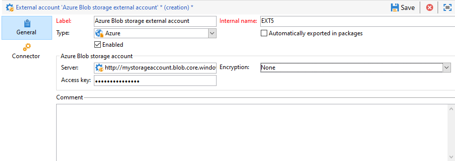

# 外部帳戶{#external-accounts}

Adobe Campaign 隨附一組預先定義的外部帳戶。若要設定與外部系統的連線，您可以建立新的外部帳戶。

技術流程（例如技術工作流程或宣傳工作流程）會使用外部帳戶。例如，在工作流程中設定檔案傳輸，或與任何其他應用程式(Adobe Target、Experience Manager等)進行資料交換時，您需要選取外部帳戶。

## 建立外部帳戶{#creating-an-external-account}

若要建立新外部帳戶，請遵循下列步驟。 詳細設定取決於外部帳戶的類型。

1. 從促銷活動&#x200B;**[!UICONTROL Explorer]**&#x200B;中，選取&#x200B;**[!UICONTROL Administration]**「>」 **[!UICONTROL Platform]**「>」 **[!UICONTROL External accounts]**。

   

1. 按一下 **[!UICONTROL New]** 按鈕。

   

1. 輸入&#x200B;**[!UICONTROL Label]**&#x200B;和&#x200B;**[!UICONTROL Internal Name]**。
1. 選擇要建立的外部帳戶&#x200B;**[!UICONTROL Type]**。
1. 根據所選外部帳戶類型指定憑證，以設定帳戶的存取權。

   所需資訊通常由您所連接的伺服器提供者提供。

1. 勾選&#x200B;**[!UICONTROL Enabled]**&#x200B;選項以啟用連線。
1. 按一下 **[!UICONTROL Save]**。

外部帳戶會建立並新增至外部帳戶清單。

## 促銷活動專用外部帳戶

### 退回郵件 {#bounce-mails-external-account}

**退回郵件**&#x200B;外部帳戶指定用於連接到電子郵件服務的外部POP3帳戶。 有關此外部帳戶的詳細資訊，請參閱此[page](../../workflow/using/inbound-emails.md)。

所有為POP3訪問配置的伺服器都可用於接收返回郵件。


要配置&#x200B;**[!UICONTROL Bounce mails (defaultPopAccount)]**&#x200B;外部帳戶：

* **[!UICONTROL Server]**

   POP3伺服器的URL。

* **[!UICONTROL Port]**

   POP3連接埠號。 預設埠為110。

* **[!UICONTROL Account]**

   使用者名稱。

* **[!UICONTROL Password]**

   用戶帳戶密碼。

* **[!UICONTROL Encryption]**

   在&#x200B;**[!UICONTROL By default]**、**[!UICONTROL POP3 + STARTTLS]**、**[!UICONTROL POP3]**&#x200B;或&#x200B;**[!UICONTROL POP3S]**&#x200B;之間選擇的加密類型。

### 路由{#routing-external-account}

**[!UICONTROL Routing]**&#x200B;外部帳戶可讓您根據安裝的套件，設定Adobe Campaign中可用的每個通道。


可設定下列通道：

* [電子郵件](../../installation/using/deploying-an-instance.md#email-channel-parameters)
* [行動裝置（簡訊）](../../delivery/using/sms-set-up.md#creating-an-smpp-external-account)
* [電話](../../delivery/using/steps-about-delivery-creation-steps.md#other-channels)
* [直接郵件](../../delivery/using/about-direct-mail-channel.md)
* [代理](../../delivery/using/steps-about-delivery-creation-steps.md#other-channels)
* [Facebook](../../social/using/publishing-on-facebook-walls.md#delegating-write-access-to-adobe-campaign)
* [Twitter](../../social/using/configuring-publishing-on-twitter.md)
* [iOS頻道](../../delivery/using/configuring-the-mobile-application.md)
* [Android頻道](../../delivery/using/configuring-the-mobile-application-android.md)


### 執行實例{#execution-instance-external-account}

如果您有劃分架構，則需要指定連結至控制執行個體的執行執行個體，並加以連結。 交易式訊息範本部署至執行例項


* **[!UICONTROL URL]**

   安裝執行實例的伺服器的URL。

* **[!UICONTROL Account]**

   帳戶名稱，它必須符合運算子資料夾中定義的訊息中心代理。

* **[!UICONTROL Password]**

   運算子資料夾中定義的帳戶密碼。

有關此配置的詳細資訊，請參閱此[page](../../message-center/using/configuring-instances.md#control-instance)。


## 訪問外部系統外部帳戶

### FTP {#ftp-external-account}

FTP外部帳戶可讓您設定及測試對Adobe Campaign以外之伺服器的存取。 若要設定與外部系統（例如用於檔案傳輸的FTP伺服器898）的連線，您可以建立自己的外部帳戶。 如需關於此項目的詳細資訊，請參閱此[頁面](../../workflow/using/file-transfer.md)。

若要這麼做，請在此外部帳戶中指定用來建立與FTP伺服器連線的位址和憑證


* **[!UICONTROL Server]**

   FTP伺服器的名稱。

* **[!UICONTROL Port]**

   FTP連接埠號。 預設埠為21。

* **[!UICONTROL Account]**

   使用者名稱。

* **[!UICONTROL Password]**

   用戶帳戶密碼。

* **[!UICONTROL Encryption]**

   在&#x200B;**[!UICONTROL None]**&#x200B;或&#x200B;**[!UICONTROL SSL]**&#x200B;之間選擇的加密類型。

要了解這些憑據的位置，請參閱此[page](https://help.dreamhost.com/hc/en-us/articles/115000675027-FTP-overview-and-credentials)。

### SFTP {#sftp-external-account}

SFTP外部帳戶可讓您設定及測試對Adobe Campaign以外伺服器的存取。 若要設定與外部系統（例如用於檔案傳輸的SFTP）的連線，您可以建立自己的外部帳戶。 如需關於此項目的詳細資訊，請參閱此[頁面](../../workflow/using/file-transfer.md)。


* **[!UICONTROL Server]**

   SFTP伺服器的URL。

* **[!UICONTROL Port]**

   FTP連接埠號。 預設埠為22。

* **[!UICONTROL Account]**

   用來連線至SFTP伺服器的帳戶名稱。

* **[!UICONTROL Password]**

   用於連線至SFTP伺服器的密碼。

### 外部資料庫(FDA){#external-database-external-account}

使用&#x200B;**外部資料庫**&#x200B;鍵入外部帳戶以連接到外部資料庫。 深入了解同盟資料存取(FDA)選項，請參閱[本節](../../installation/using/about-fda.md)。

[相容性矩陣](../../rn/using/compatibility-matrix.md)中列出與Campaign相容的外部資料庫


外部帳戶配置設定取決於資料庫引擎。 進一步了解以下章節：

* 配置對[Azure synapse](../../installation/using/configure-fda-synapse.md)的訪問
* 配置對[Hadoop](../../installation/using/configure-fda-hadoop.md)的訪問
* 配置對[Oracle](../../installation/using/configure-fda-oracle.md)的訪問
* 配置對[Netezza](../../installation/using/configure-fda-netezza.md)的訪問
* 配置對[SAP HANA](../../installation/using/configure-fda-sap-hana.md)的訪問
* 配置對[Snowflake](../../installation/using/configure-fda-snowflake.md)的訪問
* 配置對[Sybase IQ](../../installation/using/configure-fda-sybase.md)的訪問
* 配置對[Teradata](../../installation/using/configure-fda-teradata.md)的訪問

### Facebook connect {#facebook-connect-external-account}

**[!UICONTROL Facebook Connect]**&#x200B;外部帳戶可讓您在Facebook應用程式中顯示個人化內容，透過此社交網路更容易取得潛在客戶。

對於每個Facebook應用程式，您需要建立&#x200B;**[!UICONTROL Facebook Connect]**&#x200B;類型外部帳戶。 如需詳細資訊，請參閱[page](../../social/using/creating-a-facebook-application.md#configuring-external-accounts)。


* **[!UICONTROL Hosting mode]**

   **[!UICONTROL hosted by a partner]**&#x200B;或&#x200B;**[!UICONTROL hosted by this instance]**&#x200B;之間的應用程式托管模式。

* **[!UICONTROL Application ID]**

   facebook應用程式的應用程式ID。

* **[!UICONTROL Application secret]**

   facebook應用程式的應用程式密碼。

如果您選擇由此執行個體模式托管，則「安全畫布URL」必須貼入Facebook上的&#x200B;**Facebook網路遊戲(https)**&#x200B;欄位

要了解這些憑據的位置，請參閱此[page](https://developers.facebook.com/docs/facebook-login/access-tokens)。

## Adobe解決方案整合外部帳戶

### Adobe Experience Cloud {#adobe-experience-cloud-external-account}

若要使用Adobe ID連線至Adobe Campaign主控台，您必須設定&#x200B;**[!UICONTROL Adobe Experience Cloud (MAC)]**&#x200B;外部帳戶。


* **[!UICONTROL IMS server]**

   您的IMS伺服器URL。 請確定預備和生產執行個體都指向相同的IMS生產端點。

* **[!UICONTROL IMS scope]**

   此處定義的範圍必須是IMS布建範圍的子集。

* **[!UICONTROL IMS client identifier]**

   您的IMS用戶端ID。

* **[!UICONTROL IMS client secret]**

   IMS用戶端密碼的憑證。

* **[!UICONTROL Callback server]**

   存取Adobe Campaign例項的URL。

* **[!UICONTROL IMS organization ID]**

   您的IMS組織ID。 若要尋找組織ID，請參閱[此頁面](https://experienceleague.adobe.com/docs/core-services/interface/manage-users-and-products/faq.html)（**哪裡可以找到我的IMS組織ID?**）。

* **[!UICONTROL Association mask]**

   允許將Enterprise Dashboard中的設定名稱同步至Adobe Campaign中群組的語法。

* **[!UICONTROL Server]**

   Adobe Experience Cloud例項的URL。

* **[!UICONTROL Tenant]**

   您的Adobe Experience Cloud租用戶名稱。

有關此配置的詳細資訊，請參閱[此頁](../../integrations/using/configuring-ims.md)。

## 網站分析 {#web-analytics-external-account}

**[!UICONTROL Web Analytics]**&#x200B;外部帳戶可讓您以區段形式將資料從Adobe Analytics轉送至Adobe Campaign。 相反地，它會將Adobe Campaign傳送之電子郵件促銷活動的指標和屬性傳送至Adobe Analytics連接器。


對於此外部帳戶，必須擴充追蹤URL的計算公式，且必須核准兩個解決方案之間的連線。 如需關於此項目的詳細資訊，請參閱此[頁面](../../platform/using/adobe-analytics-connector.md#external-account-classic)。

### Adobe Experience Manager {#adobe-experience-manager-external-account}

**[!UICONTROL AEM (AEM instance)]**&#x200B;外部帳戶可讓您直接在Adobe Experience Manager中管理電子郵件傳送的內容以及表單。


* **[!UICONTROL Server]**

   Adobe Experience Manager伺服器的URL。

* **[!UICONTROL Port]**

   用來連線至Adobe Experience Manager編寫執行個體的帳戶名稱。

* **[!UICONTROL Password]**

   用來連線至Adobe Experience Manager製作執行個體的密碼。

如需詳細資訊，請參閱本[區段](../../integrations/using/about-adobe-experience-manager.md)。


## CRM連接器外部帳戶

### Microsoft Dynamics CRM {#microsoft-dynamics-crm-external-account}

**[!UICONTROL Microsoft Dynamics CRM]**&#x200B;外部帳戶可讓您將Microsoft Dynamics資料匯入和匯出至Adobe Campaign。

在此[頁面](../../platform/using/crm-ms-dynamics.md)中深入了解Campaign - Microsoft Dynamics CRM連接器。

>[!NOTE]
>
> **[!UICONTROL On-premise]** 和部 **[!UICONTROL Office 365]** 署類型現已過時。[瞭解更多](../../rn/using/deprecated-features.md)。

使用&#x200B;**[!UICONTROL Web API]**&#x200B;部署類型和&#x200B;**[!UICONTROL Password credentials]**&#x200B;身份驗證時，您需要提供以下詳細資訊：


* **[!UICONTROL Account]**

   用於登入Microsoft CRM的帳戶。

* **[!UICONTROL Server]**

   Microsoft CRM伺服器的URL。

* **[!UICONTROL Client identifier]**

   可從&#x200B;**[!UICONTROL Update your code]**&#x200B;類別&#x200B;**[!UICONTROL Client ID]**&#x200B;欄位中的Microsoft Azure管理門戶找到的客戶端ID。

* **[!UICONTROL CRM version]**

   **[!UICONTROL Dynamics CRM 2007]**、**[!UICONTROL Dynamics CRM 2015]**&#x200B;或&#x200B;**[!UICONTROL Dynamics CRM 2016]**&#x200B;之間的CRM版本。

使用&#x200B;**[!UICONTROL Web API]**&#x200B;部署類型和&#x200B;**[!UICONTROL Certificate]**&#x200B;身份驗證時，您需要提供以下詳細資訊：


* **[!UICONTROL Server]**

   Microsoft CRM伺服器的URL。

* **[!UICONTROL Private Key (Base64 encoded)]**

   編碼為Base64的私鑰

* **[!UICONTROL Custom Key identifier]**

* **[!UICONTROL Key ID]**

* **[!UICONTROL Client identifier]**

   可從&#x200B;**[!UICONTROL Update your code]**&#x200B;類別&#x200B;**[!UICONTROL Client ID]**&#x200B;欄位中的Microsoft Azure管理門戶找到的客戶端ID。

* **[!UICONTROL CRM version]**

   **[!UICONTROL Dynamics CRM 2007]**、**[!UICONTROL Dynamics CRM 2015]**&#x200B;或&#x200B;**[!UICONTROL Dynamics CRM 2016]**&#x200B;之間的CRM版本。

有關此配置的詳細資訊，請參閱此[page](../../platform/using/crm-connectors.md)。

### Salesforce.com CRM {#salesforce-crm-external-account}

**[!UICONTROL Salesforce CRM]**&#x200B;外部帳戶可讓您將Salesforce資料匯入和匯出至Adobe Campaign。


若要設定Salesforce CRM外部帳戶以搭配Adobe Campaign運作，您需要提供下列詳細資訊：

* **[!UICONTROL Account]**

   用於登入Salesforce CRM的帳戶。

* **[!UICONTROL Password]**

   用於登入Salesforce CRM的密碼。

* **[!UICONTROL Client identifier]**

   若要了解在何處尋找用戶端識別碼，請參閱此[page](https://help.salesforce.com/articleView?id=000205876&amp;type=1)。

* **[!UICONTROL Security token]**

   若要了解在何處尋找安全權杖，請參閱此[page](https://help.salesforce.com/articleView?id=000205876&amp;type=1)。

* **[!UICONTROL API version]**

   選取API的版本。

對於此外部帳戶，您需要使用配置嚮導配置Salesforce CRM。

有關此配置的詳細資訊，請參閱此[page](../../platform/using/crm-connectors.md)。

## 傳輸資料外部帳戶

### Amazon簡單儲存服務(S3){#amazon-simple-storage-service--s3--external-account}

Amazon Simple Storage Service(S3)連接器可用來匯入或匯出資料至Adobe Campaign。 可在工作流程活動中設定。 如需關於此項目的詳細資訊，請參閱此[頁面](../../workflow/using/file-transfer.md)。


當您設定此新外部帳戶時，您必須提供下列詳細資訊：

* **[!UICONTROL AWS S3 Account Server]**

   伺服器的URL，應填入如下：

   ```
   <S3bucket name>.s3.amazonaws.com/<s3object path>
   ```

* **[!UICONTROL AWS access key ID]**

   要了解在何處查找您的AWS訪問密鑰ID，請參閱此[page](https://docs.aws.amazon.com/general/latest/gr/aws-sec-cred-types.html#access-keys-and-secret-access-keys)。

* **[!UICONTROL Secret access key to AWS]**

   要了解在何處查找您對AWS的秘密訪問密鑰，請參閱此[page](https://aws.amazon.com/fr/blogs/security/wheres-my-secret-access-key/)。

* **[!UICONTROL AWS Region]**

   要了解有關AWS區域的更多資訊，請參閱此[頁](https://aws.amazon.com/about-aws/global-infrastructure/regions_az/)。

* **[!UICONTROL Use server side encryption]**&#x200B;核取方塊可讓您以S3加密模式儲存檔案。

若要了解在何處尋找存取金鑰ID和秘密存取金鑰，請參閱Amazon網站服務[檔案](https://docs.aws.amazon.com/general/latest/gr/aws-sec-cred-types.html#access-keys-and-secret-access-keys)。

### Azure Blob儲存{#azure-blob-external-account}

**Azure Blob儲存體**&#x200B;外部帳戶可用來使用&#x200B;**[!UICONTROL Transfer file]**&#x200B;工作流程活動將資料匯入或匯出至Adobe Campaign。 如需詳細資訊，請參閱本[區段](../../workflow/using/file-transfer.md)。



若要設定&#x200B;**[!UICONTROL Azure external account]**&#x200B;以搭配Adobe Campaign使用，您必須提供下列詳細資訊：

* **[!UICONTROL Server]**

   Azure Blob儲存伺服器的URL。

* **[!UICONTROL Encryption]**

   在&#x200B;**[!UICONTROL None]**&#x200B;或&#x200B;**[!UICONTROL SSL]**&#x200B;之間選擇的加密類型。

* **[!UICONTROL Access key]**

   若要了解在何處找到您的&#x200B;**[!UICONTROL Access key]**，請參閱此[page](https://docs.microsoft.com/en-us/azure/storage/common/storage-account-keys-manage?tabs=azure-portal)。
