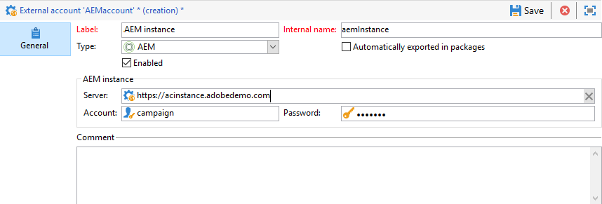

# 外部帳戶{#external-accounts}


Adobe Campaign 隨附一組預先定義的外部帳戶。為了設定與外部系統的連接，您可以建立新的外部帳戶。

技術流程（例如技術工作流程或宣傳工作流程）會使用外部帳戶。例如，在工作流中設定檔案傳輸或與任何其他應用程式(Adobe Target、Experience Manager等)進行資料交換時，需要選擇外部帳戶。

## 建立外部帳戶 {#creating-an-external-account}

要建立新外部帳戶，請執行以下步驟。 詳細設定取決於外部帳戶的類型。

1. 從市場活動 **[!UICONTROL Explorer]**&#x200B;選中 **[!UICONTROL Administration]** &#39;>&#39; **[!UICONTROL Platform]** &#39;>&#39; **[!UICONTROL External accounts]**。

   

1. 按一下 **[!UICONTROL New]** 按鈕。

   

1. 輸入 **[!UICONTROL Label]** 和 **[!UICONTROL Internal Name]**。
1. 選擇您的外部帳戶 **[!UICONTROL Type]** 你想要建立的。
1. 通過根據所選外部帳戶類型指定憑據來配置對帳戶的訪問。

   所需資訊通常由您所連接的伺服器提供者提供。

1. 檢查 **[!UICONTROL Enabled]** 的子菜單。
1. 按一下&#x200B;**[!UICONTROL Save]**。

建立外部帳戶並將其添加到外部帳戶清單。

## 市場活動特定的外部帳戶

### 退回郵件 {#bounce-mails-external-account}

的 **退回郵件** 外部帳戶指定用於連接到電子郵件服務的外部POP3帳戶。 有關此外部帳戶的詳細資訊，請參閱 [頁](../../workflow/using/inbound-emails.md)。

為POP3訪問配置的所有伺服器都可用於接收返回郵件。


配置 **[!UICONTROL Bounce mails (defaultPopAccount)]** 外部帳戶：

* **[!UICONTROL Server]**

   POP3伺服器的URL。

* **[!UICONTROL Port]**

   POP3連接埠號。 預設埠為110。

* **[!UICONTROL Account]**

   用戶的名稱。

* **[!UICONTROL Password]**

   用戶帳戶密碼。

* **[!UICONTROL Encryption]**

   選擇的加密類型 **[!UICONTROL By default]**。 **[!UICONTROL POP3 + STARTTLS]**。 **[!UICONTROL POP3]** 或 **[!UICONTROL POP3S]**。

* **[!UICONTROL Function]**

   入站電子郵件或SOAP路由器

>[!IMPORTANT]
>
>在使用MicrosoftOAuth 2.0配置POP3外部帳戶之前，您首先需要在Azure門戶中註冊您的應用程式。 如需詳細資訊，請參閱[此頁面](https://docs.microsoft.com/en-us/azure/active-directory/develop/quickstart-register-app)。

使用 **MicrosoftOAuth 2.0**，則選中 **[!UICONTROL Microsoft OAuth 2.0]** 的子菜單。

* **[!UICONTROL Azure tenant]**

   在 **基本知識** Azure門戶中應用程式概述的下拉框。

* **[!UICONTROL Azure Client ID]**

   在 **基本知識** Azure門戶中應用程式概述的下拉框。

* **[!UICONTROL Azure Client secret]**

   在 **客戶端機密** 列 **證書和機密** Azure門戶中應用程式的菜單。

* **[!UICONTROL Azure Redirect URL]**

   可在 **驗證** Azure門戶中應用程式的菜單。 它應以以下語法結尾 `nl/jsp/oauth.jsp`，例如 `https://redirect.adobe.net/nl/jsp/oauth.jsp`。

輸入不同的憑據後，可以按一下 **[!UICONTROL Setup the connection]** 完成外部帳戶配置。

### 路由{#routing-external-account}

的 **[!UICONTROL Routing]** 外部帳戶允許您根據安裝的軟體包配置Adobe Campaign的每個可用通道。


可以配置以下通道：

* [電子郵件](../../installation/using/deploying-an-instance.md#email-channel-parameters)
* [行動裝置（簡訊）](../../delivery/using/sms-set-up.md#creating-an-smpp-external-account)
* [電話](../../delivery/using/steps-about-delivery-creation-steps.md#other-channels)
* [直接郵件](../../delivery/using/about-direct-mail-channel.md)
* [代理](../../delivery/using/steps-about-delivery-creation-steps.md#other-channels)
* [Twitter](../../social/using/configuring-publishing-on-twitter.md)
* [iOS](../../delivery/using/configuring-the-mobile-application.md)
* [Android頻道](../../delivery/using/configuring-the-mobile-application-android.md)

### 執行實例  {#execution-instance-external-account}

如果具有分解式體系結構，則需要指定連結到控制實例的執行實例並連接它們。 事務性消息模板被部署到執行實例


* **[!UICONTROL URL]**

   安裝執行實例的伺服器的URL。

* **[!UICONTROL Account]**

   帳戶名稱必須與在操作員資料夾中定義的「郵件中心代理」匹配。

* **[!UICONTROL Password]**

   操作員資料夾中定義的帳戶密碼。

有關此配置的詳細資訊，請參閱此 [頁](../../message-center/using/configuring-instances.md#control-instance)。

## 訪問外部系統外部帳戶

### FTP {#ftp-external-account}

FTP外部帳戶允許您配置和test對Adobe Campaign以外伺服器的訪問。 要設定與外部系統（如用於檔案傳輸的FTP伺服器898）的連接，可以建立自己的外部帳戶。 如需關於此項目的詳細資訊，請參閱此[頁面](../../workflow/using/file-transfer.md)。

為此，請在此外部帳戶中指定用於建立與FTP伺服器連接的地址和憑據


* **[!UICONTROL Server]**

   FTP伺服器的名稱。

* **[!UICONTROL Port]**

   FTP連接埠號。 預設埠為21。

* **[!UICONTROL Account]**

   用戶的名稱。

* **[!UICONTROL Password]**

   用戶帳戶密碼。

* **[!UICONTROL Encryption]**

   選擇的加密類型 **[!UICONTROL None]** 或 **[!UICONTROL SSL]**。

要知道在何處查找這些憑據，請參閱此 [頁](https://help.dreamhost.com/hc/en-us/articles/115000675027-FTP-overview-and-credentials)。

### SFTP {#sftp-external-account}

SFTP外部帳戶允許您配置和test對Adobe Campaign以外的伺服器的訪問。 要設定與外部系統（如用於檔案傳輸的SFTP）的連接，可以建立自己的外部帳戶。 如需關於此項目的詳細資訊，請參閱此[頁面](../../workflow/using/file-transfer.md)。


* **[!UICONTROL Server]**

   SFTP伺服器的URL。

* **[!UICONTROL Port]**

   FTP連接埠號。 預設埠為22。

* **[!UICONTROL Account]**

   用於連接到SFTP伺服器的帳戶名。

* **[!UICONTROL Password]**

   用於連接到SFTP伺服器的密碼。

在Windows上添加SSH密鑰：

1. 建立 **首頁** 將值設定為安裝目錄的環境變數。

2. 將您的私鑰添加到 `/$HOME/.ssh/id_rsa` 的子菜單。

3. 重新啟動Adobe Campaign服務。

### 外部資料庫(FDA) {#external-database-external-account}

使用 **外部資料庫** 鍵入外部帳戶以連接到外部資料庫。 瞭解有關聯合資料存取(FDA)選項的詳細資訊，請參閱 [此部分](../../installation/using/about-fda.md)。

與市場活動相容的外部資料庫列在 [相容性矩陣](../../rn/using/compatibility-matrix.md)


外部帳戶配置設定取決於資料庫引擎。 在以下各節中瞭解更多資訊：

* 配置對 [韋爾蒂卡](../../installation/using/configure-fda-vertica.md)
* 配置對 [Snowflake](../../installation/using/configure-fda-snowflake.md)
* 配置對 [Google大查詢](../../installation/using/configure-fda-google-big-query.md)
* 配置對 [azure synapse](../../installation/using/configure-fda-synapse.md)
* 配置對 [Hadoop](../../installation/using/configure-fda-hadoop.md)
* 配置對 [Oracle](../../installation/using/configure-fda-oracle.md)
* 配置對 [Netezza](../../installation/using/configure-fda-netezza.md)
* 配置對 [SAP HANA](../../installation/using/configure-fda-sap-hana.md)
* 配置對 [Snowflake](../../installation/using/configure-fda-snowflake.md)
* 配置對 [sybase IQ](../../installation/using/configure-fda-sybase.md)
* 配置對 [Teradata](../../installation/using/configure-fda-teradata.md)

### Facebook {#facebook-connect-external-account}

的 **[!UICONTROL Facebook Connect]** 外部帳戶允許您在Facebook應用程式中顯示個性化內容，從而更容易通過此社交網路獲取潛在客戶。

對於每個Facebook應用程式，您需要建立 **[!UICONTROL Facebook Connect]** 鍵入外部帳戶。 有關此內容的詳細資訊，請參閱 [頁](../../social/using/creating-a-facebook-application.md#configuring-external-accounts)。


* **[!UICONTROL Hosting mode]**

   應用程式的托管模式 **[!UICONTROL hosted by a partner]** 或 **[!UICONTROL hosted by this instance]**。

* **[!UICONTROL Application ID]**

   你的Facebook應用程式的應用ID。

* **[!UICONTROL Application secret]**

   你的Facebook應用程式的應用程式機密。

如果選擇此實例模式承載的，則需要將安全畫布URL貼上到 **Facebook網路遊戲(https)** facebook

要知道在何處查找這些憑據，請參閱此 [頁](https://developers.facebook.com/docs/facebook-login/access-tokens)。

## Adobe解決方案整合外部客戶

### Adobe Experience Cloud {#adobe-experience-cloud-external-account}

要使用Adobe ID連接到Adobe Campaign控制台，必須配置 **[!UICONTROL Adobe Experience Cloud (MAC)]** 外部帳戶。


* **[!UICONTROL IMS server]**

   IMS伺服器的URL。 確保階段實例和生產實例都指向相同的IMS生產端點。

* **[!UICONTROL IMS scope]**

   此處定義的作用域必須是IMS設定的作用域的子集。

* **[!UICONTROL IMS client identifier]**

   IMS客戶端的ID。

* **[!UICONTROL IMS client secret]**

   IMS客戶端機密的憑據。

* **[!UICONTROL Callback server]**

   訪問你的Adobe Campaign實例的URL。

* **[!UICONTROL IMS organization ID]**

   組織的ID。 要查找組織ID，請參閱 [此頁](https://experienceleague.adobe.com/docs/core-services/interface/administration/organizations.html?lang=zh-Hant){_blank}。

* **[!UICONTROL Association mask]**

   允許企業儀表板中的配置名稱與Adobe Campaign中的組同步的語法。

* **[!UICONTROL Server]**

   您的Adobe Experience Cloud實例的URL。

* **[!UICONTROL Tenant]**

   你的Adobe Experience Cloud租戶的名字。

有關此配置的詳細資訊，請參閱 [此頁](../../integrations/using/configuring-ims.md)。

## 網站分析 {#web-analytics-external-account}

的 **[!UICONTROL Web Analytics]** 外部帳戶允許您以段的形式將資料從Adobe Analytics轉發到Adobe Campaign。 相反，它將Adobe Campaign向Adobe Analytics連接器發送電子郵件活動的指標和屬性。


對於此外部帳戶，必須豐富跟蹤的URL的計算公式，並且必須批准兩個解決方案之間的連接。 如需關於此項目的詳細資訊，請參閱此[頁面](../../platform/using/adobe-analytics-connector.md#external-account-classic)。

### Adobe Experience Manager {#adobe-experience-manager-external-account}

的 **[!UICONTROL AEM (AEM instance)]** 外部帳戶允許您直接在Adobe Experience Manager管理電子郵件遞送的內容和表單。



* **[!UICONTROL Server]**

   Adobe Experience Manager伺服器的URL。

* **[!UICONTROL Port]**

   用於連接到Adobe Experience Manager創作實例的帳戶名。

* **[!UICONTROL Password]**

   用於連接到Adobe Experience Manager創作實例的密碼。

如需詳細資訊，請參閱本[區段](../../integrations/using/about-adobe-experience-manager.md)。

## CRM連接器外部帳戶

### Microsoft動力客戶關係管理 {#microsoft-dynamics-crm-external-account}

>[!NOTE]
>
> **[!UICONTROL On-premise]** 和 **[!UICONTROL Office 365]** 部署類型現在已棄用。 [了解更多資訊](../../rn/using/deprecated-features.md)。

的 **[!UICONTROL Microsoft Dynamics CRM]** 外部帳戶允許您將MicrosoftDynamics資料導入和導出到Adobe Campaign。

瞭解有關此中的活動 — MicrosoftDynamics CRM連接器的詳細資訊 [頁](../../platform/using/crm-ms-dynamics.md)。

與 **[!UICONTROL Web API]** 部署類型和 **[!UICONTROL Password credentials]** 驗證，您需要提供以下詳細資訊：


* **[!UICONTROL Account]**

   用於登錄MicrosoftCRM的帳戶。

* **[!UICONTROL Server]**

   您的MicrosoftCRM伺服器的URL。

   查找您的MicrosoftCRM **[!UICONTROL Server URL]**，訪問您的MicrosoftDynamics CRM帳戶，然後按一下 **動力學365** 並選擇你的應用。 然後你可以找到 **[!UICONTROL Server URL]** 地址欄中，例如 `https://myserver.crm.dynamics.com/`。

* **[!UICONTROL Client identifier]**

   可從以下位置的MicrosoftAzure管理門戶中找到的客戶端ID **[!UICONTROL Update your code]** 類別， **[!UICONTROL Client ID]** 的子菜單。

* **[!UICONTROL CRM version]**

   選擇 **[!UICONTROL Dynamics CRM 365]** CRM版本。

與 **[!UICONTROL Web API]** 部署類型和 **[!UICONTROL Certificate]** 驗證，您需要提供以下詳細資訊：


* **[!UICONTROL Server]**

   您的MicrosoftCRM伺服器的URL。

   查找您的MicrosoftCRM **[!UICONTROL Server URL]**，訪問您的MicrosoftDynamics CRM帳戶，然後按一下 **動力學365** 並選擇你的應用。 然後你可以找到 **[!UICONTROL Server URL]** 地址欄中，例如 `https://myserver.crm.dynamics.com/`。

* **[!UICONTROL Private Key (Base64 encoded)]**

   請注意，私鑰需要編碼到Base64。

   為此，可以使用Base64編碼器的幫助或使用命令行 `base64 -w0 private.key` Linux。

* **[!UICONTROL Custom Key identifier]**

* **[!UICONTROL Key ID]**

* **[!UICONTROL Client identifier]**

   可從以下位置的MicrosoftAzure管理門戶中找到的客戶端ID **[!UICONTROL Update your code]** 類別， **[!UICONTROL Client ID]** 的子菜單。

* **[!UICONTROL CRM version]**

   CRM的版本 **[!UICONTROL Dynamics CRM 2007]**。 **[!UICONTROL Dynamics CRM 2015]** 或 **[!UICONTROL Dynamics CRM 2016]**。

有關此配置的詳細資訊，請參閱此 [頁](../../platform/using/crm-connectors.md)。

### Salesforce.com CRM  {#salesforce-crm-external-account}

的 **[!UICONTROL Salesforce CRM]** 外部帳戶允許您將Salesforce資料導入和導出到Adobe Campaign。


要配置Salesforce CRM外部帳戶以與Adobe Campaign協作，您需要提供以下詳細資訊：

* **[!UICONTROL Account]**

   用於登錄Salesforce CRM的帳戶。

* **[!UICONTROL Password]**

   用於登錄Salesforce CRM的密碼。

* **[!UICONTROL Client identifier]**

   要知道在何處查找客戶端標識符，請參閱 [頁](https://help.salesforce.com/articleView?id=000205876&amp;type=1)。

* **[!UICONTROL Security token]**

   要瞭解在何處查找安全令牌，請參閱此 [頁](https://help.salesforce.com/articleView?id=000205876&amp;type=1)。

* **[!UICONTROL API version]**

   選擇API的版本。

對於此外部帳戶，您需要使用配置嚮導配置Salesforce CRM。

有關此配置的詳細資訊，請參閱此 [頁](../../platform/using/crm-connectors.md)。

## 傳輸資料外部帳戶

### Amazon簡單儲存服務(S3) {#amazon-simple-storage-service--s3--external-account}

Amazon簡單儲存服務(S3)連接器可用於將資料導入或導出到Adobe Campaign。 可以在工作流活動中設定。 如需關於此項目的詳細資訊，請參閱此[頁面](../../workflow/using/file-transfer.md)。


當您設定此新外部帳戶時，您必須提供下列詳細資訊：

* **[!UICONTROL AWS S3 Account Server]**

   伺服器的URL，應按如下方式填充：

   ```
   <S3bucket name>.s3.amazonaws.com/<s3object path>
   ```

* **[!UICONTROL AWS access key ID]**

   要瞭解在何處查找您的AWS訪問密鑰ID，請參閱 [頁](https://docs.aws.amazon.com/general/latest/gr/aws-sec-cred-types.html#access-keys-and-secret-access-keys) 。

* **[!UICONTROL Secret access key to AWS]**

   要瞭解在何處找到您的AWS的秘密訪問密鑰，請參閱此 [頁](https://aws.amazon.com/fr/blogs/security/wheres-my-secret-access-key/)。

* **[!UICONTROL AWS Region]**

   要瞭解有關AWS地區的更多資訊，請參閱 [頁](https://aws.amazon.com/about-aws/global-infrastructure/regions_az/)。

* 的 **[!UICONTROL Use server side encryption]** 複選框允許您將檔案儲存在S3加密模式下。

要瞭解在何處查找訪問密鑰ID和秘密訪問密鑰，請參閱AmazonWeb服務 [文檔](https://docs.aws.amazon.com/general/latest/gr/aws-sec-cred-types.html#access-keys-and-secret-access-keys)。

### Azure Blob儲存 {#azure-blob-external-account}

的 **Azure Blob儲存** 外部帳戶可使用 **[!UICONTROL Transfer file]** 工作流活動。 如需詳細資訊，請參閱本[區段](../../workflow/using/file-transfer.md)。


配置 **[!UICONTROL Azure external account]** 要與Adobe Campaign合作，您需要提供以下詳細資訊：

* **[!UICONTROL Server]**

   Azure Blob儲存伺服器的URL。

* **[!UICONTROL Encryption]**

   選擇的加密類型 **[!UICONTROL None]** 或 **[!UICONTROL SSL]**。

* **[!UICONTROL Access key]**

   知道在哪裡找到 **[!UICONTROL Access key]**，請參閱 [頁](https://docs.microsoft.com/en-us/azure/storage/common/storage-account-keys-manage?tabs=azure-portal)。
