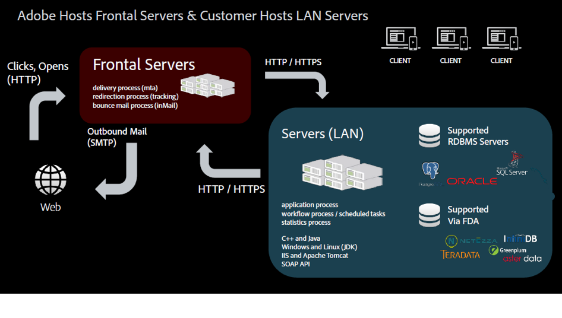

# 託管模型{#hosting-models}

Adobe Campaign提供三種托管模式的選擇，提供彈性和自由，可選擇最佳模式或模型以符合業務需求。

>[!NOTE]
>
>對於Adobe托管環境，主要安裝和配置步驟只能通過Adobe來執行，例如配置伺服器和自定義實例配置檔案。 若要進一步了解部署模式之間的主要差異，請參閱 [本頁](../../installation/using/capability-matrix.md).

## Managed Services /托管

Adobe Campaign可as a Managed Service部署：Adobe Campaign的所有元件（包括使用者介面、執行管理引擎和客戶的Campaign資料庫）都完全由Adobe托管，包括電子郵件執行、鏡像頁面、追蹤伺服器，以及面向外部的Web元件，例如取消訂閱頁面/偏好設定中心和登錄頁面。

身為托管客戶，大部分的安裝和設定步驟都由Adobe執行。 您可以存取下列小節來自訂您的實作：

* 設定每個品牌的追蹤和鏡像頁面URL。 如需交易式訊息，請參閱 [到本節](../../message-center/using/additional-configurations.md#configuring-multibranding).
* 安裝客戶端控制台：參考 [到本節](../../installation/using/installing-the-client-console.md).
* 閱讀 [詳細檔案](../../delivery/using/about-deliverability.md).
* 設定Campaign選項：參考 [到本節](../../installation/using/configuring-campaign-options.md).
* 配置CRM連接器：參考 [到本節](../../platform/using/crm-connectors.md).

## 內部部署

Adobe Campaign可內部部署：Adobe Campaign的所有元件（包括使用者介面、執行管理引擎和資料庫）都位於客戶的資料中心內。 在此部署模型中，客戶管理所有軟體和硬體更新和升級，而專用的資料庫管理員需要執行維護和優化任務，以確保Campaign實例管理。

身為內部部署客戶，開始部署Campaign Classic前，請先處理下列必要條件和建議：

* 閱讀 [相容性矩陣](../../rn/using/compatibility-matrix.md) 列出Adobe Campaign支援的所有系統和元件版本。
* 視您的環境而定，請閱讀 [Windows的先決條件](../../installation/using/prerequisites-of-campaign-installation-in-windows.md) 和 [Linux的必要條件](../../installation/using/prerequisites-of-campaign-installation-in-linux.md).
* 了解與資料庫引擎相關的建議 [在本節](../../installation/using/database.md).
* 檢查伺服器上是否安裝了所需的資料庫存取層，並可從Adobe Campaign帳戶存取。 [深入瞭解](../../installation/using/application-server.md)。
* 在某些進程需要與其他進程通信或訪問LAN和Internet時配置您的網路。 這意味著需要為這些進程開啟某些TCP埠。 [深入了解](../../installation/using/network-configuration.md) 關於網路配置要求。
* 閱讀 [Campaign安全性和隱私權檢查清單](https://helpx.adobe.com/tw/campaign/kb/acc-security.html).
* 檢查評估內部部署硬體需求的一般准則 [本文](https://helpx.adobe.com/tw/campaign/kb/hardware-sizing-guide.html).

## 混合

當部署為混合模型時，Adobe Campaign解決方案軟體會駐留在客戶網站的內部部署，而執行管理會以雲端服務的形式依Adobe提供。 Adobe Campaign行銷例項安裝在客戶的防火牆內，因此個人識別資訊(PII)仍會保留在內部，而且只有個人化電子郵件所需的資料才會傳送至雲端，以供電子郵件執行。 在雲端托管的執行例項，會接收來自內部部署例項的傳送電子郵件請求。 此例項會個人化所有電子郵件並傳送。 任何類型的資料都不會永久儲存在雲中。

身為混合客戶，大部分的安裝和設定步驟都由Adobe執行。 您可以存取下列小節來自訂您的實作：

* 設定交易式訊息：參考 [到本節](../../message-center/using/transactional-messaging-architecture.md).
* 設定每個品牌的追蹤和鏡像頁面URL。 如需交易式訊息，請參閱 [到本節](../../message-center/using/additional-configurations.md#configuring-multibranding).
* 安裝客戶端控制台：參考 [到本節](../../installation/using/installing-the-client-console.md).
* 安裝內建套件：參考 [到本節](../../installation/using/installing-campaign-standard-packages.md).
* 傳遞能力：設定 [MX規則](../../installation/using/email-deliverability.md#mx-configuration) 和 [電子郵件格式](../../installation/using/email-deliverability.md#managing-email-formats). 閱讀 [詳細檔案](../../delivery/using/about-deliverability.md).
* 設定Campaign選項：參考 [到本節](../../installation/using/configuring-campaign-options.md).
* 配置外部資料庫（同盟資料存取）:參考 [到本節](../../installation/using/about-fda.md).
* 配置CRM連接器：參考 [到本節](../../platform/using/crm-connectors.md).
* 若要進一步了解中間來源部署原則，請參閱 [到本節](../../installation/using/mid-sourcing-deployment.md).
