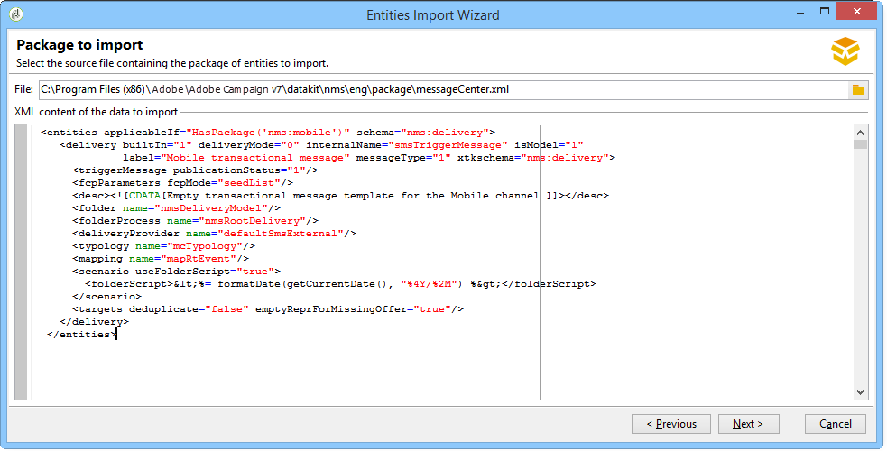

# 安裝Campaign Classic內建套件{#installing-campaign-standard-packages}


## 關於內建套件 {#campaign-standard-packages}

內建套件包含一組功能，可根據您的需求及合約進行安裝。 以下提供Campaign內建套件的完整清單。

>[!CAUTION]
>
>您只能安裝與授權合約中提及之選項對應的套件。
>
>安裝新套件可能會影響您的所有平台：它必須在最終部署之前進行測試和驗證。
>
>安裝套裝軟體後，您就無法解除安裝它。
>
>作為託管或混合客戶，請聯絡Adobe以部署新的內建套件。

若要安裝內建套件：

1. 從存取套件匯入精靈 **[!UICONTROL Tools > Advanced > Import package]** 在Adobe Campaign使用者端主控台中。
1. 選取 **[!UICONTROL Install a standard package]**。
1. 在套件清單中，核取您要安裝的套件。
   >[!NOTE]
   >
   >當套件變灰時，表示已安裝或它不符合您的執行個體。 相容性在下表中詳細說明。
1. 按一下 **[!UICONTROL Next]**，然後 **[!UICONTROL Start]** 以開始安裝封裝。

   安裝套件後，進度列會顯示 **100%** 而且您會在安裝記錄檔中看到下列訊息： **[!UICONTROL Installation of packages successful]**.

1. **[!UICONTROL Close]** 安裝視窗。

套件現在已安裝。

### 現成可用的套件清單 {#list-of-standard-packages}

下表列出所有Campaign內建套件。

<table> 
 <thead> 
  <tr> 
   <th> 套件 </th> 
   <th> 說明 </th> 
   <th> 實例類型 </th>
  </tr> 
 </thead> 
 <tbody> 
  <tr> 
   <td> 傳遞<br /> </td> 
   <td> 監視傳遞，以及傳送訊息時最終遇到的問題。 <a href="../../delivery/using/about-delivery-monitoring.md">了解更多</a><br /> </td> 
   <td> 全部</td> 
  </tr> 
  <tr> 
   <td> 行銷活動（行銷活動）<br /> </td> 
   <td> 定義、最佳化、執行和分析通訊和行銷活動。 <a href="../../campaign/using/designing-marketing-campaigns.md">了解更多</a><br /> </td> 
   <td> 行銷</td>
  </tr> 
  <tr> 
   <td> 行銷資源(MRM)<br /> </td> 
   <td> 藉由提供任務、預算與行銷資源的管理與追蹤，以合作模式控制行銷動作。 <a href="../../mrm/using/about-marketing-resource-management.md">了解更多</a> <br /> </td> 
   <td> 行銷</td> 
  </tr> 
  <tr> 
   <td> 優惠方案引擎（互動）<br /> </td> 
   <td> 在與指定聯絡人（客戶或目標）互動期間即時回應，方法是提供單一或數個已調整的優惠方案。  選填。<a href="../../interaction/using/interaction-and-offer-management.md#packages-configuration">了解更多</a> <br /> </td> 
   <td> 全部<br /> </td> 
  </tr> 
  <tr> 
   <td> 透過執行例項控制優惠方案引擎。 選填。<br /> </td> 
   <td> 要在優惠方案引擎的控制例項上安裝的套件（互動）。 <a href="../../interaction/using/distributed-architectures.md#packages-configuration">了解更多</a> </td> 
   <td> 行銷<br /> </td>  
  </tr> 
  <tr> 
   <td> 執行個體的優惠方案引擎。 選填。<br /> </td> 
   <td> 要在優惠方案引擎的執行例項上安裝的套件（互動）。 <a href="../../interaction/using/distributed-architectures.md">了解更多</a> </td> 
   <td> 中間，執行 <br /> </td>  
  </tr> 
  <!--tr> 
   <td> Lead Management (Leads) (deprecated)<br /> </td> 
   <td> Simplifies the process of building and maintaining the entire leads management life cycle. <br /> </td> 
   <td> Yes<br /> </td> 
   <td> Optional, <a href="https://helpx.adobe.com/campaign/kb/deprecated-and-removed-features.html">Learn More</a> </td> 
  </tr--> 
  <tr> 
   <td> 社交網路（社交行銷） <br /> </td> 
   <td> 同步Adobe Campaign與Twitter和Facebook。 <a href="../../social/using/about-social-marketing.md">了解更多</a> <br /> </td> 
   <td> 全部</td> 
  </tr> 
  <tr> 
   <td> 異動訊息控制（訊息中心 — 控制）<br /> </td> 
   <td> 管理從資訊系統觸發的事件產生的觸發訊息。 選填。<a href="../../message-center/using/about-transactional-messaging.md">了解更多</a> <br /> </td> 
   <td> 行銷<br /> </td> 
  </tr> 
  <tr> 
   <td> 異動訊息執行（訊息中心 — 執行） <br /> </td> 
   <td> 確保更高的可用性和更好的負載管理。 選填。<a href="../../message-center/using/about-transactional-messaging.md">了解更多</a><br /> </td> 
   <td> 執行<br /> </td>
  </tr> 
  <tr> 
   <td> LINE 頻道<br /> </td> 
   <td> 透過Adobe Campaign使用LINE頻道傳送傳遞。 選填。強制異動訊息（訊息中心封裝）。 <a href="../../delivery/using/line-channel.md">了解更多</a> <br /> </td> 
   <td> 全部<br /> </td> 
  </tr> 
  <tr> 
   <td> 直接郵件頻道<br /> </td> 
   <td> 透過Adobe Campaign使用直接郵件通道來傳送傳遞。 選填。<a href="../../delivery/using/about-direct-mail-channel.md">了解更多</a><br /> </td> 
   <td> 全部<br /> </td>
  </tr> 
  <tr> 
   <td> 行動裝置管道 (簡訊) <br /> </td> 
   <td> 透過Adobe Campaign使用行動/簡訊通道傳送傳遞。 選填。<a href="../../delivery/using/sms-channel.md">了解更多</a> <br /> </td> 
   <td> 全部<br /> </td> 
  </tr> 
   <tr> 
   <td> 電話管道<br /> </td> 
   <td> 透過Adobe Campaign使用電話通道傳送傳遞。 用於客服中心。 選填。<a href="../../delivery/using/communication-channels.md">了解更多</a> <br /> </td> 
   <td> 全部<br /> </td> 
  </tr> 
  <tr> 
   <td> 行動應用程式頻道<br /> </td> 
   <td> 使用Adobe Campaign平台，透過應用程式將個人化通知傳送至iOS和Android終端。 選填。<a href="../../delivery/using/about-mobile-app-channel.md">了解更多</a> <br /> </td> 
   <td> 全部<br /> </td> 
  </tr> 
  <tr> 
   <td> 內容管理員<br /> </td> 
   <td> 建立週期性電子報或網站，然後驗證並發佈您的訊息。 <a href="../../delivery/using/about-content-management.md">了解更多</a> <br /> </td> 
   <td> </td>
  </tr> 
  <tr> 
   <td> 線上意見調查（意見調查管理員）<br /> </td> 
   <td> 建立和管理線上表單，以新增或修改設定檔資訊、訂閱、取消訂閱或競爭者輸入表單。 選填。<a href="../../surveys/using/about-surveys.md">了解更多</a> <br /> </td> 
   <td> 行銷<br /> </td> 
  </tr> 
  <tr> 
   <td> Marketing Analytics<br /> </td> 
   <td> 可讓您分析和測量資料、計算統計資料、簡化和最佳化報告建立和計算。 您也可以建立報告並建置目標母體。 選填。<a href="../../reporting/using/ac-cubes.md">了解更多</a><br /> </td> 
   <td> 行銷<br /> </td> 
  </tr> 
  <tr> 
   <td> 回應管理員<br /> </td> 
   <td> 衡量行銷活動的成功和盈利能力，或為所有通訊管道提供建議。  選填。<a href="../../response/using/about-response-manager.md">了解更多</a> <br /> </td> 
   <td> 行銷<br /> </td> 
  </tr> 
  <tr> 
   <td> 存取外部資料（同盟資料存取）<br /> </td> 
   <td> 提供同盟資料存取(FDA)選項，以處理儲存在一或多個外部資料庫中的資訊，因此您無需變更Adobe Campaign資料的結構即可存取外部資料。  選填。<a href="../../workflow/using/accessing-an-external-database--fda-.md">了解更多</a> <br /> </td> 
   <td> 全部<br /> </td> 
  </tr> 
  <tr> 
   <td> 行銷活動最佳化<br /> </td> 
   <td> 控制、篩選及監控傳遞的傳送，使傳送的訊息最符合客戶的需求和期望，並遵守公司的通訊政策。 選填。<a href="../../campaign-opt/using/about-campaign-typologies.md">了解更多</a> <br /> </td> 
   <td> 行銷<br /> </td> 
  </tr> 
  <tr> 
   <td> 傳遞能力監控（電子郵件傳遞能力）<br /> </td> 
   <td> 測量您的行銷活動在到達收件者的收件匣時不會退回或標示為垃圾訊息的成功。 選填。<a href="../../delivery/using/about-deliverability.md">了解更多</a> <br /> </td> 
   <td> 全部 </td> 
  </tr> 
  <tr> 
   <td> 優惠券管理<br /> </td> 
   <td> 建立一組優惠券以新增至即將推出的行銷優惠方案。 選填。<a href="../../delivery/using/personalized-coupons.md">了解更多</a> <br /> </td> 
   <td> 行銷<br /> </td> 
  </tr> 
  <tr> 
   <td> 收件匣轉譯(IR)<br /> </td> 
   <td> 可讓您預覽在可能接收訊息的不同內容中傳送的訊息，並檢查主要案頭和應用程式中的相容性。 選填。<a href="../../delivery/using/inbox-rendering.md">了解更多</a><br /> </td> 
   <td> 行銷<br /> </td> 
  </tr> 
  <tr> 
   <td> 中央/地方行銷（分散式行銷）<br /> </td> 
   <td> 在中央實體（總部、行銷部門等）之間實施合作活動 本地實體 (銷售地點、地區代理等)。 選填。<a href="../../distributed/using/about-distributed-marketing.md">了解更多</a><br /> </td> 
   <td> 行銷 </td> 
  </tr> 
  <tr> 
   <td> CRM 連接器<br /> </td> 
   <td> 提供各種CRM聯結器，用於將您的Adobe Campaign平台連結至您的協力廠商系統。  <a href="../../platform/using/crm-connectors.md">了解更多</a> <br /> </td> 
   <td> 行銷</td> 
  </tr> 
  <tr> 
   <td> 網站分析聯結器<br /> </td> 
   <td> 允許Adobe Campaign和Adobe Analytics透過Web Analytics聯結器套件互動。 與異動訊息（訊息中心封裝）不相容。 <a href="../../platform/using/adobe-analytics-connector.md">了解更多</a><br /> </td> 
   <td> 行銷 </td> 
  </tr> 
  <tr> 
   <td> AEM整合<br /> </td> 
   <td> 可讓您直接在Adobe Experience Manager中管理電子郵件傳送的內容以及表單，以便受益於AEM內容編輯功能以及Adobe Campaign的傳送功能。 <a href="../../integrations/using/about-adobe-experience-manager.md">了解更多</a> <br /> </td> 
   <td> 行銷</td> 
  </tr> 
  <tr> 
   <td> Adobe Experience Cloud共用受眾整合<br /> </td> 
   <td> 可讓您與Adobe Experience Cloud解決方案和核心服務交換及共用對象/區段。 需要IMS。 <a href="../../integrations/using/sharing-audiences-with-adobe-experience-cloud.md">了解更多</a> <br /> </td> 
   <td> 行銷<br /> </td> 
  </tr> 
  <tr> 
   <td> 與Adobe Experience Cloud整合<br /> </td> 
   <td> 可讓您從不同的Adobe Experience Cloud解決方案匯入和匯出對象/區段至Adobe Campaign。 選填。<a href="../../integrations/using/configuring-ims.md#installing-the-package">了解更多</a> </td> 
   <td> 行銷</td> 
  </tr> 
  <tr> 
   <td> 隱私權資料保護法規<br /> </td> 
   <td> 包含可協助您在Campaign Classic中遵循隱私權規範的其他功能。 <a href="https://helpx.adobe.com/tw/campaign/kb/acc-privacy.html">了解更多</a> <br /> </td> 
   <td> 全部</td> 
  </tr> 
  <tr> 
   <td> 轉移至中間來源 <br /> </td> 
   <td> 詳細說明中間來源伺服器的安裝和設定，以及例項的部署，此例項可讓第三方以中間來源模式傳送訊息。 選填。<a href="../../installation/using/mid-sourcing-server.md">了解更多</a> <br /> </td> 
   <td> 行銷 </td> 
  </tr> 
  <tr> 
   <td> 中間來源平台<br /> </td> 
   <td> 此設定是託管(ASP)設定與內部化之間的最佳中繼解決方案。 在Adobe Campaign託管的「中間來源」伺服器上執行向外執行元件。 選填。<a href="../../installation/using/mid-sourcing-server.md">了解更多</a> <br /> </td> 
   <td> 中間來源 </td> 
  </tr> 
  <tr> 
   <td> AMP支援<br /> </td> 
   <td> 可讓您使用新的互動式AMP傳送電子郵件格式，並傳送動態電子郵件。 選填。<a href="../../delivery/using/defining-interactive-content.md">了解更多</a> <br /> </td> 
   <td> 全部 </td> 
  </tr> 
  <tr> 
   <td> ACS聯結器（已棄用）<br /> </td> 
   <td> 橋接Adobe Campaign v7和Adobe Campaign Standard。 這是Campaign v7的整合功能，可自動將資料複製到Campaign Standard，將兩個應用程式的優點整合在一起。 選填。<br /> </td> 
   <td> 行銷 </td> 
  </tr> 
 </tbody> 
</table>

### 訊息中心套件 {#message-center-package}

您必須安裝傳送頻道（電子郵件、行動裝置頻道、行動應用程式頻道、LINE等） 安裝異動訊息（訊息中心封裝）之前。 如果您已開始僅限電子郵件的訊息中心專案，且之後需要新增頻道，您必須依照下列步驟進行：

1. 安裝新的管道，例如 **行動裝置頻道**，使用套件匯入精靈( **[!UICONTROL Tools > Advanced > Import package > Adobe Campaign package]**)。
1. 匯入檔案( **[!UICONTROL Tools > Advanced > Import package > File]**)，然後選取：

   ```
   \datakit\nms\[Your language]\package\messageCenter.xml
   ```

1. 在 **[!UICONTROL XML data content to import]**，僅保留與相關頻道對應的訊息中心傳遞範本。 例如，如果您已新增 **行動裝置頻道**，僅保留 **實體** 與對應的元素 **[!UICONTROL Mobile transactional message]** (smsTriggerMessage)範本。 如果您已新增 **行動應用程式頻道**，僅保留 **iOS交易式訊息** 範本(iosTriggerMessage)和 **Android交易式訊息** (androidTriggerMessage)。

   


### [!DNL LINE] 頻道設定{#line-package}

若要設定 [!DNL LINE] 管道，您必須先安裝 [!DNL LINE] 封裝。

在中間來源設定的內容中，您需要：

* 安裝 [!DNL LINE] 行銷和MID執行個體上的套件

* 設定 [!DNL LINE] mkt執行個體上的外部帳戶，透過變更傳送模式指向中間執行個體。 [了解更多](../../delivery/using/line-channel.md#configure-line-external)

* 設定 [!DNL LINE] MID執行個體的外部帳戶中的認證。

>[!CAUTION]
>
>的訊息中心傳遞範本 [!DNL LINE] 如果之前已安裝訊息中心套件，則無法使用頻道 [!DNL LINE].