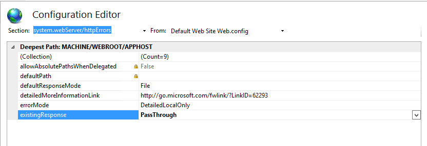

# 與 Windows 版 Web 伺服器整合{#integration-into-a-web-server-for-windows}


Adobe Campaign包含Apache Tomcat，可透過HTTP（和SOAP）作為應用程式伺服器中的入口點。

您可以使用此整合的Tomcat伺服器來處理HTTP請求。

在此情況下：

* 預設監聽埠為8080。 若要變更，請參閱 [本節](../../installation/using/configure-tomcat.md).
* 然後，用戶端主控台會使用URL(例如 [https:// `<computer>`:8080](https://myserver.adobe.com:8080).

但是，出於安全和管理原因，我們建議使用專用的Web伺服器作為HTTP通信的主要入口點，因為運行Adobe Campaign的電腦在Internet上被公開，並且您希望開啟對網路外部控制台的訪問。

Web伺服器也可讓您透過HTTPs通訊協定保證資料機密性。

同樣地，當您想使用追蹤功能時，必須使用Web伺服器，這僅能作為Web伺服器擴充模組使用。

>[!NOTE]
>
>如果您未使用追蹤功能，則可執行Apache或IIS的標準安裝，並重新導向至Campaign。 不需要追蹤Web伺服器擴充模組。

## 配置IIS Web伺服器 {#configuring-the-iis-web-server}

IIS Web伺服器的配置過程大多是圖形的。 它涉及使用網站（已建立或待建立）來存取Adobe Campaign伺服器的資源：Java(.jsp)檔案、樣式表(.css、.xsl)、影像(.png)、用於重定向的ISAPI DLL等。

以下各節詳細介紹IIS 7中的配置。 IIS8的配置基本相同。

如果電腦上尚未安裝Web IIS伺服器，則可以通過 **[!UICONTROL Add > Remove Programs > Enable or disable Windows functionalities]** 功能表。

在IIS 7中，除了標準服務外，您還需要安裝ISAPI擴充功能和ISAPI篩選器。


### 設定步驟 {#configuration-steps}

套用下列設定步驟：

1. 通過 **[!UICONTROL Control panel > Administrative tools > Services]** 功能表。
1. 根據網路參數（TCP連接埠、DNS主機、IP地址）建立和配置站點(例如Adobe Campaign)。

   

   至少必須指定站點名稱和虛擬目錄的訪問路徑。 由於未使用訪問Website目錄的路徑，因此可以使用以下目錄。

   ```
   C:\inetpub\wwwroot
   ```

   

1. A **VBS** 指令碼可讓您在我們剛建立的虛擬目錄上自動配置Adobe Campaign伺服器使用的資源。 若要啟動，請連按兩下 **iis_neolane_setup.vbs** 檔案 `[INSTALL]\conf` 資料夾，其中 `[INSTALL]` 是存取Adobe Campaign安裝資料夾的路徑。

   

   >[!NOTE]
   >
   >如果安裝了Windows server 2008/IIS7，您必須以管理員身份登錄才能運行VBS指令碼或以管理員身份執行指令碼。

   按一下 **[!UICONTROL OK]** 如果Web伺服器用作跟蹤重定向伺服器，則按一下 **[!UICONTROL Cancel]**.

   當Web伺服器上已配置多個站點時，將顯示一個中間頁，以指定安裝應用於哪個網站：輸入連結到該網站的號碼，然後按一下 **[!UICONTROL OK]**.

   

   應顯示確認訊息：

   

1. 在 **[!UICONTROL Content View]** 標籤，確認網站已正確設定Adobe Campaign資源：

   

   如果未顯示樹，請重新啟動IIS。

### 管理權限 {#managing-rights}

接下來，必須配置ISAPI DLL和Adobe Campaign安裝目錄中資源的安全設定。

若要這麼做，請套用下列步驟：

1. 選取 **[!UICONTROL Features View]** 按兩下 **驗證** 連結。

   

1. 在 **目錄安全** 頁簽，確保已啟用匿名訪問。 如有必要，請按一下 **[!UICONTROL Edit]** 連結以變更設定。

   

### 啟動Web伺服器並測試配置 {#launching-the-web-server-and-testing-the-configuration}

您現在必須測試設定是否正確。

要執行此操作，請應用以下過程：

1. 使用 **isreset** 命令行。

1. 啟動Adobe Campaign服務，然後確定其執行中。

1. 在網頁瀏覽器中插入下列URL以測試追蹤模組：

   ```
   https://<computer>/r/test
   ```

   瀏覽器應顯示下列回應：

   ```
   <redir status='OK' date='YYYY/MM/DD HH:MM:SS' build='XXXX' host='myserver.mydomain.com' localHost='localhost'/>
   ```

要測試重定向模組是否存在，請運行以下命令行：

```
nlserver pdump
```

它必須傳回下列資訊：

```
12:00:33 >   Application server for Adobe Campaign Classic (7.X YY.R build XXX@SHA1) of DD/MM/YYYY
webmdl@default (1644) - 18.2 Mo
```

您也可以確保ISAPI DLL已正確載入。

若要這麼做，請套用下列步驟：

1. 按一下 **[!UICONTROL Driver mapping]** 表徵圖。
1. 檢查ISAPI篩選器的內容：

   

## 其他設定 {#additional-configurations}

### 變更上傳檔案大小限制 {#changing-the-upload-file-size-limit}

配置IIS Web伺服器時，將自動對上載到伺服器的設定檔案設定約28 MB的限制。

這在Adobe Campaign中可能會有影響，尤其是如果您想要上傳超過此限制的檔案。

例如，如果您使用 **資料載入（檔案）** 在工作流程中輸入活動以匯入50 MB檔案，錯誤會使工作流程無法正確執行。

在此情況下，您必須提高此限制：

1. 通過 **[!UICONTROL Start > (Control panel) > Administration tools]** 功能表。
1. 在 **連線** ，選擇為Adobe安裝建立的站點，然後按兩下 **請求篩選** 的下一頁。
1. 在 **動作** 窗格，選擇 **編輯功能設定** 可編輯 **最大授權內容大小（位元組）** 欄位。

   例如，若要授權上傳50 MB的檔案，您必須指定大於&quot;52428800&quot;位元組的值。

>[!NOTE]
>
>有關此IIS選項的詳細資訊，請參閱 [官方檔案](https://www.iis.net/configreference/system.webserver/security/requestfiltering/requestlimits).

### 配置http錯誤消息顯示 {#configuring-http-error-message-display}

如果您使用6.1版IIS伺服器，則生成的錯誤消息可能很難讀取，因為消息中顯示了不適當的HTML代碼。

若要修正此問題並正確顯示錯誤，請套用下列設定：

1. 通過 **[!UICONTROL Start > Control Panel > Administrative tools]** 功能表。
1. 在 **連線** ，選擇為Adobe Campaign安裝建立的站點，然後按兩下 **配置編輯器** 的下一頁。
1. 在 **區段** 下拉清單，選擇 **system.webServer** > **httpErrors**.
1. 選取 **傳遞** 值 **existingResponse** 行。


