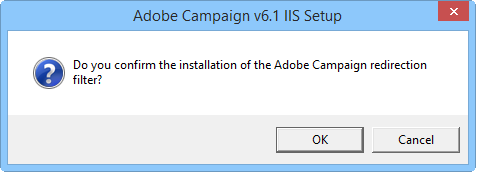

# 與 Windows 版 Web 伺服器整合{#integration-into-a-web-server-for-windows}


Adobe Campaign包括Apache Tomcat，它通過HTTP（和SOAP）作為應用伺服器的入口點。

可以使用此整合的Tomcat伺服器來服務HTTP請求。

在本例中：

* 預設監聽埠為8080。 要更改它，請參閱 [此部分](../../installation/using/configure-tomcat.md)。
* 然後客戶端控制台使用URL進行連接，如 ```https:// `<computer>`:8080```。

但是，出於安全和管理原因，我們建議使用專用的Web伺服器作為HTTP通信的主要入口點，因為運行Adobe Campaign的電腦在Internet上被暴露，並且您希望開啟對網路外部控制台的訪問。

Web伺服器還允許您使用HTTP協定保證資料機密性。

同樣，當您希望使用跟蹤功能時，必須使用Web伺服器，該功能僅作為Web伺服器擴展模組可用。

>[!NOTE]
>
>如果不使用跟蹤功能，則可以執行Apache或IIS的標準安裝，並重定向到市場活動。 不需要跟蹤Web伺服器擴展模組。

## 配置IIS Web伺服器 {#configuring-the-iis-web-server}

IIS Web伺服器的配置過程大多是圖形化的。 它涉及使用網站（已建立或待建立）訪問Adobe Campaign伺服器的資源：Java(.jsp)檔案、樣式表(.css、.xsl)、影像(.png)、重定向的ISAPI DLL等。

以下各節詳細介紹了IIS 7中的配置。 IIS8的配置基本相同。

如果您的電腦上尚未安裝Web IIS伺服器，則可以通過 **[!UICONTROL Add > Remove Programs > Enable or disable Windows functionalities]** 的子菜單。

在IIS 7中，除了標準服務外，您還需要安裝ISAPI擴展和ISAPI篩選器。


### 設定步驟 {#configuration-steps}

應用以下配置步驟：

1. 通過 **[!UICONTROL Control panel > Administrative tools > Services]** 的子菜單。
1. 根據網路參數（TCP連接埠、DNS主機、IP地址）建立和配置站點(例如Adobe Campaign)。

   

   必須至少指定站點名稱和虛擬目錄的訪問路徑。 由於未使用訪問網站目錄的路徑，因此可以使用以下目錄。

   ```
   C:\inetpub\wwwroot
   ```

   

1. A **VBS** 指令碼使您能夠自動配置Adobe Campaign伺服器在我們剛剛建立的虛擬目錄上使用的資源。 要啟動它，請按兩下 **iis_neolane_setup_vbs** 檔案 `[INSTALL]\conf` 資料夾，其中 `[INSTALL]` 是訪問Adobe Campaign安裝資料夾的路徑。

   

   >[!NOTE]
   >
   >在安裝Windows server 2008/IIS7時，必須以管理員身份登錄才能運行VBS指令碼或以管理員身份執行指令碼。

   按一下 **[!UICONTROL OK]** 如果Web伺服器用作跟蹤重定向伺服器，則按一下 **[!UICONTROL Cancel]**。

   在Web伺服器上已配置了多個站點時，將顯示一個中間頁，以指定安裝應用於哪個網站：輸入連結到站點的號碼，然後按一下 **[!UICONTROL OK]**。

   

   應顯示確認消息：

   

1. 在 **[!UICONTROL Content View]** 頁籤，確保網站已正確配置Adobe Campaign資源：

   

   如果未顯示樹，請重新啟動IIS。

### 管理權限 {#managing-rights}

接下來，必須配置ISAPI DLL和Adobe Campaign安裝目錄中資源的安全設定。

若要這麼做，請套用下列步驟：

1. 選擇 **[!UICONTROL Features View]** 按鈕 **驗證** 的子菜單。

   

1. 在 **目錄安全** 頁籤，確保已啟用匿名訪問。 如有必要，請按一下 **[!UICONTROL Edit]** 連結以更改設定。

   

### 啟動Web伺服器並測試配置 {#launching-the-web-server-and-testing-the-configuration}

您現在必須test配置是否正確。

要執行此操作，請應用以下過程：

1. 使用 **isreset** 命令行。

1. 啟動Adobe Campaign服務，然後確保它正在運行。

1. Test跟蹤模組，將以下URL插入Web瀏覽器：

   ```
   https://<computer>/r/test
   ```

   瀏覽器應顯示以下響應：

   ```
   <redir status='OK' date='YYYY/MM/DD HH:MM:SS' build='XXXX' host='myserver.mydomain.com' localHost='localhost'/>
   ```

要test重定向模組是否存在，請運行以下命令行：

```
nlserver pdump
```

它必須返回以下資訊：

```
12:00:33 >   Application server for Adobe Campaign Classic (7.X YY.R build XXX@SHA1) of DD/MM/YYYY
webmdl@default (1644) - 18.2 Mo
```

您還可以確保正確載入了ISAPI DLL。

若要這麼做，請套用下列步驟：

1. 通過按一下 **[!UICONTROL Driver mapping]** 表徵圖
1. 檢查ISAPI篩選器的內容：

   

## 其他設定 {#additional-configurations}

### 更改上載檔案大小限制 {#changing-the-upload-file-size-limit}

配置IIS Web伺服器時，將自動對上載到伺服器的設定檔案限制約28 MB。

這可能會在Adobe Campaign產生影響，尤其是如果您想上載大於此限制的檔案。

例如，如果 **資料載入（檔案）** 在工作流中鍵入activity以導入50 MB檔案，錯誤將停止工作流正確執行。

在這種情況下，您必須增加此限制：

1. 通過 **[!UICONTROL Start > (Control panel) > Administration tools]** 的子菜單。
1. 在 **連接** ，選擇為Adobe安裝建立的站點，然後按兩下 **請求篩選** 的上界。
1. 在 **操作** 框，選擇 **編輯功能設定** 可編輯 **最大授權內容大小（位元組）** 的子菜單。

   例如，要授權上載50 MB的檔案，必須指定大於「52428800」位元組的值。

>[!NOTE]
>
>有關此IIS選項的詳細資訊，請參閱「How To（如何操作）」部分 [正式檔案](https://www.iis.net/configreference/system.webserver/security/requestfiltering/requestlimits)。

### 配置http錯誤消息顯示 {#configuring-http-error-message-display}

如果使用6.1版IIS伺服器，則可能難以讀取生成的錯誤消息，因為消息中顯示了不希望的HTML代碼。

要修復此問題並正確顯示錯誤，請應用以下配置：

1. 通過 **[!UICONTROL Start > Control Panel > Administrative tools]** 的子菜單。
1. 在 **連接** ，選擇為Adobe Campaign安裝建立的站點，然後按兩下 **配置編輯器** 的上界。
1. 在 **節** 下拉清單，選擇 **system.webServer** > **http錯誤**。
1. 選擇 **傳遞** 值 **現有響應** 。


