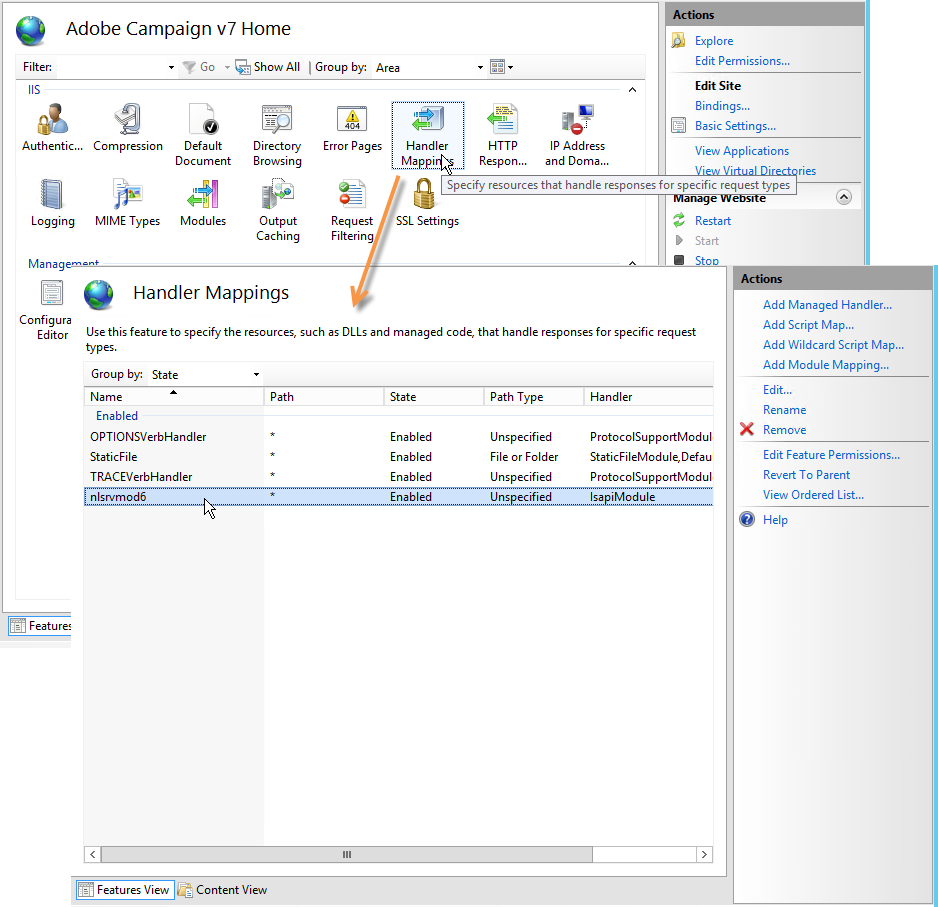

# 與 Windows 版 Web 伺服器整合{#integration-into-a-web-server-for-windows}

Adobe Campaign包含Apache Tomcat，它可透過HTTP（和SOAP）在應用程式伺服器中當做入口點。

您可以使用此整合的Tomcat伺服器來服務HTTP請求。

在本例中：

* 預設監聽埠為8080。 要更改它，請參閱[本節](../../installation/using/configure-tomcat.md)。
* 然後，客戶端控制台使用[https:// `<computer>`:8080](https://myserver.adobe.com:8080)等URL進行連接。

但是，出於安全和管理原因，我們建議使用專用的Web伺服器作為HTTP通信的主要入口點，因為運行Adobe Campaign的電腦在Internet上被公開，並且您希望開啟對網路外部控制台的訪問。

Web伺服器也可讓您使用HTTP通訊協定來保證資料的機密性。

同樣地，當您想要使用追蹤功能時，必須使用Web伺服器，此功能僅能做為Web伺服器擴充模組使用。

>[!NOTE]
>
>如果您不使用追蹤功能，則可執行Apache或IIS的標準安裝，並重新導向至促銷活動。 不需要追蹤Web伺服器擴充模組。

## 配置IIS Web伺服器{#configuring-the-iis-web-server}

IIS Web伺服器的配置過程大多是圖形化的。 它涉及使用網站（已建立或正在建立）訪問Adobe Campaign伺服器的資源：Java(.jsp)檔案、樣式表(.css、.xsl)、影像(.png)、用於重新導向的ISAPI DLL等。

IIS 7中的以下章節詳細配置。 IIS8的組態基本相同。

如果電腦上尚未安裝Web IIS伺服器，則可通過&#x200B;**[!UICONTROL Add > Remove Programs > Enable or disable Windows functionalities]**&#x200B;菜單進行安裝。

在IIS 7中，除了標準服務外，您還需要安裝ISAPI擴充功能和ISAPI篩選器。


### 配置步驟 {#configuration-steps}

套用下列設定步驟：

1. 通過&#x200B;**[!UICONTROL Control panel > Administrative tools > Services]**&#x200B;菜單開啟IIS。
1. 根據網路參數（TCP連接埠、DNS主機、IP地址）建立和配置站點(例如Adobe Campaign)。

   

   您至少必須指定站點的名稱和到虛擬目錄的訪問路徑。 由於不使用用於訪問「網站」目錄的路徑，因此您可以使用以下目錄。

   ```
   C:\inetpub\wwwroot
   ```

   

1. **VBS**&#x200B;指令碼允許您自動配置我們剛建立的虛擬目錄上的Adobe Campaign伺服器所使用的資源。 若要啟動它，請連按兩下位於`[INSTALL]\conf`資料夾中的&#x200B;**iis_neolane_setup.vbs**&#x200B;檔案，其中`[INSTALL]`是存取Adobe Campaign安裝資料夾的路徑。

   

   >[!NOTE]
   >
   >在安裝Windows伺服器2008/IIS7時，您必須以管理員身份登錄才能運行VBS指令碼或以管理員身份執行指令碼。

   如果Web伺服器用作跟蹤重定向伺服器，請按一下&#x200B;**[!UICONTROL OK]** ，否則按一下&#x200B;**[!UICONTROL Cancel]**。

   當網站伺服器上已設定多個網站時，會顯示一個中介頁面，以指定安裝套用至哪個網站：輸入連結至網站的編號，然後按一下&#x200B;**[!UICONTROL OK]**。

   

   應顯示確認消息：

   

1. 在&#x200B;**[!UICONTROL Content View]**&#x200B;標籤中，確保網站已正確配置Adobe Campaign資源：

   

   如果未顯示樹，請重新啟動IIS。

### 管理權限 {#managing-rights}

接下來，您必須為ISAPI DLL和Adobe Campaign安裝目錄中的資源配置安全設定。

若要這麼做，請套用下列步驟：

1. 選擇&#x200B;**[!UICONTROL Features View]**&#x200B;頁籤，並按兩下&#x200B;**Authentication**&#x200B;連結。

   

1. 在網站的&#x200B;**目錄安全性**&#x200B;標籤中，請確定已啟用匿名存取。 如有必要，請按一下&#x200B;**[!UICONTROL Edit]**&#x200B;連結以變更設定。

   

### 啟動Web伺服器並測試配置{#launching-the-web-server-and-testing-the-configuration}

您現在必須測試此設定是否正確。

若要這麼做，請套用下列程式：

1. 使用&#x200B;**iisreset**&#x200B;命令行重新啟動IIS伺服器。
1. 將下列URL插入網頁瀏覽器，以測試追蹤模組：

   ```
   https://<computer>/r/test
   ```

   瀏覽器應顯示下列回應：

   ```
   <redir status='OK' date='YYYY/MM/DD HH:MM:SS' build='XXXX' host='myserver.mydomain.com' localHost='localhost'/>
   ```

要測試重定向模組是否存在，請運行以下命令行：

```
nlserver pdump
```

它必須傳回下列資訊：

```
12:00:33 >   Application server for Adobe Campaign Classic (7.X YY.R build XXX@SHA1) of DD/MM/YYYY
webmdl@default (1644) - 18.2 Mo
```

您也可以確定ISAPI DLL已正確載入。

若要這麼做，請套用下列步驟：

1. 按一下&#x200B;**[!UICONTROL Driver mapping]**&#x200B;圖示，編輯Adobe Campaign網站的ISAPI篩選器。
1. 檢查ISAPI篩選器的內容：

   

## 其他配置 {#additional-configurations}

### 變更上傳檔案大小限制{#changing-the-upload-file-size-limit}

配置IIS Web伺服器時，將自動為上載到伺服器的設定檔案設定大約28 MB的限制。

這可能會在Adobe Campaign產生影響，尤其如果您想要上傳超過此限制的檔案。

例如，如果您在工作流中使用&#x200B;**資料載入（檔案）**&#x200B;類型活動來匯入50 MB的檔案，則錯誤會導致工作流程無法正確執行。

在這種情況下，您必須提高此限制：

1. 通過&#x200B;**[!UICONTROL Start > (Control panel) > Administration tools]**&#x200B;菜單開啟IIS。
1. 在&#x200B;**Connections**&#x200B;窗格中，選擇為Adobe安裝建立的站點，然後按兩下主窗格中的&#x200B;**Request Filtering**。
1. 在&#x200B;**Actions**&#x200B;窗格中，選擇&#x200B;**Edit Feature Settings**&#x200B;以便能夠編輯&#x200B;**Maximum authorized content size(bytes)**&#x200B;欄位中的值。

   例如，若要授權上傳50 MB的檔案，您必須指定超過&quot;52428800&quot;位元組的值。

>[!NOTE]
>
>有關此IIS選項的詳細資訊，請參閱[官方文檔](https://www.iis.net/configreference/system.webserver/security/requestfiltering/requestlimits)的「How To」（如何操作）部分。

### 配置http錯誤消息顯示{#configuring-http-error-message-display}

如果您使用6.1版IIS伺服器，由於訊息中顯示不想要的HTML程式碼，所產生的錯誤訊息可能難以讀取。

若要修正此問題並正確顯示錯誤，請套用下列設定：

1. 通過&#x200B;**[!UICONTROL Start > Control Panel > Administrative tools]**&#x200B;菜單開啟IIS。
1. 在&#x200B;**連接**&#x200B;窗格中，選擇為Adobe Campaign安裝建立的站點，然後在主窗格中按兩下&#x200B;**配置編輯器**。
1. 在&#x200B;**Section**&#x200B;下拉清單中，選擇&#x200B;**system.webServer** > **httpErrors**。
1. 在&#x200B;**existingResponse**&#x200B;行選擇&#x200B;**PassThrough**&#x200B;值。


