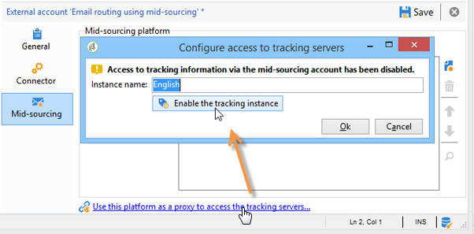

# 中間來源伺服器{#mid-sourcing-server}


本節詳細介紹了中間採購伺服器的安裝和配置，以及使第三方能夠在中發送消息的實例的部署 **中間採購** 的子菜單。

「中間採購」體系結構 [中間採購部署](../../installation/using/mid-sourcing-deployment.md)。

安裝中間採購伺服器與以正常方式安裝伺服器的過程相同（請參閱標準配置）。 它是一個獨立實例，具有自己的資料庫，可用於運行交貨。 簡言之，它包含額外的配置，允許遠程實例在中間採購模式下通過它執行交貨。

>[!CAUTION]
>
>中間採購伺服器設定完成後， [同步工作流](../../workflow/using/about-technical-workflows.md) 已首次運行，請確保不更新中間來源補充外部帳戶的內部名稱。

## 安裝和配置實例的步驟 {#steps-for-installing-and-configuring-an-instance}

### 安裝和配置實例的先決條件 {#prerequisites-for-installing-and-configuring-an-instance}

* 應用程式伺服器上的JDK。
* 訪問應用程式伺服器上的資料庫伺服器。
* 防火牆配置為向中間採購伺服器開啟HTTP(80)或HTTPS(443)埠。

以下過程詳細描述了使用單個中間採購伺服器的配置。 還可以使用多個伺服器。 同樣，也可以從內部配置發送某些消息（例如工作流通知）。

### 安裝和配置應用程式伺服器以進行中間採購部署 {#installing-and-configuring-the-application-server-for-mid-sourcing-deployment}

安裝過程與獨立實例的安裝過程相同。 請參閱 [安裝和配置（單台電腦）](../../installation/using/standalone-deployment.md#installing-and-configuring--single-machine-)。

但是，必須應用以下內容：

* 步驟 **5**，必須禁用 **門** （交付）及 **郵件** （郵件退回）模組。 的 **wf伺服器** （工作流）模組必須保持激活狀態。

   ```
   <?xml version='1.0'?>
   <serverconf>  
     <shared>    
       <!-- add lang="eng" to dataStore to force English for the instance -->    
       <dataStore hosts="console.campaign.net*">      
         <mapping logical="*" physical="default"/>    
       </dataStore>  </shared>  
       <mta autoStart="false"/>  
       <wfserver autoStart="true"/>  
       <inMail autoStart="false"/>  
       <sms autoStart="false"/>  
       <listProtect autoStart="false"/>
   </serverconf>
   ```

   如需詳細資訊，請參閱[本章節](../../installation/using/configuring-campaign-server.md#enabling-processes)。

* 步驟 **6**。 **9** 和 **10** 沒必要。
* 步驟 **12** 和 **13**，需要在連接URL中指示8080埠（因為控制台直接與Tomcat通信，而不是通過Web伺服器）。 URL變為 `http://console.campaign.net:8080`。 步驟期間 **13**，選擇 **[!UICONTROL Issue towards Mid-sourcing]** 以及要安裝的軟體包。

   

   >[!CAUTION]
   >
   >技術交貨的預設傳送方式自動替換為通過中間來源補充的電子郵件傳送方式。

### 安裝和配置中間採購伺服器 {#installing-and-configuring-the-mid-sourcing-server}

從客戶端控制台中，找到 **使用中間採購的電子郵件路由** 中間來源補充帳戶(在 **/管理/外部帳戶/** 資料夾)。 填充 **伺服器的URL**。 **帳戶**。 **密碼** 和 **鏡像頁URL** 設定。 測試連線。

>[!NOTE]
>
>的 **中sourcingEmitter** 選項建立兩個 **中間採購** 工作流。 預設情況下，該流程每1小時20分鐘運行一次，並在中間採購伺服器上收集交貨資訊。

## 部署中間採購伺服器 {#deploying-a-mid-sourcing-server}

1. 正在安裝應用程式伺服器：

   >[!CAUTION]
   >
   >如果您安裝中間採購伺服器並想安裝額外的Adobe Campaign模組，建議使用「交貨」模組而不是「市場活動」模組。

   按照與標準部署相同的步驟，僅選擇 **[!UICONTROL Mid-sourcing platform]** 的雙曲餘切值。

   

1. 用於在中間採購模式下接收的配置

   設定提交帳戶密碼：在 **/中間採購/訪問管理/操作員/** 資料夾 **中** 遠程實例在中間採購模式下使用operator進行提交。 必須為此操作員設定密碼，並將其提供給提交實例的管理員。

   的 **中間採購平台** 選項建立用於儲存提交的交貨的預設資料夾以及執行提交的預設運算子。

## 多路復用中間採購伺服器 {#multiplexing-the-mid-sourcing-server}

>[!CAUTION]
>
>只支援內部環境的多路傳輸。

中間採購實例可能由多個提交實例共用。 這些實例中的每個實例都需要與中間採購資料庫中的運算子相關聯。 要在中間採購伺服器上建立第二個帳戶：

1. 在 **[!UICONTROL Mid-sourcing > Deliveries]** 與預設中間採購帳戶關聯的節點(例如：prod)。
1. 在 **[!UICONTROL Mid-sourcing > Deliveries]** 與帳戶同名的節點(例如：acception_test)。

   

1. 在 **[!UICONTROL Mid-sourcing > Access Management > Operators]**，建立新帳戶。

   

1. 在 **[!UICONTROL Access rights]** 頁籤，授予此運算子 **中間採購提交** 組。 此訪問權限在 **[!UICONTROL Mid-sourcing > Access Management > Operator groups]**。

   

1. 選擇 **[!UICONTROL Restrict to data in the sub-folders of]** 選項，然後選擇交貨資料夾以將此運算子限制為中間來源補充交貨資料夾。

   

1. 使用以下命令重新啟動Web模組： **nlserver restart web**。

必須更改serverConf.xml檔案中的中間採購伺服器設定。 必須在現有行的「IP地址關聯管理」部分添加以下行：

```
<IPAffinity IPMask="" localDomain="" name=""/>
```

「@name」屬性必須遵守以下規則：

**&#39;marketing_account_operator_name&#39;。&#39;affinity_name&#39;。&#39;affinity_group**

「marketing_account_operator_name」與在中間來源補充實例中聲明的中間來源補充帳戶的內部名稱相關。

「affinity_name」與指定給關聯的任意名稱相關。 此名稱必須唯一。 授權字元為 `[a-z]``[A-Z]``[0-9]`。 目的是聲明一組公共IP地址。

「affinity_group」與在每個遞送中使用的目標映射中聲明的子關聯相關。 最後一部分包括「。」 如果沒有子關聯，則忽略。 授權字元為 `[a-z]``[A-Z]``[0-9]`。

必須停止並重新啟動伺服器，才能將修改考慮在內。

## 在中間採購伺服器上配置跟蹤 {#configuring-tracking-on-a-mid-sourcing-server}

**配置中間採購伺服器**

1. 轉到「運算子」並選擇運算子 **[!UICONTROL mid]**。
1. 在 **[!UICONTROL Frontal servers]** 頁籤，輸入跟蹤伺服器連接參數。

   要建立跟蹤實例，請輸入跟蹤伺服器的URL、跟蹤伺服器內部帳戶密碼以及該實例的名稱、其密碼以及與其關聯的DNS掩碼。

   

1. 輸入連接參數後，按一下 **[!UICONTROL Confirm the configuration]**。
1. 如有必要，請指定要儲存遞送中包含的影像的位置。 為此，請從下拉清單中選擇一種發佈模式。

   

   如果選擇 **[!UICONTROL Tracking server(s)]** 選項，映像將複製到中間採購伺服器上。

**配置客戶平台**

1. 轉至外部中間採購工藝路線帳戶。
1. 在 **[!UICONTROL Mid-Sourcing]** 頁籤，指定中間採購伺服器連接參數。

   

1. 通過按一下 **[!UICONTROL Test the connection]**。
1. 聲明中間採購伺服器上引用的跟蹤實例：

   按一下連結 **[!UICONTROL Use this platform as a proxy to access the tracking servers]**。

   指定跟蹤實例的名稱，然後確認與跟蹤伺服器的連接。

   

如果郵件的傳遞要由幾個中間採購伺服器管理，請選擇該選項 **[!UICONTROL Routing with alternating mid-sourcing accounts]** 並指定不同的伺服器。


