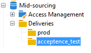

# 中間來源伺服器{#mid-sourcing-server}


本節詳細說明中間來源伺服器的安裝和組態，以及可讓協力廠商以&#x200B;**中間來源**&#x200B;模式傳送訊息的執行個體部署。

在[中間來源部署](../../installation/using/mid-sourcing-deployment.md)中顯示「中間來源」架構。

安裝中間來源伺服器的程式與以正常方式安裝伺服器的程式相同（請參閱標準設定）。 它是一個有自己的資料庫的獨立執行個體，可用來執行傳送。 簡言之，它包含額外的設定，可讓遠端執行個體在中間來源模式下透過它執行傳遞。

>[!CAUTION]
>
>設定中間來源伺服器且[同步工作流程](../../workflow/using/about-technical-workflows.md)首次執行後，請確定您未更新中間來源外部帳戶的內部名稱。

## 安裝和設定執行個體的步驟 {#steps-for-installing-and-configuring-an-instance}

### 安裝和設定執行個體的先決條件 {#prerequisites-for-installing-and-configuring-an-instance}

* 應用程式伺服器上的JDK。
* 存取應用程式伺服器上的資料庫伺服器。
* 防火牆已設定為開啟HTTP (80)或HTTPS (443)連線埠至中間來源伺服器。

下列程式詳細說明使用單一中間來源伺服器的組態。 也可以使用多個伺服器。 同樣地，也可以從內部設定傳送特定訊息（例如工作流程通知）。

### 為中間來源部署安裝和設定應用程式伺服器 {#installing-and-configuring-the-application-server-for-mid-sourcing-deployment}

安裝程式與獨立執行處理的程式相同。 請參閱[安裝和設定（單一電腦）](../../installation/using/standalone-deployment.md#installing-and-configuring--single-machine-)。

不過，您必須套用下列專案：

* 在步驟&#x200B;**5**，您必須停用&#x200B;**mta** （傳遞）和&#x200B;**inMail** （退回郵件）模組。 但是，**wfserver** （工作流程）模組必須保持啟用狀態。

  ```
  <?xml version='1.0'?>
  <serverconf>  
    <shared>    
      <!-- add lang="eng" to dataStore to force English for the instance -->    
      <dataStore hosts="console.campaign.net*">      
        <mapping logical="*" physical="default"/>    
      </dataStore>  </shared>  
      <mta autoStart="false"/>  
      <wfserver autoStart="true"/>  
      <inMail autoStart="false"/>  
      <sms autoStart="false"/>  
      <listProtect autoStart="false"/>
  </serverconf>
  ```

  如需詳細資訊，請參閱[本章節](../../installation/using/configuring-campaign-server.md#enabling-processes)。

* 不需要步驟&#x200B;**6**、**9**&#x200B;和&#x200B;**10**。
* 在步驟&#x200B;**12**&#x200B;和&#x200B;**13**&#x200B;中，您必須在連線URL中指定8080連線埠（因為主控台直接與Tomcat通訊，而不是透過Web伺服器通訊）。 URL會變成`http://console.campaign.net:8080`。 在步驟&#x200B;**13**&#x200B;中，選取&#x200B;**[!UICONTROL Issue towards Mid-sourcing]**&#x200B;封裝以及要安裝的封裝。

  

  >[!CAUTION]
  >
  >透過中間來源的電子郵件路由會自動取代技術傳遞的預設路由。

### 安裝和設定中間來源伺服器 {#installing-and-configuring-the-mid-sourcing-server}

從使用者端主控台，使用中間來源&#x200B;**中間來源帳戶（在**/Administration/External accounts/**資料夾中）尋找**&#x200B;電子郵件路由。 使用裝載中間來源伺服器的伺服器提供者所提供的資訊填入伺服器&#x200B;**、**&#x200B;帳戶&#x200B;**、**&#x200B;密碼&#x200B;**和**&#x200B;映象頁面URL **設定的** URL。 測試連線。

>[!NOTE]
>
>**mid-sourcingEmitter**&#x200B;選項會建立兩個&#x200B;**中間來源**&#x200B;工作流程。 此程式預設為每1小時20分鐘執行一次，並收集中間來源伺服器上的傳遞資訊。

## 部署中間來源伺服器 {#deploying-a-mid-sourcing-server}

1. 安裝應用程式伺服器：

   >[!CAUTION]
   >
   >如果您安裝中間來源伺服器並想要安裝額外的Adobe Campaign模組，建議您使用傳送模組，而不要使用促銷活動模組。

   遵循與標準部署相同的程式，只選取&#x200B;**[!UICONTROL Mid-sourcing platform]**&#x200B;選項。

   

1. 用於以中間來源模式接收的設定

   設定提交帳戶密碼：在&#x200B;**/Mid-sourcing/Access Management/Operators/**&#x200B;資料夾中，**mid**&#x200B;運運算元由遠端執行個體用於以中間來源模式提交。 您必須設定此運運算元的密碼，並將其提供給提交執行個體的管理員。

   **中間來源平台**&#x200B;選項會建立預設資料夾以儲存提交的傳遞和執行提交的預設運運算元。

## 多工處理中間來源伺服器 {#multiplexing-the-mid-sourcing-server}

>[!CAUTION]
>
>僅內部部署環境支援多工處理。

多個提交執行個體可共用中間來源執行個體。 這些執行個體中的每一個都需要與中間來源資料庫中的運運算元相關聯。 若要在中間來源伺服器上建立第二個帳戶：

1. 在&#x200B;**[!UICONTROL Mid-sourcing > Deliveries]**&#x200B;節點中建立將與預設中間來源帳戶（例如：prod）關聯的資料夾。
1. 在&#x200B;**[!UICONTROL Mid-sourcing > Deliveries]**&#x200B;節點中建立與帳戶同名的資料夾（例如：acception_test）。

   

1. 在&#x200B;**[!UICONTROL Mid-sourcing > Access Management > Operators]**&#x200B;中建立新帳戶。

   

1. 在&#x200B;**[!UICONTROL Access rights]**&#x200B;索引標籤中，賦予此運運算元&#x200B;**中間來源提交**&#x200B;群組的權利。 此存取權在&#x200B;**[!UICONTROL Mid-sourcing > Access Management > Operator groups]**&#x200B;中可用。

   

1. 選取&#x200B;**[!UICONTROL Restrict to data in the sub-folders of]**&#x200B;選項並選取傳遞資料夾，將此運運算元限製為中間來源傳遞資料夾。

   

1. 使用下列命令重新啟動Web模組： ** web**。

您必須變更serverConf.xml檔案中的中間來源伺服器設定。 下列行必須新增至「管理IP位址的相似性」區段（位於現有行下）：

```
<IPAffinity IPMask="" localDomain="" name=""/>
```

&#39;@name&#39;屬性必須符合下列規則：

**&#39;marketing_account_operator_name&#39;.&#39;親和性名稱。&#39;affinity_group&#39;**

&#39;marketing_account_operator_name&#39;與中間來源執行個體中宣告的中間來源帳戶的內部名稱相關。

&#39;affinity_name&#39;與指定給相似性的任意名稱相關。 此名稱必須是唯一的。 授權字元為`[a-z]``[A-Z]``[0-9]`。 其目的是宣告一組公用IP位址。

&#39;affinity_group&#39;會與每個傳遞中使用的目標對應中所宣告的子相似性建立關聯。 最後一部分包含「。」 如果沒有Sub-affinity，則會被忽略。 授權字元為`[a-z]``[A-Z]``[0-9]`。

您必須先停止再重新啟動伺服器，才能考慮修改。

## 在中間來源伺服器上設定追蹤 {#configuring-tracking-on-a-mid-sourcing-server}

**設定中間來源伺服器**

1. 移至[運運算元]並選取運運算元&#x200B;**[!UICONTROL mid]**。
1. 在&#x200B;**[!UICONTROL Frontal servers]**&#x200B;索引標籤中，輸入追蹤伺服器連線引數。

   若要建立追蹤執行個體，請輸入追蹤伺服器的URL、追蹤伺服器內部帳戶密碼、執行個體的名稱、密碼以及與之相關聯的DNS遮罩。

   

1. 輸入連線引數後，按一下&#x200B;**[!UICONTROL Confirm the configuration]**。
1. 如有必要，請指定儲存傳遞中所含影像的位置。 若要這麼做，請從下拉式清單中選取其中一個發佈模式。

   

   如果您選擇&#x200B;**[!UICONTROL Tracking server(s)]**&#x200B;選項，影像將會複製到中間來源伺服器上。

**設定客戶平台**

1. 前往外部中間來源路由帳戶。
1. 在&#x200B;**[!UICONTROL Mid-Sourcing]**&#x200B;索引標籤中，指定中間來源伺服器連線引數。

   

1. 按一下&#x200B;**[!UICONTROL Test the connection]**&#x200B;以確認您的設定。
1. 宣告在中間來源伺服器上參考的追蹤執行個體：

   按一下連結&#x200B;**[!UICONTROL Use this platform as a proxy to access the tracking servers]**，

   指定追蹤例項的名稱，然後確認與追蹤伺服器的連線。

   

如果訊息的傳遞將由數個中間來源伺服器管理，請選取選項&#x200B;**[!UICONTROL Routing with alternating mid-sourcing accounts]**&#x200B;並指定不同的伺服器。


