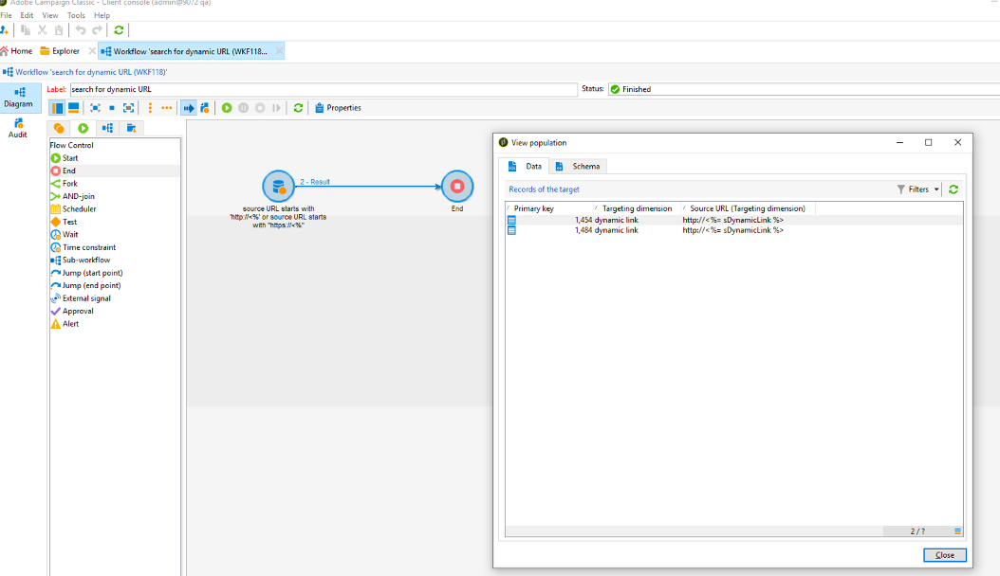

# 隱私權 {#privacy}


## 隱私請求

Adobe Campaign 提供一套工具，以協助您遵循隱私權法規（GDPR、CCPA 等）。

請參閱 [此頁](../../platform/using/privacy-management.md) 有關隱私管理的一般資訊以及Adobe Campaign的實施步驟。 您還將找到最佳實踐，並概述用戶流程和角色。

## URL個性化 {#url-personalization}

在向內容添加個性化連結時，始終避免在URL的主機名部分中出現任何個性化設定，以避免潛在的安全漏洞。 以下示例不應用於所有URL屬性&lt;`a href="">` 或 ``:

* `<%= url >`
* `https://<%= url >`
* `https://<%= domain >/path`
* `https://<%= sub-domain >.domain.tld/path`
* `https://sub.domain<%= main domain %>/path`

### 建議

要驗證並確保未使用上述功能，請通過以下方式運行跟蹤URL表的查詢： [市場活動一般查詢編輯器](../../platform/using/steps-to-create-a-query.md) 或建立具有篩選條件的工作流 [查詢活動](../../workflow/using/query.md)。

範例:

1. 建立工作流並添加查詢活動。 了解更多.

1. 開啟「查詢」活動，並在nmsTrackingUrl表上建立篩選器，如下所示：源URL以http://&lt;%開頭，源URL以https://&lt;%開頭。

1. 運行工作流並檢查是否有結果。

1. 如果是，請開啟輸出轉換以查看URL清單。



### URL簽名

為了提高安全性，引入了一種電子郵件連結的簽名機制。 可在Build 19.1.4(9032@3a9dc9c)和Campaig 20.2中找到。預設情況下啟用此功能。

>[!NOTE]
>
>按一下格式錯誤的簽名URL時，將返回以下錯誤：&quot;找不到請求的URL&quot;。..&quot;。&quot;

此外，自運動20.2和 [!DNL Gold Standard] 版本中，您可以使用增強功能來禁用以前生成的URL。 預設情況下禁用此功能。 你可以 [客戶服務](https://helpx.adobe.com/tw/enterprise/admin-guide.html/enterprise/using/support-for-experience-cloud.ug.html) 啟用此功能。

如果您在19.1.4版本上運行，則可能會遇到使用跟蹤連結推送通知交貨或使用錨點標籤交貨的問題。 如果是，建議您禁用URL簽名。

無論您是在內部或混合體系結構中運行活動，您都必須聯繫 [客戶服務](https://helpx.adobe.com/tw/enterprise/using/support-for-experience-cloud.html) 禁用URL簽名。

如果在混合體系結構中運行市場活動，則在啟用URL簽名之前，請確保已按如下方式升級托管的中間採購實例：
* 在本地市場營銷實例之前
* 到與內部營銷實例相同的版本或稍高的版本

否則，可能會出現以下問題：
* 在升級中間採購實例之前，URL將通過此實例發送，但不會簽名。
* 升級中間採購實例並在兩個實例上啟用URL簽名後，以前發送的URL沒有簽名，將被拒絕。 原因是由市場營銷實例提供的跟蹤檔案請求籤名。

要禁用在先前版本中生成的URL，請同時在所有市場活動伺服器上執行以下步驟：

1. 在伺服器配置檔案(serverConf.xml)中，更改 **blockRedirectForUnsignedTrackingLink** 至 **真**。
1. 重新啟動 **nlserver** 服務。
1. 在跟蹤伺服器上，重新啟動Web伺服器（Debian上的apache2、CentOS/RedHat上的httpd、Windows上的IIS）。

要啟用URL簽名，請同時在所有市場活動伺服器上執行以下步驟：

1. 在伺服器配置檔案(serverConf.xml)中，更改 **簽名電子郵件連結** 至 **假**。
1. 重新啟動 **nlserver** 服務。
1. 在跟蹤伺服器上，重新啟動Web伺服器（Debian上的apache2、CentOS/RedHat上的httpd、Windows上的IIS）。

## 資料限制

您必須確保低權限的經過身份驗證的用戶無法訪問加密的密碼。 要做到這一點，主要有兩種方式：僅限制對密碼欄位或整個實體（需要生成>= 8770）的訪問。

此限制允許您刪除密碼欄位，但允許從介面訪問所有用戶的外部帳戶。 請參見[此頁面](../../configuration/using/restricting-pii-view.md)。

1. 進去 **[!UICONTROL Administration]** > **[!UICONTROL Configuration]** > **[!UICONTROL Data schemas]**。

1. 新建 **[!UICONTROL Extension of a schema]**。

   

1. 選擇 **[!UICONTROL External Account]** （分機帳戶）。

1. 在最後一個嚮導螢幕中，可以編輯新srcSchema以限制對所有密碼欄位的訪問：

   可以替換主元素(`<element name="extAccount" ... >`)依據：

   ```
   <element name="extAccount">
       <attribute accessibleIf="$(loginId) = 0 or $(login) = 'admin'" name="password"/>
       <attribute accessibleIf="$(loginId) = 0 or $(login) = 'admin'" name="clientSecret"/>
   
       <element name="s3Account">
           <attribute accessibleIf="$(loginId) = 0 or $(login) = 'admin'" name="awsSecret"/>
       </element>
       <element name="wapPush">
           <attribute accessibleIf="$(loginId) = 0 or $(login) = 'admin'" name="password"/>
           <attribute accessibleIf="$(loginId) = 0 or $(login) = 'admin'" name="clientSecret"/>
       </element>
       <element name="mms">
           <attribute accessibleIf="$(loginId) = 0 or $(login) = 'admin'" name="password"/>
           <attribute accessibleIf="$(loginId) = 0 or $(login) = 'admin'" name="clientSecret"/>
       </element>
   </element>
   ```

   因此，擴展的srcSchema可以是：

   ```
   <srcSchema _cs="External Accounts (cus)" created="2017-05-12 07:53:49.691Z" createdBy-id="0"
               desc="Definition of external accounts (Email, SMS...) used by the modules"
               entitySchema="xtk:srcSchema" extendedSchema="nms:extAccount" img="" label="External Accounts"
               labelSingular="External account" lastModified="2017-05-12 08:33:49.365Z"
               mappingType="sql" md5="E9BB0CD6A4375F500027C86EA854E101" modifiedBy-id="0"
               name="extAccount" namespace="cus" xtkschema="xtk:srcSchema">
       <createdBy _cs="Administrator (admin)"/>
       <modifiedBy _cs="Administrator (admin)"/>
       <element name="extAccount">
           <attribute accessibleIf="$(loginId) = 0 or $(login) = 'admin'" name="password"/>
           <attribute accessibleIf="$(loginId) = 0 or $(login) = 'admin'" name="clientSecret"/>
   
           <element name="s3Account">
               <attribute accessibleIf="$(loginId) = 0 or $(login) = 'admin'" name="awsSecret"/>
           </element>
           <element name="wapPush">
               <attribute accessibleIf="$(loginId) = 0 or $(login) = 'admin'" name="password"/>
               <attribute accessibleIf="$(loginId) = 0 or $(login) = 'admin'" name="clientSecret"/>
           </element>
           <element name="mms">
               <attribute accessibleIf="$(loginId) = 0 or $(login) = 'admin'" name="password"/>
               <attribute accessibleIf="$(loginId) = 0 or $(login) = 'admin'" name="clientSecret"/>
           </element>
       </element>
   </srcSchema>    
   ```

   >[!NOTE]
   >
   >可以替換 `$(loginId) = 0 or $(login) = 'admin'` 與 `hasNamedRight('admin')` 允許具有管理員權限的所有用戶查看這些密碼。

## 保護包含PII的頁

我們強烈建議內部客戶保護可能包含鏡像頁面、Web應用程式等個人資訊的頁面。

此過程的目標是防止這些頁面被索引，從而避免潛在的安全風險。 以下是一些有用的文章：

* [https://developers.google.com/search/reference/robots_txt](https://developers.google.com/search/reference/robots_txt)
* [https://developers.google.com/search/reference/robots_meta_tag](https://developers.google.com/search/reference/robots_meta_tag)
* [https://www.google.com/webmasters/tools/robots-testing-tool](https://www.google.com/webmasters/tools/robots-testing-tool)

要保護您的頁面，請執行以下步驟：

1. 在Web伺服器（Apache或IIS）的根目錄下添加robots.txt檔案。 下面是檔案的內容：

   ```
   # Make changes for all web spiders
   User-agent:
   *Disallow: /
   ```

   有關IIS，請參閱 [此頁](https://docs.microsoft.com/en-us/iis/extensions/iis-search-engine-optimization-toolkit/managing-robotstxt-and-sitemap-files)。

   對於Apache，可以將檔案放置到 **/var/www/robots.txt** （德比）。

1. 有時添加 **robots.txt** 檔案在安全性方面是不夠的。 例如，如果另一個網站包含指向您頁面的連結，則該網站可能會出現在搜索結果中。

除 **robots.txt** 檔案，建議添加 **X — 機器人 — 標籤** 標題。 您可以在Apache或IIS中執行此操作， **serverConf.xml** 配置檔案。

有關詳細資訊，請參閱 [這篇文章](https://developers.google.com/search/reference/robots_meta_tag)。
