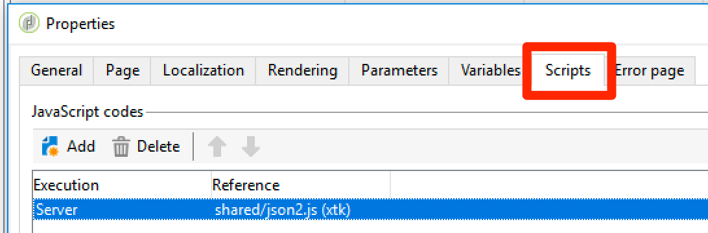

# 指令碼和程式碼指南 {#scripting-coding-guidelines}


## 指令碼

如需詳細資訊，請參閱[Campaign JSAPI檔案](https://docs.adobe.com/content/help/en/campaign-classic/technicalresources/api/index.html)。

如果您使用工作流程、網頁應用程式、工作流程編寫指令碼，請遵循以下最佳實務：

* 盡量避免使用SQL陳述式。

* 如果需要，請使用參數化（準備語句）函式，而不是字串串連。

   壞做法：

   ```
   sqlGetInt( "select iRecipientId from NmsRecipient where sEmail ='" + request.getParameter('email') +  "'  limit 1" )
   ```

   良好做法：

   ```
   sqlGetInt( "select iRecipientId from NmsRecipient where sEmail = $(sz) limit 1", request.getParameter('email'));
   ```

   >[!IMPORTANT]
   >
   >sqlSelect不支援此功能，因此必須使用DBEngine類的查詢函式：

   ```
   var cnx = application.getConnection()
   var stmt = cnx.query("SELECT sFirstName, sLastName FROM NmsRecipient where sEmail = $(sz)", request.getParameter('email'))
   for each(var row in stmt) logInfo(row[0] + " : " + row[1])
   cnx.dispose()
   ```

若要避免SQL插入，必須將SQL函式新增至允許清單，才能在Adobe Campaign中使用。 將它們新增至允許清單後，運算式編輯器中的運算子就會看到它們。 請參見[此頁面](../../configuration/using/adding-additional-sql-functions.md)。

>[!IMPORTANT]
>
>如果您使用的組建版本早於8140,**XtkPassUnknownSQLFunctionsToRDBMS**&#x200B;選項可能會設為「1」。 如果要保護資料庫的安全，請刪除此選項（或將其設定為&#39;0&#39;）。

如果您使用使用者輸入在查詢或SQL陳述式中建置篩選器，則一律必須將其逸出(請參閱[Campaign JSAPI檔案](https://docs.adobe.com/content/help/en/campaign-classic/technicalresources/api/index.html) — 資料保護：逸出函式)。 這些函式為：

* NL.XML.escape(data)
* NL.SQL.escape(data)
* NL.JS.escape(data)
* NL.XML.escapeAttribute(data)

## 保護新資料模型

### 資料夾基

請參閱下列頁面：

* [資料夾存取屬性](../../platform/using/access-management.md)
* [連結的資料夾](../../configuration/using/configuration.md#linked-folder)

### 已命名的權限

除了資料夾型安全模型外，您還可以使用命名權限來限制運算子動作：

* 您可以新增一些系統篩選器(sysFilter)，以防止讀取/寫入您的資料（請參閱[此頁](../../configuration/using/filtering-schemas.md)）。

   ```
   <sysFilter name="writeAccess">    
       <condition enabledIf="hasNamedRight('myNewRole')=false" expr="FALSE"/>  
   </sysFilter>
   ```

* 您也可以保護結構中定義的某些動作（SOAP方法）。 只需將具有相應名稱的訪問屬性設定為值即可。

   ```
   <method name="grantVIPAccess" access="myNewRole">
       <parameters>
   ...
       </parameters>
   </method>
   ```

   如需詳細資訊，請參閱[此頁面](../../configuration/using/implementing-soap-methods.md)。

>[!IMPORTANT]
>
>您可以在navtree的命令節點中使用命名權限。 它提供更佳的使用者體驗，但未提供任何保護（僅使用用戶端來隱藏/停用）。 您必須使用存取屬性。

### 溢出表

如果需要根據操作員訪問級別保護機密資料（結構的一部分），請勿在表單定義中隱藏機密資料（enabledIf/visibleIf條件）。

整個實體由螢幕載入，您也可以在欄定義中顯示。 要執行此操作，必須建立溢出表。 請參閱[此頁面](../../configuration/using/examples-of-schemas-edition.md#overflow-table)。

## 在Web應用程式中新增擷取

在公開登錄頁面/訂閱頁面中新增驗證碼是很好的作法。 很可惜，在DCE（數位內容編輯器）頁面中新增驗證碼並非易事。 我們會示範如何新增v5驗證碼或Google reCAPTCHA。

在DCE中新增驗證碼的一般方式是建立個人化區塊，以便輕鬆將其納入頁面內容中。 您必須新增&#x200B;**Script**&#x200B;活動和&#x200B;**Test**。

### 個人化區塊

1. 前往&#x200B;**[!UICONTROL Resources]** > **[!UICONTROL Campaign Management]** > **[!UICONTROL Personalization blocks]**&#x200B;並建立新的。

1. 使用&#x200B;**[!UICONTROL Web application]**&#x200B;內容類型並檢查&#x200B;**[!UICONTROL Visible in the customization menus]**。

   如需詳細資訊，請參閱[本頁面](../../delivery/using/personalization-blocks.md)。

   以下是&#x200B;**促銷活動驗證碼**&#x200B;的範例：

   ```javascript
   <%
   var captchaID = CaptchaIDGen();
   %>
   &width=200&height=50&minWordSize=8&maxWordSize=8"/>
   <input id="captchaValue" name="captchaValue" <%= String(ctx.vars.captchaValid) === "false" ? class="ui-state-error" : "" %>>
   <input type="hidden" name="captchaID" value="<%=captchaID%>"/>
   <%
   if( serverForm.isInputErroneous("captchaValue") ) {
   %>
   <script type="text/javascript"> 
   $("#captchaValue").addClass("ui-state-error")
   </script>
   <%
   }
   %>
   ```

   * 行1至6生成所有需要的輸入。
   * 行7到末端處理錯誤。
   * 第4行允許您更改驗證碼灰色框的大小（寬度/高度）和生成的字長(minWordSize/maxWordSize)。
   * 使用Google reCAPTCHA之前，您必須先在Google上註冊，然後建立新的reCAPTCHA網站。

      `<div class="g-recaptcha" data-sitekey="YOUR_SITE_KEY"></div>`
   您應該可以停用驗證按鈕，但由於我們沒有任何標準按鈕/連結，因此最好在HTML本身中停用。 若要了解如何執行，請參閱[此頁面](https://developers.google.com/recaptcha/)。

### 更新Web應用程式

1. 存取Web應用程式的屬性，以新增名為&#x200B;**captchaValid**&#x200B;的布林變數。

   

1. 在最後一頁和&#x200B;**[!UICONTROL Storage]**&#x200B;活動之間，新增&#x200B;**[!UICONTROL Script]**&#x200B;和&#x200B;**[!UICONTROL Test]**。

   將分支&#x200B;**[!UICONTROL True]**&#x200B;插入&#x200B;**[!UICONTROL Storage]**，並將另一個分支插入具有驗證碼的頁面。

   

1. 編輯分支True的條件，其中`"[vars/captchaValid]"`等於True。

   

1. 編輯&#x200B;**[!UICONTROL Script]**&#x200B;活動。 內容取決於選擇的驗證碼引擎。

1. 最後，您可以在頁面中新增個人化區塊：請參閱[此頁面](../../web/using/editing-content.md)。

   

   

>[!IMPORTANT]
>
>若要進行reCAPTCHA整合，您必須在HTML中新增用戶端JavaScript（在`<head>...</head>`中）:
>
>`<script src="https://www.google.com/recaptcha/api.js" async defer></script>`

### 行銷活動驗證碼

```javascript
var captchaID = request.getParameter("captchaID");
var captchaValue = request.getParameter("captchaValue");
  
if( !CaptchaValidate(captchaID, captchaValue) ) {
  serverForm.logInputError("captchaValue",
                           "The characters you typed for the captcha must match the image ones.",
                           "captchaValue")
  ctx.vars.captchaValid = false
}
else
  ctx.vars.captchaValid = true
```

第6行：你可以發出任何錯誤資訊。

### Google recaptcha

請參閱[官方檔案](https://developers.google.com/recaptcha/docs/verify)。

```javascript
ctx.vars.captchaValid = false
var gReCaptchaResponse = request.getParameter("g-recaptcha-response");
  
// Call reCaptcha API to validate it
var req = new HttpClientRequest("https://www.google.com/recaptcha/api/siteverify")
req.method = "POST"
req.header["Content-Type"] = "application/x-www-form-urlencoded"
req.body = "secret=YOUR_SECRET_HERE&response=" + encodeURIComponent(gReCaptchaResponse)
req.execute()
var response = req.response
if( response.code == 200 ) {
  captchaRes = JSON.parse(response.body.toString(response.codePage));
  ctx.vars.captchaValid = captchaRes.success
}
  
if( ctx.vars.captchaValid == false ) {
  serverForm.logInputError("reCaptcha",
                           "Please validate the captcha",
                           "reCaptcha")
  logInfo("reCaptcha not validated")
}
```

若要使用JSON.parse，您必須在webApp中加入「shared/json2.js」：



自建置8797以來，若要使用驗證API URL，您必須將其新增至urlPermission節點中，以將其新增至serverConf檔案的允許清單：

`<url dnsSuffix="www.google.com" urlRegEx="https://www.google.com/recaptcha/api/siteverify"/>`
