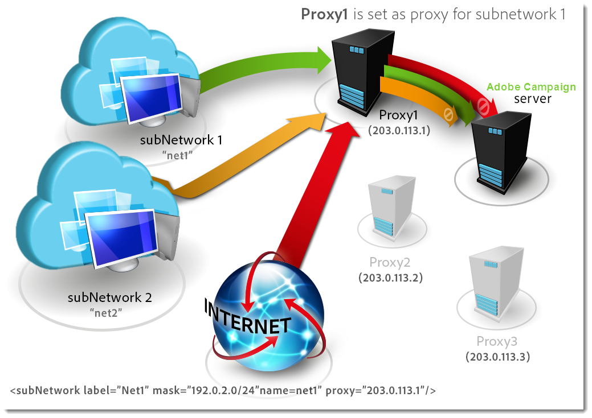

# 定義安全性區域（內部部署）{#defining-security-zones}


每個運運算元都必須連結到區域才能登入執行個體，而且運運算元IP必須包含在安全性區域中定義的位址或位址集中。 安全性區域設定是在Adobe Campaign伺服器的設定檔案中執行。

運運算元會從其在主控台中的設定檔連結至安全性區域，可在&#x200B;**[!UICONTROL Administration > Access management > Operators]**&#x200B;節點中存取。 [了解更多](#linking-a-security-zone-to-an-operator)。

>[!NOTE]
>
>此程式僅限於&#x200B;**內部部署**&#x200B;部署。
>
>身為&#x200B;**託管**&#x200B;客戶，若您可存取[Campaign控制面板](https://experienceleague.adobe.com/docs/control-panel/using/control-panel-home.html?lang=zh-Hant)，則可使用Security Zone自助服務介面。 [了解更多](https://experienceleague.adobe.com/docs/control-panel/using/instances-settings/ip-allow-listing-instance-access.html?lang=zh-Hant)
>
>其他&#x200B;**混合/託管**&#x200B;客戶需要聯絡Adobe支援團隊，將IP新增至允許清單。
>

## 建立安全區域 {#creating-security-zones}

區域由下列專案定義：

* 一或多個IP位址範圍（IPv4和IPv6）
* 與每個IP位址範圍相關聯的技術名稱

安全性區域是互鎖的，也就是說，在另一個區域中定義新區域可減少可登入區域的操作者數目，同時增加指派給每個操作者的許可權。

必須在伺服器組態期間在&#x200B;**serverConf.xml**&#x200B;檔案中定義區域。 **serverConf.xml**&#x200B;中可用的所有引數都列在[此區段](../../installation/using/the-server-configuration-file.md)中。

每個區域都會定義許可權，例如：

* HTTP連線而非HTTPS
* 錯誤顯示(Java錯誤、JavaScript、C++等)
* 報表和WebApp預覽
* 透過登入/密碼驗證
* 非安全連線模式

>[!NOTE]
>
>**每個運運算元都必須連結到區域**。 如果運運算元的IP位址屬於區域定義的範圍，則運運算元可登入執行個體。\
>操作員的IP位址可以在多個區域中定義。 在此案例中，運運算元會收到每個區域的&#x200B;**集合**&#x200B;可用許可權。

現成可用的&#x200B;**serverConf.xml**&#x200B;檔案包含三個區域： **公用、VPN及LAN**。

>[!NOTE]
>
>**現成組態是安全的**。 不過，在從舊版Adobe Campaign移轉之前，可能需要暫時降低安全性，才能移轉並核准新規則。

如何在&#x200B;**serverConf.xml**&#x200B;檔案中定義區域的範例：

```
<securityZone allowDebug="false" allowHTTP="false" label="Public Network" name="public">
<subNetwork label="All addresses" mask="*" name="all"/>

<securityZone allowDebug="true" allowHTTP="false" label="Private Network (VPN)"
              name="vpn" showErrors="true">

  <securityZone allowDebug="true" allowEmptyPassword="true" allowHTTP="true"
                allowUserPassword="false" label="Private Network (LAN)" name="lan"
                sessionTokenOnly="true" showErrors="true">
    <subNetwork label="Lan 1" mask="192.168.0.0/16" name="lan1"/>
    <subNetwork label="Lan 2" mask="172.16.0.0/12" name="lan2"/>
    <subNetwork label="Lan 3" mask="10.0.0.0/8" name="lan3"/>
    <subNetwork label="Localhost" mask="127.0.0.1/16" name="locahost"/>
    <subNetwork label="Lan (IPv6)" mask="fc00::/7" name="lan6"/>
    <subNetwork label="Localhost (IPv6)" mask="::1/128" name="localhost6"/>
  </securityZone>

</securityZone>
</securityZone>
```

定義區域的所有權利如下：

* **allowDebug**：啟用webApp在「偵錯」模式下執行
* **allowEmptyPassword**：授權連線到沒有密碼的執行個體
* **allowHTTP**：不需要使用HTTPS通訊協定即可建立工作階段
* **allowUserPassword**：工作階段權杖可以有下列形式&quot;`<login>/<password>`&quot;
* **sessionTokenOnly**：連線URL中不需要安全性權杖
* **showErrors**：轉送並顯示伺服器端的錯誤

>[!IMPORTANT]
>
>在區域定義中，每個具有&#x200B;**true**&#x200B;值的屬性都會降低安全性。

使用訊息中心時，如果有數個執行個體，您必須使用定義為&#x200B;**true**&#x200B;的&#x200B;**sessionTokenOnly**&#x200B;屬性來建立額外的安全區域，其中僅需新增必要的IP位址。 如需設定執行個體的詳細資訊，請參閱[此檔案](../../message-center/using/configuring-instances.md)。

## 安全性區域的最佳作法 {#best-practices-for-security-zones}

在&#x200B;**lan**&#x200B;安全性區域的定義中，可以新增定義技術存取的IP位址遮罩。 此新增將可讓您存取伺服器上裝載的所有執行個體。

```
<securityZone allowDebug="true" allowEmptyPassword="false" allowHTTP="true"
                    allowUserPassword="false" label="Private Network (LAN)" name="lan"
                    sessionTokenOnly="true" showErrors="true">
        <subNetwork label="Lan 1" mask="192.168.0.0/16" name="lan1"/>
        <subNetwork label="Lan 2" mask="172.16.0.0/12" name="lan2"/>
        <subNetwork label="Lan 3" mask="10.0.0.0/8" name="lan3"/>
        <subNetwork label="Localhost" mask="127.0.0.1/16" name="locahost"/>
        <subNetwork label="Lan (IPv6)" mask="fc00::/7" name="lan6"/>
        <subNetwork label="Localhost (IPv6)" mask="::1/128" name="localhost6"/>
  
        <!-- Customer internal IPs -->
        <subNetwork id="internalNetwork" mask="a.b.c.d/xx"/>

      </securityZone>
```

我們建議直接在專用於執行個體的設定檔案中定義IP位址範圍，以供僅存取特定執行個體的操作者使用。

在&#x200B;**`config-<instance>.xml`**&#x200B;檔案中：

```
  <securityZone name="public">
   ...
    <securityZone name="vpn">
      <subNetwork id="cus1" mask="a.b.c.d/xx"/>
```

## 安全區域中的子網路和代理 {#sub-networks-and-proxies-in-a-security-zone}

**proxy**&#x200B;引數可用於&#x200B;**subNetwork**&#x200B;元素，以指定安全區域中的Proxy使用。

當參照Proxy且連線透過此Proxy （透過HTTP X-Forwarded-For標頭可見）進入時，已驗證的區域是Proxy的使用者端區域，而非Proxy的使用者端區域。

>[!IMPORTANT]
>
>如果已設定Proxy且可以覆寫它（如果不存在，則覆寫它），將進行測試的IP位址將能夠被偽造。
>
>此外，中繼的產生方式現在類似代理。 因此，您可以將IP位址127.0.0.1新增至安全區域設定中的代理程式清單。
>
>例如：「`<subnetwork label="Lan 1" mask="192.168.0.0/16" name="lan1" proxy="127.0.0.1,10.100.2.135" />`」。

可能會出現各種情況：

* 子網路會在安全區域中直接參照，且未設定Proxy：子網路的使用者可直接連線至Adobe Campaign伺服器。

  

* 為安全區域中的子網路指定Proxy：此子網路的使用者可以透過此Proxy存取Adobe Campaign伺服器。

  

* Proxy包含在安全區域子網路中：透過此Proxy進行存取的使用者（無論其來源為何）都可以存取Adobe Campaign伺服器。

  

可能存取Adobe Campaign伺服器的代理伺服器的IP位址必須在相關&#x200B;**`<subnetwork>`**&#x200B;和第一層子網路&#x200B;**`<subnetwork name="all"/>`**&#x200B;中輸入。 例如，此處針對IP位址為10.131.146.102的Proxy：

```
<securityZone allowDebug="false" allowHTTP="false" label="Public Network" 
                      name="public">
    <subNetwork label="All addresses" mask="*" name="all"
                      proxy="10.131.146.102,127.0.0.1, ::1"/>

    <securityZone allowDebug="true" allowHTTP="false" label="Private Network (VPN)" 
                      name="vpn" showErrors="true">
        <securityZone allowDebug="true" allowEmptyPassword="false" allowHTTP="true" 
                      allowUserPassword="false" label="Private Network (LAN)" 
                      name="lan" sessionTokenOnly="true" showErrors="true">
            <subNetwork label="Lan proxy" mask="10.131.193.182" name="lan3" 
                      proxy="10.131.146.102,127.0.0.1, ::1"/>
            <subNetwork label="Lan 1" mask="192.168.0.0/16" name="lan1" 
                      proxy="127.0.0.1, ::1"/>

        </securityZone>
    </securityZone>
</securityZone>
```

## 將安全區域連結到操作員 {#linking-a-security-zone-to-an-operator}

定義區域後，每個運運算元都必須連結到其中一個運運算元，才能登入執行個體，而且運運算元的IP位址必須包含在區域中參考的位址或位址範圍內。

區域的技術組態是在Campaign伺服器的組態檔中執行： **serverConf.xml**。

在此之前，您必須先設定現成的&#x200B;**[!UICONTROL Security zone]**&#x200B;列舉，將標籤連結至&#x200B;**serverConf.xml**&#x200B;檔案中定義的區域的內部名稱。

此設定在Campaign檔案總管中完成：

1. 按一下&#x200B;**[!UICONTROL Administration > Platform > Enumerations]**&#x200B;節點。
1. 選取&#x200B;**[!UICONTROL Security zone (securityZone)]**&#x200B;系統列舉。

   

1. 針對伺服器組態檔中定義的每個安全性區域，按一下&#x200B;**[!UICONTROL Add]**&#x200B;按鈕。
1. 在&#x200B;**[!UICONTROL Internal name]**&#x200B;欄位中，輸入&#x200B;**serverConf.xml**&#x200B;檔案中定義的區域名稱。 它對應至`<securityzone>`專案的&#x200B;**@name**&#x200B;屬性。 在&#x200B;**標籤**&#x200B;欄位中輸入連結到內部名稱的標籤。

   

1. 按一下「確定」並儲存修改。

定義區域並設定&#x200B;**[!UICONTROL Security zone]**&#x200B;列舉後，您必須將每個運運算元連結至安全性區域：

1. 按一下&#x200B;**[!UICONTROL Administration > Access management > Operators]**&#x200B;節點。
1. 選取您要將安全性區域連結到哪個運運算元，然後按一下&#x200B;**[!UICONTROL Edit]**&#x200B;索引標籤。
1. 前往&#x200B;**[!UICONTROL Access rights]**&#x200B;標籤，然後按一下&#x200B;**[!UICONTROL Edit access parameters...]**&#x200B;連結。

   

1. 從&#x200B;**[!UICONTROL Authorized connection zone]**&#x200B;下拉式清單中選取區域

   

1. 按一下&#x200B;**[!UICONTROL OK]**&#x200B;並儲存修改以套用這些變更。


## 建議

* 請確定您的反向Proxy不允許出現在subNetwork中。 如果是這種情況，將會偵測到來自此本機IP的&#x200B;**所有**&#x200B;流量，因此將信任這些流量。

* 儘量不使用sessionTokenOnly=&quot;true&quot;：

   * 警告：如果此屬性設定為true，運運算元可能會遭到&#x200B;**CRSF攻擊**。
   * 此外，sessionToken Cookie並未以httpOnly標幟設定，因此某些使用者端JavaScript程式碼可加以讀取。
   * 不過，多個執行儲存格上的Message Center需要sessionTokenOnly：在sessionTokenOnly設為&quot;true&quot;的情況下建立新的安全性區域，並將&#x200B;**僅新增所需的IP**&#x200B;至此區域。

* 可能的話，請將所有allowHTTP、showErrors設定為false （不適用於localhost）並檢查它們。

   * allowHTTP = &quot;false&quot;：強制運運算元使用HTTPS
   * showErrors = &quot;false&quot;：隱藏技術錯誤（包括SQL錯誤）。 它可防止顯示太多資訊，但會降低行銷人員解決錯誤的能力（無需向管理員要求更多資訊）

* 僅針對需要建立（事實上是預覽）調查、webApps和報表的行銷使用者/管理員所使用的IP，將allowDebug設定為true。 此旗標可讓這些IP顯示轉送規則並為其偵錯。

   * 當allowDebug設為false時，輸出為：

     ```
     <redir status='OK' date='...' sourceIP='...'/>
     ```

   * 當allowDebug設定為true時，輸出為：

     ```
     <redir status='OK' date='...' build='...' OR version='...' sha1='...' instance='...' sourceIP='...' host='...' localHost='...'/>
     ```

* 切勿將allowEmptyPassword、allowUserPassword、allowSQLInjection設定為true。

   * **allowEmptyPassword**&#x200B;可讓操作員擁有空白密碼。 如果您遇到這種情況，請通知所有操作員要求他們設定截止日期的密碼。 一旦過了這個期限，就將此屬性變更為false。

   * **allowUserPassword**&#x200B;可讓操作員傳送其認證作為引數（以便由apache/IIS/proxy記錄它們）。 此功能過去曾用於簡化API的使用。 無論某些協力廠商應用程式是否使用此功能，您都可以簽入您的逐步指南（或規格）。 若是如此，您必須通知他們變更使用API的方式，並儘快移除此功能。

   * **allowSQLInjection**&#x200B;可讓使用者使用舊語法執行SQL插入。 此屬性應設為false。 您可以使用/nl/jsp/ping.jsp？zones=true來檢查您的安全區域設定。 此頁面顯示目前IP的安全性措施（使用這些安全性旗標計算）的有效狀態。

* HttpOnly Cookie/useSecurityToken：參考&#x200B;**sessionTokenOnly**&#x200B;旗標。

* 最小化IP新增到允許清單：開箱即用，在安全性區域中，我們為私人網路新增了3個範圍。 您不太可能會使用所有這些IP位址。 所以，請只保留您需要的專案。

* 更新webApp/內部運運算元，使其僅可在localhost中存取。
