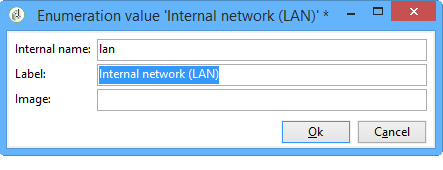

# 定義安全區 {#defining-security-zones}

每個運算子都必須連結至區域才能登入例項，且運算子IP必須包含在安全區域中定義的位址或位址集中。 安全區配置在Adobe Campaign伺服器的配置檔案中執行。

操作員從控制台中的配置式連結到安全區域，可在&#x200B;**[!UICONTROL Administration > Access management > Operators]**&#x200B;節點中訪問該配置式。 [進一步瞭解](#linking-a-security-zone-to-an-operator)。

>[!NOTE]
>
>此程式僅限於&#x200B;**on-premise**&#x200B;部署。
>
>身為&#x200B;**代管**&#x200B;的客戶，如果您可以存取[促銷活動控制面板](https://experienceleague.adobe.com/docs/control-panel/using/control-panel-home.html)，則可使用安全區自助服務介面。 [了解更多](https://experienceleague.adobe.com/docs/control-panel/using/instances-settings/ip-allow-listing-instance-access.html)
>
>其他&#x200B;**hybrid/hosted**&#x200B;客戶需要聯絡Adobe以設定其例項的安全區。


## 建立安全區{#creating-security-zones}

區域由以下項定義：

* 一或多個IP位址範圍（IPv4和IPv6）
* 與每個IP位址範圍連結的技術名稱

安全區域互鎖，這表示在另一個區域中定義新區域可以減少可登錄該區域的運算子數量，同時增加分配給每個運算子的權限。

必須在伺服器配置期間在&#x200B;**serverConf.xml**&#x200B;檔案中定義區域。 **serverConf.xml**&#x200B;中可用的所有參數都列在[本節](../../installation/using/the-server-configuration-file.md)中。

每個區域都定義權限，例如：

* HTTP連線，而非HTTPS
* 錯誤顯示（Java錯誤、JavaScript、C++等）
* 報告和webApp預覽
* 透過登入／密碼進行驗證
* 非安全連接模式

>[!NOTE]
>
>**每個運算子都必須連結至區域**。如果運算子的IP位址屬於區域所定義的範圍，運算子可登入執行個體。\
>操作員的IP地址可以定義在多個區域中。 在這種情況下，運算子接收每個區域的可用權限的&#x200B;**set**。

現成可用的&#x200B;**serverConf.xml**&#x200B;檔案包括三個區域：**public、VPN和LAN**。

>[!NOTE]
>
>**現成可用的配置是安全的**。不過，在從舊版Adobe Campaign移轉之前，可能需要暫時降低安全性，才能移轉並核准新規則。

如何在&#x200B;**serverConf.xml**&#x200B;檔案中定義區域的示例：

```
<securityZone allowDebug="false" allowHTTP="false" label="Public Network" name="public">
<subNetwork label="All addresses" mask="*" name="all"/>

<securityZone allowDebug="true" allowHTTP="false" label="Private Network (VPN)"
              name="vpn" showErrors="true">

  <securityZone allowDebug="true" allowEmptyPassword="true" allowHTTP="true"
                allowUserPassword="false" label="Private Network (LAN)" name="lan"
                sessionTokenOnly="true" showErrors="true">
    <subNetwork label="Lan 1" mask="192.168.0.0/16" name="lan1"/>
    <subNetwork label="Lan 2" mask="172.16.0.0/12" name="lan2"/>
    <subNetwork label="Lan 3" mask="10.0.0.0/8" name="lan3"/>
    <subNetwork label="Localhost" mask="127.0.0.1/16" name="locahost"/>
    <subNetwork label="Lan (IPv6)" mask="fc00::/7" name="lan6"/>
    <subNetwork label="Localhost (IPv6)" mask="::1/128" name="localhost6"/>
  </securityZone>

</securityZone>
</securityZone>
```

定義區域的所有權利如下：

* **allowDebug**:可讓webApp在「debug」模式中執行
* **allowEmptyPassword**:授權不使用密碼的實例的連接
* **allowHTTP**:不需使用HTTPS通訊協定即可建立工作階段
* **allowUserPassword**:作業Token可以有下列格式「`<login>/<password>`」
* **sessionTokenOnly**:連線URL中不需要安全性Token
* **showErrors**:會轉送並顯示伺服器端的錯誤

>[!IMPORTANT]
>
>在區域定義中，每個具有&#x200B;**true**&#x200B;值的屬性都會降低安全性。

使用消息中心時，如果存在多個執行實例，則需要使用定義為&#x200B;**true**&#x200B;的&#x200B;**sessionTokenOnly**&#x200B;屬性來建立附加安全區，其中僅添加必要的IP地址。 有關配置實例的詳細資訊，請參閱[本文檔](../../message-center/using/creating-a-shared-connection.md)。

## 安全區{#best-practices-for-security-zones}的最佳做法

在&#x200B;**lan**&#x200B;安全區的定義中，可以添加定義技術訪問的IP地址掩碼。 此新增功能將允許存取伺服器上裝載的所有執行個體。

```
<securityZone allowDebug="true" allowEmptyPassword="false" allowHTTP="true"
                    allowUserPassword="false" label="Private Network (LAN)" name="lan"
                    sessionTokenOnly="true" showErrors="true">
        <subNetwork label="Lan 1" mask="192.168.0.0/16" name="lan1"/>
        <subNetwork label="Lan 2" mask="172.16.0.0/12" name="lan2"/>
        <subNetwork label="Lan 3" mask="10.0.0.0/8" name="lan3"/>
        <subNetwork label="Localhost" mask="127.0.0.1/16" name="locahost"/>
        <subNetwork label="Lan (IPv6)" mask="fc00::/7" name="lan6"/>
        <subNetwork label="Localhost (IPv6)" mask="::1/128" name="localhost6"/>
  
        <!-- Customer internal IPs -->
        <subNetwork id="internalNetwork" mask="a.b.c.d/xx"/>

      </securityZone>
```

我們建議在僅存取特定例項的運算子專用的設定檔案中，直接定義IP位址範圍。

在&#x200B;**`config-<instance>.xml`**&#x200B;檔案中：

```
  <securityZone name="public">
   ...
    <securityZone name="vpn">
      <subNetwork id="cus1" mask="a.b.c.d/xx"/>
```

## 安全區{#sub-networks-and-proxies-in-a-security-zone}中的子網和代理

**proxy**&#x200B;參數可用於&#x200B;**subNetwork**&#x200B;元素中，以指定安全區中的proxy使用。

當參考代理並且連接通過此代理進入時（通過HTTP X-Forwarded-For標頭可見），驗證區域是代理的客戶端區域，而不是代理的客戶端區域。

>[!IMPORTANT]
>
>如果已設定代理，並且可以覆寫它（或者如果不存在），則測試的IP位址將會被偽造。
>
>此外，中繼現在也像Proxy一樣產生。 因此，您可以將IP地址127.0.0.1添加到安全區配置中的Proxy清單中。
>
>例如：&quot; `<subnetwork label="Lan 1" mask="192.168.0.0/16" name="lan1" proxy="127.0.0.1,10.100.2.135" />`&quot;。

可能會發生各種情況：

* 安全區中直接引用子網路，且未配置代理：子網用戶可直接連接到Adobe Campaign伺服器。

   

* 為安全區域中的子網路指定代理：來自此子網的用戶可以通過此代理訪問Adobe Campaign伺服器。

   

* 代理包含在安全區子網路中：透過此Proxy存取的使用者，不論其來源為何，都可存取Adobe Campaign伺服器。

   

可能訪問Adobe Campaign伺服器的代理的IP地址必須在&#x200B;**`<subnetwork>`**&#x200B;相關子網和一級子網&#x200B;**`<subnetwork name="all"/>`**&#x200B;中輸入。 例如，以下是IP位址為10.131.146.102的Proxy:

```
<securityZone allowDebug="false" allowHTTP="false" label="Public Network" 
                      name="public">
    <subNetwork label="All addresses" mask="*" name="all"
                      proxy="10.131.146.102,127.0.0.1, ::1"/>

    <securityZone allowDebug="true" allowHTTP="false" label="Private Network (VPN)" 
                      name="vpn" showErrors="true">
        <securityZone allowDebug="true" allowEmptyPassword="false" allowHTTP="true" 
                      allowUserPassword="false" label="Private Network (LAN)" 
                      name="lan" sessionTokenOnly="true" showErrors="true">
            <subNetwork label="Lan proxy" mask="10.131.193.182" name="lan3" 
                      proxy="10.131.146.102,127.0.0.1, ::1"/>
            <subNetwork label="Lan 1" mask="192.168.0.0/16" name="lan1" 
                      proxy="127.0.0.1, ::1"/>

        </securityZone>
    </securityZone>
</securityZone>
```

## 將安全區連結到操作員{#linking-a-security-zone-to-an-operator}

定義區域後，必須將每個運算子連結到其中一個運算子，才能登錄到實例，並且該運算子的IP地址必須包含在區域中引用的地址或地址範圍中。

區域的技術組態會在促銷活動伺服器的組態檔案中執行：**serverConf.xml**。

在此之前，您必須首先配置現成可用的&#x200B;**[!UICONTROL Security zone]**&#x200B;枚舉，以將標籤連結到&#x200B;**serverConf.xml**&#x200B;檔案中定義的區域的內部名稱。

此設定是在促銷活動檔案總管中完成：

1. 按一下&#x200B;**[!UICONTROL Administration > Platform > Enumerations]**&#x200B;節點。
1. 選擇&#x200B;**[!UICONTROL Security zone (securityZone)]**&#x200B;系統枚舉。

   

1. 對於伺服器配置檔案中定義的每個安全區，按一下&#x200B;**[!UICONTROL Add]**&#x200B;按鈕。
1. 在&#x200B;**[!UICONTROL Internal name]**&#x200B;欄位中，輸入&#x200B;**serverConf.xml**&#x200B;檔案中定義的區域名稱。 它對應於`<securityzone>`元素的&#x200B;**@name**&#x200B;屬性。 在&#x200B;**Label**&#x200B;欄位中輸入連結至內部名稱的標籤。

   

1. 按一下「確定」並儲存修改。

定義區域並配置&#x200B;**[!UICONTROL Security zone]**&#x200B;枚舉後，您需要將每個運算子連結到安全區域：

1. 按一下&#x200B;**[!UICONTROL Administration > Access management > Operators]**&#x200B;節點。
1. 選擇要將安全區連結到的運算子，然後按一下&#x200B;**[!UICONTROL Edit]**&#x200B;頁籤。
1. 前往&#x200B;**[!UICONTROL Access rights]**&#x200B;標籤，然後按一下&#x200B;**[!UICONTROL Edit access parameters...]**&#x200B;連結。

   

1. 從&#x200B;**[!UICONTROL Authorized connection zone]**&#x200B;下拉式清單中選取區域

   

1. 按一下&#x200B;**[!UICONTROL OK]**&#x200B;並保存修改以應用這些更改。
