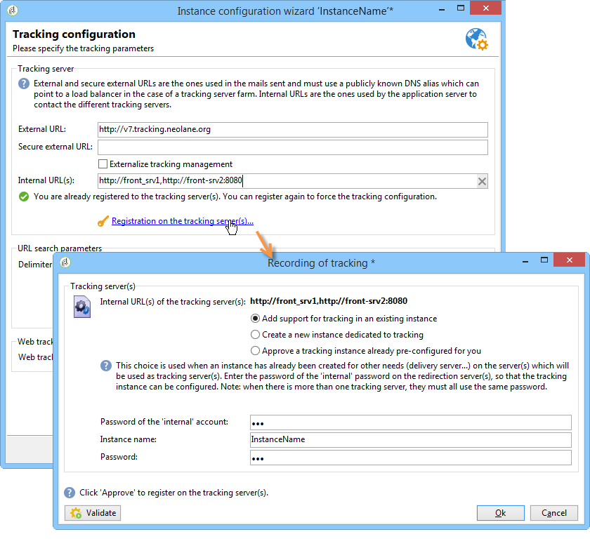

# 標準部署{#standard-deployment}


此配置需要三台電腦：

* LAN內的應用程式伺服器，供最終用戶使用（準備促銷活動、報告等）,
* 在DMZ中，負載平衡器後面有兩個前沿伺服器。

DMZ中的兩台伺服器處理跟蹤、鏡像頁和傳遞，並且冗餘以實現高可用性。

區域網路中的應用伺服器為最終用戶提供服務，並執行所有循環過程（工作流引擎）。 因此，當前端伺服器上達到峰值負載時，應用程式使用者不會受到影響。

資料庫伺服器可以托管在與這三台電腦不同的電腦上。 否則，只要Adobe Campaign（Linux或Windows）支援作業系統，應用程式伺服器和資料庫伺服器就應在LAN內共用同一台電腦。

伺服器和進程之間的一般通信根據以下模式執行：


此類型的配置可以處理大量收件人（500,000到1,000,000），因為資料庫伺服器（和可用頻寬）是主要限制因素。

## 功能 {#features}

### 優勢 {#advantages}

* 故障切換功能：在另一台電腦出現硬體問題時，將進程切換到一台電腦的能力。
* 總體效能更好，因為MTA和重定向功能可以部署在負載平衡器後面的兩台電腦上。 有了兩個活動的MTA和足夠的頻寬，在每小時100,000封郵件的區域內可以實現廣播速率。

## 安裝和配置步驟 {#installation-and-configuration-steps}

### 先決條件 {#prerequisites}

* JDK在所有三台電腦上，
* 兩個前端上的Web伺服器(IIS、Apache),
* 訪問所有三台電腦上的資料庫伺服器，
* 可通過POP3訪問的退回郵箱，
* 建立兩個DNS別名：

   * 首先公開，用於追蹤並指向虛擬IP位址(VIP)上的負載平衡器，然後分配給兩個前端伺服器，
   * 第二個會公開給內部使用者，供他們透過主控台存取，並指向相同的應用程式伺服器。

* 防火牆配置為開啟STMP(25)、DNS(53)、HTTP(80)、HTTPS(443)、SQL(1521(Oracle)、5432(PostgreSQL)等 埠。 如需詳細資訊，請參閱區段 [資料庫存取](../../installation/using/network-configuration.md#database-access).

### 安裝應用程式伺服器 {#installing-the-application-server}

請依照步驟從Adobe Campaign應用程式伺服器安裝獨立執行個體，以建立資料庫（步驟12）。 請參閱 [安裝和配置（單台電腦）](../../installation/using/standalone-deployment.md#installing-and-configuring--single-machine-).

由於電腦不是追蹤伺服器，因此請勿將與Web伺服器的整合列入考量。

在下列範例中，例項的參數為：

* 執行個體的名稱： **示範**
* DNS掩碼： **console.campaign.net*** (僅用於客戶端控制台連接和報告。
* 語言：英文
* 資料庫： **campaign:demo@dbsrv**

### 安裝兩個前端伺服器 {#installing-the-two-frontal-servers}

安裝和配置過程在兩台電腦上相同。

步驟如下：

1. 安裝Adobe Campaign伺服器。

   有關詳細資訊，請參閱 [在Linux安裝Campaign的必要條件](../../installation/using/prerequisites-of-campaign-installation-in-linux.md) (Linux)和 [在Windows安裝Campaign的必要條件](../../installation/using/prerequisites-of-campaign-installation-in-windows.md) (Windows)。

1. 按照以下各節所述的Web伺服器整合過程(IIS、Apache)操作：

   * Linux: [與Linux網頁伺服器整合](../../installation/using/integration-into-a-web-server-for-linux.md)
   * 對於Windows: [與Windows版Web伺服器整合](../../installation/using/integration-into-a-web-server-for-windows.md)

1. 建立 **示範** 例項。 執行此作業有兩種方式：

   * 透過主控台建立執行個體：

      

      有關詳細資訊，請參閱 [建立執行個體並登入](../../installation/using/creating-an-instance-and-logging-on.md).

      或

   * 使用命令行建立實例：

      ```
      nlserver config -addinstance:demo/tracking.campaign.net*
      ```

      有關詳細資訊，請參閱 [建立例項](../../installation/using/command-lines.md#creating-an-instance).
   實例的名稱與應用程式伺服器的名稱相同。

   與伺服器的連線 **nlserver web** 模組（鏡像頁面，取消訂閱）會從負載平衡器(tracking.campaign.net)的URL進行。

1. 變更 **內部** 與應用程式伺服器相同。

   如需詳細資訊，請參閱[本章節](../../installation/using/configuring-campaign-server.md#internal-identifier)。

1. 將資料庫連結到實例：

   ```
   nlserver config -setdblogin:PostgreSQL:campaign:demo@dbsrv -instance:demo
   ```

1. 在 **config-default.xml** 和 **config-demo.xml** 檔案，啟用 **web**, **trackinglogd** 和 **mta** 模組。

   如需詳細資訊，請參閱[本章節](../../installation/using/configuring-campaign-server.md#enabling-processes)。

1. 編輯 **serverConf.xml** 檔案並填入：

   * MTA模組的DNS設定：

      ```
      <dnsConfig localDomain="campaign.com" nameServers="192.0.0.1, 192.0.0.2"/>
      ```

      >[!NOTE]
      >
      >此 **nameServers** 參數僅用於Windows。

      有關詳細資訊，請參閱 [傳送設定](configure-delivery-settings.md).

   * 重定向參數中的冗餘跟蹤伺服器：

      ```
      <spareServer enabledIf="$(hostname)!='front_srv1'" id="1" url="https://front_srv1:8080"/>
      <spareServer enabledIf="$(hostname)!='front_srv2'" id="2" url="https://front_srv2:8080"/>
      ```

      有關詳細資訊，請參閱 [冗餘跟蹤](configuring-campaign-server.md#redundant-tracking).

1. 啟動網站並從URL測試重新導向： [https://tracking.campaign.net/r/test](https://tracking.campaign.net/r/test).

   瀏覽器應顯示下列訊息（視負載平衡器重新導向的URL而定）:

   ```
   <redir status="OK" date="AAAA/MM/JJ HH:MM:SS" build="XXXX" host="tracking.campaign.net" localHost="front_srv1"/>
   ```

   或

   ```
   <redir status="OK" date="AAAA/MM/JJ HH:MM:SS" build="XXXX" host="tracking.campaign.net" localHost="front_srv2"/>
   ```

   如需詳細資訊，請參閱下列章節：

   * Linux: [啟動Web伺服器並測試配置](../../installation/using/integration-into-a-web-server-for-linux.md#launching-the-web-server-and-testing-the-configuration)
   * 對於Windows: [啟動Web伺服器並測試配置](../../installation/using/integration-into-a-web-server-for-windows.md#launching-the-web-server-and-testing-the-configuration)

1. 啟動Adobe Campaign伺服器。
1. 在Adobe Campaign主控台中，使用 **管理員** 不使用密碼登錄並啟動部署嚮導。

   有關詳細資訊，請參閱 [部署執行個體](../../installation/using/deploying-an-instance.md).

   除了追蹤模組的設定外，設定與獨立執行個體相同。

1. 填入用於重新導向的外部URL（負載平衡器的URL），以及兩個前端伺服器的內部URL。

   有關詳細資訊，請參閱 [追蹤設定](../../installation/using/deploying-an-instance.md#tracking-configuration).

   

   >[!NOTE]
   >
   >我們使用先前建立之兩個追蹤伺服器的現有例項，並使用 **內部** 登入。
