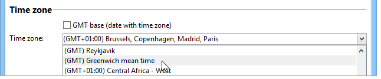

# 時區管理{#time-zone-management}

## 操作原則 {#operating-principle}

Adobe Campaign可讓您將日期表示為其時區的函式：這可讓國際使用者在世界各地處理各種時區。 每個使用相同執行個體的國家/地區都可以管理行銷活動的執行、追蹤、封存等。 視當地時間而定。

為了能在國際規模上使用Adobe Campaign平台，系統使用的所有日期都必須可連結至時區。 因此，時區已知的日期可以匯入任何其他時區中，或無論時區如何。

Adobe Campaign可讓您以UTC （國際標準時間）格式儲存日期/時間。 當資料公開時，會轉換為運運算元的當地日期/時間。 當資料庫設定為UTC時，會自動執行轉換（請參閱[組態](#configuration)）。 如果資料庫未以UTC設定，則平台中日期的時區資訊會儲存在選項中。

與時區管理相關的主要平台功能為：匯入/匯出資料、操作員及工作流程管理。 **繼承概念**&#x200B;可用於匯入/匯出或工作流程。 預設會針對資料庫伺服器時區設定時區，但您可以為工作流程甚至單一活動重新定義新時區。

**操作員**&#x200B;可以在&#x200B;**傳遞組態**&#x200B;期間修改時區，並可指定傳遞執行的特定時區。

>[!IMPORTANT]
>
>如果資料庫未管理多個時區，對於所有資料篩選操作，SQL查詢必須在資料庫伺服器的時區執行。

每個Adobe Campaign運運算元都會連結至時區：這項資訊會在其設定檔中設定。 如需詳細資訊，請參閱[此檔案](../../platform/using/access-management.md)。

當Adobe Campaign平台不需要時區管理時，您可以使用特定的連結時區，以本機格式保留儲存模式。

## 建議 {#recommendations}

時區結合多種現實：該運算式可能描述與UTC日期之間恆定的時間延遲，或區域每年可能變更兩次的時間（日光節約時間）。

例如，在postgreSQL中，**SET TIME ZONE &#39;Europe/Paris&#39;；**&#x200B;命令會考量夏季和冬季時間：日期會根據一年中的時間以UTC+1或UTC+2表示。

但是，如果您使用&#x200B;**設定時區0200；**&#x200B;命令，則時間延遲將一律為UTC+2。

## 設定 {#configuration}

日期與時間的儲存模式是在建立資料庫時選取的（請參閱[建立新執行個體](#creating-a-new-instance)）。 若進行移轉，連結至日期的時數會轉換為本機日期和時數（請參閱[移轉](#migration)）。

從技術觀點來看，有兩種方式可將&#x200B;**日期+時間**&#x200B;型別資訊儲存在資料庫中：

1. 時區格式的時間戳記：資料庫引擎以UTC格式儲存日期。 每個開啟的工作階段都會有一個時區，日期也會據此轉換。
1. 本機格式+本機時區：所有日期都會以本機格式儲存（無時間延遲管理），並為它們指派單一時區。 時區儲存在Adobe Campaign執行個體的&#x200B;**WdbcTimeZone**&#x200B;選項中，並可透過樹狀結構的&#x200B;**[!UICONTROL Administration > Platform > Options]**&#x200B;功能表變更。

>[!IMPORTANT]
>
>請注意，此修改可能會導致資料一致性和同步問題。

### 建立新執行個體 {#creating-a-new-instance}

為了讓多位國際使用者在同一例項上工作，您需要在建立例項時設定時區，以管理國家/地區之間的時差。 在建立執行個體期間，在資料庫組態階段的&#x200B;**[!UICONTROL Time zone]**&#x200B;區段中選取日期和時間管理模式。

核取&#x200B;**[!UICONTROL UTC database (date fields with time zone)]**&#x200B;選項，以UTC格式儲存所有包含日期和時間的資料（SQL欄位和XML欄位）。

>[!IMPORTANT]
>
>如果您使用&#x200B;**Oracle**，Oracle使用者端層的時區檔案(.dat)必須與伺服器上安裝的時區檔案相容。

如果資料庫不是UTC，您可以選取下拉式清單中提供的其中一個時區。 您也可以使用伺服器的時區，或選取UTC （世界協調時間）選項。

選取&#x200B;**[!UICONTROL UTC Database (date fields with time zone)]**&#x200B;選項時，SQL欄位會以TIMESTAMP WITH TIMEZONE格式儲存。

否則，它們會以本機格式儲存，而您需要選取要套用至資料庫的時區。

### 移轉 {#migration}

移轉至較舊版本（沒有時區管理）時，您需要在資料庫中定義日期儲存模式。

為了確保與外部工具存取Adobe Campaign資料庫的相容性，預設會將&#x200B;**Date+time**&#x200B;型別SQL欄位保留為本機格式。

包含日期的XML欄位現在以UTC儲存。 在載入期間，非UTC格式的欄位會使用伺服器的時區自動轉換。 這表示所有XML欄位將逐步轉換為UTC格式。

若要使用現有執行個體，請新增&#x200B;**WdbcTimeZone**&#x200B;選項並輸入執行個體的時區。

>[!IMPORTANT]
>
>請確定已針對WdbcTimeZone選項設定正確的值：稍後進行的變更可能會導致不一致。

可能值的範例：

* 歐洲/巴黎，
* 歐洲/倫敦，
* 美洲/紐約等

  這些值擷取自tz (Olson)資料庫。 如需詳細資訊，請參閱[https://en.wikipedia.org/wiki/List_of_tz_database_time_zones](https://en.wikipedia.org/wiki/List_of_tz_database_time_zones)。

## oracle資料庫和伺服器時區

對於主要資料庫，Campaign會使用伺服器時區設定資料庫連線上的工作階段時區。 「WdbcTimeZone」選項沒有影響。 因此，伺服器時區應該與Campaign使用的主要資料庫時區相符。 如果您無法變更伺服器時區，可透過在customer.sh中設定TZ環境變數來覆寫Campaign使用的時區。