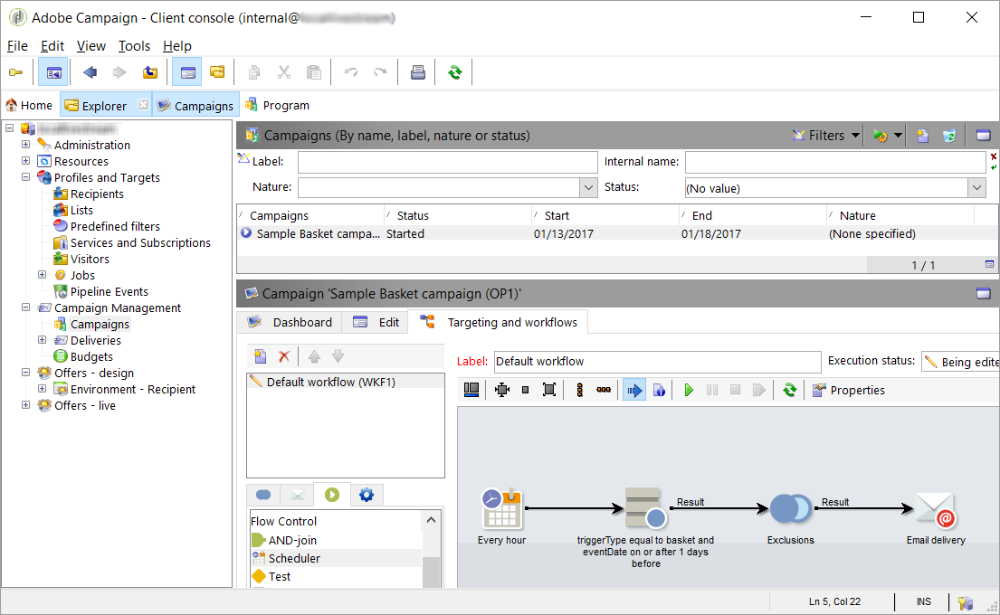

# 關於 Adobe Experience Cloud 觸發程式{#about-adobe-experience-triggers}

[!DNL Triggers] 是Adobe Campaign與Adobe Analytics使用管道的整合。 管線會從您的網站擷取使用者的動作或觸發器。 放棄購物車是觸發的範例。 Adobe Campaign會處理觸發器，以即時傳送電子郵件。

[!DNL Triggers] 在使用者動作後的短時間內執行行銷動作。 一般的回應時間不到1小時。

它可讓整合更加靈活，因為組態最小，而且不涉及協力廠商。
它也支援高流量，而不會影響行銷活動的效能。 例如，整合每小時可處理一百萬個觸發器。

## [!DNL Triggers] 架構 {#triggers-architecture}

### 什麼是Pipeline? {#pipeline-explanation}

>[!CAUTION]
>
>只有Adobe Cloud解決方案才能從Adobe的Pipeline服務產生和使用事件。 Adobe外部系統則無法。

Pipeline是Experience Cloud中代管的訊息系統，使用 [Apache Kafka](http://kafka.apache.org/)。 這是在解決方案之間輕鬆傳遞資料的方式。 此外，管線是消息隊列，而不是資料庫。 製片商推播正在醖釀中的活動，消費者會傾聽活動的流程，並對活動做他們想做的事。 事件會持續幾天，但不會再發生。 其目的是全天候接聽並立即處理事件。

### Pipeline的運作方式為何？ {#how-pipeline-work}

此程 [!DNL pipelined] 序一律會在Adobe Campaign行銷伺服器上執行。 它會連線至管線、擷取事件並立即處理。

該 [!DNL pipelined] 程式使用驗證服務登入Experience Cloud並傳送私密金鑰。 驗證服務傳回Token。 擷取事件時，會使用Token來驗證。 [!DNL Triggers] 從REST Web服務中使用簡單的GET請求來檢索。 回應為JSON格式。 請求的參數包括觸發器的名稱和指示上次檢索的消息的指針。 流程 [!DNL pipelined] 會自動處理它。

## 使用Adobe Experience Cloud觸發器與Adobe Campaign Classic整合

以下是一些最 [!DNL Triggers] 佳實務：

* 資 [!DNL Trigger] 料需要在Campaign中儲存。 不應直接處理它，因為它會造成延遲。
* 應從消息中檢查時間戳，而不是從資料庫中檢查時間戳。
* 使用TriggerTimestamp和觸發器ID來移除重複項目。

>[!CAUTION]
>
>以下範例不是現成可用的。 這是各種可能實施的特定範例。

管線事件會自動下載。 這些事件可使用表單進行監控。

Pipeline Event節點未內建，需要新增，以及相關表單需要在Campaign中建立。 這些操作僅限專家用戶使用。 如需更多相關資訊，請參閱以下章節： [導覽階層](../../configuration/using/about-navigation-hierarchy.md) 和 [編輯表單](../../configuration/using/editing-forms.md)。

對觸發器的經常性促銷活動工作流程查詢，如果符合行銷標準，則會啟動傳送。

