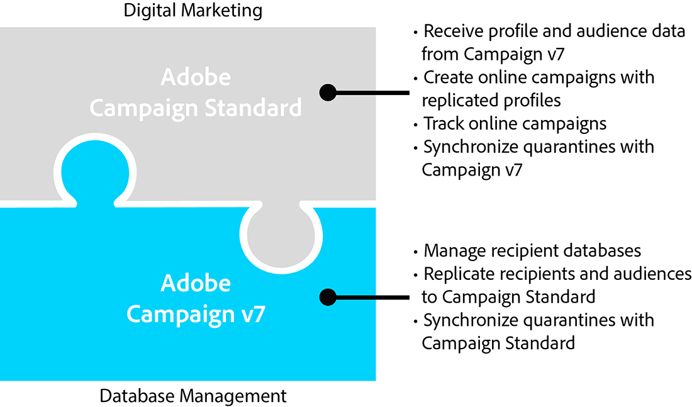
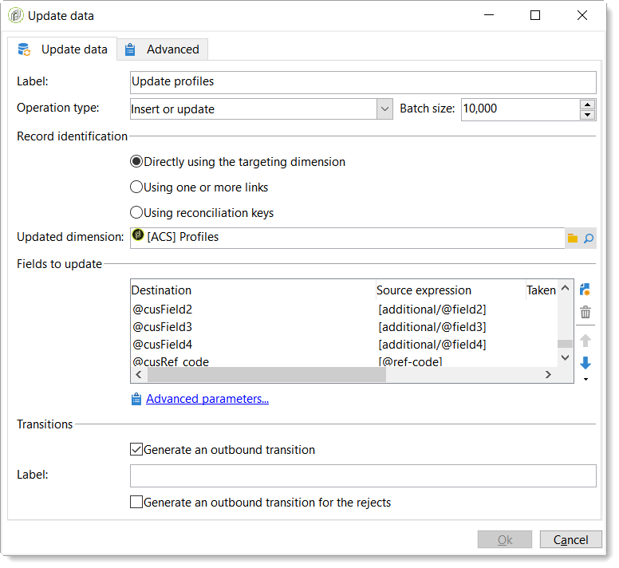

# 開始使用ACS聯結器{#acs-connector-gs}

ACS Connector橋接Adobe Campaign v7和Adobe Campaign Standard。 這是Campaign v7的整合功能，可自動將資料複製到Campaign Standard，將兩個應用程式的優點整合在一起。 Campaign v7提供管理主要行銷資料庫的進階工具。 Campaign v7的資料復寫可讓Campaign Standard在方便使用的環境中運用豐富的資料。

有了ACS Connector，數位行銷人員會繼續使用Campaign Standard來設計、鎖定目標及執行行銷活動，而Campaign v7則是為資料庫行銷人員等資料導向使用者量身打造。

>[!IMPORTANT]
>
>ACS Connector僅隨附於Adobe Campaign Prime產品。 如需如何授權Adobe Campaign Prime的詳細資訊，請聯絡您的客戶經理。
>
>ACS Connector僅適用於託管和混合架構。 完整內部部署安裝無法使用此功能。
>
>若要使用此功能，您必須使用Adobe ID (IMS)連線至Campaign。 另請參閱 [透過Adobe ID連線](../../integrations/using/about-adobe-id.md).

本檔案介紹ACS聯結器功能。 以下各節提供有關功能如何複製資料的資訊，以及如何使用複製的設定檔的說明。

* [程式](#process)：ACS聯結器概覽以及資料複製的管理方式。
* [實施](#implementation)：概述如何開始使用ACS Connector，以及如何復寫基本和進階資料的說明。
* [同步設定檔](../../integrations/using/synchronizing-profiles.md)：如何復寫設定檔以及如何使用設定檔建立傳送的說明。
* [同步對象](../../integrations/using/synchronizing-audiences.md)：說明如何在Campaign v7中鎖定收件者清單，然後將清單復寫至Campaign Standard作為對象。
* [同步化網站應用程式](../../integrations/using/synchronizing-web-applications.md)：如何將Campaign v7網頁應用程式連結至Campaign Standard的說明。
* [ACS聯結器疑難排解](../../integrations/using/troubleshooting-the-acs-connector.md)：檢閱常見問題的答案。

>[!NOTE]
>
>ACS Connector隨附於Campaign v7，並受許可協定規範。 若要使用ACS Connector，請務必在Campaign v7和Campaign Standard之間切換。 如果您不確定您的版本及其包含的功能，請聯絡管理員。

## 處理序 {#process}

### 資料複製 {#data-replication}

ACS Connector會定期將下列專案從Campaign v7複製到Campaign Standard：

* **收件者**
* **訂閱**
* **服務**
* **登陸頁面**

根據預設，ACS Connector的定期復寫是每15分鐘一次。 可以根據您的需求調整定期複製的跨度。 如需變更，請聯絡您的顧問。

收件者、訂閱、服務和登陸頁面的資料復寫是增量式的，這表示只有新的收件者和對現有收件者的修改會從Campaign v7復寫到Campaign Standard。 不過，對象的復寫會在單一例項中發生。 您可以在Campaign v7中建立受眾，然後將其復寫一次以Campaign Standard。 復寫立即執行，無法設定為定期更新。 如需指示，請參閱 [同步受眾](../../integrations/using/synchronizing-audiences.md).

>[!NOTE]
>
>請耐心等待大型資料庫的初始復寫，因為復寫作業可能需要數小時的時間。 不過，後續的複製是漸進式的，而且速度更快。

ACS Connector會定期將下列專案從Campaign Standard複製到Campaign v7：

* **[!UICONTROL Delivery IDs]**
* **[!UICONTROL Email broad logs]**
* **[!UICONTROL Email tracking logs]**

復寫傳遞ID和電子郵件記錄可讓您從Campaign v7存取v7收件者的傳遞歷史記錄和追蹤資料。

>[!IMPORTANT]
>
>只有電子郵件Broadlog和追蹤記錄會從Campaign Standard複製到Campaign v7。

### 資料同步 {#data-synchronization}

ACS Connector會同步Campaign v7與Campaign Standard之間的隔離。

例如，從Campaign v7複製到Campaign Standard的設定檔包含電子郵件地址。 如果Campaign Standard隔離電子郵件地址，資料會在下次同步期間傳遞至Campaign v7。 如需隔離的詳細資訊，請參閱 [隔離管理](../../delivery/using/understanding-quarantine-management.md) 和 [Campaign Standard隔離](https://experienceleague.adobe.com/docs/campaign-standard/using/testing-and-sending/monitoring-messages/understanding-quarantine-management.html).

### 使用複製的設定檔 {#using-replicated-profiles}

Campaign Standard和Campaign v7可以使用復寫設定檔，在行銷活動中進行目標定位工作流程。

如需如何使用復寫設定檔在Campaign Standard中傳送傳送的指示，請參閱 [同步設定檔](../../integrations/using/synchronizing-profiles.md). 提供在Campaign v7和Campaign Standard之間共用取消訂閱資料的其他指示。

### 限制 {#limitations}

復寫設定檔可隨時用於傳送，但Campaign Standard具有某些限制。 請檢閱下列專案以瞭解如何最佳管理這些專案。

* **Campaign Standard的唯讀設定檔**：復寫設定檔在Campaign Standard中為唯讀。 不過，您可以在Campaign v7中編輯收件者，修改內容會由ACS Connector在Campaign Standard中自動更新。
* **在Campaign Standard中建立的設定檔**： ACS Connector會朝一個方向複製收件者資料，從Campaign v7複製到Campaign Standard。 因此，源自Campaign Standard的設定檔不會復寫至Campaign v7。
* **用於Campaign Standard的基本收件者資料**： ACS Connector會複製適合Campaign Standard的收件者資料。 其中包括收件者的姓名、地址、電子郵件地址、行動電話號碼、住家電話號碼以及其他相關聯絡資訊。 如果Campaign v7中可用的其他收件者欄位和自訂目標表格對您的工作流程至關重要，請洽詢顧問。
* **匯入隔離的設定檔**：不想被聯絡的設定檔清單可以匯入Campaign v7或Campaign Standard為隔離的設定檔。 設定檔的狀態會包含在應用程式之間的隔離同步中，且不會用於傳送。
* **在Campaign Standard中取消訂閱服務**：取消訂閱傳送的選擇不會從Campaign Standard同步至Campaign v7。 不過，您可以設定Campaign Standard傳送，將其取消訂閱連結導向至Campaign v7。 收件者按一下取消訂閱連結的設定檔會在Campaign v7中更新，且資料會複製到Campaign Standard。 另請參閱 [變更取消訂閱連結](../../integrations/using/synchronizing-profiles.md#changing-the-unsubscription-link).
* 只有電子郵件Broadlog和追蹤記錄會從Campaign Standard複製到Campaign v7。

### 帳單 {#billing}

您選擇的傳送傳遞、Campaign v7或Campaign Standard的應用程式不會影響帳單。 帳單資訊會在Campaign v7和Campaign Standard之間調節。 因此，如果您使用兩個應用程式將傳送內容傳送給相同收件者，仍會計為一份作用中設定檔。

## 實施 {#implementation}

ACS聯結器存在兩種型別的實作。 兩者一律由Adobe Campaign Consulting團隊執行。

>[!IMPORTANT]
>
>本節僅供專家使用者使用，以針對實作流程及其主要步驟提供全域檢視。
>
>請勿嘗試自行執行任何這些實施。 必須向Adobe Campaign顧問保留絕對權利。

此 **基本實施** 可讓您復寫收件者（現成欄位）、服務和訂閱、網站應用程式和對象。 這是從Campaign v7到Campaign Standard的單向復寫。

此 **進階實施** 可讓您執行更複雜的使用案例，例如如果您有其他收件者欄位或自訂收件者表格（例如交易表格）。 另請參閱 [進階實施](#advanced-implementation).

### 安裝套件 {#installing-the-package}

若要使用此功能， **[!UICONTROL ACS Connector]** 需要安裝套件。 此操作一律由Adobe技術管理員或顧問執行。

所有與ACS Connector相關的技術元素都可在 **[!UICONTROL Administration > ACS Connector]** 瀏覽器節點。

### 技術和復寫工作流程 {#technical-and-replication-workflows}

安裝套件後，底下有兩個技術工作流程可供使用 **[!UICONTROL Administration > ACS Connector > Process]**.

>[!IMPORTANT]
>
>切勿嘗試修改這些工作流程。 絕不應該發生錯誤或暫停。 如果發生此情況，請聯絡您的Adobe Campaign顧問。

* **[!UICONTROL `[ACS] Quarantine synchronization`]** (quarantineSync)：此工作流程會同步所有隔離資訊。 Campaign v7中的所有新隔離都會複製到Campaign Standard中。 來自Campaign Standard的所有新隔離區都會複製到Campaign v7。 這可確保所有排除規則在Campaign v7和Campaign Standard之間同步。
* **[!UICONTROL `[ACS] Security group synchronization`]** (securityGroupSync)：此工作流程用於許可權轉換。 另請參閱 [許可權轉換](#rights-conversion).

下列復寫工作流程可作為「準備使用」範本使用。 這些需要由您的Adobe Campaign顧問實作。

* **[!UICONTROL `[ACS] Profile replication`]** (newProfileReplication)：此增量工作流程會將收件者複製到Campaign Standard。 依預設，它會複製所有現成的收件者欄位。 另請參閱 [預設收件者欄位](#default-recipient-fields).
* **[!UICONTROL `[ACS] Service replication`]** (newServiceReplication)：此增量工作流程會複製所選的服務以進行Campaign Standard。 請參閱使用案例 [同步Web應用程式](../../integrations/using/synchronizing-web-applications.md).
* **[!UICONTROL `[ACS] Landing pages replication`]** (newLandingPageReplication)：此增量工作流程會複製所選的Web應用程式以進行Campaign Standard。 Campaign v7網頁應用程式將顯示為Campaign Standard中的登陸頁面。 請參閱使用案例 [同步Web應用程式](../../integrations/using/synchronizing-web-applications.md).
* **[!UICONTROL `[ACS] New replication`]** (newReplication)：此增量工作流程是可用於復寫自訂表格的範例。 另請參閱 [進階實施](#advanced-implementation).
* **[!UICONTROL `[ACS] Delivery-message replication`]** (newDlvMsgQualification)：此遞增工作流程會將Campaign Standard的傳遞訊息複製到Campaign v7。
* **[!UICONTROL `[ACS] Profile delivery log replication`]** (newRcpDeliveryLogReplication)：此增量工作流程會將傳遞ID、電子郵件廣泛記錄檔和電子郵件追蹤記錄從Campaign Standard複製到Campaign v7。 它只會考慮從Campaign Standard傳送給屬於Campaign v7的nms：recipients表格一部分的設定檔的傳遞。

  >[!NOTE]
  >
  > 如果Campaign Classic和Campaign Standard執行個體都用於傳送包含追蹤URL的電子郵件，則在同步期間可能會發生重複URL tagId的問題。 若要防止此問題發生，請更新 **更新追蹤URL** (writerTrackingUrls)活動，並將「ACS」首碼新增至@tagId料來源運算式。

* **[!UICONTROL `[ACS] New delivery log replication`]** (newRcpDeliveryLogReplication)：此增量工作流程會將傳遞ID、電子郵件廣泛記錄檔和電子郵件追蹤記錄從Campaign Standard複製到Campaign v7。 它只會考慮從Campaign Standard傳送給設定檔的傳遞，這些設定檔是Campaign v7特定表格（用於定義nms：recipients以外的表格）的一部分。

### 預設收件者欄位 {#default-recipient-fields}

如果您有任何其他欄位或自訂表格（例如交易表格），預設不會複製它們。 需要執行進階設定。 另請參閱 [進階實施](#advanced-implementation).

您會在底下找到透過基本實作復寫的收件者欄位清單。 這些是現成可用的欄位：

<table> 
 <tbody> 
  <tr> 
   <td> <strong>標籤</strong>  </td> 
   <td> <strong>內部名稱</strong>  </td> 
  </tr> 
  <tr> 
   <td> 來源ID  </td> 
   <td> @sourceId  </td> 
  </tr> 
  <tr> 
   <td> 建立日期  </td> 
   <td> @created  </td> 
  </tr> 
  <tr> 
   <td> 修改日期  </td> 
   <td> @lastModified  </td> 
  </tr> 
  <tr> 
   <td> 電子郵件  </td> 
   <td> @email  </td> 
  </tr> 
  <tr> 
   <td> 姓氏  </td> 
   <td> @lastName  </td> 
  </tr> 
  <tr> 
   <td> 名字  </td> 
   <td> @firstName  </td> 
  </tr> 
  <tr> 
   <td> 中間名  </td> 
   <td> @middleName  </td> 
  </tr> 
  <tr> 
   <td> 行動  </td> 
   <td> @mobilePhone  </td> 
  </tr> 
  <tr> 
   <td> 出生日期  </td> 
   <td> @birthDate  </td> 
  </tr> 
  <tr> 
   <td> 性別  </td> 
   <td> @gender  </td> 
  </tr> 
  <tr> 
   <td> 致敬  </td> 
   <td> @salutation  </td> 
  </tr> 
  <tr> 
   <td> 不再聯絡（透過任何管道）  </td> 
   <td> @blackList  </td> 
  </tr> 
  <tr> 
   <td> 不再透過電子郵件聯絡  </td> 
   <td> @blackListEmail  </td> 
  </tr> 
  <tr> 
   <td> 不再透過簡訊聯絡  </td> 
   <td> @blackListMobile  </td> 
  </tr> 
  <tr> 
   <td> 電話  </td> 
   <td> @phone  </td> 
  </tr> 
  <tr> 
   <td> 傳真  </td> 
   <td> @fax  </td> 
  </tr> 
  <tr> 
   <td> 地址1 （公寓）  </td> 
   <td> [location/@address1]  </td> 
  </tr> 
  <tr> 
   <td> 地址2  </td> 
   <td> [location/@address2]  </td> 
  </tr> 
  <tr> 
   <td> 地址3 （號碼和街道）  </td> 
   <td> [location/@address3]  </td> 
  </tr> 
  <tr> 
   <td> 地址4 （縣）  </td> 
   <td> [location/@address4]  </td> 
  </tr> 
  <tr> 
   <td> 郵遞區號  </td> 
   <td> [location/@zipCode]  </td> 
  </tr> 
  <tr> 
   <td> 城市  </td> 
   <td> [location/@city]  </td> 
  </tr> 
  <tr> 
   <td> 州/省代碼  </td> 
   <td> [location/@stateCode]  </td> 
  </tr> 
  <tr> 
   <td> 國家/地區代碼  </td> 
   <td> [location/@countryCode]  </td> 
  </tr> 
 </tbody> 
</table>

### 許可權轉換 {#rights-conversion}

許可權在Campaign v7和Campaign Standard中的處理方式不同。 在Campaign v7中，許可權管理是以檔案夾為基礎，而在Campaign Standard中則是以單位存取（組織/地理單位）為基礎。 Campaign Standard使用者屬於包含限制內容的安全性群組。 因此，需要轉換Campaign v7許可權系統以符合Campaign Standard系統。 有數種方式可執行許可權轉換。 您會在下方找到實作的範例。

1. 在 **[!UICONTROL Administration > ACS Connector > Rights management > Security groups]**，使用 **[!UICONTROL Synchronize]** 按鈕以擷取所有Campaign Standard安全性群組。 現成的Campaign Standard群組已排除。

   

1. 如果您的許可權管理是以資料夾為基礎，請前往 **[!UICONTROL Administration > ACS Connector > Rights management > Folder mapping]** 並將每個所需的資料夾與安全性群組對應。

   

1. 接著，復寫工作流程會使用此資訊，並將對應的組織/地理單位新增至要復寫的每個物件。

### 進階實施 {#advanced-implementation}

本節說明進階實施的一些可能性。

>[!IMPORTANT]
>
>此資訊僅能作為一般准則使用。 如需實作，請洽詢您的Adobe Campaign顧問。

進階實施會根據客戶需求新增自訂復寫工作流程。 以下是一些範例：

* 傳遞復寫
* 行銷活動復寫
* 程式復寫
* 種子成員復寫
* 異動復寫
* 等等。

**復寫收件者的延伸欄位**

透過基本實作，會復寫現成的收件者欄位。 如果您想要復寫已新增至收件者綱要的自訂欄位，您必須識別這些欄位。

1. 在 **[!UICONTROL Administration > ACS Connector > Data mapping]**，在上建立目標定位對應 **[!UICONTROL nms:recipient]** 表格。

   

1. 選取要復寫的其他欄位和其他必要資訊（索引、連結、識別鍵）。

   

1. 開啟專用的設定檔復寫工作流程（不是範本，而是工作流程例項本身）。 修改 **[!UICONTROL Query]** 和 **[!UICONTROL Update data]** 活動以包含這些欄位。 另請參閱 [技術和復寫工作流程](#technical-and-replication-workflows).

   

   

**複製自訂設定檔表格**

透過基本實作，會復寫現成的收件者表格。 如果您新增自訂收件者表格，以下說明識別方式。

1. 在 **[!UICONTROL Administration > ACS Connector > Data mapping]**，在自訂設定檔表格上建立目標對應。

   

1. 定義您要復寫的識別資料、索引、連結和欄位。

   

1. 如果您的許可權管理是資料夾式的，請前往 **[!UICONTROL Administration > ACS Connector > Rights management > Folder mapping]**，並為連結至自訂表格的資料夾定義安全性群組。 另請參閱 [許可權轉換](#rights-conversion).
1. 使用 **[!UICONTROL New replication]** 工作流程（不是範本，而是工作流程例項本身）以包含自訂表格和要復寫的欄位。 另請參閱 [技術和復寫工作流程](#technical-and-replication-workflows).
